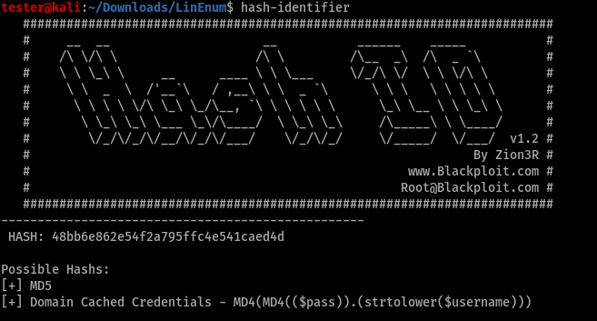

# Crack The Hash
In the field of security, hashes are values across which we come a lot. From the hashed passwords stored locally in the `/etc/shadow` to passwords stored by biggest corporations like Google and Facebook also incorporate one of the other forms of hashing.

This [Crak The Hash](https://tryhackme.com/room/crackthehash) room on TryHackMe helps to build a basic understanding of different types of hashes and how we can decrypt these hashes. Before we start, make sure that you have HashCat and Hash Identifier installed on the system along with the rockyou.txt dictionary. 

So, let's begin!

### Level 1
1. 48bb6e862e54f2a795ffc4e541caed4d
* In the image below from `hash-identifier`, it can be seen that the passed value is MD5 hashed.

	 

	Now, we can use hashcat along with rockyou.txt to break the hash using the command:

	```
	tester@kali:~/Desktop$ hashcat -m 0 hash_value /usr/share/wordlists/rockyou.txt
	```

	Here, `-m` defines the mode of the hashing algorithm that is to be cracked. The entire list of various modes that hashcat supports are present at [this link](https://hashcat.net/wiki/doku.php?id=example_hashes).
	Also, with hashcat, we can break the password easily.

2. CBFDAC6008F9CAB4083784CBD1874F76618D2A97 
* Again we can use `hash-identifier` to find the hashing algorithm, which turns out to be SHA-1. This hash can also be cracked by `hashcat` with mode `-m 100`.

3. 1C8BFE8F801D79745C4631D09FFF36C82AA37FC4CCE4FC946683D7B336B63032
* Again from `hash-identifier`, we can find out that this is a SHA-256 hashed value and crack the value using hashcat in mode `-m 1400`.

4. $2y$12$Dwt1BZj6pcyc3Dy1FWZ5ieeUznr71EeNkJkUlypTsgbX1H68wsRom
* Now this hash is a bit different from the previous ones as `hash-identifier` won't be able to determine the hashing algorithm used but we can use Google to find the hash. 
	At the beginning of the hashed value, we can see the `$2y$`, this is a hash signature and we can Google what hashing algorithm has this signature. 
	We can find out that this is hashed using the `bcrypt` hashing algorithm.
	Again that password can be cracked using mode `-m 3200` in hashcat but it might take a lot of time. So, we can look up for some online `bcrypt cracking tools` like the one [here](https://www.onlinehashcrack.com/hashes). We simply need to provide the hash value, select the hashing algorithm and perform a search. And we'll get the desired cracked value.

5. 279412f945939ba78ce0758d3fd83daa
* With hashcat, we can figure out that this hash appears to be MD5 but when we try to crack this hash with hashcat using the mode `-m 0`, the hash does not get cracked. 
	
	We can see that the `hash-identifier` had also suspected this has to be an MD4 hash. So, we can try to crack this hash with mode `-m 900` in hashcat but this time also it won't work. So, we can use another online hash cracker over [here](https://md5decrypt.net/en/Md4/) and get the cracked hash value.

### Level 2
1. F09EDCB1FCEFC6DFB23DC3505A882655FF77375ED8AA2D1C13F640FCCC2D0C85
* For this hash, `hash-identifier` detects it as SHA-256 but when tried to break with hashcat using mode `-m 1400`, it fails. So, we can look out for some other online hash decryptor like the one [here](https://crackstation.net/) and get the cracked value of the hash.

2. 1DFECA0C002AE40B8619ECF94819CC1B
* This hash got identified as MD5 and MD4 but when tried with hashcat nono of these worked. On checking the hint for this question it was mentioned as NTLM. And NTLM hashes can be cracked with hashcat using mode `-m 1000`.

3. Hash: $6$aReallyHardSalt$6WKUTqzq.UQQmrm0p/T7MPpMbGNnzXPMAXi4bJMl9be.cfi3/qxIf.hsGpS41BqMhSrHVXgMpdjS6xeKZAs02.
	Salt: aReallyHardSalt
	Rounds: 5
* For this question, we must know that what hashing algorithm uses a $6$ signature. After some googling, we can find out that this is a SHA-512 hash signature. Another important thing with this hash is that salting is used here. And the value between `$6$` and the first `$` after that is the salt that is used, which in our case is `aReallyHardSalt`.
	
	Hashcast has various supported formats of salted SHA-512 hash but we need the one in which the hashed value consists of `$6$` like `sha512crypt $6$ hash`. Hence, we can crack this hash using mode `-m 1800` in hashcat.

	P.S. Crack this hash will take a lot of time, so be patient.

4. Hash: e5d8870e5bdd26602cab8dbe07a942c8669e56d6
	Salt: tryhackme
* Using `hash-identifier`, it can be found out that this is a SHA-1 hashed value. Now, we know that we are provided both the hash and salt but unlike SHA-512, the salt is not present in the hash value. So, it must be by some way passed to the cracker in order to crack it in a proper way. So to do that there are two method:
	```
	* <password>:<hash>
	* <hash>:<password>
	```

	The issue here from `hash-identifier` it was found out that it is a SHA-1 hash value but on trying various modes realated to SHA-1 in hashcat like 100, 110, 120, 130, 140 and 150 we were not able to get the cracked value. Finally the value got cracked with mode `-m 160` which is used for `HMAC-SHA1 (key=$salt)`.


## Some key points to take away
1. `hash-identifier` can be used to identify a huge variety of hashes.
2. Sometimes, we can use hash signatures to determine the hashing algorithm like:
	* `$2a$`, `$2b$`, `$2y$` signatures are used by the `bcrypt` hashing algorithm.
	* `$6$` signature is used by the `SHA512crypt` hashing algorithm.
3. Sometimes, our local hash cracker tools won't work because of the limitations of the variety of values in the passed dictionary. Hence, if not locally then we can search for online hash crackers.
4. In SHA512crypt hash, the salt is present between `$6$xxxxxxxxx$`.
5. In case of salted SHA1, password and salt must be arranged across colon(:).

