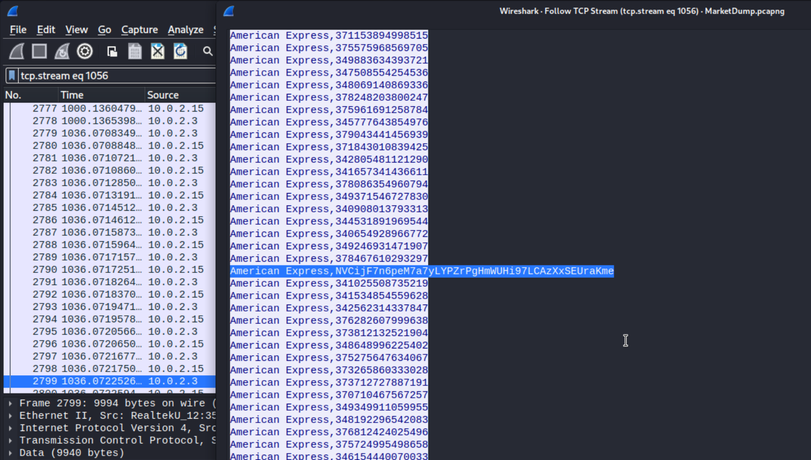

# MarketDump

[MarketDump](https://app.hackthebox.com/challenges/66) is an easy level challenge on HackTheBox. It focuses on very basic PCAP file analysis which contains network traffic dump.

The PCAP file for this challenge is already provided to us in a zip file (which can be decrypted with the provided password `hackthebox`).

## Method 1 (Short n Simple)

The first thing that we can look at would be the files that can be exported directly from the PCAP file. They can be found from `File -> Export Objects`. We can see there are multiple options like DICOM, HTTP, FTP, SMB etc. We can explore each of these options and then `Save All` the files and then analyze them.

In our case, we can file a number of HTTP files 


Once downloaded, we can open and check all these files. There is nothing interesting in all the files except for the `costumers.sql` file. This file specially stands out because though the extension is `.sql` it is a CSV file.

```
$ file costumers.sql                                                     
costumers.sql: CSV text
```

When we open the file and go through the data, we can see there are 2 comma separated columns. The first has just "American Express" written in all the rows and in the second column there are some random values with length of 15. While scrolling through the file, we can see there is one record where the data in the second column is alpha numeric rather than all numeric. 


Now we can take this string and throw it on [CyberChef's](https://gchq.github.io/CyberChef) magic decoder and get the flag.

## Method 2 (A bit in depth)

For this part, we can dive deeper into the PCAP file. And the most important 2 things to look at would be:

1. The IP addresses present in the PCAP file (Statistics -> Endpoints -> IPv4)

   

2. The network protocols that were captured (Statistics -> Protocol Hierarchy)

   

We can filter the PCAP for each of these protocols and analyze the traffic (Right Click on Protocol -> Apply Filter -> Selected). 

For most of the protocols there is nothing useful that we can see but we can see a lot of traffic when we apply a filter for `Data (HTTP)`. Considering there are a large number of packets to analyze, we can follow the traffic (Right Click on any packet in the filtered TCP Steam -> Follow -> TCP Stream)


From the screenshot, it can be seen that there was some kind of bash session that was captured in this TCP stream. As we scroll down, we can see the `costumers.sql` file was opened in the bash session. In the same session, we can see that there was an odd entry



We can send this string to CyberChef's magic decoder and get our flag.

## Key Points to Take Away

1. Always look for exportable files in a PCAP.
2. When anayzing a PCAP, start with determining the endpoints and protocols that are captured.

## References

1. [MarketDump](https://app.hackthebox.com/challenges/66)
2. [CyberChef](https://gchq.github.io/CyberChef)