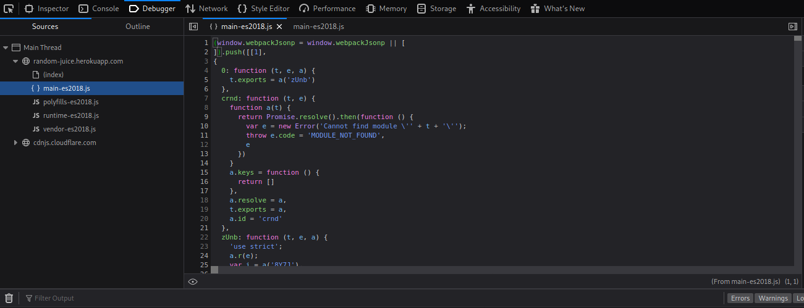

# Level 1

# Find the Score Board

After creating the app on Herko using the [OWASP Juice Shop GitHub repository](https://github.com/bkimminich/juice-shop#deploy-on-heroku-free-0month-dyno) the first task was to find the score board. From the initial app walkthrough hints, it was clear that I had to look into the source-code and other JS files of the webpage. So, I started with the source-code and searched for various terms like *dash, dashboard, score* and *scoreboard* but did not find anything. The next thing to look at were the JS files.

The first file that can be seen is the `main-es2018.js`. And when we **search for the again for the terms like *dash, dashboard, score* and *scoreboard*** then we can find some results over here.

Try to search for half terms when possible because here if we search for "scoreboard", we won't find any results as there is a hyphen as well!

# Give a Devastating Zero-Star Feedback to The Store

Whenever we come across any platform where we are asked to give some rating, there is a minimum and a maximum value.  In case of Juice Shop, the minimum value is 1 and the maximum value is 5 and we are asked to give a rating of 0. 

To complete this task we need to get to the [Customer Feedback Page](https://random-juice.herokuapp.com/#/contact) from the left menu. Once on the page, we can write the comment and solve the CAPTCHA value. 

But we can't enter a rating of less than 1. But we can surely modify the value over the fly using Burp Suite by **intercepting and modifying the values that are being passed**.

Now, when we forward this request the rating value that has been sent is 0. 

**Takeway:**

- **This shows that the rating value is not being validated at the server and the client-side validations are being trusted fully in this case which can be bypassed easily.**

# Read Our Privacy Policy

For solving this challenge, we can first try to explore every possible link on the website because usually links to privacy policy are provided in some menu or at the bottom of the webpage. But in this case, we can't find any direct link (spoiler: if you haven't yet logged in!). So, we can again take the same approach that we took for finding the scoreboard and start looking for term *privacy* in the source-code and JS files.

In the source-code, we can't find anything but again in the `main-es2018.js` file we can see multiple results for the term *privacy*. On going through the results we can find two paths:

Now, if we look care fully then it can be seen that the page `privacy-policy` is a child of `privacy-security`. So, to access the privacy policy we need to access the link: [https://random-juice.herokuapp.com/#/**privacy-security/privacy-policy](https://random-juice.herokuapp.com/#/privacy-security/privacy-policy).**

If you are logged in the Privacy & Security related information can be found under the Account tab at the upper-right corner

**Takeaway:**

- **Important information such as privacy policy should be placed at an easily accessible location as these are important links.**

# Access a Confidential Document

Again for this task, we need to take help from other tools such as [FFUF](https://www.notion.so/FFUF-5fd5cce1709f442cbf5d852b04eb35a1). We can run a directory traversal attack on the domain to get a list of some juicy directories. And then we can start exploring those directories to see if they contain some confidential document.

-fw is used to filter those results that have a word count of 206 because even if the directory didn't exist the server returned a 200 response. 
But for all such non-existing pages the word count of the 200 response was 206. 

Here, we can see that a directory named as `ftp` has been detected. On browsing the directory, we can find many files that are stored over there. We can try to open each one of them to check if they contain some confidential information.

From all these files, the file named `[acquisitions.md](http://acquisitions.md)` contains a line stating that **it is a confidential document**.

**Takeaway:**

- **Confidential documents should not be stored in such open directory.**
- **Access control must be implemented properly so that on intended users can access such files.**

# Provoke an Error That is Neither Very Gracefully Nor Consistently Handled

In the same `/ftp` directory, while opening all the files we can find a file named `coupons_2013.md.bak`. When we try to open this file, it **throws an error stating only .md and .pdf files are allowed**. 

**Takeaway**

- **Errors must be handled properly. A generic response should be returned to the user by implementing a global error handled at the configuration level.**
- **At the same time, all such errors should be logged, access to which should be restricted only to the necessary admins.**

# Follow The DRY Principle While Registering A User

 DRY stands for **Don't Repeat Yourself.** And if we look at the registration page, we can see that we need to repeat our password twice. So, maybe we need to bypass this in some way. 

Again, to do so we can use Burp Suite and modify our request the same way as we did in the case of manipulating the Rating value. All that we need to do is intercept the register request on Burp Suite and modify one of the two values which are *password* or *passwordRepeat*.

Now, when we forward this request **even though the both the password values are different it would get accepted**.

**Takeaway**

- **Input should be validated not only at the client-side but at the server as well.**
- **Placing trust on the client is not a good practice.**

# Let us Redirect You to One of Our Crypto Currency Addresses Which Are Not Promoted Any Longer

Again, we can take the same approach of searching for crypto related keywords like *bit, crypto, currency, coin, etc. *****through the source-code and JS file. Because of the past of find the links in the `main-es2019.js` file, we can directly start with that file only and search for these keywords.

And there we can find **multiple results for the term *bit and* one of them contains a URL for a bitcoin wallet as well**.

# Find The Endpoint That Serves Usage Data To Be Scraped By A Popular Monitoring System

Here, we are given a reference link towards a system and service monitoring system called [Prometheus](https://github.com/prometheus/prometheus). We can directly run a google search for "Prometheus endpoints" and land on it's [documentation page](https://prometheus.io/docs/prometheus/latest/getting_started/#starting-prometheus) where we can find that the all the metrics can be accessed at `localhost:9090/metrics`. So, can do the same and try to **access [https://random-juice.herokuapp.com/metrics](https://random-juice.herokuapp.com/metrics) which provides the usage data**.

**Takeaway:**

- **Important links to system metrics should not be accessible directly.**
- **Access control should be in place to make sure that only allowed users can access such critical information.**

# Receive A Coupon Code From The Support Chatbot

Even after going through all the links available, we can't find any link for the chatbot. So, it might be available only for users who are logged in. So, we can create an account, log in and the look for the chatbot. 

As expected, the Support Chat option is present in the left menu. Now, our task is to get the coupon from this bot. Not to forget this task has a tag of *Brute Force*. So, we can keep sending the message *Coupon* again and again to see if we can get something out of the bot.

**Takeaway:**

- **The engine running behind the chatbot must be trained properly and should not be susceptible to any such kind of brute-force attacks.**

# Perform a DOM XSS Attack With `<iframe src="javascript:alert('xss')">`

We know that XSS is usually performed when the user passes some illegal input. So, we need to look for some point where we can enter the provided payload.

And we can see that we have a search bar from where we can search for products available. So, we can input the provided payload over there and check if it works.

**Takeaway:**

- **Input from the user must never be trusted and hence should not be processed directly.**
- **Always sanitize the user input along with character encoding to avoid such XSS attacks as they can lead to malicious redirects or even steal sensitive information.**

# Use The Bonus Payload `<iframe width="100%" height="166" scrolling="no" frameborder="no" allow="autoplay" src="[https://w.soundcloud.com/player/?url=https%3A//api.soundcloud.com/tracks/771984076&color=%23ff5500&auto_play=true&hide_related=false&show_comments=true&show_user=true&show_reposts=false&show_teaser=true](https://w.soundcloud.com/player/?url=https%3A//api.soundcloud.com/tracks/771984076&color=%23ff5500&auto_play=true&hide_related=false&show_comments=true&show_user=true&show_reposts=false&show_teaser=true)"></iframe>` in The DOM XSS Challenge

For this challenge, all that we need to do is paste the provided payload in the search bar and listen to song while understanding how the payload places the iframe!

# Retrieve The Photo of Bjoern's Cat in "Melee Combat-Mode"

While going through all the link, we can recall that there is a *Photo Wall*. We can quickly go to that page and see that there is one image that is not being loaded properly. It appears that this is the image that we need to access.

We can go through the source-code and compare it's code with that of the other images but can't find anything useful. Though, if we see proper it can be seen that the image path contains an emoji(😼) in it. It might be the case that the website is not able to process it.

After some research on Google, we can find that these are called punycodes and they can be used in URLs as well. But still we can try to [convert this punycode to unicode](https://www.punycoder.com/), replace the emoji with its unicode in the images path and then try to access the image. But even this does not work.

It means that there is no issue with the emoji but something else in the URL.

We can search for "characters allowed in URL" and find [this page](https://www.urlencoder.io/learn/) where we can learn about different parts of the URL. Here, we can see that the character hash(#) plays an important role in the URL as it defines the fragment on the page. And in our file name also there are two hashes. Which means that the browser is interpreting the content after hash as a fragment on the page. 

To resolve this issue, we need to URL encode the hashes and then try to access the URL. 

So, all that we need to do to access the image is to **replace # with %24 in the URL** and then our URL would look like:

[https://random-juice.herokuapp.com/assets/public/images/uploads/😼-%23zatschi-%23whoneedsfourlegs-1572600969477.jpg](https://random-juice.herokuapp.com/assets/public/images/uploads/%F0%9F%98%BC-%23zatschi-%23whoneedsfourlegs-1572600969477.jpg)

# Reference Links:

1. OWASP Juice Shop GitHub Repository: https://github.com/bkimminich/juice-shop
2. Prometheus GitHub Repository: [https://github.com/prometheus/prometheus](https://github.com/prometheus/prometheus)
3. Prometheus Documentation: [https://prometheus.io/docs/prometheus/latest/getting_started/#starting-prometheus](https://prometheus.io/docs/prometheus/latest/getting_started/#starting-prometheus)
4. Tool to Convert Punycode to Unicode: [https://www.punycoder.com/](https://www.punycoder.com/)
5. Blog on URL Encoding: [https://www.urlencoder.io/learn/](https://www.urlencoder.io/learn/)