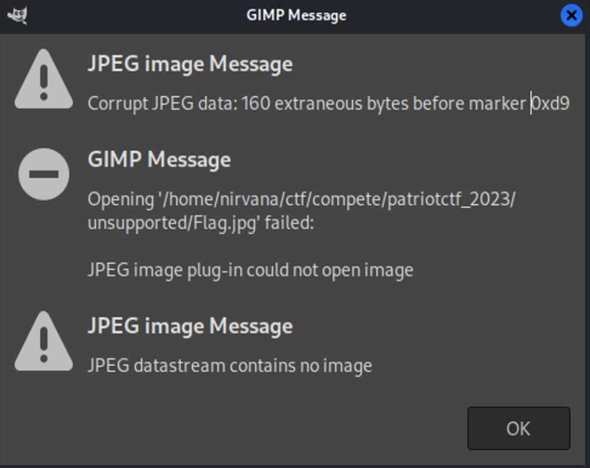
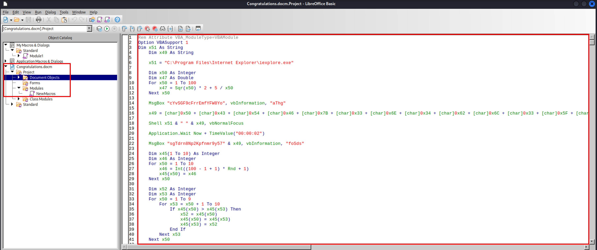
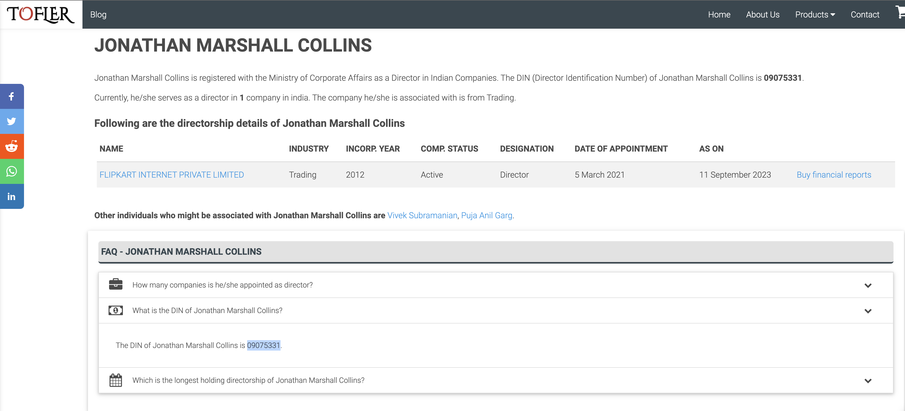
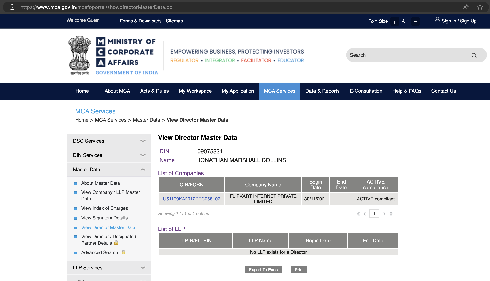
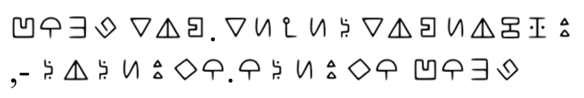
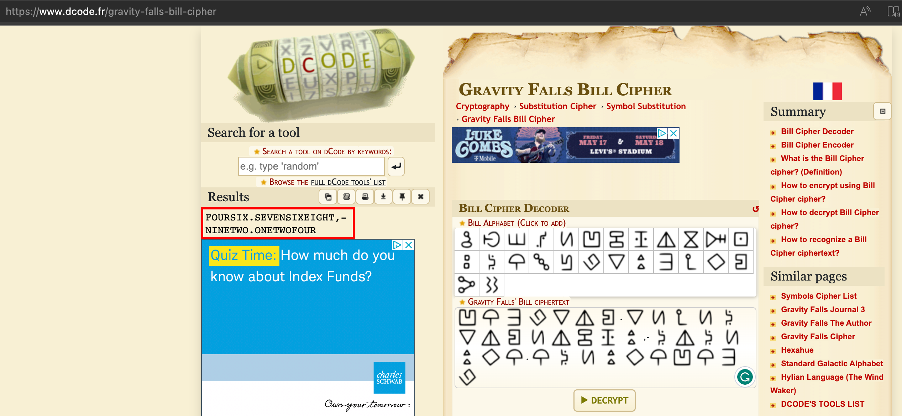
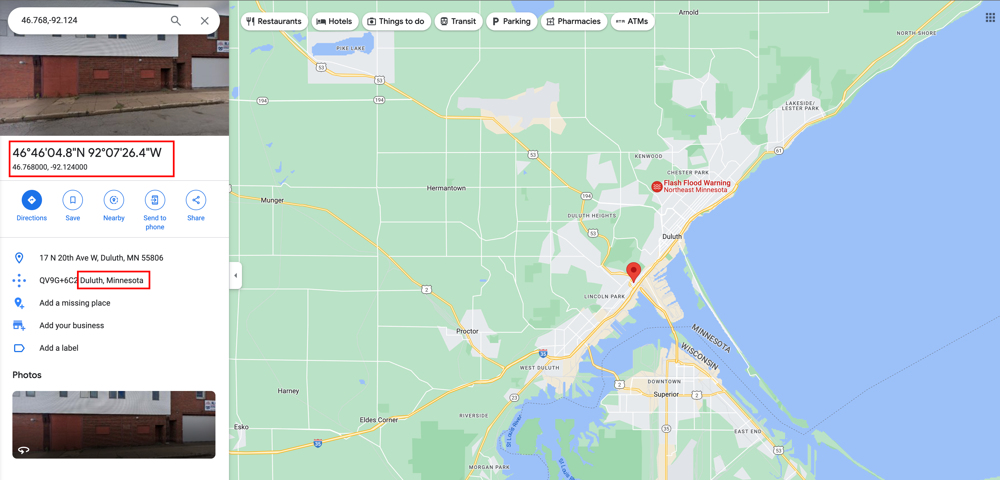

# Writeup For Patriot CTF 2023
## Unsupported Format - Forensics
### Challenge Description
My friend sent me a picture of his brand new computer, but something strange happened to it and now it says "Unsupported Format" when I try to open it. Can you try to help me recover the image?
### Solution
For this challenge a file called as `Flag.jpg` is provided.
Obviously, the first thing to do is to check the file type using `file` command.
```
$ file Flag.jpg
Flag.jpg: JPEG image data, JFIF standard 1.01, resolution (DPI), density 72x72, segment length 16, Exif Standard: [TIFF image data, little-endian, direntries=5, xresolution=74, yresolution=82, resolutionunit=2, software=GIMP 2.10.4, datetime=2023:03:22 09:23:36]
```
So, it definitely is a JPEG image. But, when you try to open it, it says `Unsupported Format`. So, probably the file is broken. Regardless, we can try to find some other details about the file using `exiftool`.
```
$ exiftool Flag.jpg
ExifTool Version Number         : 12.65
File Name                       : Flag.jpg
Directory                       : .
File Size                       : 56 kB
File Modification Date/Time     : 2023:09:08 18:22:01-07:00
File Access Date/Time           : 2023:09:10 10:38:38-07:00
File Inode Change Date/Time     : 2023:09:08 18:22:01-07:00
File Permissions                : -rwxr-xr-x
File Type                       : JPEG
File Type Extension             : jpg
MIME Type                       : image/jpeg
JFIF Version                    : 1.01
Warning                         : [minor] Skipped unknown 160 bytes after JPEG APP1 segment
Exif Byte Order                 : Little-endian (Intel, II)
X Resolution                    : 72
Y Resolution                    : 72
Resolution Unit                 : inches
Software                        : GIMP 2.10.4
Modify Date                     : 2023:03:22 09:23:36
Image Width                     : 256
Image Height                    : 213
Bits Per Sample                 : 8 8 8
Compression                     : JPEG (old-style)
Photometric Interpretation      : YCbCr
Samples Per Pixel               : 3
Thumbnail Offset                : 260
Thumbnail Length                : 11140
Image Size                      : 256x213
Megapixels                      : 0.055
Thumbnail Image                 : (Binary data 11140 bytes, use -b option to extract)
```
As you can see, there is a warning that says `Skipped unknown 160 bytes after JPEG APP1 segment`. It is not very clear what this means so another thing that can be tried is to open this file in `gimp` and see if it work.
When trying to open this file with `gimp`, it shows the following error.

So, it is clear that there are 160 additional bytes before 0x9d position. So, we can try to remove them and see if the image opens. Many tools and commands like the following can be tried from none of them work
```
# jpegtran -copy none -optimize -outfile min.image.jpg image.jpg
# jpegtran -progressive -copy none -optimize -outfile min.pro.image.jpg image.jpg
# exiftool -all= image.jpg
# magick mogrify -strip image.jpg
# magick mogrify -set comment "XXXX" image.jpg
```

Though we can still get the flag through maybe an unitended way and this is by opening your file browser and enlargin the thumbnail of the image. The flag can be seen in the thumbnail.

And there we get our flag: `PCT{c0rrupt3d_b1t5_4r3_c00l}`

## Capybara - Forensics
### Challenge Description
What a cute picture of a capybara!
### Solution
For this challenge a file called as `capybara.jpg` is provided.
As usual the file can be analyzed using `file` and `exiftool`.
```
$ file capybara.jpeg
capybara.jpeg: JPEG image data, JFIF standard 1.01, resolution (DPI), density 96x96, segment length 16, comment: "CREATOR: gd-jpeg v1.0 (using IJG JPEG v80), quality = 82", baseline, precision 8, 1200x630, components 3

$ exiftool -a capybara.jpeg
ExifTool Version Number         : 12.65
File Name                       : capybara.jpeg
Directory                       : .
File Size                       : 158 kB
File Modification Date/Time     : 2023:09:09 09:43:21-07:00
File Access Date/Time           : 2023:09:10 11:27:24-07:00
File Inode Change Date/Time     : 2023:09:09 09:43:21-07:00
File Permissions                : -rwxr-xr-x
File Type                       : JPEG
File Type Extension             : jpg
MIME Type                       : image/jpeg
JFIF Version                    : 1.01
Resolution Unit                 : inches
X Resolution                    : 96
Y Resolution                    : 96
Comment                         : CREATOR: gd-jpeg v1.0 (using IJG JPEG v80), quality = 82.
Image Width                     : 1200
Image Height                    : 630
Encoding Process                : Baseline DCT, Huffman coding
Bits Per Sample                 : 8
Color Components                : 3
Y Cb Cr Sub Sampling            : YCbCr4:2:0 (2 2)
Image Size                      : 1200x630
Megapixels                      : 0.756
```
Nothing looks weird over here. But as this is a JPEG file, it is possible that something can be found through `binwalk` or `steghide`.
```
$ binwalk -e capybara.jpeg

DECIMAL       HEXADECIMAL     DESCRIPTION
--------------------------------------------------------------------------------
0             0x0             JPEG image data, JFIF standard 1.01
151174        0x24E86         Zip archive data, at least v2.0 to extract, compressed size: 6902, uncompressed size: 919160, name: audio.wav
158170        0x269DA         End of Zip archive, footer length: 22
```
It looks like `binwalk` was able to retrieve an audio file named as `audio.wav` from the image.
After playing the audio file, all that be heard are some beeps in a sequence which appears to be morse code. Morse code can be decoded from an audio file on this website called as [morsecode.world](https://morsecode.world/international/decoder/audio-decoder-adaptive.html).

After uploading and playing the audio file on this website, the following morse code is obtained.
```
5 0 4 3 5 4 4 6 7 B 6 4 3 0 5 F 7 9 3 0 5 5 5 F 6 B 4 E 3 0 5 7 5 F 6 8 3 0 5 7 5 F 7 4 3 0 5 F 5 2 3 3 3 4 4 4 5 F 6 D 3 0 7 2 3 5 3 3 5 F 4 3 3 0 6 4 3 3 3 F 7 D
```
Considering there are only numbers and characters up till `F`, it is possible that this is a hex string. So, the next step would be to convert this hex string to ASCII after removing all the spaces in between.
And with last step, the flag can be found: `PCTF{d0_y0U_kN0W_h0W_t0_R34D_m0r53_C0d3?}`

## Congratulations - Forensics
### Challenge Description
Congratulations on making it this far, here's an email attatchment.
### Solution
For this challenge a file called as `Congratulation.docm` is provided.
Now because this is a docm file, it is possible that there is some macro code in it. So, the first thing to do is to check the macro code in the file.

As expected, a macro code can be found in the file. Now, the next step would be to analyze the macro code and see what it does.
An interesting line of code can be found in the macro which is is made up of a lot a `char` variables. This line of code is as follows.
```
x49 = [char]0x50 + [char]0x43 + [char]0x54 + [char]0x46 + [char]0x7B + [char]0x33 + [char]0x6E + [char]0x34 + [char]0x62 + [char]0x6C + [char]0x33 + [char]0x5F + [char]0x6D + [char]0x34 + [char]0x63 + [char]0x72 + [char]0x30 + [char]0x35 + [char]0x5F + [char]0x70 + [char]0x6C + [char]0x7A + [char]0x5F + [char]0x32 + [char]0x37 + [char]0x33 + [char]0x31 + [char]0x35 + [char]0x36 + [char]0x37 + [char]0x30 + [char]0x7D
```
This line of code is basically adding a sequence of characters and storing it in a variable called as `x49`. So, the next step would be to decode this variable and get the flag. This can be done by simply stripping the `[char]`, `0x` and ` + ` from the line and then converting the hex string to ASCII.
This final step will give the flag: `PCTF{3n4bl3_m4cr05_plz_27315670}`

## Rogue Access Point - OSINT
### Challenge Description
We've received a notice from our companies EDR software that a laptop was attacked while they were on WFH. The employee says they were at home when it happened, but we suspect they were using public wifi. Our EDR software managed to capture the BSSID of the wifi (46:D1:FA:63:BC:66) network before it got disconnected, but not the SSID. Can you still find the network they were connected to?
### Solution
For this challenge a BSSID is provided which is `46:D1:FA:63:BC:66`.
There is a really good website called as [wigle.net](https://wigle.net/) which can be used to find details through BSSID. 
All that needs to be done is make an account on the website and then select the Basic Search option and perform a search using the BSSID.
> The website is slight buggy, so make sure there are no latitudes and longitudes in the search bar before performing the search. Also, the map does not automatically move to the found location, so keep the map zoomed out and then perform the search and then zoom in to the found location.


And finally with the name that is found the flag can be determined: `PCTF{reds_table_free_wifi}`

## Karter - OSINT
### Challenge Description
In 2021, Flipkart added a new director. Your task is to find:

1. his last name (UPPERCASE)
2. his Director Identification Number
3. And the URL of the primary source from where you found his name (URL format: scheme://subdomain.rootdomain.tld) paths excluded
### Solution
The first thing to determine for this challenge would be the name of the director who got appointed in 2021. This can be found with a quick Google search for 'Flipkart director 2021' and one of the links leads to [this website](https://www.tofler.in/flipkart-internet-private-limited/company/U51109KA2012PTC066107#:~:text=Directors%20%2D%20FLIPKART%20INTERNET%20PRIVATE%20LIMITED&text=The%20most%20recently%20appointed%20director,appointed%20on%2005%20March%2C%202021.) which shows that `Jonathan Marshall Collins` was appointed as a director in 2021. We now have the name but still need to find the Director Identification Number (DIN) and the URL of the primary source.
On the same website, if clicked on the name then it opens a [new page](https://www.tofler.in/jonathan-marshall-collins/director/09075331) where it shows details of the director including the DIN.

The next thing to look for is the URL of the primary source.
> There was an update provided that it is `.gov` website later on Discord. 

Now with the hint, it can be assumed that there must be some government website that holds the records for DIN. Now, because this is an Indian company, we can do a simple Google search for 'din numbers India'. The results provide a link to [this website](https://www.mca.gov.in/MinistryV2/dinprocess.html) which is a government website and explains the process of getting a DIN. 
It is better to confirm if this is the expected website and this can be done by doing another Google search for 'din number india lookup' and one of the results is a link to [this website](https://www.mca.gov.in/MinistryV2/dinprocess.html). Here, the DIN found previously can be searched and the details can be confirmed.

Combining all the details, the flag can be determined: `pctf{JONATHAN_09075331_https://www.mca.gov.in}`

## Flag Finder - Misc
### Challenge Description
All you have to do is guess the flag.
`nc chal.pctf.competitivecyber.club 4757`
### Solution
For this challenge it literally asks us to guess the flag and along with that we are povided with a netcat command to connect to the server. So, we can simple connect to it and start guessing the flag.
```
nc chal.pctf.competitivecyber.club 4757
What is the password: a
a is not long enough
a%
```
With a single character it says that it is not long enough. So, a long string can be passed to see what it says.
```
$ nc chal.pctf.competitivecyber.club 4757
What is the password: aaaaaaaaaaaaaaaaaaaaaaaaaaaaaaaaaaaaaaaaaaaaaaaaaaaaa
aaaaaaaaaaaaaaaaaaaaaaaaaaaaaaaaaaaaaaaaaaaaaaaaaaaaa is too long
aaaaaaaaaaaaaaaaaaaaaaaaaaaaaaaaaaaaaaaaaaaaaaaaaaaaa%
```
In case of a long password it does say that it is too long. So, the next step would be to find the right length of the password. This can be done by passing a string of different lengths and see what it says.
```
nc chal.pctf.competitivecyber.club 4757
What is the password: 1234567890123456789
There's been an error
1234567890123456789%
```
With a password of length 19, it says that there's been an error. And when tested for 18, it says too short and when tested for 20, it says too long. So, it can be said that the target string is 19 characters long.
Now, the challenge itself asks to guess the flag and all the flags have a pattern of `pctf{}`. Considering this, the next step would be to pass a string of 19 characters with the pattern `pctf{}` character by character and see what it says.
```
$ nc chal.pctf.competitivecyber.club 4757
What is the password: p234567890123456789
User input: 112
Flag input: 112
There's been an error
p234567890123456789%

$ nc chal.pctf.competitivecyber.club 4757
What is the password: pc34567890123456789
User input: 112
Flag input: 112
User input: 99
Flag input: 99
There's been an error
pc34567890123456789%

$ nc chal.pctf.competitivecyber.club 4757
What is the password: pctf{67890123456789
User input: 112
Flag input: 112
User input: 99
Flag input: 99
User input: 116
Flag input: 116
User input: 102
Flag input: 102
User input: 123
Flag input: 123
There's been an error
pctf{67890123456789%
```

A pattern can be seen. It looks like the server is comparing the user input with the flag input character by character and then returns the ASCII decimal values of all the characters that match consecutively. At this point 6 of 19 characters are known (`pctf{}`).
So, only 13 characters need to be brute-forced. Also, whenever a correct consecutive character would be sent, it will return the ASCII decimal value of the character in response. Keeping that in mind the following script can be written to brute-force the remaining characters.

```python
from pwn import *
import itertools
import string

# List of characters to be used for brute-forcing
chars = string.ascii_lowercase + string.ascii_uppercase + string.digits + string.punctuation
attempts = 0

pwf = 'pctf{'           # Know prefix
pwb = '************}'   # Unknown suffix with `}`

# Know response from server based on known prefix
beginning_string = 'User input: 112\\nFlag input: 112\\nUser input: 99\\nFlag input: 99\\nUser input: 116\\nFlag input: 116\\nUser input: 102\\nFlag input: 102\\nUser input: 123\\nFlag input: 123\\n'

# Known response end from the server
end_string = 'There\'s been an error\\n'
       
# Function to send the guessed password to the server and check the response
def attempt(guess, gchar):
    global beginning_string
    global end_string

    # Create a connection to the server
    conn = remote('chal.pctf.competitivecyber.club', 4757)
    # Wait for the first message from the server
    conn.recvuntil('What is the password: ')
    # Send the guessed password to the server
    conn.sendline(bytes(guess, encoding='utf-8'))
    # Receive the response from the server
    response = conn.recvall()
    # print(response)
    
    # Close the connection
    conn.close()
    
    # Get the decimal value of the character
    gdec = ord(gchar)

    # Create the string to be searched in the response with the decimal value of guessed character
    char_select_string = 'User input: {}\\nFlag input: {}\\n'.format(gdec, gdec)

    # Combine the strings to be searched in the response
    search_string = beginning_string + char_select_string + end_string
    
    if search_string in str(response):
        print('FOUND')
        beginning_string = beginning_string + char_select_string
        return True
    elif 'is not long enough' in str(response):
        print('TOO SHORT')
        exit()
    return False


if __name__ == '__main__':
    # Loop for 13 characters
    for i in range(0, 13):
        # Loop through all the characters
        for guess in chars:
            password = pwf + guess + pwb[i:]
            if attempt(password, guess) == True:
                pwf = pwf + guess
                break
```

At the end, the final flag that can be found is: `pctf{Tim3ingI8N3at}`

## My Phone - Crypto
### Challenge Description
Some weird triangle man stole my phone, he taunted me by sending me his location but it seems to be encrypted with some odd cipher I've never seen before, could you please help me get my phone back?
### Solution
Here, we are provided with this image.

Now, the description says 'some weird triangle man', this sounds interesting as it could lead to some hint.
With a quick google search, it can be concluded that there exists a character called as `Bill Cipher` and does look like a triangle.
As the name contains 'Cipher', it is possible that this character is related to some cipher. So, the next step would be to search for 'Bill Cipher language' which leads to [this website](https://www.dcode.fr/gravity-falls-bill-cipher).
All that needs to be done now is just to enter the same sequence of characters as in the image and decode the message.

As mentioned in the challenge, these are the coordinates of the location of the phone. The same can be located on a map and the city can be found:

And with the city name, the flag can be determined: `PCTF{Duluth}`