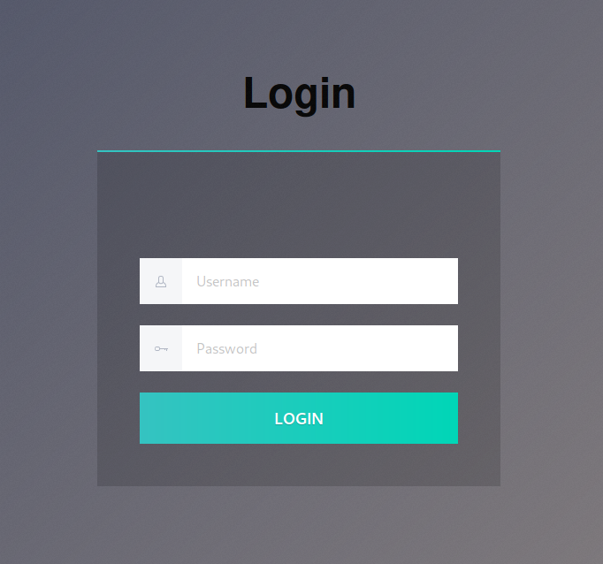

# Git Happens

[This room](https://tryhackme.com/room/githappens) is a really easy one on TryHackMe only you know a few important things about Git. Just like most of the people I am not much familiar with Git but do know how it works. This room let's you understand how you can work with Git in a safe way. So, lets begin!


### Enumeration

Once we deploy the machine, we can go and visit the IP address and see that a login page is located over there. The first thing that can come to our mind is SQL injection. So, we can try a few basic attack along with starting a directory bruteforce attack using any tool like GoBuster, Dirb etc. 



We can try simple SQLi attacks by passing values like `' or 1=1 --'` or passing `admin` in both username and password. But none of these work. Meanwhile, from the directory bruteforce attack we find that a `.git` directory has been discovered.

```

```

We can go and check the `/.git` path and see that an entire Git repository is present over there. 


Looking at the repository, the immediate thought that can come to our mind is to clone it and check the files present in it. This can be usually done using the command `git clone` as:

```
tester@kali:~/Downloads/gaming_server$ git clone http://10.10.111.93/.git
Cloning into '10.10.111.93'...
fatal: repository 'http://10.10.111.93/.git/' not found
```

But here, it says that the repository was not found. After some googling, we can find a tool named [GitTools](https://github.com/internetwache/GitTools) through which we can download the repository on our machine.

There are three tools in the GitTools repository which are Dumper, Extractor and Finder. Out of these three, we will be using dumper as we want to dump the entire repository on our local machine.

```
tester@kali:~/Downloads/git_happens$ cd GitTools/
tester@kali:~/Downloads/git_happens/GitTools$ ls
Dumper  Extractor  Finder  LICENSE.md  README.md
tester@kali:~/Downloads/git_happens/GitTools$ cd Dumper/
tester@kali:~/Downloads/git_happens/GitTools/Dumper$ ls
gitdumper.sh  README.md
tester@kali:~/Downloads/git_happens/GitTools/Dumper$ ./gitdumper.sh 
###########
# GitDumper is part of https://github.com/internetwache/GitTools
#
# Developed and maintained by @gehaxelt from @internetwache
#
# Use at your own risk. Usage might be illegal in certain circumstances. 
# Only for educational purposes!
###########


[*] USAGE: http://target.tld/.git/ dest-dir [--git-dir=otherdir]
		--git-dir=otherdir		Change the git folder name. Default: .git
tester@kali:~/Downloads/git_happens/GitTools/Dumper$ ./gitdumper.sh http://10.10.111.93/.git/ ../../../
###########
# GitDumper is part of https://github.com/internetwache/GitTools
#
# Developed and maintained by @gehaxelt from @internetwache
#
# Use at your own risk. Usage might be illegal in certain circumstances. 
# Only for educational purposes!
###########


[+] Downloaded: HEAD
[-] Downloaded: objects/info/packs
[+] Downloaded: description
[+] Downloaded: config
[-] Downloaded: COMMIT_EDITMSG
[+] Downloaded: index
[+] Downloaded: packed-refs
[+] Downloaded: refs/heads/master
[-] Downloaded: refs/remotes/origin/HEAD
[-] Downloaded: refs/stash
[+] Downloaded: logs/HEAD
[+] Downloaded: logs/refs/heads/master
[-] Downloaded: logs/refs/remotes/origin/HEAD
[-] Downloaded: info/refs
[+] Downloaded: info/exclude
[-] Downloaded: /refs/wip/index/refs/heads/master
[-] Downloaded: /refs/wip/wtree/refs/heads/master
[+] Downloaded: objects/d0/b3578a628889f38c0affb1b75457146a4678e5
[-] Downloaded: objects/00/00000000000000000000000000000000000000
[+] Downloaded: objects/b8/6ab47bacf3550a5450b0eb324e36ce46ba73f1
[+] Downloaded: objects/77/aab78e2624ec9400f9ed3f43a6f0c942eeb82d
[+] Downloaded: objects/f1/4bcee8053e39eeb414053db4ec7b985f65edc8
[+] Downloaded: objects/9d/74a92581071ae7c4a470ff035e0de4598877e5
[+] Downloaded: objects/20/9515b2f7cbdfb731d275c4b089e41ba35c3bc8
[+] Downloaded: objects/5a/35c9b7c787c22f689d0364cf57b013a11561a2
[+] Downloaded: objects/08/906612dfe6821cebc21794eb85601fc4f54de9
[+] Downloaded: objects/4a/2aab268541cbcc434e0565b4f4f2deca29ee5f
[+] Downloaded: objects/7c/578d86a8713b67af2cb1b1d7c524c23cefe7aa
[+] Downloaded: objects/4e/7178fa5b68fec15e54f2b79ace6f9ce0169e01
[+] Downloaded: objects/2e/b93ac3534155069a8ef59cb25b9c1971d5d199
[+] Downloaded: objects/4c/f757268c6824041664d132a29908aa9c362a26
[+] Downloaded: objects/3a/39b02d3b9d12222bac4737ee67e31403d62f13
[+] Downloaded: objects/ae/f68b1e25df81a8c96ee4d57b20cc9f7a1ebee5
[+] Downloaded: objects/d6/df4000639981d032f628af2b4d03b8eff31213
[+] Downloaded: objects/56/820adbbd5ac0f66f61916122c94ea52937e9b2
[+] Downloaded: objects/d9/54a99b96ff11c37a558a5d93ce52d0f3702a7d
[+] Downloaded: objects/06/012255f074d7bc4acc6fadbcff004380b5f83b
[+] Downloaded: objects/bc/8054d9d95854d278359a432b6d97c27e24061d
[+] Downloaded: objects/dd/13038df878d41b774ce4fd4552091d46873c25
[+] Downloaded: objects/8c/94b154aef92380e29a3f16f1a889b56127cf13
[+] Downloaded: objects/e5/6eaa8e29b589976f33d76bc58a0c4dfb9315b1
[+] Downloaded: objects/48/926fdeb371c8ba174b1669d102e8c873afabf1
[+] Downloaded: objects/ce/b8d530ebcf79806dffc981905ec8c2e0d7a65b
[+] Downloaded: objects/87/bcbcb476578c6cc90ed39f9404292539fe1c9c
[+] Downloaded: objects/39/5e087334d613d5e423cdf8f7be27196a360459
[-] Downloaded: objects/40/04c23a71fd6ba9b03ec9cb7eed08471197d843
[-] Downloaded: objects/19/a865c5442a9d6a7c7cbea070f3cb6aa5106ef8
[-] Downloaded: objects/0f/679a88dbbaf89ff64cb351a151a5f29819a3c0
[+] Downloaded: objects/0e/abcfcd62467d64fb30b889e8de5886e028c3ed
[+] Downloaded: objects/ba/5e4a76e3f7b6c49850c41716f8f1091fbdc84e
[+] Downloaded: objects/2f/423697bf81fe5956684f66fb6fc6596a1903cc
[+] Downloaded: objects/e3/8d9df9b13e6499b749e36e064ec30f2fa45657
[+] Downloaded: objects/0e/0de07611ada4690fc0ea5b5c04721ba6f3fd0d
[+] Downloaded: objects/66/64f4e548df7591da3728d7662b6376debfce8d
```

So, here we have now dumped the entire repository on our local machine. We can now use one of the best features of git that helps us to view all the changes that were made to the repository since it was initialized. 

`P.S. I used '../../../' just because I wanted to dump the repository to a specific directory which was three steps above the current one. `

Remember that we have dumped `.git`. Hence, by default it will be hidden.

```
tester@kali:~/Downloads/git_happens$ ls -la
total 16
drwxr-xr-x 4 tester tester 4096 Aug 28 14:20 .
drwxr-xr-x 7 tester tester 4096 Aug 31 20:21 ..
drwxr-xr-x 6 tester tester 4096 Aug 28 14:20 .git
drwxr-xr-x 6 tester tester 4096 Aug 28 14:16 GitTools
tester@kali:~/Downloads/git_happens$ cd .git/
tester@kali:~/Downloads/git_happens/.git$ ls
config  description  HEAD  index  info  logs  objects  packed-refs  refs
```

We can now use the command `git logs` to read the `commit` messages for each change that was made to the repository.

```
tester@kali:~/Downloads/git_happens/.git$ git log 
commit d0b3578a628889f38c0affb1b75457146a4678e5 (HEAD -> master, tag: v1.0)
Author: Adam Bertrand <hydragyrum@gmail.com>
Date:   Thu Jul 23 22:22:16 2020 +0000

    Update .gitlab-ci.yml

commit 77aab78e2624ec9400f9ed3f43a6f0c942eeb82d
Author: Hydragyrum <hydragyrum@gmail.com>
Date:   Fri Jul 24 00:21:25 2020 +0200

    add gitlab-ci config to build docker file.

commit 2eb93ac3534155069a8ef59cb25b9c1971d5d199
Author: Hydragyrum <hydragyrum@gmail.com>
Date:   Fri Jul 24 00:08:38 2020 +0200

    setup dockerfile and setup defaults.

commit d6df4000639981d032f628af2b4d03b8eff31213
Author: Hydragyrum <hydragyrum@gmail.com>
Date:   Thu Jul 23 23:42:30 2020 +0200

    Make sure the css is standard-ish!

commit d954a99b96ff11c37a558a5d93ce52d0f3702a7d
Author: Hydragyrum <hydragyrum@gmail.com>
Date:   Thu Jul 23 23:41:12 2020 +0200

    re-obfuscating the code to be really secure!

commit bc8054d9d95854d278359a432b6d97c27e24061d
Author: Hydragyrum <hydragyrum@gmail.com>
Date:   Thu Jul 23 23:37:32 2020 +0200

    Security says obfuscation isn't enough.
    
    They want me to use something called 'SHA-512'

commit e56eaa8e29b589976f33d76bc58a0c4dfb9315b1
Author: Hydragyrum <hydragyrum@gmail.com>
Date:   Thu Jul 23 23:25:52 2020 +0200

    Obfuscated the source code.
    
    Hopefully security will be happy!

commit 395e087334d613d5e423cdf8f7be27196a360459
Author: Hydragyrum <hydragyrum@gmail.com>
Date:   Thu Jul 23 23:17:43 2020 +0200

    Made the login page, boss!

commit 2f423697bf81fe5956684f66fb6fc6596a1903cc
Author: Adam Bertrand <hydragyrum@gmail.com>
Date:   Mon Jul 20 20:46:28 2020 +0000

    Initial commit
(END)
```

From the Date value, we can determine that the oldest change and it's commit message is at the bottom and the most recent changes are at the top. All these commit messages tell us how things changed in this repository i.e from creation of a login page through adding obfuscation and implementing SHA-512 to building a docker. But this does not provide any information that we can use directly. 

Using the commit value, we can see what changes where made at that point of time using the command `git show <commit value>`:

```
tester@kali:~/Downloads/git_happens/.git$ git show 2f423697bf81fe5956684f66fb6fc6596a1903cc
commit 2f423697bf81fe5956684f66fb6fc6596a1903cc
Author: Adam Bertrand <hydragyrum@gmail.com>
Date:   Mon Jul 20 20:46:28 2020 +0000

    Initial commit

diff --git a/README.md b/README.md
new file mode 100644
index 0000000..209515b
--- /dev/null
+++ b/README.md
@@ -0,0 +1,3 @@
+# git-fail
+
+Sometimes, bad things happen to good sites
\ No newline at end of file
```

This is how the first commit looks like in the repository, but there are multiple commits in the repository and viewing each and every commit this way would be quite tedious. Hence, we can work around a little bit like:

```
tester@kali:~/Downloads/git_happens/.git$ git log | grep commit | cut -d " " -f 2 | xargs git show
```

What we are doing over here is:

1. `git log`: This shows all the basic details like commit value, date, author and commit message.
2. `grep commit`: With this command we are fetching only those lines that contain the commit value which can pass to `git show`.
3. `cut -d " " -f 2`: The `grep` command captures the entire line but we need only the commit value and not the term 'commit' along with it. So, we cut the line by defining the space (" ") as delimiter and then selecting the second part (commit value) using the switch `-f`.
4. `xargs git show`: The command `xargs` is used when you want to pass multiple arguements. Here, we know that `git show` takes only one commit value at a time and so `xargs` can be helpful in this case.

As we know, the oldest changes are at the bottom, we should immediately go to the end of the output and start looking for all the changes that were made. And in the details of second last commit we can see the username and password for the login page.


We can now use these credentials and try to login through login page. 


Once logged in, it just says to submit the password as the flag. With this, we have solved the room!

## Some Key Points to Take Away

1. Use [GitTools](https://github.com/internetwache/GitTools) when you need to perform some operations related to Git.
2. To see the changes made to a repository use `git log`.
3. Remember that the changes are show in descending order of date and time.