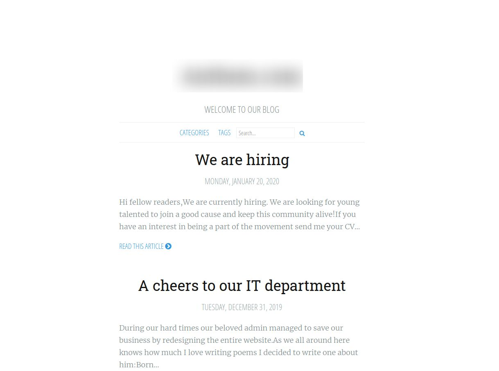
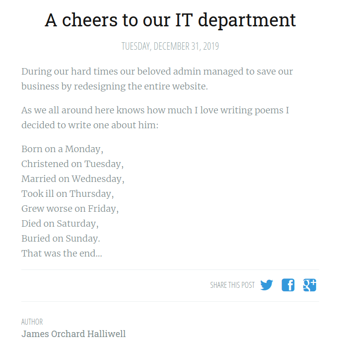
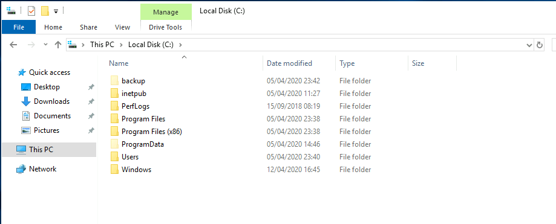

# Anthem

[This room](https://tryhackme.com/room/anthem) is based on exploiting a Windows machine. But on the way one will have to go through a lot of other things as well. The most important thing that is required for this room is enumeration. At each stage of this room, enumeration plays an important role to get the desired answers. Another thing that I really liked about room was the need of OSINT, which helps to find many useful things. 

Without further delay, let's deploy the machine and begin with the room!

### Enumeration

#### [Task 1] Website Analysis

1. ##### Let's run nmap and check what ports are open.

```
┌─[tester@parrot-virtual]─[~/Downloads/anthem]
└──╼ $nmap -A 10.10.63.79
Starting Nmap 7.80 ( https://nmap.org ) at 2020-09-24 20:58 IST
Nmap scan report for 10.10.63.79
Host is up (0.18s latency).
Not shown: 995 closed ports
PORT     STATE SERVICE       VERSION
80/tcp   open  http          Microsoft HTTPAPI httpd 2.0 (SSDP/UPnP)
135/tcp  open  msrpc         Microsoft Windows RPC
139/tcp  open  netbios-ssn   Microsoft Windows netbios-ssn
445/tcp  open  microsoft-ds?
3389/tcp open  ms-wbt-server Microsoft Terminal Services
| rdp-ntlm-info: 
|   Target_Name: WIN-LU09299160F
|   NetBIOS_Domain_Name: WIN-LU09299160F
|   NetBIOS_Computer_Name: WIN-LU09299160F
|   DNS_Domain_Name: WIN-LU09299160F
|   DNS_Computer_Name: WIN-LU09299160F
|   Product_Version: 10.0.17763
|_  System_Time: 2020-09-24T15:29:45+00:00
| ssl-cert: Subject: commonName=WIN-LU09299160F
| Not valid before: 2020-09-23T15:13:52
|_Not valid after:  2021-03-25T15:13:52
|_ssl-date: 2020-09-24T15:30:38+00:00; -1s from scanner time.
Service Info: OS: Windows; CPE: cpe:/o:microsoft:windows

Host script results:
|_clock-skew: mean: -1s, deviation: 0s, median: -1s
| smb2-security-mode: 
|   2.02: 
|_    Message signing enabled but not required
| smb2-time: 
|   date: 2020-09-24T15:29:45
|_  start_date: N/A

Service detection performed. Please report any incorrect results at https://nmap.org/submit/ .
Nmap done: 1 IP address (1 host up) scanned in 137.63 seconds
```

2. #####  What port is for the web server?

From the nmap results, we can see the port on which HTTP service is running and submit the same as the answer to this question.

3. ##### What port is for remote desktop service?

At first, in the nmap scan we can't find any service named as remote desktop service. But later, after searching a bit we can find out that `Mircosoft Terminal Services` is itself a remote desktop service. So, the associated port can be submitted as the answer for this question.

4. ##### What is a possible password in one of the pages web crawlers check for?

Now, if understand what web crawlers are then we can immediately understand that this question is talking about the file `robots.txt`. So, we can quickly visit `<machine_IP>/robots.txt` and check it's content.

```
******************

# Use for all search robots
User-agent: *

# Define the directories not to crawl
Disallow: /bin/
Disallow: /config/
Disallow: /umbraco/
Disallow: /umbraco_client/
```

At the top of the file `robots.txt`, we can see irrelevant string which appears to be like a password. So, we can try to submit that string as the answer to this question.

5. #####  What CMS is the website using?

If we browse all the disallowed directories in `robots.txt`, then in the `/umbraco` directory we can find a login page. Usually this type of system of login pages are found on various web services itself. So, we can google the term `umbraco` and check if it is some web service and we do get some details related to it be a CMS. So, we know the answer to this question as well.

6. #####  What is the domain of the website?

When we visit the IP address of the machine `http://<machine_ip>`, it takes us to the homepage. Over there we can find the domain name of the website right in front of us.



7. ##### What's the name of the Administrator

This question involves a little bit of enumeration as well as OSINT. As of know, we know about the login page and the homepage. We can't obtain any useful details from the login page, not even from it's source-code. So, we are left with the homepage. We can read the articles present over there and look any useful piece of information. From the article named `We are hiring`, we can find a email `JD@anthem.com` and the name `John Doe` but he is the author and not the administrator. 

Further moving on to the other article named `A cheers to our IT department`, we can find the named of the author of the article but even he is not the administrator. On reading the article, we can see that the poem is written for the administrator but his name is not mentioned anywhere.



We can quickly google this poem and check if we can get anything from there. From the results, we can find out the name of the person for whom this poem was written. So, we can assume that's the name of our administrator as well and try to submit it as the answer to the seventh question.

8. ##### Can we find find the email address of the administrator?

Again this question is a bit tricky as we can't find any details for the administrator on the website. But we know that many of the organizations use a specific pattern for email addresses and usernames of their employees. And in the last question we came across an email `JD@anthem.com`. So, we can try something similar for administrator's email as well by using the initials of his first and last name along with `@anthem.com` and submit it as the answer to the eighth question.


#### [Task 2] Spot the flags

In this task we just need to find different flags that are hidden throughout the website and submit them.

1. ##### What is flag 1?

To begin our search we can start with the first article named `We are hiring`  and look for anything that appears as a flag in it's source-code.


And we can find two flags here. First one as well as the second one.

2. #####  What is flag 2?

Already found above.

3. ##### What is flag 3?

On the same article's page, we can see see that the profile of the author can be opened. And when we click on it we get our third flag right in front of us!


4. #### What is flag 4?

We can move on the the second article on the website and check it's source-code as well.


And we have the fourth flag as well.


NOTE: You might not find all the flags in the exact sequence. Even I found a few during my initial enumeration itself and some of them later.


### Initial Foothold

1. ##### Let's figure out the username and password to log in to the box.

Usually port 22 is open on machines so we try to login via SSH but here port 22 is not open. Instead of that we know that RDP is available. So, we can directly RDP on to the machine and gain it's access.

We do have the CMS administrator's email address and password from the previous questions that we solved. But to gain access to the workstation we need the machine username and password. We can definitely try to login using the same credentials on the mahcine but they don't work. Also, we can notice that `@anthem.com` is there because of the website's domain name. So, maybe we can try to login using the username without the domain part and the same password.

We can RDP on the machine using the command:

```
xfreerdp /f /u:** /p:****************** /v:<machine_IP>
```

Here, `/f` is for starting the RDP session in full-screen mode, `/u` is for username, `/p` is for password and `/v` is for the remote machine IP address. Also, if you face issue related to NLA, add `-sec-nla` or `/cert-ignore`and then access the machine.

With this, we get on to the workstation.

2. #####  Gain initial access to the machine, what is the contents of user.txt?

We can see the `user.txt` file right in front of us on the Desktop from where we can get the user flag.

3. #####  Can we spot the admin password?

For this question, we need to enumerate through the machine and from the question we can guess that the admin's password is stored in some file.

We can go through various folders such as Documents, Pictures, Videos, Desktop etc. Also, make sure to turn on the `Show the Hidden Files` option as the file containing the password can be hidden. 



While browsing in C:\ drive we can see a hidden folder named `backup`. And in that folder, there is a file named `restore` but we don't have access to that file. So, we can try to change it's permissions as:

1. Right-click and select Properties
2. Go to Security tab and click on Edit
3. A new permissions window will open and then click on Add
4. Again a new window to Select Users or Groups opens. In that we need to add the username of the user as whom we have currently logged in. We can also check the username using the Check Name button in the same window.
5. Apply the changes.


Once done, we can now open the `restore` file and find the Administrator's password.

4. #####  Escalate your privileges to root, what is the contents of root.txt?

Now, we have the Administrator's password. So, we can go to `C:\Users\Administrator\Desktop` and when prompted for the admin password we can enter the obtained password. Once in the `Desktop` folder, we can open the `root.txt` file and get our flag.

With this we have completed the `Anthem` room!

## Some Key Points to Take Away

1. If port 22 is not open then look for some other port through which we can gain access on the machine. 
2. If you are unable to get RDP using `xfreerdp`, then add `/cert-ignore` or `sec-nla` to the command and then try to establish an RDP session.
3. In Windows machine, try to get access to unaccessible files by adding the user to allowed users list from Properties (Security tab) of the specific file.

