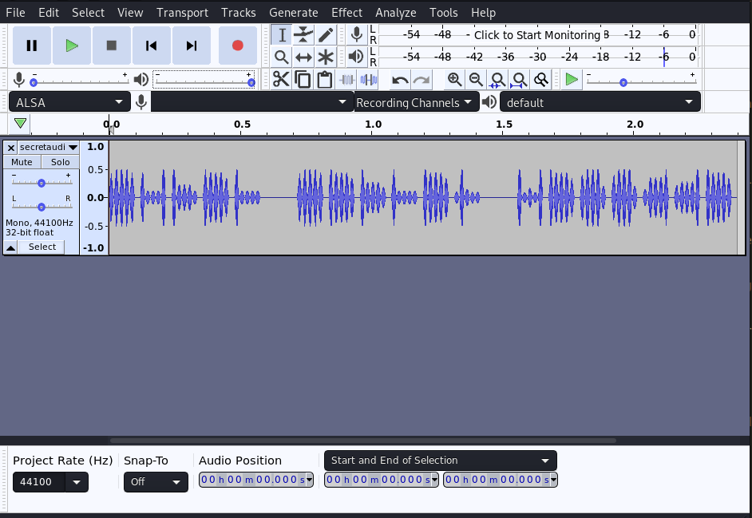

# c4ptur3-th3-fl4g
As the name suggests, this room is totally based on flags. For each question, we need to find the flag and submit it. Though this room is completely based on flags, it is not something based on pentesting. But we are given certain strings, images or audio for each question that are used to hide these flags. Our task is to identify the specific method to obtain the flag.

With that being said, let's begin with our challenge.

### [Task 1] Translating & Shifting
For this room, there is one major resource i.e. [CyberChef](https://gchq.github.io/CyberChef/). This tool houses a huge variety of encoding methods, encryption algorithms, hashing algorithms and many other things. The tool is rightly said The Cyber Swiss Army Knife!!!

1. c4n y0u c4p7u23 7h3 f149?

This one is pretty easy, all that we need to do is replace the characters:
	
	* 4 with a
	* 0 with o
	* 7 with t
	* 2 with r
	* 3 with e
	* 1 with l
	* 9 with g
And submit the substituted value's string.

2. 01101100 01100101 01110100 01110011 00100000 01110100 01110010 01111001 00100000 01110011 01101111 01101101 01100101 00100000 01100010 01101001 01101110 01100001 01110010 01111001 00100000 01101111 01110101 01110100 00100001

There is no doubt that this string is not in any other form but binary. We can directly go to `CyberChef`, enter out input binary string and drag `from binary`(present in left operations column) to the recipe section and get our required flag!


3. MJQXGZJTGIQGS4ZAON2XAZLSEBRW63LNN5XCA2LOEBBVIRRHOM======

This string appears to be similar to base64 but the issue is that in base64 there are 0, 1 or 2 equal signs at the end of the string but in this case, there are 6 equal signs, so it's definitely not base64 encoded. We can try to decode it from base64 but it will throw an error stating invalid data. 

After doing some research on CyberChef itself, we can see that there is one more similar encoding method called base32. When we try to decode this string from base32 we get the desired flag that can be summited as the answer to this question.

4. RWFjaCBCYXNlNjQgZGlnaXQgcmVwcmVzZW50cyBleGFjdGx5IDYgYml0cyBvZiBkYXRhLg==

As explained in the previous question, if a string has up to 2 equal signs at the end then it is base64 encoded. We can simply enter this string in the input and decode it from `base64` to get the flag.

5. 68 65 78 61 64 65 63 69 6d 61 6c 20 6f 72 20 62 61 73 65 31 36 3f

If we see properly, then we can determine that this string contains numerical values from `0-9` and alphabetic values from `a-f` which is a basic characteristic of a hexadecimal value. Hence, to solve this question we can convert this value directly from `hexadecimal` and get the required flag.

6. Ebgngr zr 13 cynprf!

There are two hints that can be used to decode this string. First, it can be directly inferred from the string that the characters are jumbled in some way which indicates that there is some sort of rotation involved over here. This doubt is clarified by the presence of value 13 in the string which can be related to ROT13 rotation. 

One important point about ROT13 is that only the alphabetic characters are rotated but not numbers and special symbols. So, to solve this question we can simply use from `ROT13` encoding method and decode the string.

7. \*@F DA:? >6 C:89E C@F?5 323J C:89E C@F?5 Wcf E:>6DX

At first sight, it appears that there might be some kind of rotation involved in this encoding but the issue is which rotation. Just like ROT13 rotates the alphabets by 13 positions, we can rotate them from values 1 to 25 and we can try all of them. But the answer does not lie in this type of rotation.
After searching for some other types of rotations, we can find `ROT47` which includes numbers and special symbols along with alphabets in its rotation method. We can try this method as the encoded string consists of all of the alphabets, numbers and special symbols. 
Hence, we can decode this using from `ROT47` and get the required flag.

8. - . .-.. . -.-. --- -- -- ..- -. .. -.-. .- - .. --- -.

. -. -.-. --- -.. .. -. --.

If you have seen some of the old spy movies or for the case Titanic as well, you must be knowing about the language that has only two characters dashes(-) and dots(.) which is Morse Code.
On CyberChef, Morse Code encoding is also present through which we can decode this string and get our answer.

9. 85 110 112 97 99 107 32 116 104 105 115 32 66 67 68

These values appear to be just simple numbers but if we see properly then looking at the range of the numbers i.e. mostly between 60 and 120, it can be inferred that these are the decimal representation of ASCII characters. Hence, this can be decoded from Decimal values to ASCII characters to get the flag.

10. I am not putting the question over here as it is too long but the solution is given below.

From the question, it can be seen that this time it is a really long string and also appears to be recursive in some manner. But at the end of the string, we can see an `=`, which gives us a hint that this string is `base64` encoded. So, we can decode the entire string from `Base64`. But it's not done yet.

Now we can see that the initial string got decoded into `Morse Code`, so we need to decrypt it using Morse Code decoding (if you are using CyberChef, directly drag Morse Code from operations below Base64 operation in the recipe section). 

But again it's not done yet, the morse code is now in the form of `binary`. Hence, we need to decode it from binary as well (again you can directly add `from binary` from operations right below Morse Code operation in the recipe section).

Now the string appears to be encoded using some form of rotation and as it includes many special symbols we can be certain that this string can be decoded using `ROT47` (again this can be done by adding `ROT47` right below the binary operation in the recipe section).

Again, the values in the decoded string appear to numbers between 30 to 120. Hence, we can convert them from `hexadecimal` to ASCII (by dragging the `from decimal` operation below the ROT47 operation in the recipe section).

And boom we get our final answer!


### [Task 2] Spectrograms
This task gives a brief explanation about spectrograms which basically means a visual representation of sthe pectrum of frequencies of a signal as it varies with time. In other words, it represents the signal strength or loudness of a signal over time at various frequencies present in a particular waveform.

Now for this task, we are provided with an mp3 file. So, our thinking should be like we have an audio file and we are talking about spectrograms that represent audio in a visual format which means that there must be some hint in those graphs for this audio file that can be used to solve the task. And if we google a little bit, then we can find that `Audacity` can help us build those graphs. We can install audacity using the command: `sudo apt install audacity`.

Once installed, we need to open our audio file in Audacity. And it would look something like:



But this does not give us any hint. Now, if we recall properly then in the task's description they have mentioned about `spectrogram`, we need to look up on the internet how to get a spectrogram in Audacity. After googling a little bit, we can find that spectrograms can be viewed in audacity as shown in the image below:


Once we view the spectrogram, we can see the flag for this task right in front of us!

### [Task 3] Steganography
If you have read my previous walkthrough then you must be knowing steganography was used to solve the [Brooklyn Nine-Nine](https://tryhackme.com/room/brooklynninenine) room as well. We can use tools like Steghide and StegCipher for tasks related to steganography.

So, let's begin!

For this task, they have provided us an image in which there is a dinosaur peeking from noodles but we don't have any use of this. We can directly open this file with Steghide using the command:

```
tester@kali:~/Downloads$ steghide extract -sf stegosteg.jpg 
Enter passphrase: 
wrote extracted data to "steganopayload2248.txt".
```

As we don't know any passphrase, we can skip it by pressing the enter key. This command will extract the hidden text file behind this image and stores it in the same directory in a new file. All that we need to do now is just view the content of the file using `cat` and get the flag!

### [Task 4] Security Through Obscurity
1. Download and get 'inside' the file. What is the first filename & extension?

This task is somewhat similar to the previous one but a little bit more confusing. Again we will be using steghide to get the data hidden behind the image as:

```
tester@kali:~/Downloads$ steghide extract -sf meme.jpg 
Enter passphrase: 
steghide: could not extract any data with that passphrase!
```

But this time we get an error that the passphrase is incorrect, certainly as we did not enter any passphrase at the very first stage. As we don't know the passphrase we can use `StegCracker` through which we can bruteforce the passphrase's from a wordlist. StegCracker automatically started bruteforcing the passphrase with `rockyyou.txt` as we did not pass any wordlist explicitly.

The StegCracker would take a really long time and meanwhile we can try to change the file extension from `.jpg` to `.zip` and check if the zip file opens. 

After changing the file extension, the zip actually opens and we can see another image hidden in that zip. We can extract that image and open it. The name of this file in the zip is supposed to be the answer of the first question in this task.

Now as we successfully cracked the file just by changing its extension, we can stop the StegHide bruteforce attack.

2. Get inside the archive and inspect the file carefully. Find the hidden text.

But for the second question, we still need to work. If we open the image we can find the text `H4ck3r Ch4tz`. But this does not get accepted as the flag for the last question. So, we can try to again check this image for steganography first by using steghide and then by stegcraker. But as the image is in `.png` format it is not supported. So, we can try to change the image's extension to `.txt` and see that the flag is present at the end of the file.

With this, we have completed all the tasks in c4ptur3-th3-fl4g room!!!

## Some Key Points to Take Away
1. When need to work with encryption/decryption, hashing, encoding, decoding or any similar tasks use the Cyber Swiss Knife [CyberChef](https://gchq.github.io/CyberChef/).
2. Whenever you have an audio file think of how some data can be stored in it in the form of voice notes or visual graphs.
3. In case of images, your first thought should be to check them for steganography.
4. Along with steghide and StegCracker, try to change the images extension to `.zip` or `.txt`.